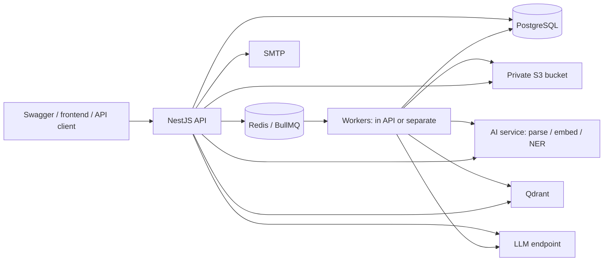

# Backend setup: from a fresh machine to a real end-to-end test

Code audit: 28–29 September 2026. Commands below use **Windows PowerShell**, from `D:\fyp_backend_nest`, unless marked otherwise. Provider dashboards change; their official instructions are linked where used. No existing credentials are reproduced here.

Read this guide in order. Use [the complete variable reference](ENVIRONMENT_VARIABLES.md) when you need a particular setting. You do **not** need to manually fill 317 settings: most are validated tuning defaults. You do need real connection details and secrets for the features you intend to run.

## 1. What the repository actually contains

This is a NestJS backend with TypeORM/PostgreSQL, Redis/BullMQ, authentication, organizations, permissions, an encrypted document vault, retrieval, agents, PII masking, tools, workflows, Socket.IO, quotas, audit logs, and lifecycle management.

| Component | What it does | Required for |
|---|---|---|
| NestJS API | Serves REST, Swagger, streaming chat and Socket.IO | Every client request |
| PostgreSQL | Accounts, permissions, documents/chunks, encrypted conversations, workflow state and audit | Core application |
| Redis | Queues, revocation, throttling, event streams, coordination | A complete working deployment; some API paths degrade without it |
| S3-compatible object storage | Stores encrypted uploaded files and audit archives | Document uploads/downloads and enabled audit archival |
| Qdrant | Searches document vectors and lexical indexes | Ingestion and RAG retrieval |
| Separate AI service | Parses/chunks documents, embeds text, optionally reranks, detects names | Full knowledge pipeline; default PII provider |
| LLM endpoint | Generates chat and agent responses | Chat, agents, and workflow agent steps |
| SMTP | Delivers verification, reset, invitation and tool emails | Real email delivery; `log` works for initial local testing |
| Worker process | Consumes ingestion and workflow jobs | Either inside the API or as a separate process |
| Frontend | Displays product UI and handles links from email | Optional for backend-only testing with PowerShell/Swagger |



**Important missing component:** this repository contains the AI client, contract, and test doubles, but no deployable Python AI application, requirements file, or AI Docker image. A hosted LLM key does not replace that service. You must supply/build a service implementing [AI service v1](contracts/ai-service-v1.md), or obtain its existing deployment from your team. Until then, auth and other core features can work, and the mock-based automated suites can run, but real document ingestion cannot be completed.

The supplied `docker-compose.yml` starts **only PostgreSQL and Redis**. Qdrant, Ollama and Presidio entries are commented out. It does not start the API, object storage, or a Python AI service.

## 2. Findings from your current checkout

These are a snapshot, not proof that credentials work:

- `.env` exists and passes the environment schema. The six core signing/encryption/pepper/cookie values are nonempty. The four built-in insecure secret defaults were not detected.
- Database host is local; database fields are populated and `DB_SSL=false`. Their connectivity/password was not tested during this documentation task.
- Redis points to local port 6379; `REDIS_URL` is empty, so discrete Redis settings apply.
- S3 settings, Qdrant URL/key, AI URL/signing secret, LLM URL/key, SMTP credentials and bootstrap administrator credentials are absent/empty.
- `MAIL_TRANSPORT=log`, `NODE_ENV=development`, `SEED_DEMO_DATA=false`. No `.env.local` was present.
- The schema declares **317 variables**; `.env.example` lists **261**. The missing 56 mostly cover governance, MFA, RLS, mTLS and observability. The complete reference includes all 317.
- Copying `.env.example` by itself does **not** produce a valid environment: its four empty required secret fields must be populated. Omitting a key and setting `KEY=` are different to Joi.
- `npm run test:e2e` references `test/jest-e2e.config.mjs`, which is absent in this checkout. Use the three named E2E scripts described below.
- `docs/CLOUD_SETUP.md` contains a dated database-password failure from an earlier session. Treat it as historical, not a fresh diagnosis of your current password.
- `JSON_BODY_LIMIT` and `APP_SHUTDOWN_TIMEOUT` are parsed into config, but this audit found no corresponding explicit parser-limit or hard shutdown timer wiring in the bootstrap. Do not assume changing these alone changes those runtime limits.

## 3. Choose the first deployment shape

For your first end-to-end run, use:

| Need | Concrete choice | Where you get the values |
|---|---|---|
| Run backend | Your Windows machine | No hosting account needed yet |
| SQL + queues | Supplied Docker PostgreSQL and Redis | Local values in section 5 |
| Files | Cloudflare R2 private bucket | Bucket and S3 token credentials |
| Vectors | Qdrant Cloud | Cluster URL and **database** API key |
| Parse/embed/NER | Your team's AI service implementing this repo's contract | Service URL, matching HMAC secret and embedding metadata |
| Generation | Local Ollama, or Groq's compatible API | Local model name, or provider key and current model ID |
| Email | Initially `log`; then Mailtrap Email Sandbox | Sandbox SMTP credentials |

This keeps the database and job queue easy to inspect while verifying the real storage and AI integrations. For a hosted deployment, replace local Postgres/Redis with managed services and deploy the API/worker as described in section 13. Accounts, usage quotas and paid capacity depend on your providers; this guide does not assume a permanently free full stack.

## 4. Install prerequisites and prepare configuration

Use a current patched **Node 22.x release, at least 22.13**, for the baseline closest to this checkout. The root package says `>=20.11`, but the installed TypeORM package requires `^20.19.0 || ^22.13.0 || >=24.11.0`; the smaller root minimum is insufficient. This audit ran on Node 22.14.0/npm 10.9.2. Node 24.11+ is another eligible engine range but was not tested here. Obtain Node from its [official download page](https://nodejs.org/en/download/archive/v22).

Install Git and Docker Desktop with Linux containers if you use local infrastructure. Start Docker Desktop before Compose. Then:

```powershell
Set-Location D:\fyp_backend_nest
node --version
npm --version
docker version
docker compose version
npm ci
```

`npm ci` uses `package-lock.json`. Include development dependencies for build, migrations, seed and tests: those commands use Nest CLI/TypeScript/ts-node. Do not use `--omit=dev` for those steps. If native Argon2 installation fails, resolve the installation problem first; setting `PASSWORD_HASH_ALGORITHM=scrypt` changes runtime hashing, not installation of the declared dependency.

**You already have `.env`: edit it, do not overwrite it.** For a genuinely fresh checkout only:

```powershell
if (-not (Test-Path .env)) { Copy-Item .env.example .env }
npm run generate:secrets -- --write
```

The generator fills missing/empty values for:

```text
JWT_ACCESS_SECRET
JWT_REFRESH_SECRET
ENCRYPTION_KEY
AUDIT_HASH_SECRET
PASSWORD_PEPPER
COOKIE_SECRET
AI_SERVICE_SIGNING_SECRET
```

Existing nonempty values are preserved. Generate secrets **before** creating users, documents, MFA secrets or workflow content. On an existing database, adding/changing a formerly empty pepper can invalidate password verification; changing encryption/audit keys breaks existing data or verification. Keep the same secrets on API and worker. Back them up securely with your deployment configuration.

### Environment loading rules

- Hosting/shell environment values normally take precedence over dotenv files.
- Nest is configured to read `.env.local`, then `.env`.
- The TypeORM migration CLI explicitly loads **only `.env`**. API/worker tracing loads `.env.local` first, while seed/test entry points also import the standalone data source. Consequently, different commands can see different values when `.env.local` overrides overlap. A working API does not prove the migration CLI is targeting the same database.
- Use one `.env` locally and explicit environment values on your host. Avoid a conflicting `.env.local` for database/secret settings.
- A variable set as `$env:DB_NAME=...` persists in that PowerShell session and may override later file edits. Use a fresh terminal when switching environments.
- `DATABASE_URL`, `OPENAI_API_KEY` and a provider's REST Redis token are **not** substitutes for this app's `DB_*`, `LLM_API_KEY` and Redis TCP settings.
- Boolean values should be literal `true`/`false`; durations should include units such as `30s`, `15m`, `30d`. A bare duration number means milliseconds.
- Quote values containing spaces or `#` in `.env`. Variable expansion is enabled, so prefer generated base64url secrets and avoid unintended `$` expansion. Host dashboard values should contain the raw value, without surrounding dotenv quote characters.

## 5. Start local PostgreSQL and Redis

For a **new local development database**, edit these fields in `.env`:

```dotenv
NODE_ENV=development
APP_HOST=0.0.0.0
APP_PORT=3000
APP_URL=http://localhost:3000
FRONTEND_URL=http://localhost:5173
CORS_ORIGINS=http://localhost:5173,http://localhost:3000
CORS_CREDENTIALS=true
TRUST_PROXY=0
COOKIE_SECURE=false
COOKIE_SAME_SITE=lax
REQUIRE_EMAIL_VERIFICATION=false

DB_HOST=localhost
DB_PORT=5432
DB_USERNAME=postgres
DB_PASSWORD=postgres
DB_NAME=ai_agent_platform
DB_SCHEMA=public
DB_SSL=false
DB_SSL_REJECT_UNAUTHORIZED=true
DB_SYNCHRONIZE=false
DB_MIGRATIONS_RUN=false
DB_ROW_LEVEL_SECURITY=true
DB_RLS_ROLE=

REDIS_URL=
REDIS_HOST=localhost
REDIS_PORT=6379
REDIS_USERNAME=
REDIS_PASSWORD=
REDIS_DB=0
REDIS_TLS=false
REDIS_KEY_PREFIX=daiap:dev:
QUEUE_PREFIX=daiap_dev_bull
QUEUE_WORKERS_ENABLED=true

MAIL_TRANSPORT=log
LOG_PRETTY=true
SWAGGER_ENABLED=true
SEED_DEMO_DATA=false
```

The local sample password is for the isolated development instance only. If your existing database already has a different password, keep its real password. Docker uses `POSTGRES_*` values **on first initialization** of its persistent volume; editing `.env` does not reset an existing PostgreSQL password.

```powershell
docker compose up -d postgres redis
docker compose ps
docker compose exec postgres pg_isready -U postgres -d ai_agent_platform
docker compose exec redis redis-cli ping
docker compose exec redis redis-cli CONFIG GET maxmemory-policy
```

Expected: PostgreSQL ready, Redis `PONG`, policy `noeviction`. Change the `-U`/`-d` arguments if you selected other credentials. If port 5432 is occupied, choose a free `DB_PORT` and recreate the Compose container without deleting its volume. The same applies to Redis's host port.

The Compose file publishes local service ports and does not configure Redis authentication/TLS. Keep these development services on a trusted local machine; it is not a public production deployment recipe.

The API runs on the Windows host, hence `localhost`. If you later containerize it, `localhost` means that container; use Docker service names such as `postgres`/`redis` on the shared network.

### If you prefer managed PostgreSQL

Create a Neon project/database and select its **direct/non-pooled** connection. Copy the host, port, role, password and database into `DB_HOST`, `DB_PORT`, `DB_USERNAME`, `DB_PASSWORD`, `DB_NAME`; set `DB_SSL=true`. Neon distinguishes pooled hosts with `-pooler`; its [official connection guide source](https://github.com/neondatabase/website/blob/main/content/docs/get-started/connect-neon.md) documents both connection types.

This repository's tenant binding uses session settings. Do **not** use transaction pooling for the API/worker: `RowLevelSecurityService` can disable tenant binding when it detects it. Supabase direct or session-mode connections are alternatives; use the exact provider host, port and role, not guessed values. Keep `DB_SSL_REJECT_UNAUTHORIZED=true`; supply actual PEM contents in `DB_SSL_CA` if a custom CA is required. This DB CA path does not have the AI/LLM base64-PEM decoder: use actual certificate text, not a filename or base64 blob.

### If you prefer managed Redis

Create a Redis Cloud database, enable suitable persistence and `noeviction`, then copy its endpoint and credentials. Use `REDIS_URL=rediss://default:<URL-encoded-password>@<host>:<port>` **only when TLS is enabled by the provider**. Alternatively fill discrete fields and set `REDIS_TLS=true`. A custom CA goes in `REDIS_TLS_CA` as PEM contents. The app does not expose Redis client-certificate variables, so choose a password-authenticated TLS setup rather than mandatory client mTLS.

Use a Redis TCP endpoint, not an HTTPS REST endpoint. Choose sufficient connection/memory capacity for multiple BullMQ, pub/sub and application connections. See [Redis Cloud connection instructions](https://redis.io/docs/latest/operate/rc/databases/connect/) and [TLS setup](https://redis.io/docs/latest/operate/rc/security/database-security/tls-ssl/). BullMQ specifically requires `noeviction` and recommends persistence in its [deployment guidance](https://docs.bullmq.io/guide/going-to-production).

## 6. Migrate, enforce RLS and seed

With the chosen database reachable:

```powershell
npm run migration:show
npm run migration:run
npm run migration:show
```

All five migrations should be applied: InitialSchema, KnowledgeLayer, InferenceAgentsPrivacy, OrchestrationToolsRealtime and GovernanceHardening. Do not use `schema:drop`, `migration:revert` or `DB_SYNCHRONIZE=true` as routine setup steps.

Leave `DB_SCHEMA=public` for your first installation. Nondefault schemas require checking the raw SQL migrations and schema creation/permissions; changing this variable alone is not a verified custom-schema setup.

The governance migration creates 28 tenant policies and attempts to create/grant the `daiap_rls` role. For local Docker's superuser `postgres`, after migration set:

```dotenv
DB_ROW_LEVEL_SECURITY=true
DB_RLS_ROLE=daiap_rls
```

Then seed. For a managed non-superuser/non-BYPASSRLS owner, an empty `DB_RLS_ROLE` can be correct. If the migration could not create the role, do not set a nonexistent role: have the database administrator provision its grants or use an appropriate non-bypassing owner. The migration CLI uses the login's privileges, not the app's configured `SET ROLE`.

### Administrator versus demo users

For a personal administrator, choose your own strong password, enter it in `.env`, then run seed:

```dotenv
PLATFORM_ADMIN_EMAIL=your-real-email@example.com
PLATFORM_ADMIN_PASSWORD=<your-unique-strong-password>
PLATFORM_ADMIN_NAME="Your Name"
SEED_DEMO_DATA=false
```

Replace the placeholders before running:

```powershell
npm run seed
```

Seed synchronizes the permission catalogue/built-in roles and optionally creates the administrator. The password must satisfy the configured policy (default 12+ characters, uppercase, lowercase and number, with additional weak-pattern checks). An already-existing user's password is **not** reset by changing the bootstrap password and rerunning seed. After successful bootstrap, remove the bootstrap password from long-lived configuration and use normal password-change/recovery flows.

For a **disposable development database**, you can instead enable demo data:

```powershell
$env:SEED_DEMO_DATA = 'true'
npm run seed
Remove-Item Env:SEED_DEMO_DATA
```

Demo workspace: `acme-corp`. Accounts: `owner@acme.test`, `admin@acme.test`, `hr@acme.test`, `employee@acme.test`, `auditor@acme.test`. Their intentionally public test password is `Demo-Workspace-2026!`. Never deploy these accounts with real data. The demo includes knowledge bases and published agents; it does not supply a real AI service or turn seeded knowledge-base records into indexed documents.

## 7. Provision private object storage

In Cloudflare, open **R2 Object Storage**, create a private bucket such as `daiap-dev-documents`, then create an R2 token with **Object Read & Write** scoped to that bucket. Copy its **Access Key ID**, **Secret Access Key**, and S3 endpoint. These are the credentials for the S3 client, not an arbitrary Cloudflare bearer API token. See [R2 S3 setup](https://developers.cloudflare.com/r2/get-started/s3/) and [token permissions](https://developers.cloudflare.com/r2/api/tokens/).

```dotenv
STORAGE_S3_BUCKET=daiap-dev-documents
STORAGE_S3_ENDPOINT=https://<your-account-id>.r2.cloudflarestorage.com
STORAGE_S3_REGION=auto
STORAGE_S3_ACCESS_KEY_ID=<R2-access-key-id>
STORAGE_S3_SECRET_ACCESS_KEY=<R2-secret-access-key>
STORAGE_S3_FORCE_PATH_STYLE=false
STORAGE_S3_SERVER_SIDE_ENCRYPTION=
STORAGE_KEY_PREFIX=daiap/dev/
UPLOAD_MAX_FILE_SIZE=50mb
UPLOAD_ALLOWED_TYPES=pdf,docx,txt,md
```

Copy the endpoint shown by your provider exactly, including any jurisdiction-specific variant. Do not use an `r2.dev` public-download URL or append the bucket name. The bucket must already exist. The backend uploads/downloads through its own authorized routes and encrypts files before storing them; public bucket access and browser-to-R2 CORS are not needed for this flow.

If using AWS S3, use its actual region, leave the custom endpoint blank, and provide suitable IAM credentials/role. The S3 SDK supports its normal credential chain when explicit keys are omitted. MinIO/Supabase-compatible endpoints generally need `STORAGE_S3_FORCE_PATH_STYLE=true`. Do not assume every provider accepts AWS-specific server-side encryption options.

## 8. Provision Qdrant

Create a Qdrant Cloud cluster. Once available, copy the cluster's REST URL and create a **database API key** that permits collection creation and read/write operations. A cloud-management key is a different credential. Follow the [cloud quickstart](https://qdrant.tech/documentation/cloud-quickstart/) and [database authentication guide](https://qdrant.tech/documentation/cloud/authentication/).

```dotenv
QDRANT_URL=<the-exact-HTTPS-cluster-URL>
QDRANT_API_KEY=<database-API-key>
QDRANT_COLLECTION_PREFIX=daiap_dev_
QDRANT_TENANCY=collection
QDRANT_QUANTIZATION=scalar
EMBEDDING_MODEL=nomic-embed-text
EMBEDDING_DIMENSIONS=768
EMBEDDING_BATCH_SIZE=32
```

Use the provider's exact URL/port; do not substitute the dashboard URL. The application creates collections and payload indexes automatically. With `collection` tenancy it isolates workspaces by collection; `shared` is another supported mode, not a setting to switch casually on existing data.

`EMBEDDING_MODEL` and `EMBEDDING_DIMENSIONS` must match your actual AI service. The defaults are labels expected by the backend, not instructions that automatically install a model. Changing model/dimensions requires a planned reindex/new vector namespace; do not reuse old vectors under a new model label.

## 9. Supply the AI service: the main full-stack prerequisite

Ask your team for its implementation/repository and deploy it as a separate long-lived service, or implement it from [the contract](contracts/ai-service-v1.md). Merely setting `AI_SERVICE_URL` to Ollama, Groq, a Hugging Face model page or a stock Presidio instance will not work: the routes, bodies and HMAC protocol are specific to this project.

| Required route | Responsibility and acceptance criterion |
|---|---|
| `GET /v1/health` | Signed response with `contract_version: 1`, matching embedding model/dimensions and truthful PII availability |
| `POST /v1/documents/parse` | Accept raw file bytes and query options; return ordered nonempty text chunks; support the file types you enable |
| `POST /v1/embeddings` | Return one finite nonzero vector per input, exact model label and configured dimension |
| `POST /v1/pii/analyze` | Required for `PII_NER_PROVIDER=ai-service`; return one entity-span list per text, using Python code-point offsets |
| `POST /v1/rerank` | Needed only if you enable reranking; otherwise leave it disabled |

On the **NestJS API and worker**:

```dotenv
AI_SERVICE_URL=https://<your-real-ai-service-host>
AI_SERVICE_SIGNING_SECRET=<the-generated-shared-secret>
AI_SERVICE_KEY_ID=v1
AI_SERVICE_TIMEOUT=30s
AI_SERVICE_PARSE_TIMEOUT=300s
EMBEDDING_MODEL=nomic-embed-text
EMBEDDING_DIMENSIONS=768
PII_NER_PROVIDER=ai-service
PII_DEFAULT_ON_FAILURE=REFUSE
RAG_RERANK_ENABLED=false
```

Use the server root: the client appends `/v1/...`; do not append `/v1` yourself. On the **AI service**, configure the same secret under the variable its implementation reads. The contract's example uses `DAIAP_SIGNING_SECRET`; that is a Python-side example, not an additional NestJS setting. Map key ID `v1` to that secret.

The service must verify request body hashes, HMAC signatures, timestamps and nonces, reject replays, and keep clocks synchronized. Its embedding implementation must consistently use the model's query/document prefixes. Scanned PDFs need OCR in that service; the backend does not implement OCR. Match chunk tokenization to the embedding model. Keep document and PII text out of service logs.

The contract includes illustrative snippets, not a complete ready-to-run app: the PII snippet references `Depends(verify_signature)` even though the earlier example is middleware, and needs integration/import corrections. Do not treat copying the snippets together as a tested deployment.

Provision enough memory for the selected embedding/NER models, install/preload them at startup, and keep the service available within its request budgets. The exact Python install/build/start commands depend on the implementation you supply; this repository cannot determine them. An unsigned browser request to `/v1/health` can correctly return 401; verify through the backend's signed health call.

### Alternative name detector

If the AI service handles parse/embed but not NER, deploy a private Presidio analyzer and set:

```dotenv
PII_NER_PROVIDER=presidio
PRESIDIO_ANALYZER_URL=http://<private-analyzer-host>:3000
PRESIDIO_API_KEY=
```

The URL is the analyzer server root. Supply a key only if an authenticating proxy expects it. The application performs masking itself, so a separate Presidio anonymizer is not required by this integration. Do not expose an unauthenticated analyzer publicly.

For a limited local demonstration using synthetic data, `PII_NER_PROVIDER=none` plus `PII_DEFAULT_ON_FAILURE=DEGRADE_TO_PATTERNS` allows pattern-only behavior. This does **not** test name detection and may not override already-saved workspace policies. For full end-to-end acceptance, run a functioning NER provider and retain `REFUSE`.

## 10. Configure a real model endpoint

### Option A: Ollama on your own machine

Install Ollama using its [official quickstart](https://docs.ollama.com/quickstart), start it, and pull the model you intend to run:

```powershell
ollama pull llama3.1:8b
ollama list
Invoke-RestMethod http://localhost:11434/api/tags
```

```dotenv
LLM_PROVIDER=ollama
LLM_BASE_URL=http://localhost:11434
LLM_API_KEY=
LLM_DEFAULT_MODEL=llama3.1:8b
LLM_ALLOWED_MODELS=llama3.1:8b
LLM_MAX_CLASSIFICATION=RESTRICTED
LLM_MAX_CONCURRENCY=1
```

The model must fit your hardware and finish within configured budgets. CPU generation can be slow. `RESTRICTED` permits the highest classification to reach that endpoint after masking; choose it only for infrastructure you trust with that data. If the backend is hosted elsewhere, its `localhost:11434` cannot reach your laptop. Deploy the model on reachable private infrastructure or use an authenticated HTTPS proxy.

### Option B: Groq-compatible hosted generation

Create a Groq account/project API key and choose a currently available chat model from its console/model listing. Fill:

```dotenv
LLM_PROVIDER=openai
LLM_BASE_URL=https://api.groq.com/openai/v1
LLM_API_KEY=<your-provider-key>
LLM_DEFAULT_MODEL=<exact-current-model-id>
LLM_ALLOWED_MODELS=<same-exact-model-id>
LLM_MAX_CLASSIFICATION=INTERNAL
```

Here `openai` means the **OpenAI-compatible protocol**, not a requirement to use OpenAI billing. The backend calls `/models` and `/chat/completions`; confirm the provider/model supports the parameters and streaming behavior your use case needs. Groq documents its compatible base URL and unsupported differences in [its compatibility guide](https://console.groq.com/docs/openai). Model availability and limits change, so no hard-coded hosted model is promised here.

A provider key funds generation only. It does not configure the project's custom embedding/parse service. Lower classification settings can correctly withhold confidential documents from external inference. Existing workspace model policies or agent model IDs can also restrict a newly selected default; inspect `GET .../llm/policy` and each agent if model selection is rejected.

Initially keep the coordinated timeout defaults:

```dotenv
LLM_FIRST_TOKEN_TIMEOUT=120s
LLM_MAX_DURATION=240s
LLM_REQUEST_TIMEOUT=300s
LLM_QUEUE_TIMEOUT=30s
WORKFLOW_STEP_TIMEOUT=10m
WORKFLOW_RUN_TIMEOUT=30m
QUOTA_RESERVATION_TTL=10m
```

Your upstream proxy must also permit sufficiently long streaming requests. Increasing only `REQUEST_TIMEOUT` does not tune every route; inference, upload and retrieval use their own budgets.

## 11. Configure and test email

For initial local work:

```dotenv
MAIL_TRANSPORT=log
REQUIRE_EMAIL_VERIFICATION=false
```

Messages and action links appear in the API terminal; no real email is sent. To test the actual SMTP path, create a **Mailtrap Email Sandbox**, open its Integration → SMTP section and copy host, port, username and password. Mailtrap documents this in its [sandbox integration guide](https://docs.mailtrap.io/email-sandbox/setup/sandbox-smtp-integration).

```dotenv
MAIL_TRANSPORT=smtp
MAIL_FROM_NAME="AI Agent Platform"
MAIL_FROM_ADDRESS=no-reply@example.com
SMTP_HOST=<sandbox-host-from-dashboard>
SMTP_PORT=2525
SMTP_SECURE=false
SMTP_USERNAME=<sandbox-username>
SMTP_PASSWORD=<sandbox-password>
SMTP_REJECT_UNAUTHORIZED=true
FRONTEND_URL=http://localhost:5173
```

Use a port actually offered by your provider. `SMTP_SECURE=true` is for implicit TLS, usually 465; `false` is used for STARTTLS ports such as 587/2525. Sandbox mail is captured in its test inbox, not delivered to the addressed person.

For real recipients, use a production SMTP service, complete its sender/domain verification, and replace the sandbox credentials/from address. This app uses SMTP, not the provider's email REST API key unless that key is explicitly also its SMTP password. Set `REQUIRE_EMAIL_VERIFICATION=true` after the flow works.

Email links target frontend routes `/auth/verify-email`, `/auth/reset-password` and `/invitations/accept`. Without a frontend, extract the link's token and submit it through the corresponding Swagger API route. A successful password-reset request alone does not prove delivery: the mail service logs and swallows delivery failures, so inspect the actual inbox and logs.

## 12. Start the API and inspect actual capabilities

Optional offline configuration check, which validates values but does not connect to providers:

```powershell
node -r ts-node/register -e "require('dotenv').config({quiet:true}); const c=require('./src/config/env.validation'); c.validateEnvironment(process.env); console.log('Environment validation passed');"
npm run start:dev
```

Open a second terminal:

```powershell
$base = 'http://localhost:3000'
Invoke-RestMethod "$base/health/live"
Invoke-RestMethod "$base/health/ready"
Invoke-RestMethod "$base/health" | ConvertTo-Json -Depth 12
```

Open [Swagger](http://localhost:3000/docs). OpenAPI JSON is at [docs-json](http://localhost:3000/docs-json). API routes start at `http://localhost:3000/api/v1`.

Liveness proves only that the process runs. Readiness requires PostgreSQL and reports Redis degradation without necessarily failing. The full health report checks storage, Qdrant, AI, model, PII, queues, workflows, realtime and security; a top-level HTTP 200 alone does not prove these are working. Inspect individual components for `up`, `degraded` or missing configuration. For local `postgres` after the RLS setup, require `row_level_security.binding=true`, `enforced=true`, and 28 policies. Optional mTLS being disabled is not itself a failure.

### One process or separate worker

Start with `QUEUE_WORKERS_ENABLED=true`: the API consumes ingestion and workflow jobs itself. Do not turn this off until another process is consuming them.

For separation, set `QUEUE_WORKERS_ENABLED=false` in the API environment, then run in another terminal:

```powershell
$env:WORKER_HTTP_PORT = '3001'
npm run start:worker:dev
```

Worker bootstrap forces its own `QUEUE_WORKERS_ENABLED=true`; it does not serve the normal API. Its optional health/metrics listener is on port 3001 in this example. API and worker must share database, Redis DB, key/queue prefixes, encryption/signing keys, storage namespace, Qdrant/model/AI configuration and permissions. A worker with different prefixes can appear healthy while consuming a different queue. A worker with different encryption keys cannot read queued work's encrypted content.

## 13. Deploy the backend after local checks succeed

One concrete hosting option is a Render Node web service connected to this repository. Its [Node deployment guide](https://render.com/docs/deploy-node-express-app) explains repo-based web services. Use this project's commands, not that guide's sample Express commands:

| Setting | Value |
|---|---|
| Root directory | Repository root |
| Runtime | Node, pinned to a compatible version |
| Build | `npm ci --include=dev && npm run build` |
| Start | `npm run start:prod` |
| Health check | `/health/ready` |
| Listen host | `APP_HOST=0.0.0.0` |
| Listen port | Omit `APP_PORT` so the schema uses the platform's `PORT` |

Do not copy `APP_PORT=3000` from the local file into a host expecting its injected port. Supply cloud-reachable Postgres, Redis, storage, Qdrant, AI, model and SMTP endpoints; `localhost` on a host refers to that host's process environment.

Run `npm run migration:run` followed by `npm run seed` **once per release** using the release environment. Keep TypeScript source and dev dependencies available to that job. Render supports pre-deploy commands on eligible services; otherwise use a deliberate one-off release job or your local machine with the exact release database/configuration. See [Render deployment stages](https://render.com/docs/deploys). Do not have every API replica race to migrate and seed.

For a single always-running API leave `QUEUE_WORKERS_ENABLED=true`. For independent workers, create a background worker from the same commit/build, start `npm run start:worker:prod`, set the API's worker flag false, and copy the shared environment. A sleeping/free web instance is unsuitable for reliable background jobs. Hosting capacity and plan availability must be checked in the provider dashboard.

Set these production-specific values in addition to the credentials already covered:

```dotenv
NODE_ENV=production
APP_HOST=0.0.0.0
APP_URL=https://api.your-domain.example
FRONTEND_URL=https://app.your-domain.example
CORS_ORIGINS=https://app.your-domain.example
CORS_CREDENTIALS=true
COOKIE_SECURE=true
COOKIE_SAME_SITE=lax
REFRESH_TOKEN_COOKIE_DOMAIN=
TRUST_PROXY=1
LOG_PRETTY=false
LOG_LEVEL=info
DB_SYNCHRONIZE=false
DB_MIGRATIONS_RUN=false
DB_ROW_LEVEL_SECURITY=true
REQUIRE_EMAIL_VERIFICATION=true
MAIL_TRANSPORT=smtp
SEED_DEMO_DATA=false
TOOL_HTTP_ALLOW_PRIVATE_NETWORKS=false
TOOL_HTTP_ALLOW_INSECURE=false
```

Use your real domains. Set `TRUST_PROXY` from the actual proxy chain; `1` is only an example for one trusted proxy. For same-site frontend/API domains, `lax` or a deliberately chosen `strict` policy can work. Cross-site deployments may require `COOKIE_SAME_SITE=none` with secure HTTPS cookies; browser third-party-cookie restrictions can still interfere. The `.env.example` comment saying production must always use `strict` is too simplistic. Frontend requests that use refresh cookies need credentials enabled. Leave cookie domain empty unless you deliberately need a broader domain scope.

Retain explicit random JWT/encryption/audit secrets in both staging and production. SMTP verification, secret strength checks and HTTPS do not replace a functional deployment test. Swagger can stay enabled during private testing; choose its public exposure deliberately afterward.

## 14. Real HTTP smoke tests, in dependency order

Use a development/test workspace with synthetic content. These requests create records. They do not send messages to real people unless you explicitly test production SMTP/tool delivery. Run steps in the same second PowerShell terminal so variables persist. Stop at a failed checkpoint and fix that dependency before moving on.

### A. Log in and establish workspace context

For the disposable demo seed:

```powershell
$api = 'http://localhost:3000/api/v1'
$loginBody = @{
  email = 'owner@acme.test'
  password = 'Demo-Workspace-2026!'
} | ConvertTo-Json
$login = Invoke-RestMethod -Method Post -Uri "$api/auth/login" `
  -ContentType 'application/json' -Body $loginBody -SessionVariable authSession
$token = $login.data.tokens.accessToken
if (-not $token) { throw 'No access token: inspect login/MFA response.' }
$headers = @{ Authorization = "Bearer $token" }
$org = 'acme-corp'
$orgApi = "$api/organizations/$org"
Invoke-RestMethod -Uri "$api/auth/me" -Headers $headers
```

If you skipped demo data, register through `POST /auth/register` using `{email,password,firstName,lastName}` or log in as your bootstrap user. Create a workspace using `POST /organizations` with `{name,slug}`, then replace `$org` with its slug/UUID and rebuild `$orgApi`. Using a platform administrator is not a substitute for testing normal workspace membership and roles.

Success responses normally have `{success,data,meta}`. If MFA is enabled, login may return a challenge instead of tokens: complete `/auth/mfa/verify`. The access token expires after 15 minutes by default. With cookies enabled the body omits the refresh token; the cookie is retained in `$authSession`:

```powershell
$renewed = Invoke-RestMethod -Method Post -Uri "$api/auth/refresh" `
  -WebSession $authSession -ContentType 'application/json' -Body '{}'
$token = $renewed.data.accessToken
$headers = @{ Authorization = "Bearer $token" }
```

Paste the access token into Swagger's Bearer Authorize field when using Swagger. Path-based organization context usually makes an extra `X-Organization-Id` header unnecessary. Never supply a contradictory organization header.

### B. Create a knowledge base and upload actual bytes

```powershell
$kbBody = @{
  name = 'Setup Smoke Test'
  accessMode = 'WORKSPACE'
  defaultClassification = 'INTERNAL'
} | ConvertTo-Json
$kb = Invoke-RestMethod -Method Post -Uri "$orgApi/knowledge-bases" `
  -Headers $headers -ContentType 'application/json' -Body $kbBody
$kbId = $kb.data.id
$smokeFile = Join-Path $env:TEMP 'daiap-setup-smoke.txt'
Set-Content -LiteralPath $smokeFile -Encoding UTF8 `
  -Value 'Annual leave policy: Every employee receives 25 days of annual leave each year.'
$uploadJson = curl.exe --silent --show-error --fail-with-body `
  -X POST "$orgApi/knowledge-bases/$kbId/documents" `
  -H "Authorization: Bearer $token" -F "file=@$smokeFile"
if ($LASTEXITCODE -ne 0) { throw 'Upload failed; inspect the returned error.' }
$upload = $uploadJson | ConvertFrom-Json
$docId = $upload.data.id
```

Use `curl.exe`, not PowerShell's `curl` alias. If your bundled curl lacks `--fail-with-body`, use Swagger's multipart upload control. Do not manually set multipart `Content-Type`; the client must generate its boundary.

Poll for at most five minutes for this small text file:

```powershell
$deadline = (Get-Date).AddMinutes(5)
do {
  $document = Invoke-RestMethod -Uri "$orgApi/documents/$docId" -Headers $headers
  $status = $document.data.status
  Write-Host "Document status: $status"
  if ($status -in @('READY', 'FAILED')) { break }
  Start-Sleep -Seconds 3
} while ((Get-Date) -lt $deadline)
if ($status -ne 'READY') {
  $document | ConvertTo-Json -Depth 10
  throw 'Ingestion did not reach READY.'
}
```

Expected progression: `UPLOADED → PARSING → CHUNKING → EMBEDDING → READY` (quick transitions may be missed by polling). This proves substantially more than a storage health ping: uploaded bytes passed through S3, the queue, worker, parser, embedding service, PostgreSQL and Qdrant.

### C. Retrieve and download

```powershell
$query = @{
  query = 'How many annual leave days does each employee receive?'
  knowledgeBaseIds = @($kbId)
  topK = 3
} | ConvertTo-Json
$retrieval = Invoke-RestMethod -Method Post -Uri "$orgApi/rag/query" `
  -Headers $headers -ContentType 'application/json' -Body $query
$retrieval | ConvertTo-Json -Depth 12
$download = Join-Path $env:TEMP 'daiap-setup-smoke-downloaded.txt'
Invoke-WebRequest -Uri "$orgApi/documents/$docId/download" `
  -Headers $headers -OutFile $download
Get-FileHash -LiteralPath $smokeFile
Get-FileHash -LiteralPath $download
```

Expected: returned passages refer to the uploaded leave policy; hashes match. `/rag/query` returns retrieved evidence, not necessarily a generated natural-language answer. The agent test below adds generation.

### D. Check privacy, models and direct generation

```powershell
$piiBody = @{ text = 'Ayesha Raza can be reached at ayesha@example.com.' } | ConvertTo-Json
Invoke-RestMethod -Method Post -Uri "$orgApi/pii/analyze" `
  -Headers $headers -ContentType 'application/json' -Body $piiBody |
  ConvertTo-Json -Depth 10
Invoke-RestMethod -Uri "$orgApi/llm/models" -Headers $headers |
  ConvertTo-Json -Depth 8
$chatBody = @{
  messages = @(@{ role = 'user'; content = 'Reply with one short greeting.' })
} | ConvertTo-Json -Depth 6
Invoke-RestMethod -Method Post -Uri "$orgApi/llm/chat" `
  -Headers $headers -ContentType 'application/json' -Body $chatBody |
  ConvertTo-Json -Depth 10
```

Expected: masking placeholders for detected personal data, the intended model in the allowed list, and a real generated reply with usage metadata. Pattern masking alone does not prove NER. If a chosen sample name is missed, investigate NER accuracy/language rather than weakening the failure policy. For streaming, use Swagger or a streaming client against `/llm/chat/stream`; a response buffered until completion is not a valid streaming check.

### E. Create and publish an agent, then ask using your document

```powershell
$agentBody = @{
  name = 'Setup Assistant'
  instructions = 'Answer policy questions using the provided reference passages.'
  grounding = 'STRICT'
  citations = $true
  retrieval = @{ enabled = $true; knowledgeBaseIds = @($kbId) }
} | ConvertTo-Json -Depth 8
$agent = Invoke-RestMethod -Method Post -Uri "$orgApi/agents" `
  -Headers $headers -ContentType 'application/json' -Body $agentBody
$agentId = $agent.data.id
Invoke-RestMethod -Method Post -Uri "$orgApi/agents/$agentId/publish" -Headers $headers
$conversationBody = @{ agentId = $agentId; title = 'Setup verification' } | ConvertTo-Json
$conversation = Invoke-RestMethod -Method Post -Uri "$orgApi/conversations" `
  -Headers $headers -ContentType 'application/json' -Body $conversationBody
$conversationId = $conversation.data.id
$message = @{ content = 'How many annual leave days does each employee receive?' } | ConvertTo-Json
Invoke-RestMethod -Method Post -Uri "$orgApi/conversations/$conversationId/messages" `
  -Headers $headers -ContentType 'application/json' -Body $message |
  ConvertTo-Json -Depth 12
```

Expected: answer grounded in the uploaded 25-day policy with source references, and persisted messages visible through `GET .../conversations/{id}/messages`. Ask a follow-up to verify conversational memory. If it refuses for lack of evidence, inspect retrieval, classifications and knowledge-base IDs before changing the prompt.

### F. Execute an asynchronous workflow

First create a simple default trigger-to-output graph. It tests durable orchestration without adding model uncertainty:

```powershell
$workflowBody = @{ name = 'Setup queue check' } | ConvertTo-Json
$workflow = Invoke-RestMethod -Method Post -Uri "$orgApi/workflows" `
  -Headers $headers -ContentType 'application/json' -Body $workflowBody
$workflowId = $workflow.data.id
Invoke-RestMethod -Method Post -Uri "$orgApi/workflows/$workflowId/publish" -Headers $headers
$runBody = @{ input = @{ input = 'Queue smoke test' } } | ConvertTo-Json -Depth 5
$run = Invoke-RestMethod -Method Post -Uri "$orgApi/workflows/$workflowId/runs" `
  -Headers $headers -ContentType 'application/json' -Body $runBody
$runId = $run.data.id
Invoke-RestMethod -Uri "$orgApi/workflow-runs/$runId" -Headers $headers |
  ConvertTo-Json -Depth 12
```

Poll the run until `COMPLETED` or a terminal failure; inspect `/workflow-runs/{runId}/content` and `/trace`. For the full AI workflow, save this graph with `PUT /workflows/{workflowId}/definition`, then publish again and start another run:

```powershell
$graph = @{
  schemaVersion = 1
  nodes = @(
    @{ id = 'start'; type = 'trigger'; position = @{ x = 0; y = 0 }; data = @{} }
    @{ id = 'answer'; type = 'agent'; position = @{ x = 240; y = 0 };
       data = @{ agentId = $agentId; prompt = '{{input.input}}'; useTools = $false } }
    @{ id = 'end'; type = 'output'; position = @{ x = 480; y = 0 };
       data = @{ value = '{{nodes.answer.output}}' } }
  )
  edges = @(
    @{ id = 'e1'; source = 'start'; target = 'answer'; sourceHandle = 'out' }
    @{ id = 'e2'; source = 'answer'; target = 'end'; sourceHandle = 'out' }
  )
}
$definition = @{ graph = $graph } | ConvertTo-Json -Depth 16
Invoke-RestMethod -Method Put -Uri "$orgApi/workflows/$workflowId/definition" `
  -Headers $headers -ContentType 'application/json' -Body $definition
Invoke-RestMethod -Method Post -Uri "$orgApi/workflows/$workflowId/publish" -Headers $headers
$runBody = @{ input = @{ input = 'How many annual leave days are available?' } } |
  ConvertTo-Json -Depth 5
$run = Invoke-RestMethod -Method Post -Uri "$orgApi/workflows/$workflowId/runs" `
  -Headers $headers -ContentType 'application/json' -Body $runBody
$runId = $run.data.id
```

Use [the workflow contract](contracts/workflow-graph-v1.md) for multiple agents, branching, approval and tool nodes. A `WAITING_APPROVAL` run needs an authorized approver; the default separation-of-duties rule can forbid the initiator from approving their own step.

### G. Socket.IO, tools, permissions and email acceptance

Use `socket.io-client` (already a dev dependency), not a raw WebSocket client. With your current token and workspace, run this in a frontend/Node client:

```javascript
const { io } = require('socket.io-client');
const socket = io('http://localhost:3000', {
  path: '/realtime',
  transports: ['websocket'],
  auth: { token: '<access-token>', organizationId: 'acme-corp' },
});
socket.on('ready', console.log);
socket.on('connect_error', (error) => console.error(error.message, error.data));
socket.onAny((event, payload) => console.log(event, payload));
```

Do not place credentials in the URL. To subscribe to a particular run, use `socket.emit('subscribe', { runId }, console.log)` after connecting; see payload/ack and replay details in [the realtime contract](contracts/realtime-v1.md). Trigger a run and verify progress arrives, then disconnect/reconnect and verify allowed replay behavior.

Complete these remaining checks through Swagger:

| Feature | Check | Expected result |
|---|---|---|
| Registration/verification | Register a fresh test email; use its email token at `/auth/verify-email` | Email arrives in log/sandbox; account becomes verified |
| Reset | Request `/auth/forgot-password`, submit token/new password to `/auth/reset-password`, log in again | New password works; inspect delivery rather than request status alone |
| Invitations | Invite a second test user and accept via invitation token | Correct workspace/role membership |
| Refresh/revocation | Refresh, logout, try the revoked refresh session again | Rotation works and revoked session is refused |
| RBAC/tenant isolation | Log in as employee and query restricted HR resources; try another organization's resource IDs | No unauthorized content; appropriate 403/404 |
| Tools | Inspect `/tools`, grant calculator to a test agent or add a calculator workflow node using its returned tool ID | Correct result and tool execution ledger |
| HTTP tools | Set `TOOL_HTTP_ALLOWED_HOSTS` to an exact trusted API host; create/grant an HTTP tool via Swagger | Allowed host works; unlisted host is blocked |
| Email tool | Test only with sandbox SMTP or a deliberately chosen recipient | Expected message captured; approval/recipient constraints enforced |
| Audit/governance | Inspect audit, usage, quotas and analytics after the runs | Attributed events and token spend; configured limits enforced |
| MFA | Enroll a test account, enable it and complete a fresh two-step login | Challenge/verification and saved recovery codes work |

`TOOL_HTTP_ALLOWED_HOSTS` is empty by default, so arbitrary outbound HTTP tools are disabled. Built-in tools do not need a separate tool-hosting platform. Quotas and circuit breakers are backed by PostgreSQL/Redis, not another paid service.

## 15. Automated testing: what each command proves

### Offline/unit/build checks

```powershell
npm run typecheck
npm run build
node --experimental-vm-modules node_modules/jest/bin/jest.js --runInBand
```

The direct Jest command guarantees serial execution. In this audit, `npm test -- --runInBand` did not propagate that flag as expected in the local shell; the initial parallel run had a timing-sensitive SSE heartbeat failure. Running serially passed all **33 suites / 709 tests**. `typecheck` and `build` also passed. Existing ts-jest deprecation/experimental-VM warnings are not provider-configuration errors.

### Real Qdrant integration

The integration file reads shell environment and does **not** automatically load `.env`. Explicitly load dotenv when invoking its existing Jest config:

```powershell
node -r dotenv/config --experimental-vm-modules node_modules/jest/bin/jest.js `
  --config ./jest.integration.config.mjs --runInBand
```

It needs a valid `QDRANT_URL`/`QDRANT_API_KEY`, creates a uniquely named test collection, tests secure filtering and removes its collection. Prefer a development cluster. Confirm tests actually ran rather than showing `skipped`.

### Named E2E suites on disposable PostgreSQL/Redis

These suites **write/delete data**, and workflow tests exercise real BullMQ queues. Use a separately created test database, dedicated Redis instance or an isolated logical database with unique prefixes, and matching disposable secrets. Stop other test API/workers that could consume the same queues. Do not point these tests at your development users/documents you care about, or production.

For the default local Compose PostgreSQL installation, create a new empty database (run creation once):

```powershell
docker compose exec postgres createdb -U postgres ai_agent_platform_e2e
```

In a **fresh dedicated test terminal**, set overrides and migrate/seed:

```powershell
$env:NODE_ENV = 'test'
$env:DB_HOST = 'localhost'
$env:DB_PORT = '5432'
$env:DB_USERNAME = 'postgres'
$env:DB_PASSWORD = 'postgres'
$env:DB_NAME = 'ai_agent_platform_e2e'
$env:DB_SSL = 'false'
$env:DB_RLS_ROLE = ''
$env:REDIS_URL = 'redis://127.0.0.1:6379/1'
$env:REDIS_KEY_PREFIX = 'daiap:e2e:'
$env:QUEUE_PREFIX = 'daiap_e2e_bull'
$env:SEED_DEMO_DATA = 'true'
$env:PLATFORM_ADMIN_EMAIL = ''
$env:PLATFORM_ADMIN_PASSWORD = ''
$env:MAIL_TRANSPORT = 'log'
$env:PASSWORD_BREACH_CHECK = 'off'
npm run migration:run
$env:DB_RLS_ROLE = 'daiap_rls'
npm run seed

$env:KNOWLEDGE_E2E = 'true'
npm run test:e2e:knowledge
$env:AGENTS_E2E = 'true'
npm run test:e2e:agents
$env:WORKFLOWS_E2E = 'true'
npm run test:e2e:workflows
```

Adjust connection values for your test infrastructure. The `/1` logical Redis database is supported by the local standalone Redis recipe; not every cloud offering supports multiple DB indexes. Isolation by prefix is important even when DB indexes differ. Close this test terminal afterward so its overrides cannot accidentally affect your normal app commands.

| Suite | Real dependencies | Replaced by test doubles |
|---|---|---|
| Knowledge E2E | PostgreSQL application graph; Redis configuration should be available for shared services | S3, Qdrant, AI, job submission |
| Agents E2E | PostgreSQL application graph; Redis used by shared governance/services | S3, Qdrant, AI, job submission, LLM transport |
| Workflows E2E | PostgreSQL, Redis/BullMQ, HTTP server, Socket.IO and real workers | S3, Qdrant, AI, LLM and partner HTTP API |

These suites prove application behavior under controlled dependencies. They do not prove that your cloud storage keys, parser, embeddings, NER, hosted model or SMTP work. The real HTTP tests in section 14 are essential for that final claim.

## 16. Advanced configuration you can initially leave alone

The [complete reference](ENVIRONMENT_VARIABLES.md) lists every key/default and marks omissions from `.env.example`. The common advanced groups are:

| Group | What you would change it for |
|---|---|
| `THROTTLE_*` | Per-route request budgets; test auth/email limits intentionally rather than globally disabling production throttles |
| `INGESTION_*`, `CHUNK_*`, `MAINTENANCE_*` | Document size/chunking, worker concurrency, retries and stalled-job recovery |
| `RAG_*` | Hybrid/dense retrieval, candidate count and optional reranker |
| `LLM_*`, `AGENT_MEMORY_*`, `AGENT_CONTEXT_*` | Model concurrency, time budgets, context and conversation memory |
| `WORKFLOW_*`, `TOOL_*` | Run/step ceilings, retries, approvals and outbound tool policy |
| `QUOTA_*`, `AGENT_CIRCUIT_*` | Monthly/per-minute usage and runaway-agent limits |
| `MFA_*`, `PASSWORD_BREACH_*` | Two-step login and password breach checks; the default breach service is an outbound dependency |
| `REALTIME_*` | Socket.IO path, transports, connection caps and event retention |
| `METRICS_*`, `OTEL_*` | Prometheus scraping and optional distributed tracing |
| `LIFECYCLE_*`, `*_RETENTION`, `DATA_EXPORT_*` | Pruning, archiving, exports and erasure; nonzero retention may cause permanent deletion |
| `AI_SERVICE_TLS_*`, `LLM_TLS_*` | Optional client mTLS to endpoints that actually verify a client certificate |

For metrics, generate a separate random `METRICS_TOKEN` of at least 24 characters, configure your scraper to send `Authorization: Bearer <token>`, and scrape `/metrics`. Production metrics without a configured token return 401. No separate observability account is necessary merely to run the app. Configure an OTLP endpoint and its headers only if you actually have a collector/vendor. Set `WORKER_HTTP_PORT` only on the worker if it needs a probe/scraper listener.

mTLS fields are **certificate/key PEM contents**, not file paths. The AI/LLM client helper accepts raw PEM, escaped-newline PEM or base64 of the whole PEM. Both client cert and key must be supplied together and the endpoint must be HTTPS. `AI_SERVICE_TLS_SERVERNAME` is supported; there is no corresponding declared `LLM_TLS_SERVERNAME` variable. The supplied `generate:mtls` helper is for deliberate certificate/proxy setup, not a prerequisite for ordinary provider HTTPS.

## 17. Troubleshooting by symptom

| Symptom | Check/fix |
|---|---|
| Environment validation fails immediately | Exact variable name/type; empty JWT/encryption/audit secret fields; duration relationships in the reference |
| App ignores a changed value | Restart; inspect shell overrides; avoid `.env.local`/CLI mismatch; unknown misspellings are allowed and ignored |
| PostgreSQL password authentication fails | Actual server/role/password, existing Docker volume credentials, and overridden shell values; do not delete data as a password fix |
| Database does not exist | Create the selected DB first; migrations create tables, not the database |
| Tables/permissions missing | `migration:show`, apply all migrations, then seed; verify CLI and API target the same DB |
| Permission denied on extension/role creation | Migration role must be able to create required objects; the initial migration requests `pgcrypto`; inspect provider privileges |
| RLS health degraded | Direct/session connection, all 28 policies, non-bypassing runtime role; set `daiap_rls` only if created/granted |
| Redis refuses connection/auth or TLS | TCP host/port, TLS mode, credentials, URL-encoded password, URL precedence; REST URLs do not work |
| Upload returns missing knowledge configuration | Set bucket, Qdrant URL, AI URL and working credentials; parser service must exist |
| S3 403 / bucket probe fails | Correct S3 endpoint, bucket existence and scoped read/write credentials; inspect bucket-level probe permissions |
| AI health/parse/embed 401 | Shared HMAC secret/key ID, matching clocks, unmodified path/query/body, replay handling |
| Embedding rejection/dimension mismatch | Exact model label, vector count, finite nonzero values and configured dimensions; reindex when model changes |
| Document stays UPLOADED | Redis and consuming workers; same Redis DB/QUEUE_PREFIX; worker logs; check no competing stale deployment |
| Document becomes FAILED | Inspect its failure details and correlated worker logs; unsupported/scanned file, parser error, embedding/vector write failure |
| PII_DETECTION_UNAVAILABLE | Default REFUSE policy needs working NER; check selected provider and saved workspace policy |
| LLM_NOT_CONFIGURED / unknown model | LLM_BASE_URL, provider protocol, model installed/available, global allowlist and workspace policy |
| LLM timeout or LLM_BUSY | Warm model, hardware, per-process concurrency and queue time; tune coordinated budgets only after measuring |
| RAG returns no passages | Document READY, requested KB IDs, user clearance/grants and matching vector namespace/model |
| Agent draft inaccessible | Publish agent; verify caller roles and restricted-agent access |
| Workflow waits forever | Worker topology/prefixes, stalled job recovery, pending approval, real provider availability |
| 403/404 despite valid token | Workspace membership/role, knowledge compartment, classification, API-key scopes, MFA or IP allowlist |
| Browser refresh fails but Swagger login works | Cookie secure/SameSite/domain, actual HTTPS, credentials-enabled frontend, exact CORS origin |
| Emails missing despite 200 response | MAIL_TRANSPORT=log vs smtp, SMTP logs, captured inbox, sender verification; delivery errors are swallowed |
| 429 while testing auth/email | Default tight auth/email budgets; wait for window or use a deliberate local-test override |
| Socket fails to connect | Socket.IO protocol/path, auth payload, workspace, CORS; token expiry/revocation; proxy supports upgrades |
| Test command reports skipped | Required E2E flag or Qdrant shell environment missing |
| Generic test:e2e cannot find config | It targets an absent file; use the three named suites |
| Newly generated secrets break existing records/login | Restore the original matching keys/pepper; changing encryption/pepper is not a repair strategy |

Use response `meta.requestId` / `X-Request-Id` to locate related API/worker logs. Do not publish logs containing development email action tokens or provider credentials.

## 18. When you can call the backend end-to-end ready

- [ ] All migrations applied and permission seed completed against the intended database.
- [ ] Authentication, verification/reset, refresh and logout tested with real requests.
- [ ] Redis available, noeviction/persistence configured, and jobs actually consumed.
- [ ] Full health report has working required dependencies; RLS binding/enforcement checked.
- [ ] A real uploaded file reaches READY; downloaded bytes match; retrieval returns its passage.
- [ ] A working NER provider masks names and structural PII before generation.
- [ ] Direct model chat and document-grounded agent conversation complete using real providers.
- [ ] Workflow finishes asynchronously and exposes its trace; Socket.IO events arrive.
- [ ] Restricted content and a different tenant's resources remain inaccessible to unauthorized users.
- [ ] SMTP messages are observed in the intended sandbox/inbox.
- [ ] Unit/build checks and disposable E2E suites pass; none were merely skipped.
- [ ] If hosted: API/worker share secrets/namespaces, port/proxy/cookies are correct, and restart/recovery behavior has been tested.

**Verification performed during this audit:** environment schema inventory, redacted local-config validation, TypeScript typecheck, production build, and the full serial unit suite (709 tests) passed. Real provider connectivity, database migrations/seed and live HTTP E2E were **not** run; the required AI/storage/model endpoints are not configured. This guide does not claim your cloud integrations are already working.

Primary code anchors: [validation](../src/config/env.validation.ts), [bootstrap](../src/main.ts), [module/environment loading](../src/app.module.ts), [migration connection](../src/database/data-source.ts), [RLS binding](../src/database/tenancy/row-level-security.service.ts), [worker](../src/worker.ts), [knowledge readiness](../src/modules/knowledge/knowledge-readiness.service.ts), [seed](../src/database/seeds/run-seed.ts), and [package commands](../package.json).
