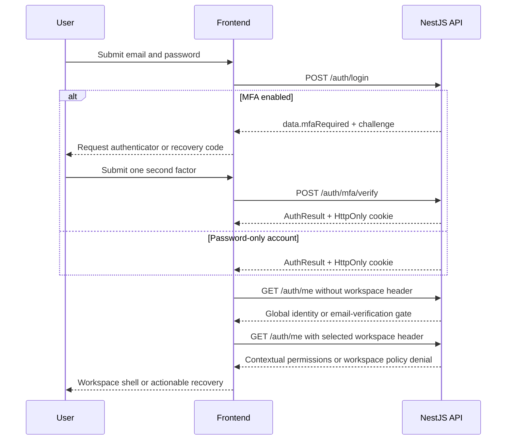

# Phase 1 — Identity, Secure Sessions & Workspace Entry

**Frontend engineering handoff · revision 2 · 5 October 2026**
**Product:** Distributed AI Agent Management Platform (AgentVault)
**Backend baseline:** `877de76`, NestJS at `http://localhost:3000`
**Status:** specification ready; frontend implementation and acceptance not yet verified.
**Companion:** [Five-phase roadmap and delivery checklist](FRONTEND_PHASES.md).

> This replaces the old Phase 1 handoff. Implement this phase first and obtain acceptance before proceeding to Phase 2. Frontend delivery phases are independent of historical backend phase numbers in code comments. The implementation is authoritative when comments, Swagger annotations or old documents disagree.

## Contents

1. [Outcome and scope](#1-outcome-and-scope)
2. [Connection and evidence](#2-connection-and-evidence)
3. [HTTP contract](#3-http-contract)
4. [Session architecture](#4-session-architecture)
5. [Workspace and permission architecture](#5-workspace-and-permission-architecture)
6. [Screens and interaction design](#6-screens-and-interaction-design)
7. [Input validation](#7-input-validation)
8. [Response models](#8-response-models)
9. [Complete endpoint register](#9-complete-endpoint-register)
10. [Detailed endpoint contracts](#10-detailed-endpoint-contracts)
11. [Error recovery matrix](#11-error-recovery-matrix)
12. [Implementation sequence](#12-implementation-sequence)
13. [Acceptance checklist](#13-acceptance-checklist)
14. [Integration constraints and source map](#14-integration-constraints-and-source-map)

## 1. Outcome and scope

Deliver a polished application where a new or returning user can register, verify email, sign in with password or MFA, recover access, join an invitation, create/select/switch workspaces, and manage their profile, password, authenticator and devices. This is the secure foundation for all later functionality.

Completion means real backend journeys and failure states work, not merely that screens render. This handoff separates existing backend behavior from recommended frontend implementation decisions.

| Module | Phase 1 responsibility |
|---|---|
| Authentication | All 20 operations in AuthController, including complete MFA management |
| Organizations | Create, list mine, read selected workspace; onboarding and switching |
| Memberships | Read my membership only |
| Invitations | Public preview and signed-in acceptance |
| Permissions | Consume effective permissions from contextual `/auth/me` |
| Infrastructure diagnostics | Three root health probes |
| Frontend foundation | Transport adapter, session coordinator, tenant-aware cache, routing, design system, accessible forms, app shell |

**26 product HTTP operations + 3 diagnostic operations = 29 Phase 1 operations.**

Deferred: workspace edits/deletion/ownership transfer, team administration, creating invitations, roles/catalogue, API keys, IP-rule management, knowledge ingestion, AI/chat, tools/workflows, audit, analytics, quotas, personal-data export and account erasure. Each has an explicit home in the roadmap. `GET /auth/me/export` and `DELETE /auth/me` belong to the separate lifecycle controller and Phase 5, despite the auth URL prefix.

The completion demo must show: registration through workspace creation; browser reload with session restoration; MFA sign-in; accepting an invitation; switching between two workspaces without stale data; profile/password/device management; and recovery from validation, expired links, session expiry and workspace restrictions.

## 2. Connection and evidence

### Local addresses

| Purpose | URL |
|---|---|
| Backend origin | `http://localhost:3000` |
| Product API base | `http://localhost:3000/api/v1` |
| Swagger UI when enabled | `http://localhost:3000/docs` |
| OpenAPI JSON when enabled | `http://localhost:3000/docs-json` |
| Frontend origin for local integration | `http://localhost:5173` |
| Health probes | `/health`, `/health/live`, `/health/ready` on backend origin |

Do not append `/api/v1` twice. Health and documentation URLs are outside the versioned API base. `/api/docs-json` is incorrect for the inspected deployment and returned 404. Other deployments can configure different prefixes/docs paths.

Use one hostname consistently; mixing `localhost` and `127.0.0.1` can break cookies. A frontend on HTTPS needs an HTTPS API or an appropriate same-origin proxy.

### What was actually verified

Read-only checks on **5 October 2026, approximately 11:51–11:53 Asia/Karachi**:

| Check | Observed result | Meaning |
|---|---|---|
| `GET /health/live` | 200; enveloped `data.status = "ok"` | API process reachable |
| `GET /health/ready` | 503; `SERVICE_UNAVAILABLE` | Readiness failed at inspection time; dependency diagnosis needed before integration sign-off |
| Unauthenticated `GET /api/v1/auth/me` | 401; `AUTH_TOKEN_MISSING` | Protected route and error envelope verified |
| `GET /docs-json` | 200; 122 distinct paths | Live OpenAPI available; methods on a path are separate operations |
| OPTIONS `/api/v1/auth/me`, origin `http://localhost:5173` | 204; exact origin allowed; credentials true | Browser-origin preflight allowed |

This was not an authenticated end-to-end test. No accounts, workspaces, invitations, passwords or MFA settings were changed. Cookie issuance, inbox delivery, database-backed flows and frontend behavior still require acceptance evidence. Readiness failure did not disclose its failing dependency in the response; use backend logs and the request ID to diagnose it. Liveness alone does not prove login or onboarding is available.

### Configuration contract

Set a frontend public API-base variable to the URL above. A Vite app may call it `VITE_API_BASE_URL`; this is a frontend naming choice, not a backend variable. No backend secret belongs in frontend configuration.

| Backend setting | Source default | Frontend consequence |
|---|---|---|
| `FRONTEND_URL` | `http://localhost:5173` | Email links must resolve to the frontend |
| `REFRESH_TOKEN_COOKIE_ENABLED` | `true` | Refresh credential is cookie-based, absent from JSON |
| `REFRESH_TOKEN_COOKIE_NAME` | `daiap_rt` | Managed by browser; never read by application JS |
| `COOKIE_SECURE` / `COOKIE_SAME_SITE` | `false` / `lax` | Local HTTP defaults; production must match deployment topology |
| `CORS_ORIGINS` | `http://localhost:5173,http://localhost:3000` | Different frontend origin requires configuration |
| `CORS_CREDENTIALS` | `true` | Client uses `credentials: 'include'` |
| `JWT_ACCESS_TTL` / `JWT_REFRESH_TTL` | `15m` / `30d` | Use returned expiration values, not hardcoded timers |
| `REQUIRE_EMAIL_VERIFICATION` | `false` | When true, all authenticated routes may be gated, including unscoped `/auth/me` |
| `MFA_CHALLENGE_TTL` | `5m` | Display returned deadline |
| Verification/reset/invitation token TTL | `24h` / `1h` / `7d` | Defaults, not guarantees for a specific issued token |
| `MAX_OWNED_ORGANIZATIONS` | `5` | Handle server quota denial, not a hardcoded entitlement |

These are repository defaults, **not verified runtime environment values**. Do not copy secret-bearing environment files to the frontend repository.

### Required email callback routes

The mail service constructs these paths. They must work on direct navigation and browser reload:

- `/auth/verify-email?token=<encoded-token>`
- `/auth/reset-password?token=<encoded-token>`
- `/invitations/accept?token=<encoded-token>`

Tokens are opaque; do not decode them as JWTs. Exclude token-bearing URLs from analytics, logs and error reports. Read a token, retain it only for the active flow, and remove it from the address bar when safe. Prefer token-free internal continuation across login/registration. If reload continuity is needed, narrowly scoped, short-lived session storage is acceptable for invitation/link continuity only; clear on completion, cancellation or expiry. Never store access/refresh tokens there.

## 3. HTTP contract

### Request construction

| Header/option | Rule |
|---|---|
| `Content-Type: application/json` | For JSON request bodies |
| `Accept: application/json` | All Phase 1 operations are JSON |
| `Authorization: Bearer <accessToken>` | Authenticated calls only; browser session does not use API keys |
| `credentials: 'include'` | Auth calls including public login/register/refresh, to accept/send cookies |
| `X-Organization-Id: <uuid>` | Explicit workspace calls or intentionally contextual `/auth/me` |
| `X-Request-Id` | Optional correlation UUID; use a fresh value per HTTP attempt |

Never send Cookie manually. Do not attach stale bearer credentials to public requests. Do not attach the active organization globally to all requests.

### Envelopes

```ts
interface Pagination {
  page: number; limit: number; totalItems: number; totalPages: number;
  hasPreviousPage: boolean; hasNextPage: boolean;
}
interface Meta {
  requestId: string; timestamp: string; durationMs?: number;
  pagination?: Pagination; path?: string;
}
type ApiSuccess<T> = { success: true; data: T; meta: Meta };
type ApiFailure = {
  success: false;
  error: { code: string; message: string; details?: unknown };
  meta: Meta;
};
```

Collections are `data: T[]`, with pagination under `meta.pagination`. Never expect `data.items` or a second nested `data`. Session lists are arrays without pagination. Dates serialize as ISO strings. Optional missing fields are different from explicit null.

Illustrative paginated response:

```json
{
  "success": true,
  "data": [],
  "meta": {
    "requestId": "11111111-1111-4111-8111-111111111111",
    "timestamp": "2026-10-05T07:00:00.000Z",
    "pagination": {
      "page": 1, "limit": 20, "totalItems": 0, "totalPages": 0,
      "hasPreviousPage": false, "hasNextPage": false
    }
  }
}
```

Illustrative field-validation response:

```json
{
  "success": false,
  "error": {
    "code": "VALIDATION_FAILED",
    "message": "Validation failed.",
    "details": { "fields": { "email": ["email must be a valid email address"] } }
  },
  "meta": {
    "requestId": "11111111-1111-4111-8111-111111111111",
    "timestamp": "2026-10-05T07:00:00.000Z",
    "path": "/api/v1/auth/register"
  }
}
```

Examples are illustrative, not captured credentials or guaranteed message text. Branch on `error.code`. Preserve HTTP status, request ID and pagination in the shared adapter.

### Validation, limits and retry policy

- DTO failures are **422 `VALIDATION_FAILED`**, generally with `error.details.fields: Record<string,string[]>`. Unknown body/query properties are rejected. Do not submit `confirmPassword`, `rememberMe`, `termsAccepted` or `returnTo` to APIs that do not define them.
- Invalid UUID route parameters can return **400 `BAD_REQUEST`**; malformed JSON is also distinct from field validation.
- Map field paths to inputs, keep all messages accessible, put unmapped errors in a summary, and focus the first invalid field.
- Read `Retry-After` in seconds, `X-RateLimit-Limit`, `X-RateLimit-Remaining` and `X-RateLimit-Reset` in Unix seconds. Do not treat reset as milliseconds.
- Named policies are selected, not assumed to stack: auth defaults to 10/15 minutes, email to 5/hour, refresh to 60/15 minutes. Other operations use default policy. Account lockout is separate: default five failed attempts over a 15-minute window and 15-minute lockout. All values are configurable.
- Never blindly retry a sensitive mutation after a timeout: it may already have committed. This includes registration, MFA changes, password changes, workspace creation and invitation acceptance.
- GET retries may be bounded for transient failures. Do not auto-retry 403/404/409/422. A 401 is not sufficient by itself to justify refresh.
- Handle HTML/non-JSON proxy responses and transport failures without crashing JSON parsing. Never invent a backend error code/request ID for a network failure.
- Navigation cancellation is not an error toast. Never render `error.stack` or server text as HTML.

## 4. Session architecture

### Storage and ownership

Keep access tokens and authentication state in memory. The refresh cookie is HttpOnly and scoped by the controller to **`/api/v1/auth`**. With cookie mode enabled, `refreshToken` is omitted from JSON. A proxy that rewrites auth paths must preserve compatible cookie behavior.

Use one session coordinator for bootstrap, expiry timers, response-driven renewal and credential changes. Do not mount refresh effects in every page or enable generic mutation retries for authentication. Framework development effect replay must not submit duplicate refreshes.

```text
unknown -> restoring -> anonymous
                    -> authenticated-global -> selecting-workspace -> workspace-ready
                    -> email-verification-required
                    -> temporarily-unavailable
anonymous -> submitting-login -> mfa-challenge -> authenticated-global
workspace-ready -> switching -> workspace-ready | workspace-access-blocked
authenticated -> signing-out -> anonymous
```

MFA challenge state is not authenticated. Do not render protected content or call bearer APIs until verification returns tokens. Distinguish offline/server failure from a definitively invalid session.



The contextual request occurs only after resolving any global verification gate. The diagram shows the order, not permission to continue after an error.

### Bootstrap

1. Render neutral restoring UI, with no flash of protected content.
2. Make one coordinated cookie-only `POST /auth/refresh` with `{}`. No bearer or org header. Missing cookie is an expected anonymous result.
3. Save successful access token/expiry in memory; request unscoped `/auth/me`.
4. If global email verification blocks `/auth/me`, retain recoverable auth state and show verification guidance. Use login/register email if available; otherwise collect an email for resend. Never create a refresh/login loop.
5. Resume safe invitation/deep-link intent first; otherwise validate the last-used workspace. With no valid selection, show picker.
6. Transient refresh failures get a retryable connection state. Definitive invalid/reused/revoked/expired refresh credentials end local authentication.

### Renewal and replay

On a protected request conclusively rejected by the authentication guard for an expired/missing access token, allow one coordinated refresh and one replay. If another request already obtained a newer token, use it first. Invalid/revoked token outcomes should end the session by default; explicit password-change recovery below is a controlled exception.

Never auto-refresh for `AUTH_INVALID_CREDENTIALS`, `AUTH_PASSWORD_MISMATCH`, `MFA_CODE_INVALID`, `MFA_CHALLENGE_INVALID`, link-token errors or `INVITATION_EMAIL_MISMATCH`. These describe the submitted action. Refresh must never recursively invoke itself.

A mutation may be replayed after a conclusive pre-handler authentication failure, not after an ambiguous transport timeout. Bind any queued replay to its original user, workspace and session generation. Cancel if these change while renewal is pending.

### Cross-tab coordination is required

Every successful refresh rotates the credential. Reuse detection revokes the family, and AuthService then revokes **all sessions for that user**. A module-level promise only protects one tab.

Required frontend design:

- All refresh callers share one same-origin exclusive cross-tab lock, for example Web Locks where supported, plus same-tab single-flight state.
- After lock acquisition, check whether another tab supplied a newer usable access token; use it rather than rotating unnecessarily.
- Broadcast updated access token/expiry only to same-origin app contexts if using that approach; do not persist or log them. Never broadcast a refresh token.
- A tab missing a broadcast may renew serially with the current cookie after acquiring the lock. Never queue an old body refresh token.
- Logout increments a session generation and broadcasts sign-out; late responses from older generations cannot resurrect state.
- Coordinate logout and cookie-changing login/register against refresh. Cookie identity is shared by same-origin tabs; independent account sessions in those tabs are not supported by one cookie.
- An ambiguous refresh timeout must not blindly retry the same credential. Offer recovery/re-authentication if a safe current session cannot be established.
- Define and test browser support/fallback. A same-tab promise or expiring lock that can overlap is not a sufficient fallback.

### Credential changes

**Change password:** current refresh family is retained only if the cookie traveled. `UsersService.setPassword` advances `tokensValidFrom`, so old access JWTs, including this tab's, become invalid. After success perform one explicit coordinated refresh, then reload identity/sessions. If unsuccessful, require sign-in. Do not promise the old access token survives.

**Reset password:** all sessions revoked, cookie cleared, no tokens returned. Clear local state and require login.

**Enable MFA:** install returned replacement access token if present; other devices are revoked. Display recovery codes once. If no token is returned, use a fresh MFA sign-in before entering a restricted workspace.

**Disable MFA:** service clears session-row assurance but does not immediately reissue/revoke existing JWTs. Explicitly refresh afterward, reload MFA status and re-evaluate workspace access. This frontend action does not fix assurance retained by other clients' already-issued JWTs; see section 14.

**Logout/revoke current session:** clear identity, permissions, tenant data, sensitive forms and all user-bound caches. Notify tabs. Do not immediately restore with a revoked cookie. The session-delete operation does not clear the cookie itself.

**Logout network failure:** local UI may clear, but server sign-out is unconfirmed. Say so and prevent automatic restoration from silently undoing local sign-out until deliberate recovery. Frontend JavaScript cannot delete an HttpOnly cookie.

## 5. Workspace and permission architecture

### One context source

Backend precedence: `X-Organization-Id` → `X-Organization-Slug` → path parameter. The ID header accepts UUID or slug. Prefer canonical UUID and derive both path and header from one immutable workspace argument. Never combine an old captured URL with the current global header.

Unscoped operations: auth except deliberately contextual `/auth/me`, organization create/list, invitation preview/accept. Scoped operations: workspace detail, own membership, contextual identity.

There is no switch-workspace endpoint. Login's optional `organizationId` is advisory and does not grant access.

### Switching transaction

1. Increment selection generation and cancel old tenant requests. Stop rendering the previous workspace's permissions/data immediately.
2. Request contextual `/auth/me` for the candidate. This enforces membership, workspace status, IP, MFA and email policies.
3. Use returned canonical `activeOrganizationId`; normalize omitted permissions to `[]`, never full access.
4. Fetch workspace detail only if `workspace:read` is present. A custom role can lack that permission; global account settings must remain usable.
5. Fetch own membership for actual member role labels when useful. Platform-admin break-glass context can have no persisted membership; do not make this a universal shell dependency.
6. Commit only if selection generation is current. Persist a user-scoped last-used workspace ID as a hint, never authority.
7. On denial show the relevant recovery state with access to picker/account/sign-out.

Example cache keys: `['me', userId, organizationId ?? 'global']`, `['workspaces', userId, page, limit]`, `['workspace', userId, organizationId]`, `['own-membership', userId, organizationId]`. Abort or ignore stale generations. Clear user-bound caches on account change/sign-out. Isolate tenant caches and prevent stale rendering on every switch.

`GET /auth/me` embeds only the first **100 memberships**, without pagination metadata. Use `/organizations` pagination for the complete picker. That controller forwards only page/limit; search/sort fields in the shared DTO do not implement workspace search. Do not advertise full search over a partial client collection.

### Permission-driven UI

Use concrete keys from contextual `/auth/me.permissions`. Roles and ownership are labels/context, not a replacement for permissions. The server expands wildcard grants. `isPlatformAdmin` must not independently enable every client action.

Global profile/security screens need authentication, not workspace read permission. Workspace detail needs `workspace:read`. Create/list own workspaces and read own membership have no additional permission requirement, but global email policy and relevant workspace guards still apply.

Future navigation should have phase-availability and permission metadata. Hide undelivered modules or label them as planned without backend calls or fake data. After unexpected permission denial, refresh contextual permissions once; do not loop or refresh the token as a permissions fix.

## 6. Screens and interaction design

Routes below are recommendations except the three exact mail callback routes.

| Surface | Required content | Required states |
|---|---|---|
| `/auth/login` | Email, password reveal, forgot-password and signup links | pending, invalid credentials, lockout, unavailable account, rate-limit, offline |
| `/auth/register` | First/last name, email, new password; optional client-only confirmation | policy hints, duplicate email, breach/field errors, submitted |
| `/auth/mfa` | TOTP/recovery modes, deadline, verify | wrong code, expired challenge, lockout, restart login |
| `/auth/forgot-password` | Email/reset request | generic confirmation, cooldown |
| `/auth/reset-password` | Link token, new password/confirmation | missing/expired/used token, validation, success then login |
| `/auth/verify-email` | Verify action and result; resend recovery | missing token, verifying, success, expired/used/invalid |
| `/auth/check-email` | Verification guidance, resend, recheck | globally gated session, cooldown |
| `/invitations/accept` | Workspace, role, inviter, masked email, expiry | preview, auth continuation, wrong account, accepted/expired/revoked/used |
| `/workspaces` | Paginated picker, role labels, create action | loading, zero workspaces, more pages, blocked workspace |
| `/workspaces/new` | Name, optional slug/description | validation, quota, reserved slug, uncertain outcome |
| `/w/:organizationId` | Selected workspace shell and useful setup links | selecting, denied, no permissions; no fake analytics |
| `/account/profile` | Names/display name/avatar URL, read-only email | loading, dirty, save pending, saved/error |
| `/account/security` | Password, MFA, session sections | independently loading/failing sections |
| `/account/security/mfa` | QR/manual secret, confirmation, codes, disable/regenerate | enrollment, enabled, confirmation, one-time display |
| `/account/security/sessions` | Device rows/current badge, revoke, logout-all | loading, nullable fields, confirmation, revoked |
| Shared boundaries | Not found, forbidden, policy blocked, unavailable | safe retry/picker/account/sign-in actions, request ID |

### Design and accessibility

Use a coherent AgentVault visual identity: restrained neutral surfaces, one accent, clear hierarchy and consistent spacing. Dark styling is a frontend design choice, not an API constraint. Define semantic tokens for backgrounds, text, borders, focus and status; never rely on color alone.

Auth pages need focused reading width and one primary action. App shell needs desktop sidebar, visible workspace identity/switcher, account menu and mobile drawer. Account settings remain accessible without a selected workspace.

Use real labels, semantic headings, keyboard-operable dialogs/menus, visible focus and live-region error/status announcements. Support autocomplete (`email`, `current-password`, `new-password`, `one-time-code`), password managers and paste. TOTP is a string preserving leading zeroes, with numeric input mode rather than a number field. Recovery codes support paste. Respect reduced motion, zoom and 360px mobile width without horizontal overflow.

Every asynchronous surface needs loading, empty, success, pending mutation and actionable error states. Keep form values on recoverable errors. Explain disabled actions. Prevent duplicate submits. Trap dialog focus and restore it on close. Render user text as text and use safe image URL handling plus initials/fallbacks for broken avatars.

### Flow-specific requirements

**Registration:** starts a session but no workspace. Continue a pending invitation before general onboarding. Terms/confirmation controls stay client-only unless a later API supports them.

**Verification:** do not double-submit link tokens through effects. An explicit Verify button is acceptable. Success does not create a login session. If signed in, reload unscoped and then contextual identity. An already-used link does not prove the current browser is authenticated.

**Invitations:** `requiresRegistration` is guidance. Never use the masked preview address as a login email. Preserve intent through registration/login/MFA/email verification. Signed-in acceptance is an explicit action. Re-load memberships after success and use normal workspace checks. Backend-prepared invitation fixtures can test this before Phase 2 invitation-management UI exists.

**MFA:** render the returned otpauth URI locally as QR; never send secret to a remote QR service. Provide manual entry. After enabling, display recovery codes once with deliberate copy/download and acknowledgement. Clear them from memory when dismissed. No endpoint retrieves old codes. Setup retry can replace the pending secret; do not retry it automatically.

Send exactly one factor for verify/disable. Backend prioritizes a supplied recovery code rather than enforcing exclusive-or in the DTO; UI must enforce one mode. Recovery replacement requires TOTP, not a recovery code. A just-used TOTP may fail replay protection; guide users to wait for the next code.

**Devices:** use returned session ID, not user/family ID. Null device/IP/date fields get a neutral placeholder. Confirm revocation. Re-fetch after revoking another device; exit immediately after current-device revocation.

**Profile:** avatar is a URL, not a file upload. Email is read-only; no account email-change endpoint exists in this phase.

## 7. Input validation

Required fields use correct primitive types. Omit optional fields not edited; do not assume null is a universal clearing contract. Trim name/email/slug fields; never trim or transform passwords. Server validation is authoritative.

| Request | Constraints |
|---|---|
| Register | email valid/max 320/trimmed; password strong policy; firstName/lastName nonempty strings/max 100/trimmed |
| Login | email valid/max 320/trimmed; password nonempty/max 1024; optional organizationId UUID v4; no strength validator for existing passwords |
| Refresh/logout | optional refreshToken string/max 4096; cookie-mode browser sends `{}` |
| Verify email | token nonempty/max 512 |
| Resend/forgot | email valid/max 320/trimmed |
| Reset | token nonempty/max 512; password strong policy |
| Change password | currentPassword nonempty/max 1024; newPassword strong policy |
| Profile PATCH | optional firstName/lastName trimmed 1–100; displayName trimmed/max 255; avatarUrl trimmed/max 2048; DTO does not validate URL syntax |
| MFA verify | challengeToken nonempty/max 2048; one of code/recoveryCode |
| MFA setup | password nonempty/max 1024 |
| MFA enable | code string, six digits with optional middle space/outer whitespace |
| MFA disable | password nonempty/max 1024; one of code/recoveryCode |
| Recovery replacement | password nonempty/max 1024; code TOTP string |
| Second factor | code regex `^\s*\d{3}\s?\d{3}\s*$`; recoveryCode string/max 32; frontend rejects blank/both |
| Create workspace | name trimmed 2–120; optional slug trimmed 2–60 matching `^[a-z0-9][a-z0-9-]*[a-z0-9]$`; optional description trimmed/max 2000 |
| List workspaces | page integer >=1/default 1; limit integer 1–100/default 20; query strings converted to numbers |
| Invitation preview | query token nonempty/max 512, URL-encoded once |
| Invitation accept | JSON token nonempty/max 512 |
| Revoke session | path sessionId UUID v4 |

Pagination DTO also accepts search (trimmed/max 200), sortBy (max 50), sortDirection (ASC/DESC, uppercased), but workspace-list implementation ignores them. `limit > 100` returns 422 despite old descriptions saying clamped.

### New-password policy

Defaults: 12–128 characters, uppercase/lowercase/number required, symbol optional. Validator rejects its common-password list, four repeated characters, ascending/descending sequences of five, and qualifying personal-data fragments when supplied by that validation path. Registration supplies names/email; reset/change DTOs do not carry the same personal-data context. Do not promise identical identity-fragment checks across all flows.

Breach checking may reject with 422 `AUTH_PASSWORD_BREACHED` in enforce mode. Show a password field error; do not send frontend passwords to external breach services. No public password-policy or strength-score endpoint exists. UI meter is advisory; agree deployment-specific hints and always show server validation.

## 8. Response models

Wire types below are payloads under `data`. Dates are JSON strings. Optional fields match actual branching behavior.

```ts
type UUID = string;
type ISODate = string;
interface TokenPair {
  accessToken: string; refreshToken?: string; // omitted in cookie mode
  tokenType: string; // currently Bearer
  expiresIn: number; expiresAt: ISODate; refreshExpiresIn: number; // lifetimes in seconds
}
interface AuthUser {
  id: UUID; email: string; firstName: string; lastName: string; displayName: string;
  emailVerified: boolean; isPlatformAdmin: boolean;
  status: 'PENDING' | 'ACTIVE' | 'SUSPENDED' | 'DEACTIVATED'; mfaEnabled?: boolean;
}
interface AuthResult { user: AuthUser; tokens: TokenPair }
interface MfaRequired {
  mfaRequired: true;
  challenge: { token: string; expiresAt: ISODate; methods: string[] };
}
type LoginResult = AuthResult | MfaRequired;
interface MembershipSummary {
  organizationId: UUID; organizationName: string; organizationSlug: string;
  roleSlugs: string[]; isOwner: boolean;
}
interface CurrentUser extends AuthUser {
  avatarUrl: string | null; memberships: MembershipSummary[];
  permissions?: string[]; activeOrganizationId?: UUID;
}
interface MfaStatus {
  enabled: boolean; enrolledAt: ISODate | null;
  recoveryCodesRemaining: number; sessionVerified: boolean;
}
interface MfaSetup { secret: string; otpauthUri: string; issuer: string; account: string }
interface MfaEnabledResult { recoveryCodes: string[]; accessToken?: string; expiresIn?: number }
interface Session {
  id: UUID; deviceLabel: string | null; ipAddress: string | null;
  createdAt: ISODate; lastUsedAt: ISODate | null; expiresAt: ISODate; isCurrent: boolean;
}
interface WorkspaceSettings {
  defaultChunkSize?: number; defaultChunkOverlap?: number; auditRetentionDays?: number;
  requireMfa?: boolean; requireVerifiedEmail?: boolean; allowedEmailDomains?: string[];
}
interface Workspace {
  id: UUID; name: string; slug: string; description: string | null; logoUrl: string | null;
  status: 'ACTIVE' | 'SUSPENDED' | 'ARCHIVED'; plan: 'FREE' | 'PRO' | 'ENTERPRISE';
  ownerId: UUID; settings: WorkspaceSettings; ipAllowlistEnabled: boolean;
  memberCount: number; createdAt: ISODate;
}
interface ListedWorkspace extends Workspace {
  roleSlugs: string[]; isOwner: boolean; joinedAt: ISODate | null;
}
interface MemberRole {
  id: UUID; name: string; slug: string; color: string | null; priority: number;
}
interface OwnMembership {
  id: UUID; // membership id, NOT user id
  userId: UUID; email: string; firstName: string; lastName: string; displayName: string;
  avatarUrl: string | null; title: string | null;
  status: 'ACTIVE' | 'SUSPENDED' | 'REMOVED'; roles: MemberRole[];
  highestRolePriority: number; isOwner: boolean;
  joinedAt: ISODate | null; lastActiveAt: ISODate | null; createdAt: ISODate;
}
interface InvitationPreview {
  organizationName: string; organizationSlug: string; roleName: string;
  inviterName: string; email: string; // masked, NOT a login email
  expiresAt: ISODate; requiresRegistration: boolean;
}
interface InvitationAccepted { organizationId: UUID; organizationSlug: string; memberId: UUID }
interface Liveness { status: 'ok'; uptime: number; environment: string; timestamp: ISODate }
interface HealthReport {
  status: string; info?: Record<string, unknown>; error?: Record<string, unknown>;
  details: Record<string, unknown>;
}
```

MFA challenge login has no user/tokens yet. Account `mfaEnabled` differs from session `sessionVerified`. PENDING is not necessarily a login failure; email policy controls later access. Workspace settings may be empty and are read-only in this phase; absence does not mean enabled. Model, PII and quota policies are not contained in this settings object.

## 9. Complete endpoint register

Paths below are relative to `/api/v1` except root health paths. Public = no bearer; User = bearer without workspace context; Context = bearer with resolved workspace. Status codes follow controller implementation. Common errors in section 11 apply to every operation where relevant.

| ID | Method | Path | Auth/context | Success | Rate policy | Payload |
|---|---|---|---|---|---|---|
| P1-API-01 | POST | `/auth/register` | Public | 201 | auth | AuthResult |
| P1-API-02 | POST | `/auth/login` | Public | 200 | auth | AuthResult or MfaRequired |
| P1-API-03 | POST | `/auth/mfa/verify` | Public | 200 | auth | AuthResult |
| P1-API-04 | GET | `/auth/mfa` | User | 200 | default | MfaStatus |
| P1-API-05 | POST | `/auth/mfa/setup` | User | 200 | auth | MfaSetup |
| P1-API-06 | POST | `/auth/mfa/enable` | User | 200 | auth | MfaEnabledResult |
| P1-API-07 | POST | `/auth/mfa/disable` | User | 200 | auth | `{ disabled: true }` |
| P1-API-08 | POST | `/auth/mfa/recovery-codes` | User | 200 | auth | `{ recoveryCodes: string[] }` |
| P1-API-09 | POST | `/auth/refresh` | Public + cookie | 200 | refresh | TokenPair |
| P1-API-10 | POST | `/auth/logout` | User + cookie | 200 | default | `{ revokedSessions: number }` |
| P1-API-11 | POST | `/auth/logout-all` | User | 200 | default | `{ revokedSessions: number }` |
| P1-API-12 | GET | `/auth/me` | User; optional Context | 200 | default | CurrentUser |
| P1-API-13 | PATCH | `/auth/me` | User | 200 | default | `{ id: UUID, displayName: string }` |
| P1-API-14 | POST | `/auth/verify-email` | Public | 200 | auth | `{ verified: boolean }` |
| P1-API-15 | POST | `/auth/resend-verification` | Public | 200 | email | `{ sent: true }` |
| P1-API-16 | POST | `/auth/forgot-password` | Public | 200 | email | `{ sent: true }` |
| P1-API-17 | POST | `/auth/reset-password` | Public | 200 | auth | `{ reset: true }` |
| P1-API-18 | POST | `/auth/change-password` | User + cookie | 200 | auth | `{ changed: true, revokedSessions: number }` |
| P1-API-19 | GET | `/auth/sessions` | User | 200 | default | Session[] |
| P1-API-20 | DELETE | `/auth/sessions/:sessionId` | User | 200 | default | `{ revoked: number }` |
| P1-API-21 | POST | `/organizations` | User | 201 | default | Workspace |
| P1-API-22 | GET | `/organizations` | User | 200 | default | ListedWorkspace[] + pagination |
| P1-API-23 | GET | `/organizations/:organizationId` | Context; workspace:read | 200 | default | Workspace |
| P1-API-24 | GET | `/organizations/:organizationId/members/me` | Context; no extra permission | 200 | default | OwnMembership |
| P1-API-25 | GET | `/invitations/preview?token=…` | Public | 200 | auth | InvitationPreview |
| P1-API-26 | POST | `/invitations/accept` | User | 200 | auth | InvitationAccepted |
| P1-API-27 | GET | root `/health/live` | Public | 200 | default | Liveness |
| P1-API-28 | GET | root `/health/ready` | Public | 200 when ready | default | HealthReport |
| P1-API-29 | GET | root `/health` | Public | 200 when passing | default | HealthReport |

## 10. Detailed endpoint contracts

Response types below refer to section 8 and live under envelope `data`. GET/DELETE operations have no body. Protected operations inherit account/session and global email guards. Known domain errors are listed per endpoint; validation, rate-limit, transport and server errors also apply. Values are illustrative and must not be used as real credentials.

### P1-API-01 · Register

`POST /api/v1/auth/register`

```json
{"email":"alex@example.com","password":"Cedar!Orbit7Mosaic","firstName":"Alex","lastName":"Morgan"}
```

201 AuthResult and refresh cookie when enabled. Creates PENDING account, starts a session and sends verification mail. No workspace is created. Example password demonstrates format, not guaranteed acceptability.

Errors: 409 ACCOUNT_ALREADY_EXISTS; 422 VALIDATION_FAILED / AUTH_PASSWORD_BREACHED. After uncertain network failure offer login/recovery instead of repeatedly registering. Adopt auth state only from a complete success response.

### P1-API-02 · Login

`POST /api/v1/auth/login`

```json
{"email":"alex@example.com","password":"<user-entered-password>"}
```

Optional organizationId is UUID v4 and advisory. 200 returns AuthResult with cookie OR this payload under data:

```json
{"mfaRequired":true,"challenge":{"token":"<opaque-challenge>","expiresAt":"2026-10-05T07:05:00.000Z","methods":["totp","recovery_code"]}}
```

Check mfaRequired before reading tokens. Errors: 401 AUTH_INVALID_CREDENTIALS; 403 ACCOUNT_LOCKED (possible details.lockedUntil), ACCOUNT_SUSPENDED, ACCOUNT_DEACTIVATED; 429. Wrong MFA attempts also count toward lockout. Never poll credentials while locked.

### P1-API-03 · Complete MFA login

`POST /api/v1/auth/mfa/verify`

```json
{"challengeToken":"<challenge.token>","code":"024681"}
```

Recovery mode: replace code with recoveryCode. 200 AuthResult and cookie establish the session. Errors: 401 MFA_CODE_INVALID / MFA_CHALLENGE_INVALID; 403 ACCOUNT_LOCKED / ACCOUNT_SUSPENDED / ACCOUNT_DEACTIVATED. Wrong factor permits correction while challenge remains valid; invalid/expired/consumed challenge requires password login again. Clear challenge/factor after success or abandonment.

### P1-API-04 · MFA status

`GET /api/v1/auth/mfa` → 200 MfaStatus. No query/body. Distinguish enabled account from verified session. Re-fetch after enrollment, disable, recovery replacement or recovery-code sign-in.

### P1-API-05 · Start MFA enrollment

`POST /api/v1/auth/mfa/setup`

```json
{"password":"<current-password>"}
```

200 MfaSetup; creates/replaces pending secret without enabling MFA. Errors: 401 AUTH_PASSWORD_MISMATCH; 409 MFA_ALREADY_ENABLED. Complete with enable. No cancel-enrollment API; leaving the page does not disable MFA. Never cache/log secret or URI.

### P1-API-06 · Enable MFA

`POST /api/v1/auth/mfa/enable`

```json
{"code":"024681"}
```

200 MfaEnabledResult: recovery codes, optional accessToken/expiresIn. Install replacement token, refresh identity/status/devices, show codes once and then continue intended workspace. Other device families are revoked. Errors: 401 MFA_CODE_INVALID; 409 MFA_ALREADY_ENABLED / MFA_NOT_ENROLLING. Missing enrollment requires setup again.

### P1-API-07 · Disable MFA

`POST /api/v1/auth/mfa/disable`

```json
{"password":"<current-password>","code":"024681"}
```

Alternatively recoveryCode instead of code. 200 `{ disabled: true }`; removes secret/codes, clears session-row assurance, sends security notice. Errors: 401 AUTH_PASSWORD_MISMATCH / MFA_CODE_INVALID; 409 MFA_NOT_ENABLED. Confirm explicitly, refresh token assurance afterward, and expect MFA-required workspace access to be blocked.

### P1-API-08 · Replace recovery codes

`POST /api/v1/auth/mfa/recovery-codes`

```json
{"password":"<current-password>","code":"024681"}
```

200 `{ recoveryCodes: string[] }`. Invalidates prior unused codes. TOTP required; recoveryCode is not supported in this DTO. Errors: 401 AUTH_PASSWORD_MISMATCH / MFA_CODE_INVALID; 409 MFA_NOT_ENABLED. Confirm replacement, display once and re-read remaining count. Do not hardcode array length.

### P1-API-09 · Refresh

`POST /api/v1/auth/refresh` with `{}`, credentials include, no bearer/org header.

200 TokenPair and rotated cookie. Non-browser compatibility accepts body refreshToken and takes it before cookie; browser must use cookie mode.

401: AUTH_TOKEN_MISSING, AUTH_REFRESH_TOKEN_INVALID, AUTH_REFRESH_TOKEN_REUSED, AUTH_TOKEN_EXPIRED, AUTH_TOKEN_REVOKED; unusable account may return ACCOUNT_SUSPENDED. Reuse triggers all-user session revocation. No recursive or blind retries. Update memory token/expiry and release waiting requests only after success.

### P1-API-10 · Logout this device

`POST /api/v1/auth/logout` with `{}`, bearer and cookie. 200 `{ revokedSessions: number }`; count is not fixed. Revokes current family, denylists presented access JWT and clears cookie. A missing-cookie path falls back to session ID. Clear local state after acknowledgement; no org context needed.

### P1-API-11 · Logout everywhere

`POST /api/v1/auth/logout-all`, no fields (empty JSON acceptable). 200 `{ revokedSessions: number }`; revokes current and other sessions and clears cookie. Confirm, clear state across tabs. No password field is defined.

### P1-API-12 · Current identity and permissions

`GET /api/v1/auth/me`, no body/query. Unscoped: 200 CurrentUser, memberships, usually no activeOrganizationId/permissions. Contextual header: resolves workspace, returns canonical activeOrganizationId and concrete permissions where nonempty.

Membership array capped at 100. Omitted permissions normalize to empty. Context errors: 404 ORGANIZATION_NOT_FOUND; 403 ORGANIZATION_SUSPENDED, MEMBERSHIP_SUSPENDED, IP_NOT_ALLOWED, MFA_REQUIRED, ACCOUNT_EMAIL_NOT_VERIFIED. Account settings use unscoped request to avoid stale-tenant lockout. Global email policy can still gate it.

### P1-API-13 · Update profile

`PATCH /api/v1/auth/me`

```json
{"firstName":"Alex","lastName":"Morgan","displayName":"Alex M.","avatarUrl":"https://example.com/avatar.png"}
```

All fields optional; send changes only. 200 `{ id, displayName }`, not full user. Refetch unscoped identity and invalidate relevant contextual/member views. No email/password/file field. Keep dirty form on recoverable failure.

### P1-API-14 · Verify email

`POST /api/v1/auth/verify-email`

```json
{"token":"<email-link-token>"}
```

200 `{ verified: true }`, no auth tokens. Errors: 401 TOKEN_NOT_FOUND / TOKEN_EXPIRED / TOKEN_ALREADY_USED. Public, usable while global verification blocks bearer routes. Re-fetch identity if signed in; otherwise offer login. Expired/used link offers resend/sign-in, not retries.

### P1-API-15 · Resend verification

`POST /api/v1/auth/resend-verification`

```json
{"email":"alex@example.com"}
```

200 `{ sent: true }` whether or not a send occurred. Public, email throttle. Generic conditional confirmation does not prove account existence, unverified status or inbox delivery.

### P1-API-16 · Request password reset

`POST /api/v1/auth/forgot-password`

```json
{"email":"alex@example.com"}
```

200 `{ sent: true }`; same generic confirmation rule. Public, email throttle. User follows email; do not invent a reset token. Mail/network/server failures remain possible.

### P1-API-17 · Reset password from link

`POST /api/v1/auth/reset-password`

```json
{"token":"<reset-link-token>","password":"<new-password>"}
```

200 `{ reset: true }`; consumes token, changes password, revokes all sessions and clears cookie. Errors: 401 TOKEN_NOT_FOUND / TOKEN_EXPIRED / TOKEN_ALREADY_USED; 422 VALIDATION_FAILED / AUTH_PASSWORD_BREACHED. Breach rejection precedes token consumption, allowing correction. Clear local auth and require login on success.

### P1-API-18 · Change password

`POST /api/v1/auth/change-password`

```json
{"currentPassword":"<current-password>","newPassword":"<new-password>"}
```

200 `{ changed: true, revokedSessions: number }`. Cookie identifies family to retain. Errors: 401 AUTH_PASSWORD_MISMATCH; 400 AUTH_PASSWORD_REUSED if unchanged; 422 VALIDATION_FAILED / AUTH_PASSWORD_BREACHED. Explicitly renew after success because old access token is cut off. Without cookie no family may survive; fall back to login.

### P1-API-19 · Active devices

`GET /api/v1/auth/sessions` → 200 Session[]. No query/pagination. Rotations collapse into family/device rows. isCurrent is server-computed. Re-fetch after renewal/revocation; do not retain old row IDs indefinitely. Provide manual refresh, not aggressive polling.

### P1-API-20 · Revoke a device

`DELETE /api/v1/auth/sessions/:sessionId`, UUID v4, no body. 200 `{ revoked: number }`; revokes family. 404 AUTH_SESSION_NOT_FOUND if unknown/not owned. Refresh stale list on 404 with neutral explanation. Current-device revoke exits; operation does not clear cookie itself.

### P1-API-21 · Create workspace

`POST /api/v1/organizations`

```json
{"name":"Research Lab","slug":"research-lab","description":"Shared research workspace"}
```

201 Workspace. Omit slug to derive from name. Transaction creates workspace, standard roles and owner membership. Even explicitly supplied duplicate slug may receive random suffix; returned slug/UUID are authoritative.

Errors: 403 ORGANIZATION_LIMIT_REACHED (possible details.limit/current); 409 ORGANIZATION_SLUG_RESERVED / ORGANIZATION_SLUG_TAKEN; 422 validation. Invalidate lists/memberships and contextualize returned workspace. No slug-availability endpoint or arbitrary settings on create.

### P1-API-22 · List my workspaces

`GET /api/v1/organizations?page=1&limit=20` → 200 ListedWorkspace[] with meta.pagination. No org header/body. Active memberships only; listed workspace may still be suspended/policy-blocked. Select through contextual checks. Empty array is normal onboarding. Max limit 100; shared search/sort inputs are ignored here.

### P1-API-23 · Workspace detail

`GET /api/v1/organizations/:organizationId`, matching org header, no body/query. UUID or slug, canonical UUID preferred. 200 Workspace; requires workspace:read and context checks. Permission denial does not invalidate global session. Do not infer authority from ownerId alone.

### P1-API-24 · My workspace membership

`GET /api/v1/organizations/:organizationId/members/me` with matching context → 200 OwnMembership. No body/query or extra permission; active membership/policies still apply. id is membership ID; userId is account ID. Display role badge only; edits are Phase 2. Synthetic platform-admin context has no persisted membership and this lookup may fail; its failure status was not live-verified. Do not block all navigation on this optional view.

### P1-API-25 · Invitation preview

`GET /api/v1/invitations/preview?token=<encoded-token>` → 200 InvitationPreview. Public, no org/body. Email is masked. 404 INVITATION_NOT_FOUND; 409 INVITATION_EXPIRED / INVITATION_REVOKED / INVITATION_ALREADY_ACCEPTED; 422 missing/invalid token. Terminal states offer login/picker/contact-inviter recovery.

### P1-API-26 · Accept invitation

`POST /api/v1/invitations/accept`

```json
{"token":"<invitation-link-token>"}
```

200 InvitationAccepted. Bearer, no org context; recipient is not yet a member. Must match normalized invited email. 401 INVITATION_EMAIL_MISMATCH; 404 INVITATION_NOT_FOUND / ROLE_NOT_FOUND; 409 INVITATION_EXPIRED / INVITATION_REVOKED / INVITATION_ALREADY_ACCEPTED / MEMBERSHIP_ALREADY_EXISTS / MEMBERSHIP_SUSPENDED. Global email policy can return 403 first.

After success perform normal contextual entry; MFA/IP restrictions may still block workspace. On already-member/accepted conflict, re-read accessible workspaces and offer entry only if actually accessible. An arbitrary conflict is not success.

### P1-API-27 · Liveness

`GET http://localhost:3000/health/live` → 200 Liveness under envelope. Uptime is integer seconds. No dependencies checked. Diagnostic only; do not poll to gate ordinary navigation.

### P1-API-28 · Readiness

`GET http://localhost:3000/health/ready` → 200 HealthReport when ready; 503 SERVICE_UNAVAILABLE on failure. Checks PostgreSQL/Redis; Redis may report degraded rather than fatal. Inspection received 503 without a dependency breakdown. Diagnose with backend logs/request ID.

### P1-API-29 · Full health

`GET http://localhost:3000/health` → 200 HealthReport on success; 503 for fatal check failure. Covers database, Redis, memory, storage/vector/AI/queues, inference, workflow/realtime and security indicators; some feature dependencies report nonfatally. Do not hardcode every details key or expose an infrastructure dump as user dashboard. Source-reviewed, not live-exercised in this handoff.

### Browser request examples

These illustrate construction, not a complete safe refresh implementation. Components should use the shared adapter with explicit auth mode, workspace, abort signal and retry classification.

```ts
const apiBase = 'http://localhost:3000/api/v1';
const refreshResponse = await fetch(`${apiBase}/auth/refresh`, {
  method: 'POST', credentials: 'include',
  headers: { 'Content-Type': 'application/json', Accept: 'application/json' },
  body: JSON.stringify({}),
});

async function readWorkspace(workspaceId: string, accessToken: string, signal?: AbortSignal) {
  return fetch(`${apiBase}/organizations/${encodeURIComponent(workspaceId)}`, {
    credentials: 'include', signal,
    headers: {
      Accept: 'application/json', Authorization: `Bearer ${accessToken}`,
      'X-Organization-Id': workspaceId,
    },
  });
}

const query = new URLSearchParams({ token: invitationToken });
const previewResponse = await fetch(`${apiBase}/invitations/preview?${query}`, {
  credentials: 'include', headers: { Accept: 'application/json' },
});
```

## 11. Error recovery matrix

| Outcome | User experience | State action |
|---|---|---|
| Access expired/missing on protected resource | Restore once, then login if definitive failure | Coordinated refresh/replay, no recursion |
| AUTH_TOKEN_INVALID / AUTH_TOKEN_REVOKED | Session ended | Clear auth; explicit password-change renewal handled separately |
| Refresh invalid/reused/expired/revoked | Login; calm security explanation for reuse | Clear caches and notify tabs |
| AUTH_INVALID_CREDENTIALS | Generic credential error | Stay on form; no refresh |
| AUTH_PASSWORD_MISMATCH | Current-password error | Preserve session; no refresh |
| MFA_CODE_INVALID | Fresh code/recovery mode | Keep valid challenge |
| MFA_CHALLENGE_INVALID | Restart login | Clear challenge |
| Link TOKEN_* errors | Invalid/expired/used recovery | No auto-refresh/resubmit |
| INVITATION_EMAIL_MISMATCH | Deliberate account switch | Preserve invitation safely |
| ACCOUNT_LOCKED | Unlock deadline if present, recovery | No automatic credential attempts |
| ACCOUNT_SUSPENDED / ACCOUNT_DEACTIVATED | Account unavailable | End protected navigation |
| ACCOUNT_EMAIL_NOT_VERIFIED | Verify/resend/recheck | Keep recoverable auth, no loop |
| MFA_REQUIRED | Enroll if disabled; login again if session unverified | Security screens unscoped |
| IP_NOT_ALLOWED | Workspace network restriction, picker | No global logout |
| ORGANIZATION_SUSPENDED / MEMBERSHIP_SUSPENDED | Workspace-specific block | Clear tenant state, retain global account |
| ORGANIZATION_NOT_FOUND | Workspace unavailable | Clear selection; do not assert existence |
| PERMISSION_DENIED | Action unavailable | Refresh permissions once if stale; no token refresh |
| ORGANIZATION_LIMIT_REACHED | Explain ownership limit | Preserve creation form |
| Slug conflict | Different name/URL | Preserve form |
| MFA state conflict | Re-read status, correct enrollment flow | No blind retries |
| Invitation/member conflict | Follow individual endpoint recovery | Re-read accessible workspaces when appropriate |
| AUTH_PASSWORD_REUSED | Choose different password | Preserve form |
| AUTH_PASSWORD_BREACHED | Choose another password | Keep reset token usable |
| VALIDATION_FAILED | Field mapping/focus | Preserve input |
| RATE_LIMIT_EXCEEDED | Retry-After countdown | Disable relevant action; no retry storm |
| 5xx/timeout | Service error/request ID | No automatic mutation replay |
| Network/CORS/non-JSON | Connection recovery | Do not claim mutation/logout success |

Codes can have different HTTP statuses depending on service/guard context. Error details are optional; absent deadlines, permission lists or IDs must not crash UI.

## 12. Implementation sequence

Use the project's agreed frontend tooling. If none exists, React + TypeScript, routing, a server-state query layer and accessible component primitives are reasonable choices; pin actual versions in the frontend lockfile. This contract does not depend on an unverified library version.

Suggested boundaries: `app` (router/providers), `shared/api` (transport/types/errors), `shared/session` (coordinator/memory/cross-tab), `shared/workspace` (context/cache), `shared/ui` (tokens/components), and separate `features/auth`, `features/account`, `features/workspaces`, `features/invitations` with auth/app layouts.

| Order | Deliverable | Proof required |
|---|---|---|
| 1 | Config, route skeleton, visual tokens, API adapter/models | Base URL/CORS/envelope/field errors |
| 2 | Session coordinator, login/register | Cookie, reload, MFA union, refresh concurrency |
| 3 | Email/password recovery, route guards | Exact links, gated bootstrap, expired tokens |
| 4 | MFA login and settings | Local QR, challenge/recovery lifecycle, token upgrade |
| 5 | Workspace picker/create/switch | Canonical IDs, permissions, stale-request isolation |
| 6 | Invitation join | New/existing/wrong-account flows |
| 7 | Profile/password/devices | Small PATCH result, password renewal, current/other-device revoke |
| 8 | Product quality and evidence | Keyboard/mobile/error states, two-tab races, acceptance demo |

Mock fixtures support rare error states and components. Real browser/backend evidence is mandatory for cookies, CORS, email callbacks and tenant authorization. Mock success cannot close those gates.

## 13. Acceptance checklist

Every item is required unless explicitly conditional. Use IDs in tests/review evidence. Leave unchecked until run. Evidence can be a passing test/run, a secret-free screenshot or a short demo.

### Foundation

- [ ] **P1-T01** Configured origin and direct nested-route reload work without console errors.
- [ ] **P1-T02** Browser accepts HttpOnly cookie with correct host/path; no JSON refresh token dependency.
- [ ] **P1-T03** Success, paginated, field-error, non-field, network and non-JSON responses handled.
- [ ] **P1-T04** Unknown fields and limit=101 receive usable validation errors.
- [ ] **P1-T05** Copyable server request ID excludes secrets/stack/token-bearing URLs.
- [ ] **P1-T06** Retry-After honored; navigation abort causes no error toast.

### Identity and links

- [ ] **P1-T07** Register submits supported fields; duplicate, weak and breached password outcomes handled.
- [ ] **P1-T08** Register starts session without workspace; empty onboarding works.
- [ ] **P1-T09** Login does not strength-check existing password; credential failure never refreshes.
- [ ] **P1-T10** Account lockout/suspension/deactivation rendered without retry loops.
- [ ] **P1-T11** Real verification link submits once; missing/expired/used token recovery works.
- [ ] **P1-T12** Forgot/resend confirmations never assert account existence or inbox delivery.
- [ ] **P1-T13** Real reset link changes password, revokes devices and requires login.
- [ ] **P1-T14** Global email verification test configuration gates `/auth/me` without redirect/refresh loop.

### MFA

- [ ] **P1-T15** Challenge branch never accesses absent tokens or renders protected content.
- [ ] **P1-T16** TOTP and recovery login work; wrong code recoverable; expired challenge restarts login.
- [ ] **P1-T17** Leading zeroes preserved; exactly one factor submitted.
- [ ] **P1-T18** Setup password/local QR/enable/replacement token all work.
- [ ] **P1-T19** Recovery codes shown once, saved deliberately and removed from app memory/cache after dismissal.
- [ ] **P1-T20** Regeneration invalidates unused old codes; incorrect credentials/not-enabled handled.
- [ ] **P1-T21** Disable explicitly refreshes assurance and re-evaluates workspace policy.

### Session lifecycle

- [ ] **P1-T22** Reload restores without protected-content flash; missing cookie yields anonymous state.
- [ ] **P1-T23** Concurrent expired-token calls produce one same-tab renewal and bounded replay.
- [ ] **P1-T24** Two-tab bootstrap/renewal has no reuse race; supported browser/fallback documented.
- [ ] **P1-T25** Logout racing refresh/slow requests cannot resurrect state; tabs converge.
- [ ] **P1-T26** Definitive refresh failure clears auth; transient failure gives connection recovery.
- [ ] **P1-T27** Password change renews current access with retained cookie family and signs out other devices.
- [ ] **P1-T28** Devices list/current badge/revoke current/revoke other/logout-all work.
- [ ] **P1-T29** Unconfirmed server logout reported accurately; no silent automatic restoration.

### Workspace and joining

- [ ] **P1-T30** Create handles omitted/duplicate/reserved slug and quota; returned ID/slug drive navigation.
- [ ] **P1-T31** Picker supports all pages/empty state without relying on 100 embedded memberships.
- [ ] **P1-T32** Contextual identity drives concrete permissions; absent keys fail closed.
- [ ] **P1-T33** Custom role lacking workspace:read retains global account access.
- [ ] **P1-T34** Slow A responses never render in B; path/header always agree.
- [ ] **P1-T35** Removed/suspended membership, suspended workspace, IP/email/MFA gates have correct recovery.
- [ ] **P1-T36** Inaccessible deep link has working picker/account escape routes.
- [ ] **P1-T37** Invitation preview/new-user/existing-user journeys survive MFA/email continuation.
- [ ] **P1-T38** Wrong-address acceptance offers account switch without refresh loop.
- [ ] **P1-T39** Expired/revoked/accepted/already-member/suspended conflicts do not fabricate success.
- [ ] **P1-T40** If platform-admin break-glass is in scope, absent persisted membership does not block all navigation; otherwise record N/A.

### Product quality and handoff

- [ ] **P1-T41** Profile refetches full identity; safe avatar fallback; no unsupported upload/email editor.
- [ ] **P1-T42** Loading/empty/error/pending states complete; no fake statistics.
- [ ] **P1-T43** Keyboard forms/dialogs/menus and focus/error announcements work.
- [ ] **P1-T44** 360px/mobile/tablet/desktop, zoom and reduced motion usable.
- [ ] **P1-T45** Passwords, access/refresh tokens, MFA secrets/codes and link tokens absent from logs/analytics/persistent app storage, except scoped temporary link continuity described above.
- [ ] **P1-T46** Readiness/integration blockers resolved or explicitly recorded; real DB/auth/email/browser evidence attached. Liveness alone is insufficient.
- [ ] **P1-T47** Frontend build/typecheck/lint and relevant component/browser tests pass; commit/PR and limitations recorded.
- [ ] **P1-T48** Project owner accepts demo and Phase 1 gate before Phase 2 implementation.

Fixtures: new/unverified account, verified account without workspaces, owner of two workspaces, limited-role member, MFA-enabled account, correct invite recipient and wrong-address recipient. Use disposable fixtures for lockouts/password/session changes; do not manufacture these states on real users.

## 14. Integration constraints and source map

| Finding | Required handling |
|---|---|
| Readiness returned 503 | Diagnose dependencies before claiming integrated acceptance |
| Swagger incomplete for some branches | Login union/arrays/small object returns require source-aware types |
| AuthController opening cookie comment outdated | `presentTokens` actually omits refresh token in cookie mode |
| Password change invalidates old access JWT | Explicit refresh after successful change; cookie needed to retain family |
| MFA disable leaves assurance in already-issued JWT | Refresh this client; backend review if immediate revocation across clients is required |
| Org header overrides route | One context source and isolated caches mandatory |
| Global email gate affects unscoped bearer routes | Public link/resend/reset routes are recovery paths |
| No switch/avatar upload/email change/slug check/password-policy endpoints | Do not invent API-backed controls |
| Membership summary capped; workspace search ignored | Use pagination and honest UI |
| No MFA step-up endpoint for existing unverified session | Login again to get challenge; verify requires challenge token |
| No generic mutation idempotency contract | Re-read state or guide recovery after uncertain outcomes |

No backend behavior was modified for this handoff. Backend comments mentioning phase 5 do not defer MFA from frontend Phase 1.

Source paths relative to backend root:

| Area | Source |
|---|---|
| Routing/CORS/docs | `src/main.ts` |
| Defaults | `src/config/env.validation.ts`, `app.config.ts`, `security.config.ts`, `throttle.config.ts` |
| Auth routes/cookies/models | `src/modules/auth/auth.controller.ts`, `dto/auth.dto.ts` |
| Auth service/rotation | `src/modules/auth/auth.service.ts`, `services/session.service.ts`, `services/jwt-token.service.ts` |
| MFA | `src/modules/auth/mfa/mfa.service.ts` |
| Profile/password cutoff | `src/modules/users/users.service.ts` |
| Password validation/breach | `src/common/validators/is-strong-password.validator.ts`, `src/modules/auth/services/breached-password.service.ts` |
| Guards | `src/common/guards/authentication.guard.ts`, `organization-context.guard.ts`, `permissions.guard.ts` |
| Organizations | `src/modules/organizations/organizations.controller.ts`, `organizations.service.ts`, `dto/organization.dto.ts` |
| Membership | `src/modules/memberships/memberships.controller.ts`, `dto/membership.dto.ts` |
| Invitations | `src/modules/invitations/invitations.controller.ts`, `invitations.service.ts`, `dto/invitation.dto.ts` |
| Email URLs | `src/shared/mail/mail.service.ts` |
| Envelope/errors | `src/common/interceptors/response-transform.interceptor.ts`, `src/common/filters/all-exceptions.filter.ts`, `src/common/enums/error-code.enum.ts` |
| Validation/paging | `src/common/validation/validation-pipe.ts`, `src/common/dto/pagination-query.dto.ts`, `src/common/utils/pagination.util.ts` |
| Health | `src/modules/health/health.controller.ts` |

Return from the frontend engineer: implementation commit/PR, running URL, secret-free setup notes, P1-T01–48 evidence, browser/refresh-coordination decision, and unresolved integration/UX limitations. Record acceptance in the roadmap. Then prepare detailed Phase 2 against the current backend state.
