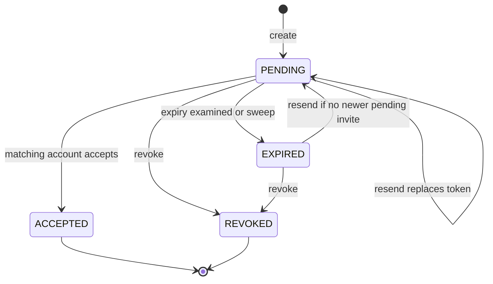

# Phase 2 — Workspace Administration & Access Control

**Frontend implementation handoff · revision 3 · 5 October 2026**

**Product:** AgentVault / Distributed AI Agent Management Platform
**Backend baseline:** `5b4efb7`
**Phase:** 2 of exactly 5
**Status:** specification ready; frontend implementation and integrated acceptance not yet verified.

**Read with:** [Master roadmap/checklist](FRONTEND_PHASES.md) and [Phase 1 foundation](PHASE_1_FOUNDATION_AUTH_WORKSPACE.md).

> This replaces the previous Phase 2 document and its nine-phase plan. The owner explicitly requested progression to Phase 2. That authorizes this handoff; it does not establish that unobserved Phase 1 browser tests passed. Reuse Phase 1 authentication, workspace isolation and error handling. All 30 Phase 2 HTTP operations are specified here; shared Phase 1 dependencies are identified separately.

## Contents

1. [Delivery outcome and evidence](#1-delivery-outcome-and-evidence)
2. [Shared integration contract](#2-shared-integration-contract)
3. [Authorization and dependency matrix](#3-authorization-and-dependency-matrix)
4. [Screens and workflows](#4-screens-and-workflows)
5. [Validation and wire models](#5-validation-and-wire-models)
6. [Complete endpoint register](#6-complete-endpoint-register)
7. [Detailed endpoint contracts](#7-detailed-endpoint-contracts)
8. [State, cache and concurrency](#8-state-cache-and-concurrency)
9. [Errors and recovery](#9-errors-and-recovery)
10. [Implementation sequence](#10-implementation-sequence)
11. [Acceptance checklist and demonstration](#11-acceptance-checklist-and-demonstration)
12. [Backend constraints and release decisions](#12-backend-constraints-and-release-decisions)
13. [Source map and delivery record](#13-source-map-and-delivery-record)

## 1. Delivery outcome and evidence

Deliver an administration area where authorized people can manage workspace settings, membership, invitations, roles, machine credentials, IP restrictions, ownership and workspace removal. Every control must match the backend's permissions and lifecycle behavior. A successful screen mockup or a happy-path request is not completion.

| Area | New operations | Required outcome |
|---|---:|---|
| Workspace settings/lifecycle/network | 7 | Edit settings; transfer ownership; delete workspace; list/add/remove IP rules; change enforcement |
| Members | 8 | Directory/detail; replace roles; local profile; suspend/reactivate/remove; leave |
| Invitation management | 4 | List/create/resend/revoke, integrated with Phase 1 redemption |
| Permission catalogue and roles | 7 | Catalogue; list/detail/create/update/delete roles; explicit repair/recompute |
| API keys | 4 | Scope catalogue; metadata list; one-time creation secret; revoke |
| **Total** | **30** | All covered in register, contracts and acceptance |

Out of scope for new implementation: knowledge/PII (Phase 3), agents/model/chat (Phase 4), audit viewer/analytics/quotas/workflows/tools/personal-data export/erasure (Phase 5). Their permission keys are already valid catalogue entries and must remain visible/selectable as appropriate in the role editor. Do not confuse a permission's historical backend `phase` field with the five frontend milestones.

### Verification honesty

- Controllers, DTOs, services, guards, permission definitions, mail delivery, audit-retention behavior and shared utilities were inspected locally against `5b4efb7`.
- On **5 October 2026 around 15:32 Asia/Karachi**, local requests to `/health/live`, `/health/ready`, `/docs-json` and `/api/v1/permissions` were refused at the TCP connection stage. No HTTP status or response body was obtained in that initial check. A later owner-authorized live run succeeded; see the live verification report linked in section 13.
- The later running `/docs-json` returned 200 with 122 paths; all 30 Phase 2 register operations matched it. Controllers and services remain the primary behavioral source.
- The initial documentation pass made no data changes. The subsequent owner-authorized live verification created disposable accounts/workspaces and exercised mutations; fixture setup, cleanup and email limitations are recorded in the live report. No frontend repository/runtime was supplied here.
- Unit utility checks and document coverage validation are distinct from live database/browser tests. Record their results in section 13. Do not inherit the old document's claim that every request was live-tested.

Finish the frontend against these contracts, then execute the acceptance matrix using disposable fixtures and a running API. Section 12 lists source-observed gaps that cannot be fixed by frontend presentation and must be resolved or explicitly accepted before claiming the whole phase fully functional.

## 2. Shared integration contract

### Addresses and request modes

Product API base: `http://localhost:3000/api/v1`. Frontend local origin: `http://localhost:5173`, unless project configuration says otherwise. Swagger defaults: backend `/docs` and `/docs-json`. Health probes remain root `/health/*`. Production origins and cookie policy must be configured, not inferred from local defaults.

Every new Phase 2 endpoint is bearer-authenticated. **Only `GET /permissions` is workspace-independent.** All other operations require workspace context and inherit membership, workspace state, IP, MFA and email checks.

```http
Authorization: Bearer <in-memory-access-token>
Accept: application/json
Content-Type: application/json
X-Organization-Id: <same-canonical-workspace-uuid-as-the-path>
```

Use Content-Type for JSON bodies, not a fictional body on GET. Use credentials include consistently with Phase 1. Organization header overrides path on this backend; construct both from one captured workspace ID. Do not use an API key to manage API keys, users or roles. Never substitute a newly generated machine secret for the user's bearer credential.

**DELETE with JSON:** API-key revocation accepts an optional reason in a JSON body. The shared client/proxy must support this. Other Phase 2 DELETE operations have no body.

### Envelope and pagination

```ts
interface Pagination {
  page: number; limit: number; totalItems: number; totalPages: number;
  hasPreviousPage: boolean; hasNextPage: boolean;
}
interface Meta {
  requestId: string; timestamp: string; durationMs?: number;
  pagination?: Pagination; path?: string;
}
type Result<T> = { success: true; data: T; meta: Meta };
type Failure = {
  success: false;
  error: { code: string; message: string; details?: unknown };
  meta: Meta;
};
```

Member and invitation lists are `data: T[]` with `meta.pagination`. Roles, IP rules and API keys are complete non-paginated arrays. Permission catalogue and key scope catalogue are objects, not arrays. All timestamps serialize as ISO strings; nullable properties must remain nullable. Use response metadata for request-ID support and pagination.

Success bodies are not standardized to `{ updated: true }`: use each operation's return type. For example, deleting an invitation returns an Invitation, revoking a key returns ApiKey metadata, removing a member returns `{ removed, revokedApiKeys }` and deleting a role returns `{ deleted: true }`.

### Common handling

- DTO failures: 422 `VALIDATION_FAILED`, generally `details.fields` keyed by property path, including `settings.defaultChunkOverlap`. Unknown properties are rejected. Path UUID validation may return 400 `BAD_REQUEST`.
- No optimistic security changes. Disable duplicate submissions, preserve input on error, commit UI changes after success, and refetch authority afterward.
- Do not blindly replay mutations after timeouts/disconnection: an invitation may exist, a key may have been issued, or access may already have changed.
- Apply Phase 1 bounded refresh only to conclusively expired/missing access credentials; 403 authorization/policy failures do not trigger refresh loops.
- Invitation create/resend use the email rate policy (source default 5/hour). Remaining new endpoints use default policy (source default 120/60 seconds). Read `Retry-After` in seconds and `X-RateLimit-Reset` as Unix seconds; actual configuration can differ.
- Error text is display content, not a stable machine key. Use `error.code`, HTTP status and optional details. Preserve transport/non-JSON errors as frontend failures, without fabricating a request ID.

### Shared Phase 1 dependencies

| Dependency | Why reused here |
|---|---|
| Contextual `GET /auth/me` | Exact current effective permissions and canonical workspace ID |
| `GET /organizations/:organizationId/members/me` | Actor membership ID, role labels and highestRolePriority |
| `GET /organizations/:organizationId` | Existing settings, ownerId and enforcement flag; needs workspace:read |
| `GET /organizations` and unscoped `/auth/me` | Refresh switcher/memberships after rename/transfer/leave/delete |
| `GET /auth/mfa`, MFA enrollment/login | Prove current session's MFA before enabling workspace requirement |
| Verification/resend routes | Verify current email before enabling workspace requirement |
| Public invitation preview and signed-in accept | Complete create → email → join journey |

Do not duplicate their implementations. A denied secondary read should disable only its dependent editor, not crash the entire administration area.

## 3. Authorization and dependency matrix

### Five separate concepts

1. **Authentication:** a valid user/session and global email policy.
2. **Workspace access:** active membership/workspace and applicable IP/MFA/email restrictions.
3. **Action permission:** exact effective key, such as `role:assign`, checked by backend.
4. **Priority:** higher number outranks lower; backend normally compares actor and target's highest role priority for member administration.
5. **Ownership/self rules:** ownerId and member/user identity, independent of role name.

Multiple roles grant the union of permissions and the maximum priority. Standard source definitions: Owner 100, Administrator 80, Member 50 (default), Viewer 20. Read actual server roles/membership instead of hardcoding these as current user authority. Custom-role priority is an integer 0–99, default 40, and must be strictly below the actor when created/edited.

`Member.id` is the membership UUID. `Member.userId` is the account UUID. Member URLs use the former; ownership transfer uses the latter. Do not infer workspace ownership from holding a role named Owner.

### Action permissions and UI read dependencies

| Action | Backend requirement | Additional reads for a usable editor |
|---|---|---|
| View workspace settings | workspace:read | Workspace detail |
| Edit ordinary workspace settings | workspace:update | workspace:read to hydrate safely |
| Change requireMfa, including false/null reset | workspace:update AND security:update | Workspace detail + own MFA status |
| Enable requireMfa | Above + current session MFA-verified | Phase 1 MFA/login recovery |
| Enable requireVerifiedEmail | workspace:update + own email verified | Current identity; does not separately require security:update |
| View/add/remove IP rules | security:read / security:update | Both for complete interactive management; workspace:read for current enforcement flag |
| Enable/disable enforcement | security:update | Rules + workspace detail |
| Transfer ownership | workspace:transfer + actual ownerId match | member:read for paginated active-member picker, workspace:read |
| Delete workspace | workspace:delete + actual ownerId match | Workspace identity for confirmation |
| Directory/detail | member:read | role:read for optional role filter labels |
| Edit own workspace profile | No elevated permission | Own membership, no directory permission needed |
| Edit another member's profile | member:update + target lower priority | Target member view + own membership |
| Suspend/reactivate | member:update + not self + target lower priority | Directory/detail; owner cannot be suspended |
| Remove member | member:remove + not self + target lower priority + not owner | Directory/detail; explain key revocation |
| Replace roles | role:assign + not self + target currently lower priority + no permission escalation | member:read, role:read, catalogue, own membership |
| Leave workspace | No elevated permission; actual owner forbidden | Own membership/workspace |
| View invitations | member:read | Paginated invitation list |
| Create invitation | member:invite + allowed domain/seat + selected role below actor + no permission escalation | role:read for selector; own membership/catalogue |
| Resend/revoke invitation | member:invite | member:read to find invitation; resend current checks differ from create (section 12) |
| Read catalogue | Bearer only; no org | Global cache isolated by authentication session |
| Role list/detail | role:read | Catalogue for descriptions |
| Create role | role:create + priority below actor + no permission escalation | Catalogue + own membership; role:read for post-create navigation |
| Update/delete role | role:update / role:delete + non-system + role currently below actor | role:read; update also validates requested keys/priority |
| Recompute permissions | role:update | Re-read contextual identity/member roles afterward |
| API-key list/scope catalogue | apikey:read | Current effective user permissions |
| Issue key | apikey:create + scopes supported and held by actor | apikey:read to load supported scope options |
| Revoke key | apikey:revoke | apikey:read for selection/metadata; no creator-only rule in service |

If an unusual custom role has mutation permission but lacks a required read, show an actionable unavailable editor (“This editor also needs role:read”), or a narrowly supported standalone flow. Do not issue forbidden fetches endlessly or invent unknown current values. Invitation creation can omit roleId to use the default; it still may fail role/rank checks. No manual UUID entry should be the normal replacement for a missing picker.

### Exact hierarchy distinctions

- Members: backend `assertCanActOn` rejects self with 400 `CANNOT_MODIFY_SELF` and target priority >= actor with 403 `FORBIDDEN`. Editing one's own local profile bypasses those elevated checks. Leaving has a dedicated route.
- Roles: system roles cannot be edited/deleted; a custom role at/above actor priority is forbidden. A lower role may still grant permissions the actor cannot assign.
- Invitations: creation checks both selected role priority and expanded grants. Role assignment currently checks target member priority and granted permissions but **does not separately enforce the new role's priority below actor**. Do not falsely document that as a server guarantee. Apply a conservative lower-rank role selector and track the backend gap in section 12.
- Ownership transfer replaces both parties' role sets: incoming owner becomes only Owner; outgoing owner becomes only Administrator when that system role exists. It does not append roles or preserve custom-role combinations.
- Platform-admin break-glass may yield a synthetic membership that `/members/me` cannot load. Never invent owner status or priority from a missing response. Product acceptance here targets normal workspace members; platform-admin management UX needs an explicit tested contract if included.

### Permission editor behavior

Use `Permission.key` as canonical identity. Keep full keys such as `pii:policy:read`; do not reconstruct from `resource` and `action`, because the current catalogue controller truncates multi-colon action metadata. Group by `byCategory`, show descriptions and `isDangerous`, and keep later-module keys rather than silently dropping them.

Role responses can contain wildcards. Show stored grants faithfully and an expanded preview based on the catalogue. Supported matching uses first colon split and wildcard resource/action semantics; `pii:*` covers full PII actions, while `pii:policy:*` is not a prefix-glob implementation. Do not generate arbitrary patterns.

For new roles, explicit concrete key selection is the preferred UX. Existing wildcard grants must not silently become a frozen explicit list when editing a description. PATCH only dirty fields; if editing permissionKeys, submit the complete intended array and show before/after grants. Any conversion from wildcard to fixed list must be deliberate. Empty grants are rejected; no permission removal by submitting `[]`.

## 4. Screens and workflows

Reuse Phase 1 layout/tokens/components. Suggested frontend paths below are not backend endpoints.

| Frontend route | Content and actions |
|---|---|
| `/w/:id/settings/general` | Name, description, logo URL; slug/plan read-only; dirty-state saving |
| `/w/:id/settings/defaults` | Ingestion chunk defaults and audit retention, with override/inherited states |
| `/w/:id/settings/security` | Require MFA/verified email, invitation domains; policy impact explanation |
| `/w/:id/settings/networks` | IP rules, add/remove, last matched, enforcement switch |
| `/w/:id/team` | Search/filter/sort/paginate members, role/status badges, per-row actions |
| `/w/:id/team/:memberId` | Full member identity, roles/local profile/status; read-only removed-member detail |
| `/w/:id/my-workspace-profile` | Own display-name override/title and leave action without member:read |
| `/w/:id/invitations` | Paginated invitations, invite dialog, resend/revoke, expiry presentation |
| `/w/:id/roles` | Built-in and custom roles, priority, permission summary, recompute utility |
| `/w/:id/roles/new` and `/roles/:roleId` | Catalogue-backed role create/detail/edit, read-only system role, delete |
| `/w/:id/settings/api-keys` | Complete metadata list/status/filter, create wizard, one-time secret, revoke |
| `/w/:id/settings/danger` | Ownership transfer and workspace deletion, explicit impact/confirmation |

### Common product quality

Provide loading, no-data, no-filter-results, forbidden, stale-state, pending-save and retryable error states separately. Empty list must not suggest inviting/creating if permission is absent. Keep filters in URL if helpful but never secrets. Use semantic table headings and mobile cards where tables cannot fit. Preserve search/filter state returning from a detail page. Debounce member search and abort outdated requests.

All forms/dialogs require labels, keyboard operation, visible focus, error summary/field messages and focus restoration. Confirmations name the exact workspace/member/key/role, use an explicit verb, and avoid relying on color. Meet readable contrast, keyboard-only interaction, 360px mobile width and reduced-motion behavior. Use safe URL schemes for logos; backend accepts a string rather than uploading an asset. Do not render names/descriptions/domain strings as HTML.

Dangerous actions use confirmed server results; no optimistic owner changes, role replacement, membership removal or key revocation. Freeze target IDs when a dialog opens and close it if workspace/account changes. Confirmation fields are client-only unless included in the DTO. There is no password/MFA challenge field on ordinary Phase 2 mutations: do not invent backend step-up guarantees.

### Settings forms

Split profile, chunk defaults, audit retention and access policies into independent forms that PATCH only their changed keys. Omitted settings remain unchanged. Setting-level `null` removes the override; `settings: null` does not clear the entire object. Represent “use deployment default” explicitly rather than filling unknown defaults with guessed numbers.

Source defaults for chunk size/overlap are 512/64, but runtime defaults are not exposed by these endpoints. Use them only as labelled development defaults. Validate overlap < size when both effective values are known; server checks merged settings plus runtime defaults. Return server field errors if an inherited value makes a change invalid.

Audit input accepts 30–3650 days; retention worker applies `max(requested days, AUDIT_RETENTION_MIN)` when an override exists. The backend does not reject every value below a configured floor higher than 30 days at this PATCH. Display “subject to platform minimum,” not a guarantee of exact deletion date. Reset removes override, restoring deployment retention behavior.

Show a policy-change review with old/new values and affected behavior. Enabling MFA requires sessionVerified, not merely account mfaEnabled. Enabling verified-email requirement requires the acting email verified. Fields a user cannot change must not be resent by a full-object save. Domain inputs normalize whitespace/lowercase and remove one leading @ in the UI; submit bare domains. Matching is exact: `example.com` is not a wildcard for subdomains. Empty array clears the restriction. Policy changes do not retroactively revalidate existing invitation tokens (section 12).

### Member lifecycle

Default directory lists ACTIVE and SUSPENDED, not removed. Explicit REMOVED filter includes soft-deleted rows; removed detail stays read-only. Member filter by role returns every role attached to matching members, not only the matching role. “Name” sorting is by user's firstName; search includes first/last name, normalized email and workspace displayName, not title/global display-name search.

Local profile empty strings clear overrides; returned displayName may fall back to global preferred name. The view does not expose raw override separately, so offer a clear/reset action instead of inferring whether displayed fallback was explicitly set. Do not edit global first/last/email/avatar from this form.

Role assignment is full replacement. Initialize selection with all current roles, show added/removed roles before submit, preserve unknown/ineligible existing roles rather than silently dropping them, and reconcile deleted roles before saving. No bulk member endpoint exists; if bulk UI is desired later, it must be an explicit separately tracked feature with per-item outcomes.

Suspend retains roles and blocks the person's workspace requests; reactivate restores ACTIVE. Neither is an account-wide logout. Remove/leave soft-delete membership and revoke keys that member created in this workspace; returning requires invitation acceptance, not the reactivate endpoint. No implicit undo toast for removal. API-key behavior on suspension/downgrade differs; do not promise all machine access stops (section 12).

### Invitation lifecycle



Create/resend return invitation metadata, never the token/link. Do not offer “Copy invitation link” or fabricate a URL using invitation ID. Actual mail delivery must be configured. MailService swallows send failures, and management responses have no delivery-status field: say “Invitation created; email delivery attempted,” not “Delivered.” sendCount and lastSentAt track send attempts, not inbox confirmations.

List may return stored PENDING with expiresAt in the past before expiry is persisted. Show a derived “Expired” presentation while preserving raw status in state. Server status filtering uses stored status; do not promise EXPIRED filter includes all logically expired pending rows. Listing itself does not persist expiry despite a nearby service comment.

Resend rotates token and expiry and can revive expired invitations. Old links generally become INVITATION_NOT_FOUND because their digest was replaced; do not require INVITATION_REVOKED for every invalidated link. Accepted invites cannot be revoked; remove the member through the member workflow if authorized. Revoked invites cannot be resent; create a new invitation.

Refresh members/invitations on focus/manual refresh after a recipient joins. No Phase 2 realtime dependency. Integrate recipient flow from Phase 1 without creating a second acceptance page.

### API-key issuance

1. Read supported scope catalogue and intersect with current concrete permissions. This catalogue is narrower than roles; no administrative wildcard scopes.
2. Collect name, optional description, future expiry and optional IP/CIDR pins. Explain pins apply to the machine's egress address, not necessarily this browser's network.
3. Review scopes, expiry and allowed networks; submit once.
4. Render plaintextKey from successful creation in a dedicated one-time panel. Copy only on user action, acknowledge clipboard failures, and require “I have saved this key” before dismissing.
5. Store only apiKey metadata in list/query cache. Clear plaintext and mutation response on dismiss/navigation/logout/workspace switch; exclude it from error monitoring, query-devtools persistence and recordings.

There is no retrieve-secret, update-key or rotate-key endpoint. Replacement is create → update consuming service outside this frontend → revoke old key. Do not auto-revoke an old integration key immediately after issuing another. A lost creation response may leave an issued but unrecoverable secret: refresh metadata, identify/revoke the orphan deliberately and issue a replacement. Never auto-retry creation or claim the original secret can be recovered.

List status is derived: revokedAt wins, otherwise expiresAt <= now means expired, else active. Null expiry displays “No expiry” for existing records, but create DTO does not provide a supported forever option; omit expiry for configured default. usageCount is a decimal string, not a safe JavaScript integer. No creator name is returned, only createdById. Resolve name from authorized member data where available; otherwise show ID without fetching a prohibited directory.

### IP restrictions and ownership

Add a valid rule covering the API-observed caller IP before enabling. Do not use a public IP lookup as proof that Nest sees the same address. There is no current-IP endpoint here; self-lockout errors may include details.ip. Proxy configuration affects the address.

Enabling with zero active rules returns 400. Enabling/removing a rule that excludes the caller can return 409 IP_ALLOWLIST_SELF_LOCKOUT. Removing the last active rule while enforcement is on returns 409 RESOURCE_CONFLICT. Do not automatically disable enforcement to make removal succeed. Offer deliberate add/review/disable choices with clear consequences. Rule editing/toggling is not supported: add replacement then remove old, respecting protection rules.

Transfer picker uses all pages of ACTIVE members, excludes current owner and sends selected userId. Confirmation explains both parties' role sets are replaced and actor loses owner-only actions. Re-read authority after success before rendering another action. Workspace delete is soft deletion plus membership soft deletion, not physical erasure, and exposes no restore API. Confirmation may require typing workspace name locally, but DELETE body remains empty. Leave/delete exits to global workspace picker and clears tenant state without logging out of the account.

## 5. Validation and wire models

### Body fields

Use primitive JSON booleans/numbers, not form strings. Omit untouched values. Only settings-key null clearing and explicitly described string clearing should be used; do not generalize class-validator IsOptional into safe null support on every service property.

| DTO / field | Backend contract |
|---|---|
| Workspace PATCH name | Optional trimmed string 2–120 |
| description | Optional trimmed string <=2000; empty string supported, no automatic null needed |
| logoUrl | Optional trimmed string <=2048; empty clears to null; URL syntax not validated by DTO |
| settings.defaultChunkSize | Optional integer 64–4096 |
| settings.defaultChunkOverlap | Optional integer 0–1024; merged effective overlap must be < size |
| settings.auditRetentionDays | Optional integer 30–3650; runtime retention minimum applies downstream |
| settings.requireMfa / requireVerifiedEmail | Optional boolean; key-level null resets override; requireMfa still needs security:update |
| settings.allowedEmailDomains | Optional array <=20 strings, each <=253; DTO does not validate domain syntax; [] clears restriction |
| Transfer newOwnerUserId | Required UUID v4, active member account ID |
| IP-rule cidr | Required nonempty trimmed string <=64; service validates IPv4/IPv6/address/CIDR |
| IP-rule label | Optional trimmed string <=120 |
| Enforcement enabled | Required boolean |
| Member roles roleIds | Required nonempty array <=20 UUID v4; full replacement; deduplicate client-side |
| Member profile displayName/title | Optional trimmed strings <=120 each; empty clears override/title to null |
| Suspend reason | Optional trimmed string <=255 |
| Invitation email | Required valid email, trimmed, <=320; normalized in service |
| Invitation roleId | Optional UUID v4; omitted selects default role |
| Invitation message | Optional trimmed string <=1000; sent in email, not returned in Invitation view |
| Role create name | Required trimmed string 2–60; must produce nonempty alphanumeric slug |
| Role create description | Optional trimmed string <=500 |
| Role create permissionKeys | Required array 1–200 strings; format/catalogue/grant checks below |
| Role create priority | Optional integer 0–99; default 40, still must be below actor |
| Role create color | Optional hex-color string; standardize frontend to #RRGGBB |
| Role PATCH | Same mutable fields/ranges, all optional; permissionKeys if present remains nonempty full replacement |
| Key name | Required nonempty trimmed string <=120 |
| Key description | Optional trimmed string <=500 |
| Key scopes | Required array 1–50 strings; exact available-scopes subset + actor authority |
| Key expiresAt | Optional ISO date-time converted to Date, must be future at validation time; omit for default TTL |
| Key allowedIps | Optional array <=20 strings each <=64; service trims/drops blanks then validates networks; [] means no key-specific pin |
| Key revoke reason | Optional trimmed string <=255, in DELETE JSON body |

Role key DTO regex: `^[a-z][a-z0-9_]*(:[a-z0-9_*]+)+$|^\*:\*$`. Service rejects unknown concrete keys with 400 PERMISSION_NOT_FOUND. Some wildcard-looking strings can pass syntax/existence checks while granting nothing; use exact catalogue keys or supported existing wildcard forms, not freeform autocomplete guesses.

Do not submit organization slug, plan, ownerId, ipAllowlistEnabled via workspace PATCH; isSystem/isDefault/slug via role create/PATCH; arbitrary account fields via member PATCH; status/token/expiry via invitation creation; keyHash/prefix/createdById via key creation. Unknown properties are 422 errors.

### Query fields and list semantics

Shared pagination: page integer >=1 default 1; limit integer 1–100 default 20; search trimmed <=200; sortBy string <=50; sortDirection uppercased ASC/DESC, default DESC. Greater-than-100 limit is rejected, not silently clamped at HTTP validation.

| List | Effective query inputs | Ordering/notes |
|---|---|---|
| Members | page, limit, search, status ACTIVE/SUSPENDED/REMOVED, roleId UUID v4, sortBy, sortDirection | Sort keys: createdAt, joinedAt, lastActiveAt, name, email, status. Unknown sortBy falls back createdAt |
| Invitations | page, limit, status PENDING/ACCEPTED/REVOKED/EXPIRED | createdAt DESC; shared search/sort accepted by DTO but ignored by handler |
| Roles | No documented query input | priority DESC, name ASC; non-paginated |
| API keys | No documented query input | createdAt DESC; includes revoked/expired metadata |
| IP rules | No documented query input | createdAt DESC; all returned rules |

Use local filtering only for genuinely complete non-paginated arrays, with honest labels. Never present client filtering of one invitation page as full-workspace search. After changing a member filter, reset page to 1. After removing last item from a page, refetch and move back if necessary.

### Response types

All dates below are JSON ISO strings; values are payloads under data.

```ts
type UUID = string;
type ISODate = string;
interface WorkspaceSettings {
  defaultChunkSize?: number; defaultChunkOverlap?: number; auditRetentionDays?: number;
  requireMfa?: boolean; requireVerifiedEmail?: boolean; allowedEmailDomains?: string[];
}
type SettingsPatch = { [K in keyof WorkspaceSettings]?: WorkspaceSettings[K] | null };
interface Workspace {
  id: UUID; name: string; slug: string; description: string | null; logoUrl: string | null;
  status: 'ACTIVE' | 'SUSPENDED' | 'ARCHIVED'; plan: 'FREE' | 'PRO' | 'ENTERPRISE';
  ownerId: UUID; settings: WorkspaceSettings; ipAllowlistEnabled: boolean;
  memberCount: number; createdAt: ISODate;
}
interface IpRule {
  id: UUID; cidr: string; label: string | null; isActive: boolean;
  lastMatchedAt: ISODate | null; createdAt: ISODate;
}
interface MemberRole { id: UUID; name: string; slug: string; color: string | null; priority: number }
interface Member {
  id: UUID; userId: UUID; email: string; firstName: string; lastName: string;
  displayName: string; avatarUrl: string | null; title: string | null;
  status: 'ACTIVE' | 'SUSPENDED' | 'REMOVED'; roles: MemberRole[];
  highestRolePriority: number; isOwner: boolean;
  joinedAt: ISODate | null; lastActiveAt: ISODate | null; createdAt: ISODate;
}
interface Invitation {
  id: UUID; email: string; status: 'PENDING' | 'ACCEPTED' | 'REVOKED' | 'EXPIRED';
  role: { id: UUID; name: string; slug: string } | null;
  invitedBy: { id: UUID; name: string } | null;
  expiresAt: ISODate; createdAt: ISODate; lastSentAt: ISODate | null; sendCount: number;
}
interface Permission {
  key: string; resource: string; action: string; category: string;
  description: string; isDangerous: boolean; phase: number;
}
interface PermissionCatalogue { permissions: Permission[]; byCategory: Record<string, string[]> }
interface Role {
  id: UUID; name: string; slug: string; description: string | null;
  isSystem: boolean; isDefault: boolean; priority: number; color: string | null;
  permissionKeys: string[]; createdAt: ISODate;
}
interface ApiKey {
  id: UUID; name: string; description: string | null; prefix: string; scopes: string[];
  createdById: UUID; expiresAt: ISODate | null; revokedAt: ISODate | null;
  lastUsedAt: ISODate | null; lastUsedIp: string | null; usageCount: string;
  allowedIps: string[]; createdAt: ISODate;
}
interface CreatedApiKey { apiKey: ApiKey; plaintextKey: string; warning: string }
interface KeyScopes { scopes: string[] }
interface MemberRemoved { removed: true; revokedApiKeys: number }
interface LeftWorkspace { left: true }
interface Deleted { deleted: true }
interface IpRuleRemoved { removed: true }
interface Recomputed { membersRecomputed: number }
```

Member response does not include suspensionReason, suspendedAt, raw local display-name override or effective permission keys; use documented fields and actor contextual identity. Invitation response has no token, URL, personal message or mail-delivery result. ApiKey response has no secret except in CreatedApiKey and no revocationReason. Role has no holder count; deleting an in-use role can return count in error details. Do not build dependent UI on non-returned entity columns.

Example success envelope for API-key creation (all values illustrative; do not use sample as a credential):

```json
{
  "success": true,
  "data": {
    "apiKey": {
      "id": "33333333-3333-4333-8333-333333333333",
      "name": "Research integration", "description": null,
      "prefix": "<public-prefix>", "scopes": ["rag:query"],
      "createdById": "22222222-2222-4222-8222-222222222222",
      "expiresAt": "2027-10-05T10:00:00.000Z", "revokedAt": null,
      "lastUsedAt": null, "lastUsedIp": null, "usageCount": "0",
      "allowedIps": [], "createdAt": "2026-10-05T10:00:00.000Z"
    },
    "plaintextKey": "<one-time-secret>",
    "warning": "Store this key now. It cannot be retrieved again."
  },
  "meta": { "requestId": "11111111-1111-4111-8111-111111111111", "timestamp": "2026-10-05T10:00:00.000Z" }
}
```

## 6. Complete endpoint register

Every path is relative to `/api/v1`. `:organizationId` is a UUID or slug resolved by context; prefer UUID. All other ID parameters below use UUID v4. All operations require bearer; all except `/permissions` require organization context. D = default rate policy; E = email rate policy. Response column is data payload, not envelope.

| ID | Method | Path | Required action permission | Success | Policy | Payload |
|---|---|---|---|---|---|---|
| P2-API-01 | PATCH | `/organizations/:organizationId` | workspace:update; extra for MFA | 200 | D | Workspace |
| P2-API-02 | DELETE | `/organizations/:organizationId` | workspace:delete + owner | 200 | D | Deleted |
| P2-API-03 | POST | `/organizations/:organizationId/transfer-ownership` | workspace:transfer + owner | 200 | D | Workspace |
| P2-API-04 | GET | `/organizations/:organizationId/ip-rules` | security:read | 200 | D | IpRule[] |
| P2-API-05 | POST | `/organizations/:organizationId/ip-rules` | security:update | 201 | D | IpRule |
| P2-API-06 | DELETE | `/organizations/:organizationId/ip-rules/:ruleId` | security:update | 200 | D | IpRuleRemoved |
| P2-API-07 | PUT | `/organizations/:organizationId/ip-enforcement` | security:update | 200 | D | Workspace |
| P2-API-08 | GET | `/organizations/:organizationId/members` | member:read | 200 | D | Member[] + pagination |
| P2-API-09 | GET | `/organizations/:organizationId/members/:memberId` | member:read | 200 | D | Member |
| P2-API-10 | PUT | `/organizations/:organizationId/members/:memberId/roles` | role:assign + service rules | 200 | D | Member |
| P2-API-11 | PATCH | `/organizations/:organizationId/members/:memberId` | self OR member:update + lower target | 200 | D | Member |
| P2-API-12 | POST | `/organizations/:organizationId/members/:memberId/suspend` | member:update + service rules | 200 | D | Member |
| P2-API-13 | POST | `/organizations/:organizationId/members/:memberId/reactivate` | member:update + service rules | 200 | D | Member |
| P2-API-14 | DELETE | `/organizations/:organizationId/members/:memberId` | member:remove + service rules | 200 | D | MemberRemoved |
| P2-API-15 | POST | `/organizations/:organizationId/members/leave` | no elevated permission; not owner | 200 | D | LeftWorkspace |
| P2-API-16 | GET | `/organizations/:organizationId/invitations` | member:read | 200 | D | Invitation[] + pagination |
| P2-API-17 | POST | `/organizations/:organizationId/invitations` | member:invite + grant/rank/creation rules | 201 | E | Invitation |
| P2-API-18 | POST | `/organizations/:organizationId/invitations/:invitationId/resend` | member:invite | 200 | E | Invitation |
| P2-API-19 | DELETE | `/organizations/:organizationId/invitations/:invitationId` | member:invite | 200 | D | Invitation |
| P2-API-20 | GET | `/permissions` | bearer; no org or permission key | 200 | D | PermissionCatalogue |
| P2-API-21 | GET | `/organizations/:organizationId/roles` | role:read | 200 | D | Role[] |
| P2-API-22 | GET | `/organizations/:organizationId/roles/:roleId` | role:read | 200 | D | Role |
| P2-API-23 | POST | `/organizations/:organizationId/roles` | role:create + grant/rank rules | 201 | D | Role |
| P2-API-24 | PATCH | `/organizations/:organizationId/roles/:roleId` | role:update + mutable/lower/grant rules | 200 | D | Role |
| P2-API-25 | DELETE | `/organizations/:organizationId/roles/:roleId` | role:delete + mutable/lower/not-in-use | 200 | D | Deleted |
| P2-API-26 | POST | `/organizations/:organizationId/roles/recompute` | role:update | 200 | D | Recomputed |
| P2-API-27 | GET | `/organizations/:organizationId/api-keys/scopes` | apikey:read | 200 | D | KeyScopes |
| P2-API-28 | GET | `/organizations/:organizationId/api-keys` | apikey:read | 200 | D | ApiKey[] |
| P2-API-29 | POST | `/organizations/:organizationId/api-keys` | apikey:create + allowed/held scopes | 201 | D | CreatedApiKey |
| P2-API-30 | DELETE | `/organizations/:organizationId/api-keys/:apiKeyId` | apikey:revoke | 200 | D | ApiKey |

## 7. Detailed endpoint contracts

Use the common headers, validation and envelopes above for every operation. Domain errors below are additional to common authorization/validation/rate/server failures. Example IDs are placeholders to replace with real values. No-body means do not attach arbitrary fields; `{}` is acceptable for no-field POST calls if the shared adapter requires JSON.

### P2-API-01 — Update workspace

`PATCH /organizations/:organizationId` → **200**, `data: Workspace`. Requires `workspace:update`.

```json
{"name":"Research Workspace","description":"Final year project team","settings":{"defaultChunkSize":512,"defaultChunkOverlap":64,"allowedEmailDomains":["example.edu"]}}
```

All fields are optional: `name`, `description`, `logoUrl`, and the documented `settings` members. Send changed fields only. Do not send the workspace response back as a patch: slug, plan, owner, counters and enforcement are not editable here. Empty logo string clears the logo. Nested settings use merge-patch semantics: omitted overrides remain, a key with `null` deletes that override. `settings:null` does not reset the entire object. Show inheritance explicitly rather than converting unknown inherited values to zero or false.

`defaultChunkOverlap` must be below the effective chunk size; the service returns **422 VALIDATION_FAILED**, with `details.fields['settings.defaultChunkOverlap']`, otherwise. Saving either value must consider the other. Any supplied `requireMfa` value additionally requires `security:update`; enabling it requires the caller's MFA verification (**403 MFA_REQUIRED**). Enabling verified-email policy requires the caller's verified email (**403 ACCOUNT_EMAIL_NOT_VERIFIED**). Do not confuse this with a second `security:update` requirement. Audit retention is also subject to the deployment minimum at retention time; successful saving does not prove that shorter retention will actually run.

On success replace workspace detail and invalidate the switcher and contextual membership/permissions when policy changes. Guard failures may prevent subsequent workspace requests after a policy change; use the existing MFA/verification recovery screens. Missing workspace: **404 ORGANIZATION_NOT_FOUND**.

### P2-API-02 — Delete workspace

`DELETE /organizations/:organizationId`, no body → **200**, `data: {"deleted":true}`. Requires `workspace:delete` and the actual owner user. Permission alone is insufficient; non-owner: **403 FORBIDDEN**.

Use a dedicated danger-zone confirmation containing the workspace name and consequences, require deliberate confirmation, and disable duplicate submission. Backend soft-deletes the workspace and its memberships; retained audit data and other resources are not a promise of immediate physical erasure. There is no restore endpoint in this handoff. Do not claim the response means every related record was erased or that status was explicitly changed to `ARCHIVED`.

After success cancel all tenant requests, evict tenant caches, clear the selected workspace, refresh the user's workspace list and route to workspace selection. Keep the user's session. After a lost response, reconcile with the workspace list/detail before allowing another attempt; a later not-found alone cannot distinguish deletion from lost access. Missing workspace: **404 ORGANIZATION_NOT_FOUND**.

### P2-API-03 — Transfer ownership

`POST /organizations/:organizationId/transfer-ownership` → **200**, `data: Workspace`. Requires `workspace:transfer` and actual ownership.

```json
{"newOwnerUserId":"22222222-2222-4222-8222-222222222222"}
```

Select an active member, display their identity and use **member.userId**, not membership ID. The current owner cannot be selected (**400 BAD_REQUEST**). Non-owner: **403 FORBIDDEN**; inactive/missing target: **404 MEMBERSHIP_NOT_FOUND**; missing owner role: **404 ROLE_NOT_FOUND**. The transaction changes owner identity, replaces the incoming owner's role set with Owner and the outgoing owner's with Admin (or an empty set if Admin is absent), then recomputes permissions. This is not an additive role assignment.

Confirm both identities and role replacement. After success refresh workspace, both members, directory, own membership and permissions; rebuild navigation immediately. No automatic transfer retry after a timeout. Read the current owner first to reconcile an ambiguous result.

### P2-API-04 — List IP rules

`GET /organizations/:organizationId/ip-rules`, no query/body → **200**, `data: IpRule[]`. Requires `security:read`. Complete array, newest first, no pagination wrapper. Empty array is a legitimate state. Render CIDR, optional label, active state, creation time and nullable last-match time. A null last match means no recorded match, not proof the rule was never used; recording is debounced.

Read enforcement state from the workspace. There is no current-public-IP discovery endpoint and no individual rule editor. Show existing inactive rules faithfully without inventing an activation endpoint.

### P2-API-05 — Add IP rule

`POST /organizations/:organizationId/ip-rules` → **201**, `data: IpRule`. Requires `security:update`.

```json
{"cidr":"203.0.113.0/24","label":"Example office egress"}
```

`cidr` is required, trimmed, nonempty, maximum 64 characters; optional label maximum 120. Use real administrator-supplied egress addresses, not the documentation range above. Service validates CIDR/IP syntax (**400 BAD_REQUEST**), then checks exact trimmed-string duplicates (**409 RESOURCE_CONFLICT**). Do not claim equivalent textual networks are canonicalized/deduplicated. New rule is active. Refresh rules after success; adding a rule does not enable enforcement. An ambiguous response is reconciled against the rules list before retrying.

### P2-API-06 — Remove IP rule

`DELETE /organizations/:organizationId/ip-rules/:ruleId`, no body → **200**, `data: {"removed":true}`. Requires `security:update`.

Confirm CIDR and label. Missing rule: **404 RESOURCE_NOT_FOUND**. Removing the final active rule while enforcement is on: **409 RESOURCE_CONFLICT**. Excluding the current caller from remaining rules: **409 IP_ALLOWLIST_SELF_LOCKOUT**, optionally `details.ip`. Preserve the rule and show how to add a matching replacement first. Successful removal hard-deletes this rule. Refresh rules and workspace; never optimistically remove access restrictions before the server confirms.

### P2-API-07 — Set IP enforcement

`PUT /organizations/:organizationId/ip-enforcement` → **200**, `data: Workspace`. Requires `security:update`.

```json
{"enabled":true}
```

`enabled` is required and must be a JSON boolean. Enabling without active rules: **400 BAD_REQUEST**. Caller not matched: **409 IP_ALLOWLIST_SELF_LOCKOUT**, with current IP where provided. Read-only rule access is a practical dependency for explaining the change. Confirm enabling and show recovery instructions from the deployment operator. A caller already blocked by workspace enforcement cannot use this scoped endpoint to unblock themselves.

Replace workspace and refresh rules after success. Deployment `ENFORCE_IP_ALLOWLIST` can disable actual checks, and service failure/empty-rule behavior is permissive; the persisted switch alone is not evidence of network protection. See section 12 before security acceptance.

### P2-API-08 — List members

`GET /organizations/:organizationId/members?page=1&limit=20&status=ACTIVE&sortBy=createdAt&sortDirection=DESC` → **200**, `data: Member[]` and pagination metadata. Requires `member:read`.

Supported filters: optional `search`, `status`, `roleId`; sorting: `createdAt`, `joinedAt`, `lastActiveAt`, `name`, `email`, `status`. Unknown sort keys fall back to creation time. Search is trimmed, maximum 200; it searches first/last name, normalized email and workspace display name, not title or the user's global display-name field. `status` is `ACTIVE`, `SUSPENDED` or `REMOVED`. Without status, both active and suspended members appear; removed members are excluded. Removed filter includes soft-deleted records.

Reset page when filters change, debounce search, cancel obsolete responses and include every filter in the query key. Display both membership and user identities correctly. A filtered empty state must offer filter reset; workspace-empty and network-error states differ. Fetch role catalogue only when permitted, otherwise omit the role filter rather than blocking the directory.

### P2-API-09 — Read member

`GET /organizations/:organizationId/members/:memberId` → **200**, `data: Member`. Requires `member:read`. `memberId` is a membership UUID. Missing: **404 MEMBERSHIP_NOT_FOUND**.

This read includes removed memberships; a removed profile can render as historical/read-only even when mutations return not-found. The response does not contain the member's full effective-permission set, suspension reason or suspension timestamp. Do not fabricate them from role names. Use `isOwner`, `highestRolePriority`, role IDs and status to build action eligibility. A stale list row must not override newer detail.

### P2-API-10 — Replace member roles

`PUT /organizations/:organizationId/members/:memberId/roles` → **200**, `data: Member`. Requires `role:assign` plus service checks.

```json
{"roleIds":["33333333-3333-4333-8333-333333333333"]}
```

Required nonempty UUID-v4 array, maximum 20. This replaces the entire role set. Self-target: **400 CANNOT_MODIFY_SELF**. Target's current highest priority must be lower than actor's, otherwise **403 FORBIDDEN** with `yourPriority`/`targetPriority`. Missing/cross-workspace role: **404 ROLE_NOT_FOUND**. Actor must hold every expanded requested grant, otherwise **403 CANNOT_ESCALATE_PRIVILEGES**, `deniedPermissions`. Removing owner role from the owner: **409 CANNOT_REMOVE_LAST_OWNER**, subject to earlier guards.

The service does not separately require the newly selected role's priority to be below the actor's. The frontend should filter high-priority grants conservatively, but label this as frontend policy and track the server gap; it cannot secure direct API calls. Use role detail/catalogue reads only with appropriate permission. On success refresh target, directory and relevant contextual state. Do not merge a stale response into a newer edit. Concurrent replacement is last-writer behavior; there is no ETag contract.

### P2-API-11 — Update workspace member profile

`PATCH /organizations/:organizationId/members/:memberId` → **200**, `data: Member`.

```json
{"displayName":"Ayesha — Research","title":"Frontend engineer"}
```

Both fields optional, trimmed, at most 120; empty string clears the local value. The caller may edit their own membership without `member:update`. Editing another requires `member:update` (**403 PERMISSION_DENIED**) and lower target rank (**403 FORBIDDEN**). Missing/removed target: **404 MEMBERSHIP_NOT_FOUND**.

Display name is returned as local override or user fallback, not separate raw fields. Preserve a dirty-field set: do not blindly save a displayed fallback as an explicit override. Offer a clear-local-name action and explain that it restores the account fallback. This endpoint does not change account email, avatar or global profile. Refresh target/directory and own membership when self-editing.

### P2-API-12 — Suspend member

`POST /organizations/:organizationId/members/:memberId/suspend` → **200**, `data: Member`. Requires `member:update`.

```json
{"reason":"Access paused pending team review"}
```

Optional trimmed reason maximum 255. Self-target: **400 CANNOT_MODIFY_SELF**; equal/higher target rank: **403 FORBIDDEN**; owner protection: **409 CANNOT_REMOVE_LAST_OWNER** if reached; missing/removed target: **404 MEMBERSHIP_NOT_FOUND**. Roles are preserved; membership becomes suspended and cached member access/counts are invalidated.

Confirm the specific workspace membership. **Existing creator API keys are not revoked by this operation.** Do not tell the administrator all machine access has stopped. Link to API-key review where permitted. The returned view does not expose the recorded reason. Refresh member/directory/workspace counts after confirmation. Prefer the action only for active members.

### P2-API-13 — Reactivate member

`POST /organizations/:organizationId/members/:memberId/reactivate`, no fields → **200**, `data: Member`. Requires `member:update`; self and target-rank checks are the same as suspension. Missing/removed: **404 MEMBERSHIP_NOT_FOUND**. Reactivation sets ACTIVE and clears suspension details while preserving roles. It does not restore soft-deleted memberships and does not check seat limits in this service path. Refresh member/directory/counts. Present this for suspended members; do not use it as an undelete action.

### P2-API-14 — Remove member

`DELETE /organizations/:organizationId/members/:memberId`, no body → **200**, `data: {"removed":true,"revokedApiKeys":2}`. Requires `member:remove` and lower target rank.

Self-target: **400 CANNOT_MODIFY_SELF** (use leave); equal/higher rank: **403 FORBIDDEN**; owner protection: **409 CANNOT_REMOVE_LAST_OWNER** if reached; missing/removed: **404 MEMBERSHIP_NOT_FOUND**. Soft-deletes membership with REMOVED status and revokes keys created by that user in the workspace. Confirmation must include both membership removal and key revocation, not account deletion. Display the returned revocation count.

Refresh members, workspace counts and keys. Membership and key writes do not share one guaranteed transaction boundary; on an error/timeout reconcile both resources rather than asserting nothing happened. Removed member detail can still be read with read permission; remove mutation is not a historical-record deletion API.

### P2-API-15 — Leave workspace

`POST /organizations/:organizationId/members/leave`, no fields → **200**, `data: {"left":true}`. No elevated permission beyond valid workspace membership. Owner: **409 CANNOT_REMOVE_LAST_OWNER**; transfer ownership first. Missing membership: **404 MEMBERSHIP_NOT_FOUND**.

Confirm loss of this workspace and revocation of the user's workspace API keys. On success cancel tenant queries, clear tenant caches and active workspace, refresh workspace selection and keep account login. Never attempt a scoped success refresh after membership has been removed. A lost response requires reconciliation from the workspace-independent workspace-list flow.

### P2-API-16 — List invitations

`GET /organizations/:organizationId/invitations?page=1&limit=20&status=PENDING` → **200**, `data: Invitation[]` plus pagination. Requires `member:read`.

Only page, limit and status affect this query; shared DTO search/sort fields are not implemented by the service. Do not show a server-backed search/sort control that silently does nothing. Results are newest first. Status values: `PENDING`, `ACCEPTED`, `EXPIRED`, `REVOKED`. Stored PENDING can have an elapsed expiry; display “Expired” based on time while preserving stored status for queries. The EXPIRED filter is not a complete list of all elapsed pending invitations.

Administrator responses contain unmasked email, nullable role and nullable inviter, timestamps and send count. No invitation token, copy-link field, delivery receipt or original message is returned. Use mail delivery, not a fabricated invitation URL.

### P2-API-17 — Create invitation

`POST /organizations/:organizationId/invitations` → **201**, `data: Invitation`. Requires `member:invite`; email throttle applies.

```json
{"email":"teammate@example.edu","roleId":"33333333-3333-4333-8333-333333333333","message":"Please join our project workspace."}
```

Email required, valid and at most 320; optional role UUID-v4 (omission chooses default Member); optional trimmed message maximum 1000. Check role-read dependency before offering custom selection; omitting the role does not bypass grant/rank checks. Selected role must be below actor's priority and its expanded permissions must be held by the actor (**403 CANNOT_ESCALATE_PRIVILEGES**, priority or denied-permission details).

Domain mismatch: **400 BAD_REQUEST**, `allowedDomains`; seat cap: **403 SEAT_LIMIT_REACHED**, `limit` and `current`; active member: **409 MEMBERSHIP_ALREADY_EXISTS**; suspended member: **409 MEMBERSHIP_SUSPENDED**; unexpired pending invite: **409 INVITATION_ALREADY_PENDING**, `invitationId`/`expiresAt`; missing role: **404 ROLE_NOT_FOUND**. Expired pending invitation is marked EXPIRED before a new invitation is created. Pending invitations do not reserve seats.

Success means invitation persisted and sending was attempted, not email delivered. Mail failures can be swallowed by the delivery service; send count/last-sent timestamp are not delivery receipts. Refresh invitations, close or reset the form on known success and provide resend as an explicit action. Never auto-repeat after timeout: first inspect pending invitations. Invitation preview/acceptance stays in Phase 1.

### P2-API-18 — Resend invitation

`POST /organizations/:organizationId/invitations/:invitationId/resend`, no fields → **200**, `data: Invitation`. Requires `member:invite`; email throttle applies.

Rotates the token digest and expiry, increments send count, and can revive an expired invitation. Previously sent token is invalid. Accepted: **409 INVITATION_ALREADY_ACCEPTED**; revoked: **409 INVITATION_REVOKED**; a newer pending invitation for the email: **409 INVITATION_ALREADY_PENDING**, with its ID; missing invitation: **404 INVITATION_NOT_FOUND**; deleted role: **404 ROLE_NOT_FOUND**; missing inviter can produce **404 ACCOUNT_NOT_FOUND**.

Explain that the recipient must use the latest email. Preserve the original inviter identity from the response; do not imply the resender became inviter. Resend does not revalidate all of creation's role/rank/domain/seat rules. Do not advertise it as a policy-safe substitute for creating a new invitation. Refresh the row/list; no automatic retry or guessed link.

### P2-API-19 — Revoke invitation

`DELETE /organizations/:organizationId/invitations/:invitationId`, no body → **200**, `data: Invitation`. Requires `member:invite`.

Missing: **404 INVITATION_NOT_FOUND**; accepted: **409 INVITATION_ALREADY_ACCEPTED** (membership must be managed separately). Sets REVOKED and replaces token digest. Repeated revocation is accepted by the service, although UI should disable the redundant action. The old public token normally becomes not-found because its digest no longer matches; do not promise the public redemption page will specifically receive INVITATION_REVOKED. Refresh list and any selected detail. Revoking an invitation is not removing an already joined user.

### P2-API-20 — Permission catalogue

`GET /permissions`, no body/query or organization header → **200**, `data: PermissionCatalogue`. Bearer session required; no workspace permission decorator.

Use `permissions[]` and `byCategory` to organize the role editor. Entries include `key`, `resource`, `action`, `category`, `description`, `isDangerous`, `phase`. **`key` is canonical.** Controller action splitting truncates multi-colon actions; for `pii:policy:read`, do not reconstruct the key by joining returned resource/action. If a UI needs the complete action, derive the substring after the first colon from key. `phase` is historical backend metadata, not this delivery milestone. Catalogue contains available permissions, not permission to grant them; intersect with actor's effective grants.

### P2-API-21 — List roles

`GET /organizations/:organizationId/roles`, no query/body → **200**, `data: Role[]`. Requires `role:read`. Ordered priority descending then name ascending, complete array. Show system/default badges, priority, color and description. `permissionKeys` preserves raw wildcard entries; expanded checkboxes must not silently overwrite these. No member count is returned. Use member filtering if allowed to inspect assignment, not invented role-holder totals.

### P2-API-22 — Read role

`GET /organizations/:organizationId/roles/:roleId` → **200**, `data: Role`. Requires `role:read`. Missing/cross-workspace: **404 ROLE_NOT_FOUND**. Refresh this before opening a long-lived edit form. Read access is distinct from edit/delete authority; system roles are view-only. Role slug remains stable across name edits.

### P2-API-23 — Create role

`POST /organizations/:organizationId/roles` → **201**, `data: Role`. Requires `role:create`.

```json
{"name":"Document Reviewer","description":"Reviews workspace documents","permissionKeys":["document:read","knowledgebase:read"],"priority":30,"color":"#2563EB"}
```

Name 2–60; description optional maximum 500; permissionKeys required nonempty, maximum 200, syntax as section 5; priority integer 0–99, defaults 40; color optional hex. Priority must be strictly below actor's. Every expanded requested permission must be held by actor; otherwise **403 CANNOT_ESCALATE_PRIVILEGES**. Unknown concrete permissions: **400 PERMISSION_NOT_FOUND**, `unknownPermissions`; unusable derived slug: **400 BAD_REQUEST**; slug collision: **409 ROLE_ALREADY_EXISTS**. A different-looking name can collide after slug normalization.

Only offer concrete catalogue keys and understood resource wildcards. The service skips existence validation for keys containing `*`, but does not implement arbitrary prefix globbing; `pii:policy:*` is not interchangeable with `pii:*`. Do not expose free-form wildcard entry by default. Refresh role list; do not automatically assign a new role to its creator.

### P2-API-24 — Update role

`PATCH /organizations/:organizationId/roles/:roleId` → **200**, `data: Role`. Requires `role:update`.

```json
{"description":"Reviews documents and retrieval results","permissionKeys":["document:read","knowledgebase:read","rag:query"]}
```

Fields from create are optional; permissionKeys, if supplied, is a complete nonempty replacement. Preserve omitted fields and raw wildcard representation during metadata-only saves. Existing role must be custom (**403 ROLE_IMMUTABLE** for system roles), and its current priority and requested new priority must be below actor's (**403 CANNOT_ESCALATE_PRIVILEGES**). Grant subset and unknown-key checks also apply. Missing role: **404 ROLE_NOT_FOUND**. Changing name does not change slug.

Changing grants or priority recomputes affected memberships automatically. Refresh role list/detail, member views and own contextual grants; gate the next screen using refreshed access. Do not run the explicit recompute endpoint after every ordinary update. No optimistic privilege grants and no automatic retry of stale replacement bodies.

### P2-API-25 — Delete role

`DELETE /organizations/:organizationId/roles/:roleId`, no body → **200**, `data: {"deleted":true}`. Requires `role:delete`.

Same custom/lower-rank checks as update: **403 ROLE_IMMUTABLE** or **403 CANNOT_ESCALATE_PRIVILEGES**; missing: **404 ROLE_NOT_FOUND**. Assigned non-deleted memberships, including suspended members, cause **409 ROLE_IN_USE**, `memberCount`. Removed memberships do not count. Show a link to the filtered directory when permitted and require reassignment before deletion; do not silently reassign members.

Pending invitations are not included in the service's in-use protection. Inspect/revoke/reissue relevant invitations before deletion where possible, and track the backend gap for direct callers. Deleting a role can break invitation acceptance/resend. Refresh roles, members and invitation display after success; invitation role may be null. Confirmation names the role and warns about pending invitations.

### P2-API-26 — Recompute member permissions

`POST /organizations/:organizationId/roles/recompute`, no fields → **200**, `data: {"membersRecomputed":3}`. Requires `role:update`.

Expose as a clearly labeled advanced repair action with explanation and pending state. Recomputes all non-deleted memberships, including suspended ones; normal role operations already perform their own recomputation. Display returned count and refresh own membership/permissions and member data. Do not execute on page load or in a retry loop. This is not a way to bypass assignment constraints or restore removed members.

### P2-API-27 — API-key scope catalogue

`GET /organizations/:organizationId/api-keys/scopes` → **200**, `data: {"scopes":[...]}`. Requires `apikey:read`. Complete allowed scope vocabulary, not actor-filtered. Intersect with effective permissions when building create controls, but handle server denial after concurrent role changes.

Current 18 scopes: `rag:query`, `document:read`, `document:create`, `document:reindex`, `knowledgebase:read`, `clearance:internal`, `clearance:confidential`, `agent:read`, `agent:execute`, `conversation:read`, `conversation:delete`, `llm:invoke`, `workflow:read`, `workflow:execute`, `tool:read`, `tool:execute`, `usage:read`, `pii:policy:read`. Treat runtime response as the available list and test changes against source. Administrative wildcard grants, restricted clearance, PII reveal and read-all scopes are not offered here.

### P2-API-28 — List API-key metadata

`GET /organizations/:organizationId/api-keys` → **200**, `data: ApiKey[]`. Requires `apikey:read`. Complete array, newest first; includes expired and revoked keys. Derive display status in order: revoked, expired, active. A nullable expiry can appear in existing records; do not assume every record was made under current defaults.

Render name, prefix, scopes, creator ID, allowed IPs, timestamps and usage count. **usageCount is a string**, not a safely coercible JavaScript integer. No plaintext secret, creator display name or revocation reason is returned. Resolve a creator name only through authorized data and keep a useful fallback ID. Empty last-use fields are valid. Client-side filtering is possible for this complete list and must be described as such.

### P2-API-29 — Create API key

`POST /organizations/:organizationId/api-keys` → **201**, `data: CreatedApiKey` containing `apiKey`, `plaintextKey`, `warning`. Requires `apikey:create`.

```json
{"name":"Research ingestion worker","description":"Document upload automation","scopes":["document:create","document:read"],"expiresAt":"2027-01-01T00:00:00.000Z","allowedIps":["203.0.113.10/32"]}
```

Name required trimmed nonempty maximum 120; description optional 500; scopes required 1–50 strings (deduplicated); optional future expiry; optional allowedIps at most 20 strings, each at most 64. Omitted expiry defaults to 365 days in current service. Send UTC ISO strings and validate that the chosen instant is future; the illustrative date must be replaced when no longer future. Omitted/empty IP list gives no per-key IP restriction. IPs constrain the machine's egress, not necessarily the browser creating the key; workspace restrictions apply separately.

Unsupported scopes: **400 BAD_REQUEST**, `unsupportedScopes`/`supportedScopes`; scopes not held: **403 CANNOT_ESCALATE_PRIVILEGES**, `deniedScopes`; malformed IP/CIDR: **400 BAD_REQUEST**; past expiry: **422 VALIDATION_FAILED**. Do not invent an unlimited-expiry creation option. Server trims IP entries, filters blanks and validates syntax.

Render plaintext once in a dedicated disclosure component with explicit copy and acknowledgment. Keep it only in ephemeral component state; exclude it from query caches, persisted stores, logs, telemetry, toast text, URLs and fixtures. Clear on close, unmount, workspace switch and logout. Clipboard writes require user intent and may fail; report failure without losing the only view. There is no retrieve-secret endpoint. If creation response is lost, refresh metadata, explain the unavailable secret and let the user revoke the orphan then create a replacement. Never automatically retry secret creation. Rotation is create → update external consumer → verify externally → revoke old, not a nonexistent rotate endpoint.

### P2-API-30 — Revoke API key

`DELETE /organizations/:organizationId/api-keys/:apiKeyId` → **200**, `data: ApiKey`. Requires `apikey:revoke`.

```json
{"reason":"Rotated after deployment update"}
```

Optional trimmed reason maximum 255. **The DELETE request can carry JSON**; ensure the adapter/proxy preserves this body. No body is also valid. Any authorized workspace revoker can revoke a key; it is not restricted to its creator. Missing/cross-workspace key: **404 API_KEY_NOT_FOUND**. Already revoked returns unchanged metadata successfully. The operation saves revocation and invalidates cached key authentication; treat response/network failures as potentially applied and refresh metadata.

Confirm name/prefix and impact on external consumers. Show revoked status from the server and refresh the full list. No undo or reactivate endpoint exists; replacement is a new key. Do not echo a secret during revocation and do not promise access-policy changes automatically narrowed old key scopes.

## 8. State, cache and concurrency

Every workspace query key begins with the canonical organization ID. Include member/invitation filters and page in list keys; keep catalogue caching separate from workspace effective permissions. Capture the workspace at mutation dispatch and apply responses only to that workspace. Cancel stale requests on switching, leaving, deletion and logout. Never repopulate an evicted tenant from a late response.

| Mutation | Refresh or clear after known success |
|---|---|
| Workspace settings/enforcement | Workspace detail, switcher; contextual access after policy changes |
| Transfer | Workspace, own membership/permissions, both affected members, directory |
| Member profile/roles/status | Member detail, directory, own context if applicable; workspace counts for status changes |
| Remove | Directory/detail, counts, API-key list |
| Leave/delete workspace | Cancel and evict tenant; clear selection; refresh workspace list outside tenant context |
| Invitation create/resend/revoke | Invitation lists and selected row; no optimistic delivery status |
| Role create/update/delete/recompute | Roles/detail, affected members, own permissions; invitations when role removed |
| Key create/revoke | Metadata list; creation secret stays outside cache |
| Rule add/remove | Rules and relevant workspace state |

Use pessimistic updates for authority, ownership, keys and network restrictions. No endpoint provides a documented version precondition/ETag: preserve dirty fields, refresh before editing, and warn if a refetch changes the source while the form is dirty. PUT role assignment and permission-key replacement can overwrite concurrent edits. On reconnect refetch before resubmitting. Do not queue administrative mutations offline.

Disable the submitted action while pending, without blocking unrelated reads. GET retries may be bounded with backoff; mutations must not be automatically replayed after ambiguous transport failures. Explicitly reconcile a possibly successful write. Authentication refresh remains coordinated by the Phase 1 adapter; do not implement a second refresh mechanism here or repeat a side effect merely because response parsing failed.

## 9. Errors and recovery

| Condition | Required experience |
|---|---|
| Offline/connection refused | Connection state with retry; retain nonsensitive dirty fields; never show an empty successful list |
| 400 domain rule | Display actionable server message; map known field details; keep form open |
| 401 | Shared refresh/session flow; avoid loops and repeated mutations |
| 403 | Explain unavailable authority/policy; refresh contextual permissions; do not silently sign out for every denial |
| 404 | Resource unavailable; refresh parent list; distinguish workspace loss from one deleted row |
| 409 | Show conflict-specific next action: reassign, transfer, inspect pending invite, add matching IP rule |
| 422 | Attach validation to fields and focus error summary; keep valid input |
| 429 | Respect server retry guidance when present; countdown for explicit retry; no resend loop |
| 5xx/timeout after mutation | State that outcome is unknown; reconcile authoritative reads before offering another submission |

Preserve request IDs for support, but redact secrets, invitation tokens, authorization headers and sensitive input from telemetry. Handle unrecognized error codes with a useful fallback rather than crashing. Accessibility requires labeled controls, announced errors/pending status, focus return after dialogs, keyboard-operable tables/forms, non-color-only statuses and readable narrow-screen layouts. Dates use local display plus unambiguous full timestamps; send UTC instants. Do not expose stack traces or infrastructure details to end users.

## 10. Implementation sequence

1. Verify Phase 1 session, tenant isolation, envelope parsing, current membership and effective permissions. Establish disposable owner/admin/member/viewer/custom-role fixtures in two workspaces.
2. Build shared administration layout, read-only workspace/member/role views, typed models and permission-aware routes. Read dependencies must degrade independently.
3. Implement workspace edits and local member profile, then member role/status/removal/leave actions with authority checks and cache refresh.
4. Implement invitation management and run the existing public preview/acceptance flow end to end with real test mail delivery.
5. Implement permission catalogue and role editor, wildcard preservation, assignment conflicts and explicit recompute repair.
6. Implement API-key metadata/create/revoke and one-time secret handling; verify a disposable key against an allowed downstream endpoint when its backend fixture is available.
7. Implement network rules/enforcement, transfer and deletion using disposable workspaces and operator recovery access.
8. Run the acceptance matrix, resolve section 12 decisions, collect evidence and request owner review. Do not mark implementation complete from mocked responses alone.

These are work packages within Phase 2, not additional delivery phases. The engineer's submission includes frontend commit, backend commit/configuration, test results, demo, unresolved issues and the completed operation ledger.

## 11. Acceptance checklist and demonstration

Every item starts unchecked because implementation evidence has not been supplied. Record pass/fail, fixture, frontend/backend commit, date and evidence link in the review record. Use disposable fixtures for mutations, a test mailbox, separate browser sessions for actors, and two tenants for isolation. Never put plaintext keys or tokens in evidence. API IDs refer to section 7.

### Foundation and presentation

- [ ] P2-T01 Verify Phase 1 login/refresh/MFA/workspace selection before administration testing.
- [ ] P2-T02 Verify matching organization header/path and rejection/isolation across two tenants.
- [ ] P2-T03 Verify late reads/mutations cannot repaint a newly selected workspace.
- [ ] P2-T04 Verify loading, empty, filtered-empty, failed and retry states on every list.
- [ ] P2-T05 Verify direct routes and controls with owner, admin, member, viewer and restricted custom roles.
- [ ] P2-T06 Verify missing read dependencies disable only the dependent editor/filter with explanation.
- [ ] P2-T07 Verify keyboard use, focus restoration, error announcements, mobile layout and contrast.
- [ ] P2-T08 Verify unknown fields, malformed UUIDs, validation details, request IDs and generic unknown errors.

### Workspace and network — API 01–07

- [ ] P2-T09 Save name/description/logo and verify persistence after reload (01).
- [ ] P2-T10 Save only dirty settings; verify omission preserves and key-null removes an override (01).
- [ ] P2-T11 Test chunk bounds and overlap against effective chunk size (01).
- [ ] P2-T12 Test MFA setting with/without security:update and verified MFA; test verified-email policy (01).
- [ ] P2-T13 Demonstrate audit-retention inheritance/deployment minimum without claiming unsupported retention (01).
- [ ] P2-T14 Delete a disposable workspace as owner; reject non-owner; clear tenant state and retain session (02).
- [ ] P2-T15 Transfer to active userId; reject self/inactive target; verify both complete role replacements (03).
- [ ] P2-T16 Verify owner-only actions disappear after transfer and permission refresh (03).
- [ ] P2-T17 Render empty/populated IP lists and nullable match times (04).
- [ ] P2-T18 Add valid IPv4/IPv6 fixtures supported by validator; reject malformed and duplicate entries (05).
- [ ] P2-T19 Remove rule; reject missing/final-active/self-lockout cases (06).
- [ ] P2-T20 Enable/disable enforcement; reject no-rule/caller-exclusion cases; verify actual deployment behavior (07).
- [ ] P2-T21 Verify proxy-derived caller IP and operator recovery process in a disposable environment (06–07).

### Members — API 08–15

- [ ] P2-T22 Test pagination, supported search/sorts, role filter and default active+suspended result (08).
- [ ] P2-T23 Verify REMOVED filter and historical detail; mutation of removed record remains unavailable (08–09).
- [ ] P2-T24 Verify membership ID versus user ID throughout links and transfer selector (09).
- [ ] P2-T25 Replace full role set; reject empty/cross-tenant/missing roles (10).
- [ ] P2-T26 Reject self/equal/higher-target assignment and grants actor does not hold (10).
- [ ] P2-T27 Review requested-role-priority backend gap and conservative UI selection policy (10).
- [ ] P2-T28 Edit own local profile without elevated permission; reject unauthorized other-member edits (11).
- [ ] P2-T29 Clear local name to fallback without silently persisting fallback as an override (11).
- [ ] P2-T30 Suspend lower member; verify access denial, preserved roles and honest key-access notice (12).
- [ ] P2-T31 Reactivate suspended member; verify role restoration and removed-member rejection (13).
- [ ] P2-T32 Remove member; verify REMOVED state, key revocation count and affected key metadata (14).
- [ ] P2-T33 Test partial/unknown removal outcome and reconcile membership plus keys (14).
- [ ] P2-T34 Leave as non-owner; verify tenant cleanup and key revocation; owner must transfer first (15).

### Invitations — API 16–19, Phase 1 redemption

- [ ] P2-T35 Verify pagination/status and elapsed PENDING display; no fake server search/sort (16).
- [ ] P2-T36 Create with default and explicit roles, message and normalized test email (17).
- [ ] P2-T37 Test disallowed domain, seat cap, active/suspended member and duplicate pending invite (17).
- [ ] P2-T38 Reject role/grant escalation; verify read-dependency behavior (17).
- [ ] P2-T39 Verify actual mailbox arrival and Phase 1 matching-account acceptance, then member list (17).
- [ ] P2-T40 Resend pending/expired invitation; verify old token invalid, new token usable and count updated (18).
- [ ] P2-T41 Reject resend for accepted/revoked/missing-role/newer-pending cases (18).
- [ ] P2-T42 Revoke invitation; verify old link unusable and accepted invite cannot remove membership (19).
- [ ] P2-T43 Simulate mail failure/throttle/lost response; avoid delivery claims or automatic duplicate sends (17–18).
- [ ] P2-T44 Review acceptance/resend policy revalidation and role-deletion gaps before release.

### Roles — API 20–26

- [ ] P2-T45 Load catalogue, dangerous markers and multi-colon canonical keys correctly (20).
- [ ] P2-T46 Render complete ordered role list/detail, system/default badges and raw wildcard grants (21–22).
- [ ] P2-T47 Create custom role; test name/slug collision, priority boundaries and unknown concrete grants (23).
- [ ] P2-T48 Reject grants/priority above actor's authority and system-role mutations (23–25).
- [ ] P2-T49 Save metadata without flattening wildcards; explicitly replace grant set when intended (24).
- [ ] P2-T50 Verify grant/priority edits automatically update affected membership permissions (24).
- [ ] P2-T51 Reject deletion in use by active or suspended members; show count/reassignment route (25).
- [ ] P2-T52 Handle pending invitations referencing a deleted role without invented recovery APIs (25).
- [ ] P2-T53 Run explicit recompute repair; verify count and refreshed access; never auto-run on load (26).

### API keys — API 27–30

- [ ] P2-T54 Load available scopes and intersect actor grants; do not offer unsupported wildcard/reveal scopes (27).
- [ ] P2-T55 Render revoked/expired/active metadata and string usageCount without numeric precision loss (28).
- [ ] P2-T56 Create with valid scopes/expiry/IPs; test unsupported/unheld scopes and invalid/past values (29).
- [ ] P2-T57 Show secret once, explicit copy/clipboard-failure handling and acknowledgment (29).
- [ ] P2-T58 Confirm no secret in persistence, logs, telemetry, caches, URLs or screenshots (29).
- [ ] P2-T59 Lose create response; reconcile orphan metadata and explicitly revoke/recreate without retry (29–30).
- [ ] P2-T60 Revoke with DELETE JSON reason; repeat safely; reject cross-tenant/missing ID (30).
- [ ] P2-T61 Verify disposable key allowed/denied scope and IP behavior, then revocation against backend.
- [ ] P2-T62 Review key behavior after creator suspension/role downgrade/removal and record release decision.

### Reliability and sign-off

- [ ] P2-T63 Test concurrent role replacement and stale form refetch without silent input loss.
- [ ] P2-T64 Test connection loss and 401/403/404/409/422/429/5xx paths without mutation retry loops.
- [ ] P2-T65 Execute all 30 register operations against running backend and record sanitized evidence.
- [ ] P2-T66 Resolve or explicitly accept each section 12 constraint; frontend mitigations are not server fixes.
- [ ] P2-T67 Record frontend commit, backend commit, deployment configuration and browser test results.
- [ ] P2-T68 Owner reviews demonstration and records acceptance or remaining failures in master checklist.

Demonstration order: enter as owner → edit settings → invite a test teammate → accept in another session → adjust role/profile → suspend/reactivate → create/edit a custom role → issue and revoke a disposable key → exercise safe network rules → transfer ownership → leave/delete disposable workspace. Demonstrate at least one denied action and one ambiguous network recovery, not just the successful path. Destructive cases use separate fixtures so earlier evidence remains inspectable.

## 12. Backend constraints and release decisions

These are source-observed behaviors, not claims that all backend requirements are defective. The owner/backend engineer must decide intended policy and provide runtime evidence. Do not hide a server gap behind a disabled button or check acceptance as passed merely because it is documented.

| ID | Observed behavior | Required release decision / mitigation |
|---|---|---|
| P2-G01 | Initial refusal superseded by successful live liveness/readiness and API checks | Availability observation resolved for this run; browser acceptance and untested policy branches remain separate |
| P2-G02 | Suspension/role downgrade does not revoke or narrow creator API keys; key auth does not re-read creator grants/membership | Decide independent machine-key lifecycle versus revocation policy; show explicit review/revoke path and test actual access |
| P2-G03 | Member role replacement checks target's current rank and grant subset, not newly assigned role rank | Confirm intended hierarchy; add backend enforcement if strict rank delegation is required; conservative UI alone is insufficient |
| P2-G04 | Resend and redemption do not re-run all create-time seat/domain/inviter-authority policy checks | Decide when policy must be enforced; cover changed policy/role and suspended inviter scenarios with backend tests |
| P2-G05 | Seat cap checked at invitation creation, not reserved by pending invites; reactivation lacks cap check | Define cap semantics and enforce at membership activation if required |
| P2-G06 | Role deletion ignores pending invitations | Decide prevention or explicit migration; inspect affected invites and repair by revoke/reissue where authorized |
| P2-G07 | Mail delivery failure can still yield invitation success and updated send metadata | Verify mailbox delivery separately; expose delivery observability in backend if required |
| P2-G08 | IP checks can be globally disabled and permit on rule-read failure/empty active rules | Confirm production enforcement/configuration and desired fail-closed behavior; test proxy IP and operator recovery |
| P2-G09 | Membership removal/key revocation writes do not all share one transaction manager | Test failure/reconciliation; backend must guarantee consistency if atomic revocation is required |
| P2-G10 | Permission catalogue action truncates multi-colon keys; arbitrary wildcard strings can pass existence validation | Use canonical key and understood wildcard semantics; decide catalogue/validation corrections before relying on generated editors |
| P2-G11 | No mutation version preconditions, secret retrieval, key edit/rotate, rule edit or workspace restore | Implement honest supported flows; additional features need backend contracts, not guessed endpoints |
| P2-G12 | Inherited settings/effective deployment limits are not fully exposed; retention minimum can override saved retention | Explain inheritance and obtain deployment settings; do not display guessed effective security values |

For each row record: decision owner, intended behavior, backend issue/commit if changed, test evidence and acceptance date. A security-critical unresolved policy blocks a claim of complete production readiness. This documentation task does not silently modify these behaviors.

## 13. Source map and delivery record

**Later live verification:** [report and limitations](PHASE_2_LIVE_VERIFICATION.md), [66 passing checks](PHASE_2_LIVE_RESULTS.json), and [reproducible opt-in harness](../../scripts/verify-phase2-live.cjs). All 30 operations were exercised against the running server. This supplements source inspection; it does not complete browser acceptance.

Paths below are relative to this document and point to implementation evidence. DTOs define input shape; controllers define routes/guards/status; services define business behavior and returned views. Recheck all three when changing the API.

| Area | Primary sources |
|---|---|
| Workspace/network | [controller](../../src/modules/organizations/organizations.controller.ts), [DTO](../../src/modules/organizations/dto/organization.dto.ts), [service](../../src/modules/organizations/organizations.service.ts) |
| Members | [controller](../../src/modules/memberships/memberships.controller.ts), [DTO](../../src/modules/memberships/dto/membership.dto.ts), [service](../../src/modules/memberships/memberships.service.ts) |
| Invitations | [controller](../../src/modules/invitations/invitations.controller.ts), [DTO](../../src/modules/invitations/dto/invitation.dto.ts), [service](../../src/modules/invitations/invitations.service.ts) |
| Roles/catalogue | [controller](../../src/modules/rbac/rbac.controller.ts), [DTO](../../src/modules/rbac/dto/rbac.dto.ts), [service](../../src/modules/rbac/rbac.service.ts) |
| API keys | [controller](../../src/modules/api-keys/api-keys.controller.ts), [DTO](../../src/modules/api-keys/dto/api-key.dto.ts), [service](../../src/modules/api-keys/api-keys.service.ts) |
| Permission expansion | [permission utilities](../../src/common/utils/permission.util.ts) |
| Merge-patch semantics | [object utilities](../../src/common/utils/object.util.ts) |
| IP validation | [IP utilities](../../src/common/utils/ip.util.ts) |

Documentation verification: existing targeted utility/validation tests passed **4 suites, 70 tests** on this work session. Command:

```powershell
npm.cmd test -- --runInBand --runTestsByPath src/common/utils/permission.util.spec.ts src/common/utils/object.util.spec.ts src/common/utils/ip.util.spec.ts src/common/validation/validation-pipe.spec.ts
```

These tests cover supporting utilities, not the entire Phase 2 service layer, mail, database transactions or frontend. Jest reported an existing ts-jest isolatedModules deprecation and Node VM-modules experimental warning; the suites passed. Live API results are recorded separately below; browser acceptance remains unverified.

| Delivery field | Current record |
|---|---|
| Specification | Revision 3; 30 operations; 68 acceptance checks |
| Backend source baseline | `5b4efb7` |
| Phase 1 progression | Explicitly requested by owner; implementation evidence not independently supplied |
| Frontend implementation commit | Not supplied |
| Integrated tests/demo | Live API: 66/66 checks passed across all 30 operations; frontend/demo not executed |
| Runtime availability | Later live liveness/readiness 200; PostgreSQL and Redis up |
| Backend policy decisions | P2-G01–P2-G12 awaiting evidence/decision as applicable |
| Owner acceptance | Not yet recorded |

Phase 2 is implemented only when the engineer supplies working client code, every applicable acceptance check has evidence, constraints have explicit resolution, and the owner accepts the result. This handoff is ready for that implementation process.
