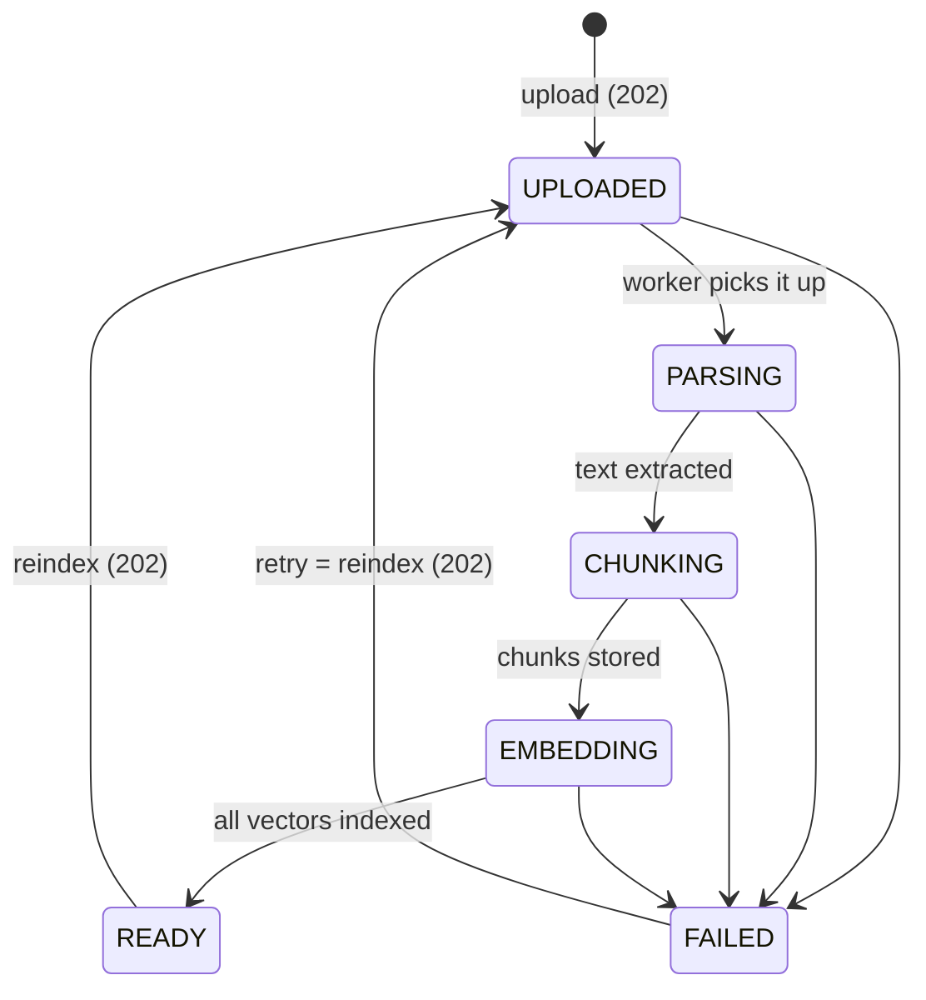

# Phase 3 — Knowledge, Document Vault & Privacy

**Frontend implementation handoff · revision 1 · 6 October 2026**

**Product:** AgentVault / Distributed AI Agent Management Platform
**Backend baseline:** `979dfd5` plus the phone-recognizer fix recorded in [P3-G01](#13-backend-constraints-and-release-decisions)
**Phase:** 3 of exactly 5
**Status:** specification ready and every operation proven against a live backend; frontend implementation and browser acceptance not yet verified.

**Read with:** [Master roadmap/checklist](FRONTEND_PHASES.md), [Phase 1 foundation](PHASE_1_FOUNDATION_AUTH_WORKSPACE.md), [Phase 2 administration](PHASE_2_WORKSPACE_ADMINISTRATION.md) and the [Phase 3 live verification report](PHASE_3_LIVE_VERIFICATION.md).

> The owner requested this handoff. That authorizes Phase 3 work; it does not establish that unobserved Phase 1–2 browser tests passed. Reuse the Phase 1 HTTP adapter, session refresh, workspace isolation and error handling, and the Phase 2 member/role/API-key data. All 23 Phase 3 HTTP operations are specified here. The obsolete nine-phase "Phase 3" document is superseded; do not use it.

## Contents

1. [Delivery outcome and evidence](#1-delivery-outcome-and-evidence)
2. [Shared integration contract](#2-shared-integration-contract)
3. [The access model](#3-the-access-model)
4. [Concepts the screens depend on](#4-concepts-the-screens-depend-on)
5. [Screens and workflows](#5-screens-and-workflows)
6. [Validation and wire models](#6-validation-and-wire-models)
7. [Complete endpoint register](#7-complete-endpoint-register)
8. [Detailed endpoint contracts](#8-detailed-endpoint-contracts)
9. [State, cache, polling and concurrency](#9-state-cache-polling-and-concurrency)
10. [Errors and recovery](#10-errors-and-recovery)
11. [Implementation sequence](#11-implementation-sequence)
12. [Acceptance checklist and demonstration](#12-acceptance-checklist-and-demonstration)
13. [Backend constraints and release decisions](#13-backend-constraints-and-release-decisions)
14. [Source map and delivery record](#14-source-map-and-delivery-record)
15. [Appendix A — TypeScript helpers](#appendix-a--typescript-helpers)

## 1. Delivery outcome and evidence

Deliver a Document Vault in which authorized people create knowledge bases, control who can see them, upload and manage documents, watch background processing, read the exact text retrieval serves, search with an explanation of their reach, and inspect and configure how personal data is masked before text reaches a model. Every control must follow the backend's three access gates (section 3). A happy-path upload is not completion.

| Area | Operations | Required outcome |
|---|---:|---|
| Knowledge bases | 5 (01–05) | List/search/sort, create, read, edit settings and access mode, delete with content destruction |
| Access grants | 3 (06–08) | List, grant or change level for a role/member/API key, revoke, with self-lockout warning |
| Documents | 8 (09–16) | Multipart upload, filtered directory, detail, chunk viewer, download, metadata/reclassification, reindex/retry, delete |
| Privacy | 5 (17–21) | Read/edit the workspace redaction policy, entity catalogue, text analysis preview, per-document redaction report |
| Retrieval | 2 (22–23) | Retrieval playground with provenance, "what can I reach" explanation |
| **Total** | **23** | All covered by register, contracts and acceptance |

Out of scope: agents, model catalogue, conversations and streaming (Phase 4, which reuses this phase's retrieval and privacy screens); Socket.IO, audit viewer, analytics, quotas and personal-data export (Phase 5). Document status uses bounded polling here; realtime arrives in Phase 5.

### Verification honesty

- Controllers, DTOs, services, guards, the ingestion pipeline, the maintenance sweep, the retrieval policy and the PII engine were read against `979dfd5`.
- On **6 October 2026 (Asia/Karachi)** an owner-requested live run exercised **all 23 operations** with real HTTP requests against the running backend (`npm run start:dev`, `http://localhost:3000`). The backend used its real dependencies: Supabase PostgreSQL with row-level security, Aiven Valkey queues and workers, Cloudflare R2 object storage, Qdrant Cloud, and the project's Python AI service. The AI service ran locally with EmbeddingGemma int8 embeddings, the jina turbo reranker, and Presidio + spaCy + bert-base-NER. Result: **401 checks, 401 passed** — see the [report](PHASE_3_LIVE_VERIFICATION.md) and [machine-readable results](PHASE_3_LIVE_RESULTS.json).
- Members joined through the **real invitation flow**: an invitation email was delivered to the Ethereal test inbox, read over IMAP, and redeemed. No database rows were written directly.
- Real files were processed end to end: PDF (2 pages), DOCX, Markdown, TXT, a multi-chunk handbook and a UTF-8 (Urdu) filename. The run also stopped the AI service mid-run and restarted it, to observe outage errors, degraded masking, visible retries and recovery.
- Everything marked *source-observed* in this document was read from code but not produced live. Section 13 lists what remains unverified (encrypted PDFs, OCR, quota exhaustion, integrity failure on download, storage/vector outages, 429 exhaustion).
- One backend defect was found and fixed during verification (P3-G01). No other backend behavior was changed.

## 2. Shared integration contract

### Addresses and request modes

Product API base: `http://localhost:3000/api/v1`. Frontend local origin: `http://localhost:5173`. All 23 operations are workspace-scoped and bearer-authenticated:

```http
Authorization: Bearer <in-memory-access-token>
Accept: application/json
X-Organization-Id: <same-canonical-workspace-uuid-as-the-path>
```

**Verified:** when the header and the path name different workspaces, the **header wins**. A request to `/organizations/{B}/documents/{id}` with header `A` was answered from workspace A. Build both from one captured workspace ID, and never let a stale tab write a header for a different workspace than its path.

Three request modes are needed; the shared Phase 1 adapter must support all three explicitly rather than forcing JSON:

| Mode | Used by | Notes |
|---|---|---|
| JSON | 21 operations | `Content-Type: application/json`; unknown properties are rejected with 422 |
| `multipart/form-data` | Upload (09) | Let the browser set the boundary — **do not** set `Content-Type` yourself. One part named `file`; optional text parts `title`, `description`, `classification`, `tags` |
| Raw response | Download (13) | Success is the file body, not an envelope. **Errors are still JSON envelopes.** Branch on status/`Content-Type` before reading |

Use `credentials: 'include'` consistently with Phase 1. API keys (`X-API-Key`) are for machines; the frontend never sends one. They appear here only as grant subjects.

### Envelope and pagination

Same envelope as Phases 1–2:

```ts
interface Pagination { page: number; limit: number; totalItems: number; totalPages: number; hasPreviousPage: boolean; hasNextPage: boolean }
interface Meta { requestId: string; timestamp: string; durationMs?: number; pagination?: Pagination; path?: string }
type Result<T> = { success: true; data: T; meta: Meta };
type Failure = { success: false; error: { code: string; message: string; details?: unknown }; meta: Meta };
```

Paginated (`data: T[]` + `meta.pagination`): knowledge-base list (01), document list (10), chunk list (12). Complete arrays: grants (06), entity types (19). The PII report (21) carries its own `page`/`totalChunks` inside `data`, not `meta.pagination`. Byte sizes are **decimal strings** (`sizeBytes`, `stats.totalBytes`); never coerce them blindly to numbers for arithmetic beyond `Number.MAX_SAFE_INTEGER`.

### Rate policies and time budgets

| Policy | Default | Applies to |
|---|---|---|
| default | 120 requests / 60 s per user | everything not listed below, including polling |
| upload | 100 / hour per user | 09 |
| rag | 60 / 60 s per user | 22 |
| privacy | 30 / 60 s per user | 20 and 21 (shared bucket) |

**Verified headers:** `x-ratelimit-limit`, `x-ratelimit-remaining`, `x-ratelimit-reset` (Unix seconds), `retry-after` (seconds, on 429), `x-request-id` and `content-disposition` are exposed through CORS. Deployment configuration can change the numbers; read the headers, do not hardcode them.

Server time budgets: upload and download 120 s, retrieval 60 s, everything else 30 s. Exceeding one returns **408 `REQUEST_TIMEOUT`**. An upload that times out may still have stored the file (section 9).

### Common handling

- DTO failures: **422 `VALIDATION_FAILED`** with `details.fields` keyed by property path. Malformed path UUIDs: **400 `BAD_REQUEST`**.
- No optimistic writes for access, classification or deletion. Commit UI changes after the server confirms, then refetch.
- Never auto-replay a mutation after a timeout or a dropped connection: an upload may be stored, a grant applied, a document deleted. Reconcile with a read first.
- 403 is not a refresh signal. Only conclusively expired credentials go through the Phase 1 refresh path.
- Error `message` is display text; switch on `error.code` and status.

### Shared dependencies from Phases 1–2

| Dependency | Why |
|---|---|
| Contextual `GET /auth/me` (with `X-Organization-Id`) | `permissions`: the **expanded** effective permission list (no wildcards), the input to every gate in section 3 |
| `GET /organizations/:id/members/me` | Your membership ID, to recognise your own MEMBER grant (self-lockout warning) |
| `GET /organizations/:id/roles` (role:read) | Role picker for ROLE grants |
| `GET /organizations/:id/members` (member:read) | Member picker for MEMBER grants — use `member.id` (membership), never `userId` |
| `GET /organizations/:id/api-keys` (apikey:read) | API-key picker for API_KEY grants |

A missing secondary permission disables only the dependent picker ("Choosing a member needs member:read"); it must not break the knowledge screens.

## 3. The access model

Read this before building any screen. Every Phase 3 refusal comes from one of these rules.

### 3.1 Three gates, in this order

1. **Role permission** — the route's permission (`document:create`, `rag:query`, …). Missing → **403 `PERMISSION_DENIED`**, `details.missingPermissions`. Checked first, before the server looks anything up. A Viewer uploading to a base they can see gets `PERMISSION_DENIED`, not 404.
2. **Compartment** — your access *level* on the knowledge base. A base you cannot see → **404 `KNOWLEDGE_BASE_NOT_FOUND`**. A base you can see, at too low a level → **403 `KNOWLEDGE_BASE_ACCESS_DENIED`**, `details: { required, granted }`.
3. **Clearance** — a document above your clearance → **404 `DOCUMENT_NOT_FOUND`**. Assigning a classification above your clearance → **403 `CLASSIFICATION_EXCEEDS_CLEARANCE`**, `details: { requested, clearance }`.

A level says **where** you may act; the permission says **what** you may do. Both are required.

Request-processing order also matters for error display: multipart limits (400/413) and DTO validation (422) are checked before the handler. Inside upload the order is: missing configuration (503) → missing file (400) → base access (404/403) → content inspection (415) → clearance (403) → duplicate (409) → storage (503) → quota (403).

### 3.2 Compartments: access modes, levels and grants

| Mode | Who can see it | Effective level |
|---|---|---|
| `WORKSPACE` | anyone holding the route permission | **MANAGE for everyone** who can see it; permissions alone decide what they may do |
| `RESTRICTED` | only subjects with a grant: to them as a member, to one of their roles, or to their API key | the **highest** of their grants; with no grant the base does not exist for them |

**Levels:** `READ` (see the base and its documents, chunks, download, report, retrieve) < `WRITE` (upload, edit, reclassify, reindex, delete documents) < `MANAGE` (edit the base, list/change its grants, delete it).

**Compartment bypass:** only holders of `*:*` — the workspace **owner** (and platform administrators through their audited break-glass path). **Not the Administrator role.** Verified: an Administrator does not see a RESTRICTED base created by someone else.

Grants, all verified live:

- A grant names a `ROLE`, a `MEMBER` (by **membership ID**; a user ID is refused with **404 `RESOURCE_NOT_FOUND`**) or an `API_KEY`, at one level. A subject from another workspace is also `RESOURCE_NOT_FOUND`.
- Granting an existing subject again changes its level and keeps the grant ID (upsert).
- Grants can be stored on `WORKSPACE` bases but only take effect while the base is `RESTRICTED`.
- Creating a `RESTRICTED` base, or switching a base to `RESTRICTED`, **automatically grants the acting member MANAGE**, so they are not locked out. The owner gets no automatic grant because they do not need one.
- A grant whose subject is gone (role deleted, member removed, key revoked) stops working and **disappears from the list**. Verified for a revoked API key.
- **You can lock yourself out.** Revoking or lowering your own grant takes effect on the next request. Verified: an administrator revoked their own grant and immediately got 404 on the base. Only another MANAGE holder or the owner can restore it. Warn before doing it (section 5).

### 3.3 Clearance and classification

Classifications, low to high: `PUBLIC` < `INTERNAL` < `CONFIDENTIAL` < `RESTRICTED`. Your clearance is the highest tier whose permission you hold; it is hierarchical.

| Clearance | Requires | Can read |
|---|---|---|
| PUBLIC | nothing | PUBLIC |
| INTERNAL | `clearance:internal` | PUBLIC, INTERNAL |
| CONFIDENTIAL | `clearance:confidential` | … and CONFIDENTIAL |
| RESTRICTED | `clearance:restricted` | everything |

- Reading a document needs **both** the clearance **and** visibility of its base.
- You can only **assign** classifications within your clearance: on upload, when reclassifying (the old level is implied by visibility, the new one is checked), and as a base's `defaultClassification`.
- An upload without `classification` takes the base's default. If that default is above your clearance the upload is refused (verified: a Member uploading to a CONFIDENTIAL-default base). **The upload form must always send a classification the user can assign.**
- API keys can never hold `clearance:restricted` (Phase 2 scope catalogue).

### 3.4 Hidden means 404, everywhere

The server never confirms that something you cannot see exists. All rows verified live:

| Situation | Server behavior |
|---|---|
| List knowledge bases | RESTRICTED bases without a grant are omitted |
| A base's `stats` | Count only documents within your clearance (verified: owner 5, member 4 on the same base) |
| List documents | Documents above clearance or in hidden bases are omitted |
| `?knowledgeBaseId=` naming a hidden base | 404 `KNOWLEDGE_BASE_NOT_FOUND` |
| `?classification=` above your clearance | an empty page, not an error |
| Read/edit/chunks/download/report a hidden document | 404 `DOCUMENT_NOT_FOUND` (the probe is audited server-side) |
| Upload duplicate of a document above your clearance | 409 `DOCUMENT_DUPLICATE` with **empty** `details` |
| Retrieval narrowed to a hidden base | 404 `KNOWLEDGE_BASE_NOT_FOUND`, `details.knowledgeBaseIds` |
| Retrieval narrowed to a hidden document | silently no results from it |
| Another workspace's base/document ID inside your workspace | 404 (`KNOWLEDGE_BASE_NOT_FOUND` / `DOCUMENT_NOT_FOUND`) |
| A workspace you are not a member of | 404 `ORGANIZATION_NOT_FOUND` |

Two users can therefore see different totals for the same workspace. That is correct; never "fix" it on the client. On direct navigation to a 404 base or document, say "This document doesn't exist or you don't have access to it" — the same words for both cases.

### 3.5 Who can do what

"Level" is your effective level on the document's base (the `access` field of 01/03).

| Action | Permission(s) | Level | Extra rule |
|---|---|---|---|
| See bases | `knowledgebase:read` | READ | |
| Create a base | `knowledgebase:create` | — | default classification within clearance |
| Edit a base | `knowledgebase:update` | MANAGE | default classification within clearance |
| Delete a base | `knowledgebase:delete` | MANAGE | |
| See a base's grants | `knowledgebase:read` | MANAGE | |
| Change grants | `knowledgebase:update` | MANAGE | |
| List/read documents, read chunks | `document:read` | READ | classification within clearance |
| Upload | `document:create` | WRITE | classification within clearance |
| Edit metadata, reclassify | `document:update` | WRITE | new classification within clearance |
| Reindex or retry | `document:reindex` | WRITE | only from `READY` or `FAILED` |
| Delete a document | `document:delete` | WRITE | |
| Download the original | `document:download` | READ | |
| Retrieval, "what can I reach" | `rag:query` | READ (scope) | |
| Read policy, entity types, analyze | `pii:policy:read` | — | `reveal` also needs `pii:reveal` |
| Edit policy | `pii:policy:update` | — | |
| Document redaction report | `document:read` **and** `pii:policy:read` | READ | `reveal` also needs `pii:reveal` |

### 3.6 Built-in roles, verified live

| | Owner | Administrator | Member | Viewer |
|---|---|---|---|---|
| Clearance | RESTRICTED | CONFIDENTIAL | INTERNAL | INTERNAL |
| Bypasses compartments | yes | no | no | no |
| Bases: read / create / update / delete | ✓✓✓✓ | ✓✓✓✓ | ✓ – – – | ✓ – – – |
| Documents: read / create / update / delete | ✓✓✓✓ | ✓✓✓✓ | ✓ ✓ – – | ✓ – – – |
| Download / reindex | ✓ ✓ | ✓ ✓ | – ✓ | – – |
| Retrieval (`rag:query`) | ✓ | ✓ | ✓ | – |
| Policy read / update / reveal | ✓✓✓ | ✓ ✓ – | ✓ – – | – – – |

The run also used a custom "Records Manager" role (priority 60) with `knowledgebase:read/create/update`, `document:read/create/update/download`, `rag:query` and `clearance:restricted`. It could create and manage a RESTRICTED HR base and retrieve its RESTRICTED payroll file, but could not delete bases (`PERMISSION_DENIED`). That HR base stayed hidden from the Administrator.

Design consequences: a Member can retrieve and reindex but not download or delete. A Viewer can read documents but has no search and no privacy screens. Only the owner can reveal real PII values. Roles are editable (Phase 2), so **derive every control from the permission list, never from role names**.

### 3.7 UI rules — compute once, use everywhere

```ts
myPermissions = contextual GET /auth/me → data.permissions   // expanded, no wildcards
myClearance   = clearanceOf(myPermissions)                    // = GET /rag/access-scope clearance
assignable    = classifications up to myClearance             // upload, reclassify, base default
can(action, base) = all permissions of the action ∈ myPermissions && level(base.access) ≥ required
```

Hide what the user can never do in this workspace (no permission at all). **Disable** what they could do elsewhere but not here (level too low), with a reason ("You have read-only access to Finance Reports"). Handle every 403/404 anyway: grants and roles change while pages are open. Appendix A implements these rules.

## 4. Concepts the screens depend on

### 4.1 The document lifecycle



| Status | Meaning | Suggested label |
|---|---|---|
| `UPLOADED` | Stored encrypted, queued for a worker | Queued |
| `PARSING` | AI service extracting text | Processing — reading |
| `CHUNKING` | Chunks being encrypted and saved (brief; may be missed between polls) | Processing |
| `EMBEDDING` | Chunks being embedded and indexed, batch by batch | Processing — indexing |
| `READY` | Searchable | Ready |
| `FAILED` | See `failureCode` / `statusMessage` | Failed |

**Verified timeline** for a multi-chunk handbook (6 chunks, 981 tokens), polled about every 0.35 s after the upload response. Times are from the 202:

```text
     0 ms  UPLOADED   v1  active=null  searchable=false   (the 202 response)
 1,760 ms  CHUNKING   v1  active=null  searchable=false   (PARSING finished before the first poll)
 3,603 ms  EMBEDDING  v1  active=null  searchable=false
12,754 ms  READY      v1  active=1     searchable=true
```

Small files on this deployment reached READY in about 4–13 s, mostly embedding on a CPU-only AI service. Production timing depends on the AI-service host, so never hardcode durations, and do not assume every intermediate status will be observed between polls.

### 4.2 Status is the latest run; `isSearchable` is what retrieval serves

Two version numbers: `indexVersion` (the run in progress or the last run) and `activeIndexVersion` (the version retrieval serves; `null` until the first success). `isSearchable === (activeIndexVersion !== null)` for live documents.

- **First processing:** `isSearchable` is false until READY.
- **Reindex:** `indexVersion` increments and status restarts at UPLOADED, but `activeIndexVersion` stays on the old version, so **the document keeps answering queries throughout**. Verified:

```text
    0 ms  UPLOADED   v2  active=1  searchable=true   (the 202 response; v1 still served)
           POST …/reindex again → 409 DOCUMENT_PROCESSING {"status":"UPLOADED"}
1,539 ms  EMBEDDING  v2  active=1  searchable=true
3,334 ms  READY      v2  active=2  searchable=true   (v2 now served; v1 chunks removed)
```

- **A failed reindex keeps the previous version searchable** (FAILED with `isSearchable: true`; source-observed). Show "Reindex failed · previous version still searchable", not a plain "Failed".
- Retrying a never-indexed FAILED document starts `indexVersion` 2 with `isSearchable: false` (verified).

### 4.3 Failures and retries

A FAILED document carries `failureCode` (machine code) and `statusMessage` (a sentence written for the user). **Always show `statusMessage`.** Use `failureCode` only to choose an icon, a hint and whether to offer **Retry** (P3-API-15, needs `document:reindex`). The code set is **open**: the AI service can add codes. Never switch exhaustively.

| `failureCode` | Source | Verified | Retry helps? | Hint |
|---|---|---|---|---|
| `UNPARSEABLE_DOCUMENT` | AI service: "The document could not be read. It may be damaged." | live | no | Re-export the file and upload again |
| `DOCUMENT_EMPTY` | Backend: "No extractable text was found. Scanned documents need OCR support in the AI service." | live (text-less PDF) | no | Upload a text-based file |
| `ENCRYPTED_DOCUMENT`, `TOO_MANY_CHUNKS`, `UNSUPPORTED_FILE_TYPE`, `DOCUMENT_TOO_LARGE` | AI service; `statusMessage` is its explanation | source | no | Fix the file, delete, upload again |
| `AI_SERVICE_UNAVAILABLE` | "The AI service was unavailable." after every attempt | live (all 5 attempts exhausted) | yes, later | |
| `VECTOR_STORE_UNAVAILABLE` | Vector store unavailable or rejected the vectors | source | yes, later | |
| `OBJECT_STORAGE_UNAVAILABLE` | Document storage unavailable | source | yes, later | |
| `INGESTION_TIMEOUT` | Over the 30-minute processing budget | source | yes | Very large file: consider splitting |
| `INGESTION_STALLED` | The maintenance sweep gave up after repeated stalls | source | maybe | |
| `CONTENT_MISSING`, `CONTENT_INTEGRITY_FAILURE` | Stored file gone or failed its integrity check | source | no | Delete and upload again |
| anything else, `INGESTION_ERROR` | Unexpected | — | yes | Show `statusMessage` |

**Transient failures retry while the status stays in progress.** With the AI service stopped, the live run observed:

```text
UPLOADED                                                       (202 — the upload itself succeeds)
PARSING
PARSING  "Attempt 1 of 5 failed (AI_SERVICE_UNAVAILABLE); retrying."
         … AI service restarted …
EMBEDDING
READY                                                          (no user action needed)
```

After the AI service restarted, the same document reached READY without user action. In an earlier attempt the service stayed down: the document continued through "Attempt 4 of 5 failed …" and then became `FAILED`, `failureCode: "AI_SERVICE_UNAVAILABLE"`, "The AI service was unavailable." Both paths were observed live. So `statusMessage` on an **in-progress** document is a warning to show under the status ("Retrying: the AI service was unavailable"), not an error. Defaults: 5 attempts with exponential backoff starting at 15 s, so a transient outage can take several minutes to become FAILED.

### 4.4 No push events in Phase 3: poll

There are no realtime document events until Phase 5. Poll while anything visible is in progress (section 9.3). `lastStatusAt` changes on every transition and as a heartbeat during embedding — that is how to tell "slow" from "stuck". The backend's maintenance sweep resumes stalled runs after `INGESTION_STALL_THRESHOLD` (default 45 min) and re-queues uploads whose enqueue failed, so a document can sit in UPLOADED for a while after an infrastructure blip and still complete.

### 4.5 Chunking settings are inherited

Each document is chunked with a size and overlap (in embedding-model tokens), each taken from the most specific level that sets it:

```text
knowledge base (chunkSize / chunkOverlap) → workspace settings (defaultChunkSize / defaultChunkOverlap, Phase 2)
→ platform default (512 / 64 unless the deployment changed it)
```

- `null` on a base means "inherit"; sending `null` returns to inheriting (verified).
- The overlap must be smaller than the size **that will actually apply**, including inherited values. Verified: `chunkOverlap: 600` against the inherited 512 → 422 with `details.fields.chunkOverlap`.
- Changes affect documents processed **after** the change. There is no bulk reindex endpoint; offer "Reindex all documents" as an explicit loop over P3-API-15 with per-document outcomes, respecting rate limits.
- `embeddingModel` and `embeddingDimensions` are fixed at creation (verified: `embeddinggemma-300m-int8`, 768). Show them read-only.

### 4.6 Deleting destroys content

Each document is encrypted under its own key. Deleting a document (16) or a base (05) destroys the key in the same transaction, so the content is unrecoverable at once, backups included. The stored file and the vectors are purged in the background. Verified: after the Finance base was deleted, both documents' R2 objects and Qdrant vectors were gone within 1.9 s, checked with R2 HEAD requests and Qdrant point counts. There is **no trash, undo or restore**. The confirmation must say so; deleting a base should require typing its name. A deleted base's name can be reused immediately (verified), and re-uploading a deleted document's bytes is not a duplicate (verified).

### 4.7 What retrieval returns

- **Modes:** `hybrid` (default: dense vectors + keyword matching fused by reciprocal rank) or `dense` (vectors only; `minScore` applies only here).
- **Scores are comparable only within one response.** Cosine similarity in dense mode, a fused rank score in hybrid, a cross-encoder score when reranked. **Never present a score as a percentage or "match quality".** Show rank, and at most a bar relative to the top result.
- **Hybrid has no relevance floor.** Verified: "zebra quantum volcano" returned 8 passages. An empty result means nothing searchable was in scope, not "no good match". Use the access scope (23) to explain empties.
- `topK` defaults to 8 and is capped by the deployment (verified: `topK: 200` answered as 50).
- Reranking defaults to the deployment setting (on here: `reranked: true`). `rerank: false` skips it. If the AI service has no reranker the response says `reranked: false` rather than failing.
- **Passage `text` is the unmasked chunk text** you are cleared to read. Masking applies when text is sent to a model (Phase 4), not here. Treat passages as sensitive display content (P3-G03).
- A reclassification takes effect for retrieval immediately. Verified: a document reclassified to CONFIDENTIAL disappeared from a Member's results on the next query.
- Every query is audited without the query text. When policy withheld relevant material, the audit records which documents and why (visible in the Phase 5 audit viewer).

Verified ranking for "How many days of annual leave do new employees get?" (owner, hybrid, reranked):

```text
1. Leave Policy 2026 (PUBLIC, score 0.51273)
2. travel-claims (INTERNAL, score 0.26055)
3. Employee Handbook (INTERNAL, score 0.180775)
4. Employee Handbook (INTERNAL, score 0.154402)
5. Employee Handbook (INTERNAL, score 0.150749)
```

### 4.8 What the privacy engine does

The platform masks personal data **when text is about to reach a model**, not at ingestion. Phase 3 delivers the policy editor and two previews of what a model would receive: free text (20) and a document's chunks (21).

- **Detection:** validated pattern recognizers run in-process (email, phone, card, IBAN, SSN, CNIC, IP, salary/amount, credentials, deny-list terms). Names, places and organisations need the NER model in the AI service.
- **Placeholders** are typed and numbered per distinct value: `[PERSON_1]`, `[PERSON_2]`, `[EMAIL_ADDRESS_1]`. The same person gets the same placeholder throughout one analysis.
- **Policy** (17/18): master switch, entity types, score threshold, NER failure mode, language, allow list (never masked) and deny list (always masked as `CUSTOM`). `CUSTOM` is added automatically exactly when the deny list is non-empty. The deny list is returned only to holders of `pii:policy:update`; others get `denyList: null` plus `denyListCount`.
- **NER outage** (verified by stopping the AI service): with `REFUSE` (default) analysis answers **503 `PII_DETECTION_UNAVAILABLE`**. With `DEGRADE_TO_PATTERNS` it answers 200 with `degraded: true`: the email was masked, the name was not. Show this prominently.
- **Redaction off** (verified): `maskedText` equals the input and `entities` is empty; the policy carries a warning. Say so explicitly.
- **Reveal**: real values only with `reveal: true`, which needs `pii:reveal` (only the owner by default). Without it the call fails with 403 `PERMISSION_DENIED` rather than silently omitting values. Every reveal writes a CRITICAL audit event.
- Entity `start`/`end` are UTF-16 offsets into the server's canonicalised text, which can differ from the raw input (normalisation, control-character stripping). **Render `maskedText`; do not splice the original text with these offsets** except for revealed values, where you display `value` directly.

## 5. Screens and workflows

Suggested frontend routes (not backend endpoints). `:id` is the workspace.

| Route | Visible when | Content |
|---|---|---|
| `/w/:id/documents` | `document:read` | Document Vault: filters in the URL (`kb`, `status`, `classification`, `q`, `sort`, `dir`, `page`), table, upload entry point, processing indicators |
| `/w/:id/documents/:documentId` | `document:read` | Detail drawer or page: metadata, status/version panel, actions; tabs below |
| `…/:documentId/chunks` | `document:read` | Paginated chunk viewer ("exactly what retrieval serves") |
| `…/:documentId/privacy` | `document:read` + `pii:policy:read` | Redaction report |
| `/w/:id/knowledge-bases` | `knowledgebase:read` | Bases with access mode, your level, stats; create entry point |
| `/w/:id/knowledge-bases/new` | `knowledgebase:create` | Create form |
| `/w/:id/knowledge-bases/:kbId` | `knowledgebase:read` | Settings (read-only below MANAGE + `knowledgebase:update`), Access tab (MANAGE), delete (danger zone) |
| `/w/:id/search` | `rag:query` | Retrieval playground + "what can I reach" panel |
| `/w/:id/settings/privacy` | `pii:policy:read` | Policy (editable with `pii:policy:update`), entity catalogue, analysis preview |

A sidebar "Knowledge" group can list bases from 01 with `stats.documents`, each linking to `/documents?kb={id}`.

### Common product quality

Separate loading, empty, filtered-empty, forbidden, not-found-or-hidden, pending and retryable-error states. An empty vault must not offer upload without `document:create`. Tables need semantic headers and narrow-screen cards. Keep focus management, keyboard operation, visible focus, announced errors/progress, 360 px layouts, reduced motion and non-colour status cues. Never render titles, descriptions, tags, filenames, chunk text, passages or masked text as HTML.

### Document Vault

- Columns: title (filename secondary), base, classification badge, status (section 4.1 labels + retry warning), searchable indicator, size (formatted from the string), updated, uploader.
- Filters: base (from 01), status (multi-select; "Processing" = `UPLOADED,PARSING,CHUNKING,EMBEDDING`), classification limited to assignable values, title search (debounced; search covers **title only**). Sort: `createdAt` (default DESC), `updatedAt`, `title`, `sizeBytes`, `status`.
- Reset `page` to 1 when filters change. Abort stale requests. Include every filter in the query key.

### Upload

1. Pick a base where the user has WRITE and `document:create` (or arrive from a base page).
2. Client checks: extension in `pdf`, `docx`, `txt`, `text`, `md`, `markdown`; non-empty; size ≤ the deployment limit (50 MB default; the server is the authority via 413). These are conveniences — content is verified server-side.
3. Fields: optional title (≤255, defaults to the filename without extension), description (≤2000), classification (**always send one**, defaulting to the base default when assignable, otherwise the highest assignable), tags (comma-separated; ≤20 tags of ≤40 chars; normalised lower-case and de-duplicated).
4. One file per request. For multiple files, queue them with limited concurrency (2) and per-file outcomes; respect the upload rate policy.
5. Progress: `fetch` cannot report upload progress; use `XMLHttpRequest.upload.onprogress` if a byte-progress bar is required.
6. On **202**, the document exists with status UPLOADED: add it to the list and start polling. On **409 `DOCUMENT_DUPLICATE`** with `details.existingDocumentId`, link to it; with empty details, say "This file is already in this knowledge base" and do not invent a link. On **415**, show the server message; `details.reason` gives the precise cause (section 8, P3-API-09).
7. A timeout or dropped connection after sending may still have stored the file. Refresh the list (search by title) before offering a retry, and expect a duplicate 409 if it was stored.

### Document detail

- Status panel: status label, `statusMessage` (warning while in progress, error when FAILED), `failureCode` hint, `indexVersion`/`activeIndexVersion`, `isSearchable`, `lastStatusAt`, `processingCompletedAt`.
- Facts: file type, detected MIME type, size, pages (`pageCount`, null for non-paged formats), language, chunks, tokens, embedding model, `processingMetrics` (optional "timings" disclosure; keys are open).
- Actions, gated per section 3.5: Edit (title/description/tags), Reclassify (assignable values only; confirm consequences), Reindex/Retry (READY/FAILED only), Download, Delete (confirm destruction).
- Reclassification confirmation: "Members without {level} clearance lose access immediately, including in search."

### Knowledge bases

- List: name, description, access mode, your `access` level, `stats` (documents/ready/processing/failed/size — within your clearance, so label "documents you can see").
- Create/edit form: name (≤120), description (≤2000), access mode with an explanation of WORKSPACE vs RESTRICTED, default classification (assignable values only), chunk size/overlap with explicit "inherit" state (section 4.5). Embedding model read-only after creation.
- Switching to RESTRICTED: explain that only granted subjects (and the owner) will see it, and that you will receive MANAGE automatically.
- Delete: danger zone, type the name, explain irreversible content destruction (section 4.6).

### Access tab (grants)

- Visible at MANAGE. List: subject type icon, `subjectLabel` (role name, member display name, or "key name (prefix)"), level, granted at.
- For WORKSPACE bases, show "Grants take effect only while this base is RESTRICTED".
- Add/change grant: pick type, then subject from the Phase 2 pickers (member picker uses **membership ID**), then level. Re-granting changes the level.
- **Self-lockout guard:** if the grant being revoked or lowered is the user's own MEMBER grant (subjectId = your membership ID), or a ROLE grant for one of your roles, and the user is not the owner, warn: "You will lose {level} access to this base immediately." Recheck access afterwards and navigate away on 404.

### Retrieval playground

- Query box (≤ deployment max, 2000 characters by default; whitespace collapses). Options: base narrowing (multi-select from the access scope), mode, topK, minScore (dense only), rerank.
- Results: rank, document title (link if `document:read`), base name, classification badge, pages, passage text (plain text, sensitive), score as relative bar only. Show `knowledgeBasesSearched`, `clearance`, `effectiveClearance`, `reranked` and timings.
- "What can I reach" panel from 23: clearance, readable classifications, owner bypass, bases with mode and level. For an empty result, explain: nothing searchable in scope, documents still processing, or narrowing too tight.

### Privacy settings and previews

- Policy view: source (`default` vs `workspace`), version, enabled, entity types grouped by detector with `available`, threshold, failure mode, language, allow list, deny list (or "N private terms" when `denyList` is null), NER detector status, `warnings` (always visible).
- Policy editor (`pii:policy:update`): send `expectedVersion` from the loaded policy, and only the changed fields (section 8, P3-API-18). On 409, reload and show the current version before re-applying. Changes that mask less (disable, remove types, raise threshold, switch to DEGRADE, longer allow list) deserve an explicit confirmation — the backend flags them as "weakened" in the audit log.
- Analysis preview: textarea (≤20,000 characters by default), masked output, detections table (type, placeholder, score, source, recognizer), `degraded` banner, timings. "Reveal values" only with `pii:reveal`, behind a confirmation that the action is audited.
- Document redaction report: page through chunks (≤20 per page), masked text per chunk, detections, totals for the page; reveal as above. A never-indexed document has an empty report.

## 6. Validation and wire models

Use JSON booleans/numbers, not strings (except multipart fields, which are strings by nature). Omit untouched fields. Unknown properties are 422 everywhere, **including unknown multipart text fields** (verified).

### Body fields

| DTO / field | Contract |
|---|---|
| **Base create** `name` | required, trimmed, non-empty, ≤120; unique per workspace case-insensitively among live bases (409 `KNOWLEDGE_BASE_NAME_TAKEN`) |
| `description` | optional, ≤2000 |
| `accessMode` | `WORKSPACE` (default) \| `RESTRICTED` |
| `defaultClassification` | `PUBLIC` \| `INTERNAL` (default) \| `CONFIDENTIAL` \| `RESTRICTED`; ≤ your clearance |
| `chunkSize` | optional integer 64–4096 |
| `chunkOverlap` | optional integer 0–1024; must be < the effective size |
| **Base update** | all optional; `name` and `accessMode`/`defaultClassification` reject `null`; `description: null` or `""` clears; `chunkSize: null` / `chunkOverlap: null` inherit |
| **Grant** `subjectType` | `ROLE` \| `MEMBER` \| `API_KEY` |
| `subjectId` | UUID v4: role ID, **membership ID**, or API-key ID, live and in this workspace |
| `accessLevel` | `READ` \| `WRITE` \| `MANAGE` |
| **Upload** (multipart) `file` | exactly one part named `file`; ≤ `UPLOAD_MAX_FILE_SIZE` (50 MB default) |
| `title` | optional, non-empty, ≤255 |
| `description` | optional, ≤2000 |
| `classification` | optional enum; defaults to the base default; ≤ your clearance |
| `tags` | optional comma-separated string; ≤20 tags, each ≤40 chars; trimmed, lower-cased, de-duplicated |
| **Document update** `title` | optional, non-empty, ≤255; `null` rejected |
| `description` | optional, ≤2000; `null` or `""` clears |
| `classification` | optional enum; `null` rejected; ≤ your clearance |
| `tags` | optional JSON array (≤20, each ≤40), normalised as above; `[]` clears; `null` rejected |
| **Retrieval** `query` | required, ≤16,384 by DTO but the deployment cap (`RAG_MAX_QUERY_LENGTH`, 2000 default) applies after whitespace is collapsed → 422 `details.fields.query` |
| `knowledgeBaseIds` | optional, ≤50 UUID v4; every ID must be readable, else 404 |
| `documentIds` | optional, ≤100 UUID v4; invisible IDs silently match nothing |
| `topK` | optional integer 1–200; capped to the deployment maximum (50) |
| `mode` | `hybrid` \| `dense` |
| `minScore` | optional number 0–1; dense only |
| `rerank` | optional boolean; defaults to the deployment setting |
| **Policy update** `enabled` | optional boolean |
| `entityTypes` | optional array ≤60 of `^[A-Za-z][A-Za-z0-9_]{1,40}$`; upper-cased and de-duplicated by the server; any Presidio name is accepted |
| `scoreThreshold` | optional number 0–1 |
| `onDetectorFailure` | `REFUSE` \| `DEGRADE_TO_PATTERNS` |
| `language` | optional `^[a-z]{2}(-[A-Z]{2})?$` |
| `allowList`, `denyList` | optional arrays of ≤200 non-empty strings, each ≤100 characters, trimmed by the server; `[]` clears |
| `expectedVersion` | optional integer ≥0; mismatch → 409 |
| **Analyze** `text` | required, non-empty, ≤200,000 by DTO but the deployment cap (`PII_MAX_ANALYZE_LENGTH`, 20,000 default) → 422 (message only, no `fields`) |
| `reveal` | optional boolean; `true` needs `pii:reveal` |

Do not send: `embeddingModel`, `stats`, `access`, IDs or timestamps on base writes; `status`, versions, counts, `fileType`, `mimeType` on document writes; `source`, `version`, `nerDetector`, `warnings` on policy writes.

### Query parameters

Shared pagination: `page` ≥1 (default 1), `limit` 1–100 (default 20; 101 → 422), `search` ≤200, `sortBy` ≤50, `sortDirection` `ASC`/`DESC` (default DESC).

| List | Inputs | Ordering and notes |
|---|---|---|
| Bases (01) | page, limit, search (**name**, case-insensitive), sortBy `name`/`createdAt`/`updatedAt` | **No sortBy → name ASC.** An explicit sortBy uses sortDirection (default DESC). Unknown sortBy falls back to name but keeps the direction |
| Documents (10) | page, limit, search (**title**), `knowledgeBaseId`, `status` (one or comma-separated, ≤6; unknown → 422), `classification`, sortBy `createdAt`/`updatedAt`/`title`/`sizeBytes`/`status` | Default createdAt DESC; ties by ID |
| Chunks (12) | page, limit | chunkIndex ASC |
| PII report (21) | page ≥1 (default 1), limit 1–**20** (default 10), `reveal=true` | chunkIndex ASC |

### Response types

```ts
type UUID = string;
type ISODate = string;
type Classification = 'PUBLIC' | 'INTERNAL' | 'CONFIDENTIAL' | 'RESTRICTED';
type AccessMode = 'WORKSPACE' | 'RESTRICTED';
type AccessLevel = 'READ' | 'WRITE' | 'MANAGE';
type DocumentStatus = 'UPLOADED' | 'PARSING' | 'CHUNKING' | 'EMBEDDING' | 'READY' | 'FAILED';
type DocumentFileType = 'PDF' | 'DOCX' | 'TXT' | 'MARKDOWN';

interface KnowledgeBaseStats { documents: number; ready: number; processing: number; failed: number; totalBytes: string }
interface KnowledgeBase {
  id: UUID; name: string; description: string | null;
  accessMode: AccessMode; defaultClassification: Classification;
  embeddingModel: string; embeddingDimensions: number;
  chunkSize: number | null; chunkOverlap: number | null;
  access: AccessLevel;            // your effective level
  stats: KnowledgeBaseStats;      // within your clearance
  createdById: UUID | null; createdAt: ISODate; updatedAt: ISODate;
}
interface KnowledgeBaseGrant {
  id: UUID; subjectType: 'ROLE' | 'MEMBER' | 'API_KEY'; subjectId: UUID;
  subjectLabel: string | null; accessLevel: AccessLevel; grantedById: UUID | null; createdAt: ISODate;
}
interface DocumentRecord {
  id: UUID; knowledgeBaseId: UUID; title: string; description: string | null; tags: string[];
  originalFilename: string; fileType: DocumentFileType; mimeType: string; sizeBytes: string;
  classification: Classification; status: DocumentStatus;
  statusMessage: string | null; failureCode: string | null;
  isSearchable: boolean; indexVersion: number; activeIndexVersion: number | null;
  chunkCount: number; tokenCount: number; pageCount: number | null; language: string | null;
  embeddingModel: string | null; processingMetrics: Record<string, number>;
  uploadedById: UUID | null; lastStatusAt: ISODate; processingCompletedAt: ISODate | null;
  createdAt: ISODate; updatedAt: ISODate;
}
interface DocumentChunk { id: UUID; chunkIndex: number; text: string; tokenCount: number; pageStart: number | null; pageEnd: number | null }

interface RetrievedPassage {
  chunkId: UUID; documentId: UUID; documentTitle: string; knowledgeBaseId: UUID; knowledgeBaseName: string;
  classification: Classification; chunkIndex: number; pageStart: number | null; pageEnd: number | null;
  rank: number; score: number; text: string;
}
interface RetrievalResponse {
  retrievalId: UUID; mode: 'hybrid' | 'dense'; topK: number; reranked: boolean; embeddingModel: string;
  knowledgeBasesSearched: number; clearance: Classification; effectiveClearance: Classification;
  results: RetrievedPassage[];
  timings: { accessMs: number; embedMs: number; searchMs: number; hydrateMs: number; rerankMs: number; totalMs: number };
}
interface AccessScope {
  clearance: Classification; readableClassifications: Classification[]; bypassesCompartments: boolean;
  knowledgeBases: Array<{ id: UUID; name: string; accessMode: AccessMode; access: AccessLevel }>;
}

type DetectorFailureMode = 'REFUSE' | 'DEGRADE_TO_PATTERNS';
interface PiiPolicy {
  source: 'default' | 'workspace'; version: number; enabled: boolean;
  entityTypes: string[]; nerEntityTypes: string[]; scoreThreshold: number;
  onDetectorFailure: DetectorFailureMode; language: string;
  allowList: string[]; denyList: string[] | null; denyListCount: number;
  nerDetector: { kind: 'ai-service' | 'presidio' | 'none'; configured: boolean; missingConfiguration: string[] };
  warnings: string[]; updatedAt: ISODate | null;
}
interface EntityType {
  type: string; label: string; description: string; detector: 'pattern' | 'ner' | 'custom';
  available: boolean; enabled: boolean; example: string;
}
interface DetectedEntity {
  entityType: string; start: number; end: number; score: number;
  source: 'pattern' | 'ner' | 'custom' | 'propagation'; recognizer: string; placeholder: string;
  value?: string;                 // only when revealed
}
interface RedactionTimings { patternMs: number; nerMs: number; maskingMs: number; totalMs: number }
interface AnalyzeResult {
  maskedText: string; entities: DetectedEntity[]; entityCount: number; byType: Record<string, number>;
  degraded: boolean; detectors: string[]; revealed: boolean; timings: RedactionTimings;
}
interface DocumentPiiReport {
  documentId: UUID;
  chunks: Array<{ chunkId: UUID; chunkIndex: number; pageStart: number | null; maskedText: string; entities: DetectedEntity[] }>;
  byType: Record<string, number>; entityCount: number;   // for this page only
  page: number; totalChunks: number; degraded: boolean; revealed: boolean; timings: RedactionTimings;
}
interface Deleted { deleted: true }
interface GrantRevoked { revoked: true }
```

The top-level fields of `KnowledgeBase`, `KnowledgeBaseGrant`, `DocumentRecord`, `DocumentChunk`, `RetrievalResponse`, `RetrievedPassage`, `AccessScope`, `PiiPolicy`, `EntityType`, `AnalyzeResult` and `DocumentPiiReport` were asserted on live responses: none missing, none extra (the `… shape` checks in the results file). Not returned: storage keys, encryption material, the uploader's name (resolve `uploadedById` through member data where permitted), per-document grant lists, or the storage quota.

## 7. Complete endpoint register

All paths are relative to `/api/v1`, under `/organizations/:organizationId`. Every operation needs a bearer session, workspace membership and the workspace's MFA/email/IP policies (Phase 1–2). Policies: D default, U upload, R rag, P privacy. "Keys" = also accepts an API key (irrelevant to the browser).

| ID | Method | Path | Permission | Level | Keys | Success | Policy | Payload |
|---|---|---|---|---|---|---|---|---|
| P3-API-01 | GET | `/knowledge-bases` | knowledgebase:read | lists ≥READ | yes | 200 | D | KnowledgeBase[] + pagination |
| P3-API-02 | POST | `/knowledge-bases` | knowledgebase:create | — | no | 201 | D | KnowledgeBase |
| P3-API-03 | GET | `/knowledge-bases/:knowledgeBaseId` | knowledgebase:read | READ | yes | 200 | D | KnowledgeBase |
| P3-API-04 | PATCH | `/knowledge-bases/:knowledgeBaseId` | knowledgebase:update | MANAGE | no | 200 | D | KnowledgeBase |
| P3-API-05 | DELETE | `/knowledge-bases/:knowledgeBaseId` | knowledgebase:delete | MANAGE | no | 200 | D | Deleted |
| P3-API-06 | GET | `/knowledge-bases/:knowledgeBaseId/grants` | knowledgebase:read | MANAGE | no | 200 | D | KnowledgeBaseGrant[] |
| P3-API-07 | PUT | `/knowledge-bases/:knowledgeBaseId/grants` | knowledgebase:update | MANAGE | no | 200 | D | KnowledgeBaseGrant |
| P3-API-08 | DELETE | `/knowledge-bases/:knowledgeBaseId/grants/:grantId` | knowledgebase:update | MANAGE | no | 200 | D | GrantRevoked |
| P3-API-09 | POST | `/knowledge-bases/:knowledgeBaseId/documents` | document:create | WRITE | yes | **202** | U | DocumentRecord |
| P3-API-10 | GET | `/documents` | document:read | READ | yes | 200 | D | DocumentRecord[] + pagination |
| P3-API-11 | GET | `/documents/:documentId` | document:read | READ | yes | 200 | D | DocumentRecord |
| P3-API-12 | GET | `/documents/:documentId/chunks` | document:read | READ | no | 200 | D | DocumentChunk[] + pagination |
| P3-API-13 | GET | `/documents/:documentId/download` | document:download | READ | no | 200 | D | **raw file** |
| P3-API-14 | PATCH | `/documents/:documentId` | document:update | WRITE | no | 200 | D | DocumentRecord |
| P3-API-15 | POST | `/documents/:documentId/reindex` | document:reindex | WRITE | yes | **202** | D | DocumentRecord |
| P3-API-16 | DELETE | `/documents/:documentId` | document:delete | WRITE | no | 200 | D | Deleted |
| P3-API-17 | GET | `/pii/policy` | pii:policy:read | — | yes | 200 | D | PiiPolicy |
| P3-API-18 | PUT | `/pii/policy` | pii:policy:update | — | no | 200 | D | PiiPolicy |
| P3-API-19 | GET | `/pii/entity-types` | pii:policy:read | — | yes | 200 | D | EntityType[] |
| P3-API-20 | POST | `/pii/analyze` | pii:policy:read (+pii:reveal) | — | yes | 200 | P | AnalyzeResult |
| P3-API-21 | GET | `/pii/documents/:documentId/report` | document:read + pii:policy:read (+pii:reveal) | READ | yes | 200 | P | DocumentPiiReport |
| P3-API-22 | POST | `/rag/query` | rag:query | scope | yes | 200 | R | RetrievalResponse |
| P3-API-23 | GET | `/rag/access-scope` | rag:query | — | yes | 200 | D | AccessScope |

## 8. Detailed endpoint contracts

Common headers, validation and envelopes from section 2 apply to every operation. Errors listed are in addition to the common 401/403 `PERMISSION_DENIED`/404 `ORGANIZATION_NOT_FOUND`/422/429/5xx. Example IDs are placeholders.

### P3-API-01 — List knowledge bases

`GET /knowledge-bases?page=1&limit=20&search=hand&sortBy=createdAt&sortDirection=DESC` → **200**, `data: KnowledgeBase[]`, `meta.pagination`.

Only bases you can READ: RESTRICTED bases without a grant are omitted, so totals differ between users. `access` is your effective level; `stats` count only documents within your clearance. Search matches the **name** only. Without `sortBy`, the order is name ASC; with an explicit `sortBy` the default direction is DESC (verified). An empty array with `totalItems: 0` is a legitimate state. Distinguish it from "you have no `knowledgebase:read`" (403 before any data).

### P3-API-02 — Create knowledge base

`POST /knowledge-bases` → **201**, `data: KnowledgeBase`.

```json
{"name":"Finance Reports","description":"Quarterly statements","accessMode":"RESTRICTED","defaultClassification":"CONFIDENTIAL","chunkSize":512,"chunkOverlap":64}
```

Only `name` is required. Defaults: WORKSPACE, INTERNAL, inherited chunking. The response has `access: "MANAGE"`, zero `stats` (`totalBytes: "0"`) and the fixed `embeddingModel`/`embeddingDimensions`. Creating a RESTRICTED base grants you MANAGE as a member (verified; P3-API-06 shows it).

Errors: **409 `KNOWLEDGE_BASE_NAME_TAKEN`** (case-insensitive; verified "company handbook" vs "Company Handbook"); **403 `CLASSIFICATION_EXCEEDS_CLEARANCE`** `{requested, clearance}`; **422** overlap ≥ effective size (`details.fields.chunkOverlap`), out-of-range numbers, blank name, unknown fields. Bearer only. Refresh the list after success; navigate to the new base.

### P3-API-03 — Read knowledge base

`GET /knowledge-bases/:knowledgeBaseId` → **200**, `data: KnowledgeBase`. Hidden or unknown → **404 `KNOWLEDGE_BASE_NOT_FOUND`** (indistinguishable by design). Malformed ID → **400**. Use `access` to gate settings and the Access tab. Refetch before opening a long-lived edit form.

### P3-API-04 — Update knowledge base

`PATCH /knowledge-bases/:knowledgeBaseId` → **200**, `data: KnowledgeBase`. Requires MANAGE.

```json
{"description":null,"accessMode":"RESTRICTED","chunkSize":null,"chunkOverlap":null}
```

Send only dirty fields. `null`/`""` clears `description`; `null` on chunk fields returns to inheritance; `null` on `name`, `accessMode` or `defaultClassification` → 422. An empty body is a 200 no-op. Switching to RESTRICTED grants the acting member MANAGE; switching to WORKSPACE makes existing grants inert (kept, not deleted). Chunk changes apply to future processing only.

Errors: **403 `KNOWLEDGE_BASE_ACCESS_DENIED`** below MANAGE; **403 `CLASSIFICATION_EXCEEDS_CLEARANCE`**; **409 `KNOWLEDGE_BASE_NAME_TAKEN`** on rename collision; **422** overlap against the effective size; **404** hidden/unknown. After success, refresh the base, the list and the access scope; a mode change can hide the base from other users at once (verified).

### P3-API-05 — Delete knowledge base

`DELETE /knowledge-bases/:knowledgeBaseId`, no body → **200**, `data: {"deleted":true}`. Requires `knowledgebase:delete` + MANAGE; the owner can delete any base (bypass).

Irreversible: every document key is destroyed in the transaction; objects and vectors are purged in the background (section 4.6). Its documents immediately read as 404 everywhere (detail, download, list, retrieval — verified). Errors: **403 `PERMISSION_DENIED`** (verified for the custom role without `knowledgebase:delete`), **403 `KNOWLEDGE_BASE_ACCESS_DENIED`**, **404**. After success, evict the base and its documents from caches, refresh base/document lists and the access scope, and navigate to the base list. After a lost response, check the list before retrying; a 404 on retry means it is gone.

### P3-API-06 — List grants

`GET /knowledge-bases/:knowledgeBaseId/grants` → **200**, `data: KnowledgeBaseGrant[]`, oldest first, complete array. Requires MANAGE; WRITE gets **403 `KNOWLEDGE_BASE_ACCESS_DENIED`** `{"required":"MANAGE","granted":"WRITE"}` (verified).

`subjectLabel`: role name, member display name, or `"<key name> (<prefix>)"`. Grants whose subject was deleted, removed or revoked are omitted. Note that on a **WORKSPACE** base everyone with `knowledgebase:read` is at MANAGE, so any Member can list its (inert) grants (verified; P3-G04).

### P3-API-07 — Grant or change access

`PUT /knowledge-bases/:knowledgeBaseId/grants` → **200**, `data: KnowledgeBaseGrant`. Requires `knowledgebase:update` + MANAGE.

```json
{"subjectType":"MEMBER","subjectId":"<membership-id>","accessLevel":"READ"}
```

Upsert: the same subject again changes the level and keeps the grant ID (verified). Errors: **404 `RESOURCE_NOT_FOUND`** when the subject does not exist as a live role/membership/unrevoked key **in this workspace** (verified for a user ID and for another tenant's role); **422** invalid enum/UUID; **403** as for 06. No escalation check: a MANAGE holder can grant MANAGE. After success refresh the grant list; affected users see the change on their next request.

### P3-API-08 — Revoke grant

`DELETE /knowledge-bases/:knowledgeBaseId/grants/:grantId`, no body → **200**, `data: {"revoked":true}`. Requires `knowledgebase:update` + MANAGE. Unknown or already revoked → **404 `KNOWLEDGE_BASE_GRANT_NOT_FOUND`** (verified). Takes effect on the next request (verified: the revoked viewer got 404 on the base). Revoking your own grant can lock you out (section 3.2); recheck the base afterwards.

### P3-API-09 — Upload document

`POST /knowledge-bases/:knowledgeBaseId/documents`, `multipart/form-data` → **202**, `data: DocumentRecord` with `status: "UPLOADED"`, `isSearchable: false`, `indexVersion: 1`, `activeIndexVersion: null`.

```ts
const form = new FormData();
form.append('file', file);                      // exactly one part, named "file"
form.append('classification', 'INTERNAL');      // always send one the user can assign
form.append('title', 'Leave Policy 2026');      // optional
form.append('tags', 'policy,2026,leave');       // optional, comma-separated
await fetch(url, { method: 'POST', headers: { Authorization, 'X-Organization-Id': id }, body: form, credentials: 'include' });
```

The type is determined from the **bytes** and must agree with the extension; the client's `Content-Type` is ignored. Defaults: title = filename without extension; classification = base default. Filenames keep UTF-8 (verified with an Urdu name); client paths are stripped and `"*:<>?|` become `_` (verified: `C:\fakepath\quarterly "draft".txt` → `quarterly _draft_.txt`); leading dots are removed.

Errors, every row verified live unless marked:

| Status | Code | Cause / `details` |
|---|---|---|
| 400 | `BAD_REQUEST` | no `file` part ("Attach the document as a multipart field named \"file\"."), file under another field name, more than one file |
| 413 | `PAYLOAD_TOO_LARGE` | over `UPLOAD_MAX_FILE_SIZE` (50 MB default) |
| 415 | `DOCUMENT_EMPTY` | zero bytes; `details.reason: "EMPTY"` |
| 415 | `DOCUMENT_TYPE_NOT_ALLOWED` | `details.reason`: `TYPE_NOT_ALLOWED` (unsupported or missing extension, or type disabled on this deployment), `MACROS_PRESENT` (DOCX with macros), `MALFORMED`/`ARCHIVE_TOO_LARGE` (source); `details.allowedTypes` |
| 415 | `DOCUMENT_CONTENT_MISMATCH` | contents disagree with the extension (executable named .pdf, plain ZIP named .docx, binary named .txt); `details.reason: "CONTENT_MISMATCH"` |
| 422 | `VALIDATION_FAILED` | bad classification, title >255, >20 tags, tag >40, unknown form field |
| 403 | `PERMISSION_DENIED` | no `document:create` |
| 403 | `KNOWLEDGE_BASE_ACCESS_DENIED` | below WRITE |
| 403 | `CLASSIFICATION_EXCEEDS_CLEARANCE` | requested or inherited classification above clearance |
| 403 | `STORAGE_QUOTA_EXCEEDED` | source: `details: { quotaBytes, usedBytes, incomingBytes }` (1 GB per workspace default) |
| 404 | `KNOWLEDGE_BASE_NOT_FOUND` | hidden or unknown base |
| 409 | `DOCUMENT_DUPLICATE` | same bytes already live in **this** base; `details: { existingDocumentId, existingTitle }` only if you can see it, else `{}`. Same bytes in another base are allowed |
| 503 | `KNOWLEDGE_LAYER_NOT_CONFIGURED` | source: `details.missingConfiguration` (deployment lacks storage/vector store/AI service) |
| 503 | `OBJECT_STORAGE_UNAVAILABLE` | source: storage write failed; nothing was recorded |

202 means stored and queued, not processed: an AI outage does not fail the upload (verified). Add the returned record to caches, invalidate the base `stats`, and start polling (section 9.3).

### P3-API-10 — List documents

`GET /documents?knowledgeBaseId=<id>&status=UPLOADED,PARSING,CHUNKING,EMBEDDING&classification=INTERNAL&search=leave&sortBy=title&sortDirection=ASC&page=1&limit=20` → **200**, `data: DocumentRecord[]`, `meta.pagination`.

All readable bases unless `knowledgeBaseId` narrows to one (hidden → **404 `KNOWLEDGE_BASE_NOT_FOUND`**). `status` takes one value or a comma list (unknown → 422). `classification` above your clearance returns an empty page. Search matches **title** only. Deleted documents never appear. This is also the efficient polling endpoint (section 9.3).

### P3-API-11 — Read document

`GET /documents/:documentId` → **200**, `data: DocumentRecord`. Hidden (compartment or clearance), deleted or unknown → **404 `DOCUMENT_NOT_FOUND`**. Use this for detail views and single-document polling.

### P3-API-12 — Read chunks

`GET /documents/:documentId/chunks?page=1&limit=20` → **200**, `data: DocumentChunk[]`, `meta.pagination`. The decrypted text of the **active** version, in order: exactly what retrieval serves. A document never indexed returns an empty page (verified for FAILED). During a reindex you see the previous version until the new one is active. Chunk text may begin with the section heading path the AI service adds for context, so it is not a byte-exact excerpt of the file. Treat it as sensitive plain text; do not log or persist it. Bearer only.

### P3-API-13 — Download original

`GET /documents/:documentId/download` → **200**, raw bytes. Verified headers:

```http
Content-Type: application/pdf
Content-Disposition: attachment; filename="Leave Policy 2026.pdf"; filename*=UTF-8''Leave%20Policy%202026.pdf
Cache-Control: private, no-store
Content-Length: 1486
```

Bytes are identical to the upload (SHA-256 verified for PDF, DOCX, a Unicode-named TXT and a FAILED document — the original stays downloadable even if processing failed). Non-ASCII names appear in `filename*` with an underscore fallback in `filename`. Because the API needs the bearer header, a plain `<a href>` cannot download: fetch as a blob, take the name from `filename*` (else `filename`), create an object URL, click a temporary `<a download>`, then revoke the URL (Appendix A). Errors arrive as **JSON** with `Content-Type: application/json`: **403 `PERMISSION_DENIED`** (no `document:download` — Members by default), **404 `DOCUMENT_NOT_FOUND`**, **410 `DOCUMENT_CONTENT_UNAVAILABLE`** (stored object missing; source), **409 `DOCUMENT_CONTENT_UNAVAILABLE`** (integrity check failed, nothing served; source), **503 `OBJECT_STORAGE_UNAVAILABLE`**. Every download is audited.

### P3-API-14 — Edit metadata or reclassify

`PATCH /documents/:documentId` → **200**, `data: DocumentRecord`. Requires `document:update` + WRITE.

```json
{"title":"Remote Work Guidelines","description":"","tags":["Remote","HR"],"classification":"CONFIDENTIAL"}
```

Tags are normalised (`["remote","hr"]`) and replace the old set; `[]` clears. `description` `""`/`null` clears. `null` title/classification → 422. Reclassification takes effect for listing, reading and retrieval **immediately** (verified); vector payloads update in the background without affecting correctness. Errors: **403 `CLASSIFICATION_EXCEEDS_CLEARANCE`**, **403 `KNOWLEDGE_BASE_ACCESS_DENIED`**, **404**. After a reclassification, refresh lists and base stats; other users may lose the document.

### P3-API-15 — Reindex or retry

`POST /documents/:documentId/reindex`, body `{}` → **202**, `data: DocumentRecord` with the new `indexVersion`, `status: "UPLOADED"`, and the previous `activeIndexVersion`/`isSearchable` (verified: `UPLOADED v2 active=1 searchable=true`). Only from READY or FAILED; otherwise **409 `DOCUMENT_PROCESSING`**, `details.status` (verified on an immediate second click). Disable the button while in flight and treat 409 as "already processing" (refresh, do not error loudly). Errors also: **403** permission/level, **404**, **503 `KNOWLEDGE_LAYER_NOT_CONFIGURED`**. A permanent failure fails again on retry (verified); only offer retry where section 4.3 says it helps, or label it "Try again".

### P3-API-16 — Delete document

`DELETE /documents/:documentId`, no body → **200**, `data: {"deleted":true}`. Requires `document:delete` + WRITE. Content destroyed at once (section 4.6). A second delete → **404 `DOCUMENT_NOT_FOUND`** (verified). Evict from caches, refresh lists and base stats, close the detail view.

### P3-API-17 — Read redaction policy

`GET /pii/policy` → **200**, `data: PiiPolicy`. Before any save: `source: "default"`, `version: 0`, `updatedAt: null`, deployment defaults (verified: `CREDENTIAL, CREDIT_CARD, EMAIL_ADDRESS, IBAN_CODE, IP_ADDRESS, PERSON, PHONE_NUMBER, PK_CNIC, SALARY, US_SSN`, threshold 0.5, REFUSE, `en`). `denyList` is `null` unless you hold `pii:policy:update` (verified: Member `null` + `denyListCount: 1`; Administrator saw the array). Always render `warnings` (for example "Redaction is disabled…" or a missing NER detector).

### P3-API-18 — Update redaction policy

`PUT /pii/policy` → **200**, `data: PiiPolicy` (always with the deny list, since the caller can manage). Despite PUT this is a **partial update**: omitted fields keep their values. Send `expectedVersion`.

```json
{"expectedVersion":0,"entityTypes":["PERSON","EMAIL_ADDRESS","PHONE_NUMBER","LOCATION"],"denyList":["Project Falcon"],"allowList":["Acme Corporation"],"onDetectorFailure":"REFUSE"}
```

Verified: the first save returns `source: "workspace"`, `version: 1`. `CUSTOM` is added because the deny list is non-empty; types are upper-cased, de-duplicated and sorted. A stale version → **409 `RESOURCE_CONFLICT`** `{"expectedVersion":0,"currentVersion":1}`. `null` values are treated as "keep" (verified), but **every successful PUT increments `version`, even with no effective change** (P3-G05). Do not send no-op saves. Errors: **422** threshold out of range, malformed entity type/language, unknown failure mode; **403 `PERMISSION_DENIED`** without `pii:policy:update`. Bearer only. Takes effect on the next request everywhere (no cache). After success, replace the cached policy and refetch entity types (their `enabled` flags change).

### P3-API-19 — Entity type catalogue

`GET /pii/entity-types` → **200**, `data: EntityType[]` (verified 20 types). `detector` groups them: pattern (always `available`), `ner` (available only when the NER detector is configured), `custom` (the deny list). `enabled` reflects the current policy. Use it to build the policy editor; the policy may also name Presidio types not in this list.

### P3-API-20 — Analyze text

`POST /pii/analyze` → **200**, `data: AnalyzeResult`. Throttled with the privacy policy.

```json
{"text":"Ayesha Raza (ayesha.raza@acme.test, +92 300 1234567) earns PKR 950,000 per year.","reveal":false}
```

Verified response (abridged):

```json
{"maskedText":"[PERSON_1] ([EMAIL_ADDRESS_1], [PHONE_NUMBER_1]) earns [SALARY_1] per year.","entityCount":4,"byType":{"PERSON":1,"EMAIL_ADDRESS":1,"PHONE_NUMBER":1,"SALARY":1},"degraded":false,"revealed":false,
 "entities":[{"entityType":"PERSON","start":0,"end":11,"score":1,"source":"ner","recognizer":"presidio@2.2.364/en_core_web_md+bert-base-NER","placeholder":"[PERSON_1]"}]}
```

`reveal: true` without `pii:reveal` → **403 `PERMISSION_DENIED`**, `details.missingPermissions: ["pii:reveal"]` (verified for an Administrator); with it, each entity carries `value` (verified for the owner). Errors: **422** empty text or over the deployment cap (20,000 default; message only, no `fields`); **503 `PII_DETECTION_UNAVAILABLE`** when NER is needed, unavailable and the policy says REFUSE (verified): `details: { reason, detector, entityTypes, missingConfiguration, hint }`. With DEGRADE_TO_PATTERNS the call succeeds with `degraded: true` (verified). Never store analyzed text or revealed values in caches, URLs, logs or telemetry.

### P3-API-21 — Document redaction report

`GET /pii/documents/:documentId/report?page=1&limit=10&reveal=false` → **200**, `data: DocumentPiiReport`. Throttled with the privacy policy (shared with 20), so paging through a long document spends that budget.

Access follows the document exactly (hidden → **404 `DOCUMENT_NOT_FOUND`**). Requires both `document:read` and `pii:policy:read` (a Viewer gets 403). `limit` max **20** (21 → 422). `byType`/`entityCount` cover the returned page only; `totalChunks` is the document's total. A never-indexed document returns empty `chunks` and `totalChunks: 0` (verified). `reveal=true` follows 20's rules. 503 as for 20. A disabled policy returns unmasked text with no detections.

### P3-API-22 — Retrieve passages

`POST /rag/query` → **200**, `data: RetrievalResponse`. Throttled with the rag policy.

```json
{"query":"How many days of annual leave do new employees get?","knowledgeBaseIds":["<base-id>"],"topK":8,"mode":"hybrid","rerank":true}
```

The access policy is applied inside the vector search and again when text is read; nothing in the request can widen it. Verified: a Member never received CONFIDENTIAL/RESTRICTED passages; an Administrator never received HR Records passages; the Records Manager retrieved RESTRICTED payroll. With no readable bases the response is empty with `knowledgeBasesSearched: 0` (verified).

Errors: **404 `KNOWLEDGE_BASE_NOT_FOUND`** with `details.knowledgeBaseIds` when narrowing names a base you cannot read (verified); **422** blank query, query over the deployment cap (`details.fields.query`), `topK` 0, unknown fields; **503 `AI_SERVICE_UNAVAILABLE`** (embedding failed — verified during the outage; `details.reason`), **503 `VECTOR_STORE_UNAVAILABLE`**, **503 `KNOWLEDGE_LAYER_NOT_CONFIGURED`**; **408** past 60 s. Do not retry automatically on 503; offer a retry button and keep the query.

### P3-API-23 — What can I reach

`GET /rag/access-scope` → **200**, `data: AccessScope`. Verified:

```json
{"clearance":"INTERNAL","readableClassifications":["PUBLIC","INTERNAL"],"bypassesCompartments":false,
 "knowledgeBases":[{"id":"…","name":"Company Handbook","accessMode":"WORKSPACE","access":"MANAGE"},{"id":"…","name":"Finance Reports","accessMode":"RESTRICTED","access":"WRITE"}]}
```

Bases are sorted by name. The owner has `bypassesCompartments: true` and sees every base. Requires `rag:query` (a Viewer gets 403), so do not use it as the only source of clearance for non-searchers. Compute clearance from permissions instead (Appendix A).

## 9. State, cache, polling and concurrency

### 9.1 Query keys

Every key starts with the canonical workspace ID. Suggested keys:

| Key | Source | Notes |
|---|---|---|
| `[ws, 'kb', 'list', filters]` | 01 | |
| `[ws, 'kb', id]` | 03 | |
| `[ws, 'kb', id, 'grants']` | 06 | only when MANAGE |
| `[ws, 'doc', 'list', filters]` | 10 | |
| `[ws, 'doc', id]` | 11 | |
| `[ws, 'doc', id, 'chunks', activeIndexVersion, page]` | 12 | include the version so a completed reindex refetches |
| `[ws, 'pii', 'policy']`, `[ws, 'pii', 'types']` | 17, 19 | |
| `[ws, 'pii', 'report', docId, activeIndexVersion, policyVersion, page]` | 21 | never cache revealed pages |
| `[ws, 'rag', 'scope']` | 23 | |

Capture the workspace at dispatch time; drop responses whose workspace is no longer current. Cancel in-flight requests and polling on workspace switch, logout and leaving the screen.

### 9.2 Sensitive data

Chunk text, retrieval passages, analyzed text, masked reports and especially **revealed values** are sensitive. Keep them in memory only: no localStorage/IndexedDB persistence, no URL parameters (keep the retrieval query out of the URL unless the owner accepts that), no error-monitoring breadcrumbs, no analytics, no devtools-persisted caches. Drop revealed results when the panel closes, on navigation, workspace switch and logout. Do not log request bodies for 20/22.

### 9.3 Polling while documents process

- Poll only while something **visible** is in progress (`UPLOADED`, `PARSING`, `CHUNKING`, `EMBEDDING`).
- Prefer one list call for many documents: `GET /documents?status=UPLOADED,PARSING,CHUNKING,EMBEDDING&knowledgeBaseId=…&limit=100` (verified). Use 11 for a single open detail.
- Interval: 2 s for the first minute, then 5 s, then 15 s after 5 minutes. Pause while the tab is hidden; resume immediately on focus. Stop when everything is terminal, on navigation, on workspace switch.
- Stop automatic polling after 30 minutes and show "Still processing — refresh to check"; the backend may legitimately take longer during outages (section 4.3).
- If `lastStatusAt` is older than 10 minutes while in progress, show "Taking longer than usual". Do not mark it failed: only the server decides FAILED.
- On 429, wait for `retry-after`. On network errors back off; never spin.
- On reaching READY: invalidate the document, its chunks, base stats and any retrieval results that might include it. Reaching FAILED: invalidate the document and base stats.

### 9.4 Invalidate after mutations

| Mutation | Refresh or evict after known success |
|---|---|
| Create/update base | base list, base detail, access scope |
| Delete base | evict base + its documents; base list, document lists, access scope |
| Grant/revoke | grant list; base detail and access scope if it concerns you |
| Upload | document lists, base stats; start polling |
| Edit/reclassify | document detail and lists, base stats |
| Reindex/retry | document detail; start polling |
| Delete document | evict detail/chunks/report; lists, base stats |
| Policy update | policy, entity types, any open report/analysis (stale masks) |

No endpoint offers an ETag except the policy's `expectedVersion`. For bases and documents, preserve dirty fields, refetch before editing, and warn if a refetch changes the source while the form is dirty. Pessimistic updates for access, classification and deletion. Do not queue mutations offline.

## 10. Errors and recovery

| Status | Code | Phase 3 meaning | Required experience |
|---|---|---|---|
| 400 | `BAD_REQUEST` | malformed ID, multipart problem | Fix input; for upload, explain the file field |
| 403 | `PERMISSION_DENIED` | missing route permission | Explain the missing capability (`details.missingPermissions`); refresh permissions |
| 403 | `KNOWLEDGE_BASE_ACCESS_DENIED` | level too low (`required`, `granted`) | "You have {granted} access; this needs {required}" |
| 403 | `CLASSIFICATION_EXCEEDS_CLEARANCE` | `requested` above `clearance` | Offer assignable levels only |
| 403 | `STORAGE_QUOTA_EXCEEDED` | workspace storage full (`quotaBytes`, `usedBytes`, `incomingBytes`) | Explain; suggest deleting documents or contacting the owner |
| 404 | `ORGANIZATION_NOT_FOUND` | not a member / workspace gone | Phase 1 workspace recovery |
| 404 | `KNOWLEDGE_BASE_NOT_FOUND` / `DOCUMENT_NOT_FOUND` | unknown **or hidden** | Neutral "doesn't exist or no access"; remove from caches |
| 404 | `KNOWLEDGE_BASE_GRANT_NOT_FOUND` | grant already gone | Refresh the grant list |
| 404 | `RESOURCE_NOT_FOUND` | grant subject not live in this workspace | Refresh pickers |
| 408 | `REQUEST_TIMEOUT` | budget exceeded | Outcome unknown for writes: reconcile first |
| 409 | `KNOWLEDGE_BASE_NAME_TAKEN` | name collision | Field error on name |
| 409 | `DOCUMENT_DUPLICATE` | same file in this base | Link to existing when `details` allow |
| 409 | `DOCUMENT_PROCESSING` | reindex while in flight | Treat as "already processing"; refresh |
| 409 | `DOCUMENT_CONTENT_UNAVAILABLE` | integrity failure on download | "File failed its integrity check"; suggest re-upload |
| 409 | `RESOURCE_CONFLICT` | stale policy version | Reload policy, show diff, re-apply deliberately |
| 410 | `DOCUMENT_CONTENT_UNAVAILABLE` | stored file missing | Suggest delete and re-upload |
| 413 | `PAYLOAD_TOO_LARGE` | file too big | Show the limit |
| 415 | `DOCUMENT_EMPTY` / `DOCUMENT_TYPE_NOT_ALLOWED` / `DOCUMENT_CONTENT_MISMATCH` | content inspection | Show message; use `details.reason`, `details.allowedTypes` |
| 422 | `VALIDATION_FAILED` | DTO or service validation | Map `details.fields`; keep input |
| 429 | `RATE_LIMIT_EXCEEDED` | policy budget used | Countdown from `retry-after`; no loops |
| 503 | `KNOWLEDGE_LAYER_NOT_CONFIGURED` | deployment missing storage/vector/AI (`missingConfiguration`) | "Document features are not set up on this deployment" — show to everyone, details to operators only |
| 503 | `AI_SERVICE_UNAVAILABLE` / `VECTOR_STORE_UNAVAILABLE` / `OBJECT_STORAGE_UNAVAILABLE` | dependency down | Temporary-unavailable state with manual retry; keep input |
| 503 | `PII_DETECTION_UNAVAILABLE` | NER down and policy REFUSE | Explain; holders of `pii:policy:update` can see the DEGRADE option and its trade-off |

**Observed in testing:** one retrieval call in an otherwise healthy run returned a transient **503 `VECTOR_STORE_UNAVAILABLE`** from Qdrant Cloud. The same request then succeeded 36 times in a row. Treat dependency 503s as temporary and offer a manual retry; never loop. During an AI-service outage, `/health` still answers 200, with `ai_service` and `pii_detector` reported as `degraded` ("The AI service could not be reached"). `/health/ready` also stays 200, because readiness covers the core dependencies only. Do not use readiness to decide whether search or uploads work; handle the operation's own 503.

Recovery principles: preserve the request ID in support messages; never show stack traces, endpoints or `missingConfiguration` variable names to ordinary users; treat unknown codes with a generic fallback; distinguish "workspace gone" from "one item hidden".

## 11. Implementation sequence

1. Confirm Phase 1–2 foundations: contextual permissions, workspace isolation, envelope parsing, the multipart and raw-download modes in the shared adapter.
2. Typed models (section 6), permission/clearance helpers (Appendix A), status display mapping, query keys.
3. Knowledge-base list/create/detail/edit/delete with access-mode and chunking forms.
4. Access tab with grant pickers, upsert, revoke and the self-lockout warning.
5. Upload flow with client checks, error mapping and duplicate handling; Document Vault with filters; bounded polling.
6. Document detail: status/version panel, chunk viewer, download, edit/reclassify, reindex/retry, delete.
7. Privacy settings: policy view/editor with `expectedVersion`, entity catalogue, analysis preview, reveal gating; document redaction report.
8. Retrieval playground with provenance and access-scope explanation.
9. Failure states: stop the AI service in a disposable environment and walk sections 4.3, 4.8 and 10; then run the acceptance matrix with real backend fixtures.

These are work packages within Phase 3, not extra phases.

## 12. Acceptance checklist and demonstration

Every item starts unchecked; check it only with evidence (fixture, frontend/backend commit, date, link). Use disposable workspaces, at least Owner/Administrator/Member/Viewer plus one custom role holding `clearance:restricted`, two tenants, and real files. Never put revealed values, tokens or document contents in evidence.

### Foundation

- [ ] P3-T01 Contextual permissions drive every control; role names are never used for gating.
- [ ] P3-T02 Workspace header/path built from one ID; switching workspaces cancels requests and polling and never repaints stale data.
- [ ] P3-T03 Loading, empty, filtered-empty, forbidden, hidden-404 and retryable states exist on every list and detail.
- [ ] P3-T04 Multipart upload and raw download go through the shared adapter with request-ID reporting; JSON errors on the download route are parsed.
- [ ] P3-T05 Keyboard, focus, announcements, contrast, 360 px layout and reduced motion on every new screen.

### Knowledge bases and grants (01–08)

- [ ] P3-T06 List with pagination, name search, sort; totals differ correctly between users.
- [ ] P3-T07 Create WORKSPACE and RESTRICTED bases; case-insensitive name collision; overlap error on the right field.
- [ ] P3-T08 Default-classification selector offers only assignable levels; server 403 handled.
- [ ] P3-T09 Edit with dirty-field PATCH; `null` returns chunking to inheritance; embedding model read-only.
- [ ] P3-T10 Switching to RESTRICTED keeps the editor in (auto grant) and hides the base from others.
- [ ] P3-T11 Grant list labels; role/member/API-key pickers use the right IDs (membership, not user).
- [ ] P3-T12 Upsert changes level with the same grant; revoke takes effect; repeat revoke handled.
- [ ] P3-T13 Self-lockout warning, then correct navigation after losing access.
- [ ] P3-T14 Delete base with typed confirmation; its documents vanish from lists, detail, download and search.

### Documents (09–16)

- [ ] P3-T15 Upload PDF, DOCX, TXT and Markdown; 202 handling; classification always sent; tags normalised.
- [ ] P3-T16 Every 415/413/400/422 upload refusal shows an actionable message (`details.reason`).
- [ ] P3-T17 Duplicate 409 with and without `existingDocumentId`; no invented link.
- [ ] P3-T18 Upload outcome unknown (timeout/disconnect) reconciled without blind retry.
- [ ] P3-T19 Bounded polling per section 9.3, including pause on hidden tab and stop on workspace switch.
- [ ] P3-T20 Status labels, retry warnings, FAILED message/hint, and "previous version still searchable".
- [ ] P3-T21 Directory filters (base, multi-status, classification, title search, sort) with URL state.
- [ ] P3-T22 Chunk viewer pagination; empty state for never-indexed documents.
- [ ] P3-T23 Download via blob with Unicode filenames; JSON errors handled; Member sees no download action.
- [ ] P3-T24 Edit/clear metadata; reclassify with consequences; hidden-from-others verified in a second session.
- [ ] P3-T25 Reindex READY and retry FAILED; double-click 409 handled as "already processing".
- [ ] P3-T26 Delete with destruction warning; second delete handled.

### Privacy (17–21)

- [ ] P3-T27 Policy view: default vs workspace source, warnings, deny list hidden for readers.
- [ ] P3-T28 Policy editor sends `expectedVersion` and only changed fields; 409 conflict recovery; weakening confirmations.
- [ ] P3-T29 Entity catalogue grouped by detector with availability.
- [ ] P3-T30 Analysis preview: masked output, detections, degraded banner, 422 length handling.
- [ ] P3-T31 Reveal only with `pii:reveal`, behind confirmation, never cached or persisted.
- [ ] P3-T32 Document report pagination (≤20), empty report, hidden document 404, Viewer has no tab.
- [ ] P3-T33 NER outage: REFUSE shows 503 guidance; DEGRADE shows `degraded: true` clearly.

### Retrieval (22–23)

- [ ] P3-T34 Playground with narrowing, mode, topK, minScore (dense only), rerank; scores shown only relatively.
- [ ] P3-T35 Provenance: document/base/classification/pages per passage; links respect permissions.
- [ ] P3-T36 Empty results explained with the access scope; hidden-base narrowing 404 handled.
- [ ] P3-T37 Restricted content absent for unauthorized users in lists, detail, chunks, reports and retrieval (second session).
- [ ] P3-T38 AI/vector outage shows a temporary state with manual retry; query input kept.

### Sign-off

- [ ] P3-T39 Execute all 23 register operations through the UI against a running backend; record sanitized evidence.
- [ ] P3-T40 No sensitive text or revealed value in storage, URLs, logs, telemetry or screenshots.
- [ ] P3-T41 Resolve or accept each section 13 decision.
- [ ] P3-T42 Record frontend commit, backend commit, configuration, browser results; owner reviews and accepts.

**Demonstration:** create a RESTRICTED base → grant a role READ → upload a PDF and watch processing → open chunks and the redaction report → search and show provenance → show that a lower-clearance member sees neither the document nor its passages → reclassify and show the immediate effect → download → reindex and show that search keeps working → delete with confirmation. Also demonstrate one refused upload, one failed document with its message, and one AI-outage state with recovery.

## 13. Backend constraints and release decisions

Source-observed or verified behaviors the owner should decide on. Frontend mitigations are not server fixes; do not hide a gap behind a disabled button and call it resolved.

| ID | Behavior | Decision / mitigation |
|---|---|---|
| P3-G01 | **Fixed during verification.** The phone recognizer absorbed a closing bracket that belonged to the sentence: "(…, +92 300 1234567) earns" was masked as "…[PHONE_NUMBER_1] earns", losing the ")". Fixed in `contact.recognizers.ts` with a regression test; the live run confirmed `[PHONE_NUMBER_1]) earns` | Done; included in the next backend commit |
| P3-G02 | Unverified live: encrypted PDF, OCR of scanned PDFs, `TOO_MANY_CHUNKS`, storage-quota exhaustion, download integrity failure (409/410), `INGESTION_TIMEOUT`/`INGESTION_STALLED`, object-storage and vector-store outages, 429 exhaustion, platform-admin break-glass | Implement per source contract; test in a disposable environment before release |
| P3-G03 | Chunk text (12), retrieval passages (22) and download (13) return **unmasked** content to anyone cleared for the document. Masking applies at the model boundary only | Accept as designed (clearance is the control) or decide on UI masking; treat as sensitive either way |
| P3-G04 | On a WORKSPACE base everyone with `knowledgebase:read` is at MANAGE, so any Member can list its grants (verified), and any `knowledgebase:update` holder can add grants to it | Accept (grants are inert there) or restrict server-side |
| P3-G05 | Every successful policy PUT increments `version` and writes an audit entry, even with no effective change; `null` fields mean "keep" | Frontend sends only real changes; backend could skip no-op saves |
| P3-G06 | Workspace header overrides the path (verified) | Always send both from one ID; backend could reject mismatches |
| P3-G07 | No server guard against revoking/lowering your own grant (verified lockout) | Frontend warning required; backend guard optional |
| P3-G08 | No realtime events, bulk reindex, bulk delete, trash/restore, or storage-usage endpoint (quota visible only in the 403 details) | Honest UI; Phase 5 realtime replaces polling |
| P3-G09 | Hybrid search has no relevance floor; `minScore` is dense-only | Explain in UI; never present scores as confidence |
| P3-G10 | Duplicate detection is per base and per exact bytes; the same file can live in several bases | Accept; show where duplicates are refused |
| P3-G11 | Entity offsets refer to the canonicalised text | Render `maskedText`; do not splice raw input |
| P3-G12 | Grant changes have no escalation rule: a MANAGE holder can grant MANAGE to anyone | Accept or add a policy |

For each row record the decision owner, intended behavior, backend issue/commit if changed, evidence and date. An unresolved security-relevant row blocks a claim of production readiness.

## 14. Source map and delivery record

**Live verification:** [report](PHASE_3_LIVE_VERIFICATION.md), [results](PHASE_3_LIVE_RESULTS.json), [opt-in harness](../../scripts/verify-phase3-live.cjs).

| Area | Primary sources |
|---|---|
| Knowledge bases, grants | [controller](../../src/modules/knowledge/knowledge-bases/knowledge-bases.controller.ts), [DTO](../../src/modules/knowledge/knowledge-bases/dto/knowledge-base.dto.ts), [service](../../src/modules/knowledge/knowledge-bases/knowledge-bases.service.ts), [access service](../../src/modules/knowledge/knowledge-bases/knowledge-base-access.service.ts) |
| Access model | [compartments](../../src/modules/knowledge/domain/access.ts), [classification](../../src/modules/knowledge/domain/classification.ts), [permissions and system roles](../../src/common/constants/permissions.constants.ts) |
| Documents | [controller](../../src/modules/knowledge/documents/documents.controller.ts), [DTO](../../src/modules/knowledge/documents/dto/document.dto.ts), [service](../../src/modules/knowledge/documents/documents.service.ts), [file inspection](../../src/modules/knowledge/documents/file-inspection.ts) |
| Lifecycle | [statuses](../../src/modules/knowledge/domain/document-status.ts), [pipeline](../../src/modules/knowledge/ingestion/ingestion.pipeline.ts), [sweep and purge](../../src/modules/knowledge/ingestion/knowledge-maintenance.service.ts), [chunking](../../src/modules/knowledge/ingestion/chunking.ts) |
| Retrieval | [controller](../../src/modules/knowledge/retrieval/retrieval.controller.ts), [DTO](../../src/modules/knowledge/retrieval/dto/retrieval.dto.ts), [service](../../src/modules/knowledge/retrieval/retrieval.service.ts), [policy](../../src/modules/knowledge/retrieval/retrieval-policy.ts) |
| Privacy | [controller](../../src/modules/privacy/privacy.controller.ts), [DTO](../../src/modules/privacy/dto/privacy.dto.ts), [policy service](../../src/modules/privacy/pii-policy.service.ts), [analysis](../../src/modules/privacy/privacy.service.ts), [redaction](../../src/modules/privacy/redaction.service.ts), [entity catalogue](../../src/modules/privacy/domain/entity-catalogue.ts) |
| Readiness and dependency errors | [readiness](../../src/modules/knowledge/knowledge-readiness.service.ts), [error mapping](../../src/modules/knowledge/dependency-errors.ts) |
| Configuration defaults | [environment schema](../../src/config/env.validation.ts), [throttle policies](../../src/config/throttle.config.ts) |

| Delivery field | Current record |
|---|---|
| Specification | Revision 1; 23 operations; 42 acceptance checks; 12 decision records |
| Backend source baseline | `979dfd5` + P3-G01 fix |
| Live API evidence | 401 checks, 401 passed, all 23 operations, AI outage and recovery included |
| Appendix A | Type-checked with the repository's TypeScript compiler (`strict`); access helper cross-checked against the live role matrix |
| Frontend implementation commit | Not supplied |
| Owner acceptance | Not yet recorded |

Phase 3 is implemented only when working client code exists, every applicable acceptance check has evidence, section 13 decisions are recorded, and the owner accepts.

## Appendix A — TypeScript helpers

Framework-neutral helpers implementing sections 3, 4 and 8. They depend only on the types in section 6 and the DOM `fetch`/`Blob` APIs. Save the section 6 types as `knowledge-types.ts` (add `export` to each declaration) and this file beside it. It was compiled with the repository's TypeScript 6.0.3 (`strict`, `noUnusedLocals`, `noImplicitReturns`, DOM lib) against exactly those types. A separate script then ran 61 assertions against outcomes observed in the live run. The gate cases cover every built-in role and the custom role, and the clearance results match the live access scopes. The permission fixtures were expanded from the backend catalogue, and their sizes equal the live `/auth/me` counts: Owner 64, Administrator 60, Member 20, Viewer 10, custom 10.

```ts
import type {
  AccessLevel,
  Classification,
  DocumentRecord,
  KnowledgeBase,
  PiiPolicy,
  RetrievedPassage,
} from './knowledge-types'; // the section 6 types, exported

// ── Clearance (section 3.3) ─────────────────────────────────────────────────

export const CLASSIFICATIONS: readonly Classification[] = [
  'PUBLIC',
  'INTERNAL',
  'CONFIDENTIAL',
  'RESTRICTED',
];

const CLEARANCE_PERMISSION: Readonly<Record<Classification, string | null>> = {
  PUBLIC: null,
  INTERNAL: 'clearance:internal',
  CONFIDENTIAL: 'clearance:confidential',
  RESTRICTED: 'clearance:restricted',
};

/** Highest tier whose permission is held. `permissions` is the expanded list from contextual /auth/me. */
export function clearanceOf(permissions: readonly string[]): Classification {
  const held = new Set(permissions);
  for (let rank = CLASSIFICATIONS.length - 1; rank > 0; rank -= 1) {
    const permission = CLEARANCE_PERMISSION[CLASSIFICATIONS[rank]];
    if (permission && held.has(permission)) return CLASSIFICATIONS[rank];
  }
  return 'PUBLIC';
}

/** Classifications the user may assign: on upload, reclassification and a base default. */
export function assignableClassifications(permissions: readonly string[]): Classification[] {
  return CLASSIFICATIONS.slice(0, CLASSIFICATIONS.indexOf(clearanceOf(permissions)) + 1);
}

/** The classification to preselect on upload: the base default when assignable, else the highest assignable. */
export function defaultUploadClassification(
  base: Pick<KnowledgeBase, 'defaultClassification'>,
  permissions: readonly string[],
): Classification {
  const assignable = assignableClassifications(permissions);
  return assignable.includes(base.defaultClassification)
    ? base.defaultClassification
    : assignable[assignable.length - 1];
}

// ── Gates (sections 3.1 and 3.5) ────────────────────────────────────────────

const LEVEL_RANK: Readonly<Record<AccessLevel, number>> = { READ: 1, WRITE: 2, MANAGE: 3 };

export type KnowledgeAction =
  | 'base.read'
  | 'base.update'
  | 'base.delete'
  | 'grants.read'
  | 'grants.write'
  | 'documents.read'
  | 'documents.upload'
  | 'documents.update'
  | 'documents.reindex'
  | 'documents.delete'
  | 'documents.download'
  | 'documents.privacyReport';

const ACTIONS: Readonly<Record<KnowledgeAction, { permissions: readonly string[]; level: AccessLevel }>> = {
  'base.read': { permissions: ['knowledgebase:read'], level: 'READ' },
  'base.update': { permissions: ['knowledgebase:update'], level: 'MANAGE' },
  'base.delete': { permissions: ['knowledgebase:delete'], level: 'MANAGE' },
  'grants.read': { permissions: ['knowledgebase:read'], level: 'MANAGE' },
  'grants.write': { permissions: ['knowledgebase:update'], level: 'MANAGE' },
  'documents.read': { permissions: ['document:read'], level: 'READ' },
  'documents.upload': { permissions: ['document:create'], level: 'WRITE' },
  'documents.update': { permissions: ['document:update'], level: 'WRITE' },
  'documents.reindex': { permissions: ['document:reindex'], level: 'WRITE' },
  'documents.delete': { permissions: ['document:delete'], level: 'WRITE' },
  'documents.download': { permissions: ['document:download'], level: 'READ' },
  'documents.privacyReport': { permissions: ['document:read', 'pii:policy:read'], level: 'READ' },
};

/**
 * Why an action is unavailable on a base: `permission` → hide the control in this workspace,
 * `level` → show it disabled with a reason, `null` → allowed. The server still decides.
 */
export function deniedBecause(
  action: KnowledgeAction,
  base: Pick<KnowledgeBase, 'access'>,
  permissions: readonly string[],
): 'permission' | 'level' | null {
  const rule = ACTIONS[action];
  const held = new Set(permissions);
  if (!rule.permissions.every((permission) => held.has(permission))) return 'permission';
  if (LEVEL_RANK[base.access] < LEVEL_RANK[rule.level]) return 'level';
  return null;
}

export function canOnBase(
  action: KnowledgeAction,
  base: Pick<KnowledgeBase, 'access'>,
  permissions: readonly string[],
): boolean {
  return deniedBecause(action, base, permissions) === null;
}

export const canCreateBase = (permissions: readonly string[]): boolean =>
  permissions.includes('knowledgebase:create');
export const canSearch = (permissions: readonly string[]): boolean => permissions.includes('rag:query');
export const canReadPolicy = (permissions: readonly string[]): boolean =>
  permissions.includes('pii:policy:read');
export const canEditPolicy = (permissions: readonly string[]): boolean =>
  permissions.includes('pii:policy:update');
export const canReveal = (permissions: readonly string[]): boolean => permissions.includes('pii:reveal');

/** Reindex is only accepted from READY or FAILED; anything else answers 409 DOCUMENT_PROCESSING. */
export const canReindexNow = (document: Pick<DocumentRecord, 'status'>): boolean =>
  document.status === 'READY' || document.status === 'FAILED';

/**
 * Whether revoking or lowering this grant can remove the actor's own access (section 3.2).
 * Owners bypass compartments; everyone else is warned.
 */
export function affectsOwnAccess(
  grant: { subjectType: 'ROLE' | 'MEMBER' | 'API_KEY'; subjectId: string },
  me: { membershipId: string; roleIds: readonly string[]; isOwner: boolean },
): boolean {
  if (me.isOwner) return false;
  if (grant.subjectType === 'MEMBER') return grant.subjectId === me.membershipId;
  if (grant.subjectType === 'ROLE') return me.roleIds.includes(grant.subjectId);
  return false;
}

// ── Document status (sections 4.1–4.3) ──────────────────────────────────────

export const IN_FLIGHT_STATUSES = ['UPLOADED', 'PARSING', 'CHUNKING', 'EMBEDDING'] as const;
/** For `GET /documents?status=…` when polling many documents at once. */
export const IN_FLIGHT_QUERY = IN_FLIGHT_STATUSES.join(',');

export const isInFlight = (document: Pick<DocumentRecord, 'status'>): boolean =>
  (IN_FLIGHT_STATUSES as readonly string[]).includes(document.status);

/** Failure codes for which retrying the same file does not help. The set is open: unknown codes may be retried. */
const PERMANENT_FAILURES: ReadonlySet<string> = new Set([
  'UNPARSEABLE_DOCUMENT',
  'DOCUMENT_EMPTY',
  'ENCRYPTED_DOCUMENT',
  'TOO_MANY_CHUNKS',
  'UNSUPPORTED_FILE_TYPE',
  'DOCUMENT_TOO_LARGE',
  'CONTENT_MISSING',
  'CONTENT_INTEGRITY_FAILURE',
]);

export interface StatusDisplay {
  label: string;
  tone: 'neutral' | 'progress' | 'success' | 'warning' | 'danger';
  /** Sentence to show under the label: the server's statusMessage, or an explanation. */
  detail: string | null;
  /** Retrying the same file is likely to help (permission and level are checked separately). */
  retryHelps: boolean;
}

const LABELS: Readonly<Record<DocumentRecord['status'], string>> = {
  UPLOADED: 'Queued',
  PARSING: 'Processing — reading',
  CHUNKING: 'Processing',
  EMBEDDING: 'Processing — indexing',
  READY: 'Ready',
  FAILED: 'Failed',
};

export function displayStatus(
  document: Pick<DocumentRecord, 'status' | 'statusMessage' | 'failureCode' | 'activeIndexVersion' | 'isSearchable'>,
): StatusDisplay {
  if (isInFlight(document)) {
    return {
      label: document.isSearchable ? `${LABELS[document.status]} (previous version searchable)` : LABELS[document.status],
      // A statusMessage while in flight is a retry notice, not a failure.
      tone: document.statusMessage ? 'warning' : 'progress',
      detail: document.statusMessage,
      retryHelps: false,
    };
  }
  if (document.status === 'READY') {
    return { label: LABELS.READY, tone: 'success', detail: null, retryHelps: false };
  }
  const retryHelps = !PERMANENT_FAILURES.has(document.failureCode ?? '');
  if (document.activeIndexVersion !== null) {
    return {
      label: 'Reindex failed',
      tone: 'warning',
      detail: `${document.statusMessage ?? 'Processing failed.'} The previous version is still searchable.`,
      retryHelps,
    };
  }
  return { label: LABELS.FAILED, tone: 'danger', detail: document.statusMessage, retryHelps };
}

// ── Polling (section 9.3) ───────────────────────────────────────────────────

/** Delay before the next poll, or null to stop automatic polling. */
export function nextPollDelay(elapsedMs: number): number | null {
  if (elapsedMs < 60_000) return 2_000;
  if (elapsedMs < 5 * 60_000) return 5_000;
  if (elapsedMs < 30 * 60_000) return 15_000;
  return null;
}

/** In flight with no heartbeat for 10 minutes: show "taking longer than usual", never "failed". */
export function isSlow(
  document: Pick<DocumentRecord, 'status' | 'lastStatusAt'>,
  now: number = Date.now(),
): boolean {
  return isInFlight(document) && now - Date.parse(document.lastStatusAt) > 10 * 60_000;
}

// ── Upload (P3-API-09) ──────────────────────────────────────────────────────

export const UPLOAD_EXTENSIONS: readonly string[] = ['pdf', 'docx', 'txt', 'text', 'md', 'markdown'];
export const DEFAULT_MAX_UPLOAD_BYTES = 50 * 1024 * 1024;

/** A convenience check before sending. The server inspects the bytes and has the final word. */
export function precheckUpload(
  file: { name: string; size: number },
  maxBytes: number = DEFAULT_MAX_UPLOAD_BYTES,
): string | null {
  const dot = file.name.lastIndexOf('.');
  const extension = dot > 0 ? file.name.slice(dot + 1).toLowerCase() : '';
  if (!UPLOAD_EXTENSIONS.includes(extension)) {
    return 'Upload a PDF, Word (.docx), text (.txt) or Markdown (.md) file.';
  }
  if (file.size === 0) return 'The file is empty.';
  if (file.size > maxBytes) return `The file is larger than ${Math.floor(maxBytes / (1024 * 1024))} MB.`;
  return null;
}

/** Tags as the server stores them: trimmed, lower-cased, unique. */
export function normalizeTags(input: string | readonly string[]): string[] {
  const raw = typeof input === 'string' ? input.split(',') : input;
  return [...new Set(raw.map((tag) => tag.trim().toLowerCase()).filter(Boolean))];
}

export function buildUploadForm(
  file: Blob,
  filename: string,
  fields: { classification: Classification; title?: string; description?: string; tags?: readonly string[] },
): FormData {
  const form = new FormData();
  form.append('file', file, filename);
  form.append('classification', fields.classification);
  if (fields.title) form.append('title', fields.title);
  if (fields.description) form.append('description', fields.description);
  if (fields.tags?.length) form.append('tags', normalizeTags(fields.tags).join(','));
  return form;
}

export interface ApiFailure {
  status: number;
  code: string;
  message: string;
  details?: Record<string, unknown>;
  requestId?: string;
}

/** User-facing text for an upload refusal. Unknown codes fall back to the server message. */
export function uploadErrorMessage(error: ApiFailure): string {
  const reason = typeof error.details?.reason === 'string' ? error.details.reason : undefined;
  switch (error.code) {
    case 'DOCUMENT_EMPTY':
      return 'The file is empty.';
    case 'DOCUMENT_CONTENT_MISMATCH':
      return `${error.message} Rename it with the right extension or export it again.`;
    case 'DOCUMENT_TYPE_NOT_ALLOWED':
      return reason === 'MACROS_PRESENT'
        ? 'The document contains macros. Save it as a macro-free .docx and upload again.'
        : error.message;
    case 'DOCUMENT_DUPLICATE':
      return typeof error.details?.existingTitle === 'string'
        ? `This file is already in this knowledge base as “${error.details.existingTitle}”.`
        : 'This file is already in this knowledge base.';
    case 'PAYLOAD_TOO_LARGE':
      return 'The file is too large for this deployment.';
    case 'CLASSIFICATION_EXCEEDS_CLEARANCE':
      return 'You cannot assign that classification. Choose a lower one.';
    case 'STORAGE_QUOTA_EXCEEDED':
      return 'This workspace has used its document storage. Delete documents or ask the owner.';
    case 'KNOWLEDGE_LAYER_NOT_CONFIGURED':
      return 'Document upload is not set up on this deployment yet.';
    case 'OBJECT_STORAGE_UNAVAILABLE':
      return 'Document storage is temporarily unavailable. Try again shortly.';
    default:
      return error.message;
  }
}

// ── Download (P3-API-13) ────────────────────────────────────────────────────

/** Prefers the RFC 5987 `filename*` (UTF-8) over the ASCII fallback. */
export function filenameFromDisposition(header: string | null, fallback: string): string {
  if (!header) return fallback;
  const extended = /filename\*\s*=\s*UTF-8''([^;]+)/i.exec(header);
  if (extended) {
    try {
      return decodeURIComponent(extended[1].trim());
    } catch {
      /* fall through to the ASCII name */
    }
  }
  const plain = /filename\s*=\s*"([^"]*)"/i.exec(header);
  return plain?.[1] || fallback;
}

/**
 * Downloads through the authenticated API: the bearer header rules out a plain link.
 * Errors on this route are JSON envelopes and are thrown as ApiFailure.
 */
export async function downloadDocument(options: {
  apiBase: string;
  workspaceId: string;
  documentId: string;
  accessToken: string;
  fallbackName: string;
}): Promise<void> {
  const response = await fetch(
    `${options.apiBase}/organizations/${options.workspaceId}/documents/${options.documentId}/download`,
    {
      headers: { Authorization: `Bearer ${options.accessToken}`, 'X-Organization-Id': options.workspaceId },
      credentials: 'include',
    },
  );
  if (!response.ok) {
    const body = (await response.json().catch(() => null)) as {
      error?: { code: string; message: string; details?: Record<string, unknown> };
      meta?: { requestId?: string };
    } | null;
    const failure: ApiFailure = {
      status: response.status,
      code: body?.error?.code ?? 'UNKNOWN',
      message: body?.error?.message ?? 'The download failed.',
      details: body?.error?.details,
      requestId: body?.meta?.requestId ?? response.headers.get('x-request-id') ?? undefined,
    };
    throw failure;
  }
  const blob = await response.blob();
  const url = URL.createObjectURL(blob);
  try {
    const link = document.createElement('a');
    link.href = url;
    link.download = filenameFromDisposition(response.headers.get('content-disposition'), options.fallbackName);
    link.rel = 'noopener';
    document.body.appendChild(link);
    link.click();
    link.remove();
  } finally {
    // Let the browser start the download before releasing the blob.
    setTimeout(() => URL.revokeObjectURL(url), 30_000);
  }
}

// ── Retrieval (section 4.7) ─────────────────────────────────────────────────

/** Scores relative to the top result, for a bar. Never present these as percentages of confidence. */
export function relativeScores(results: readonly Pick<RetrievedPassage, 'score'>[]): number[] {
  const top = Math.max(...results.map((result) => result.score), 0);
  return results.map((result) => (top > 0 ? result.score / top : 0));
}

// ── Privacy policy editing (P3-API-18) ──────────────────────────────────────

export type PolicyDraft = Pick<
  PiiPolicy,
  'enabled' | 'entityTypes' | 'scoreThreshold' | 'onDetectorFailure' | 'language' | 'allowList'
> & { denyList: string[] };

export type PolicyPatch = Partial<PolicyDraft> & { expectedVersion: number };

const sameList = (a: readonly string[], b: readonly string[]): boolean =>
  a.length === b.length && [...a].sort().every((value, index) => value === [...b].sort()[index]);

/**
 * Only the fields that changed, plus expectedVersion. Returns null when nothing changed:
 * every PUT bumps the version, so do not send no-op saves. `CUSTOM` is managed by the server.
 */
export function policyPatch(loaded: PiiPolicy, draft: PolicyDraft): PolicyPatch | null {
  const patch: PolicyPatch = { expectedVersion: loaded.version };
  const types = draft.entityTypes.map((type) => type.trim().toUpperCase()).filter((type) => type !== 'CUSTOM');
  const loadedTypes = loaded.entityTypes.filter((type) => type !== 'CUSTOM');
  if (draft.enabled !== loaded.enabled) patch.enabled = draft.enabled;
  if (!sameList(types, loadedTypes)) patch.entityTypes = types;
  if (draft.scoreThreshold !== loaded.scoreThreshold) patch.scoreThreshold = draft.scoreThreshold;
  if (draft.onDetectorFailure !== loaded.onDetectorFailure) patch.onDetectorFailure = draft.onDetectorFailure;
  if (draft.language !== loaded.language) patch.language = draft.language;
  if (!sameList(draft.allowList, loaded.allowList)) patch.allowList = draft.allowList;
  // A reader without pii:policy:update sees denyList null and cannot edit; editors always get the array.
  if (loaded.denyList !== null && !sameList(draft.denyList, loaded.denyList)) patch.denyList = draft.denyList;
  return Object.keys(patch).length > 1 ? patch : null;
}

/** Mirrors the server's "weakened" audit flag, to require an explicit confirmation. */
export function weakensPolicy(loaded: PiiPolicy, patch: PolicyPatch): boolean {
  const removedTypes =
    patch.entityTypes !== undefined &&
    loaded.entityTypes.some((type) => type !== 'CUSTOM' && !patch.entityTypes?.includes(type));
  return (
    (loaded.enabled && patch.enabled === false) ||
    removedTypes ||
    (patch.scoreThreshold !== undefined && patch.scoreThreshold > loaded.scoreThreshold) ||
    (loaded.onDetectorFailure === 'REFUSE' && patch.onDetectorFailure === 'DEGRADE_TO_PATTERNS') ||
    (patch.allowList !== undefined && patch.allowList.length > loaded.allowList.length)
  );
}
```
