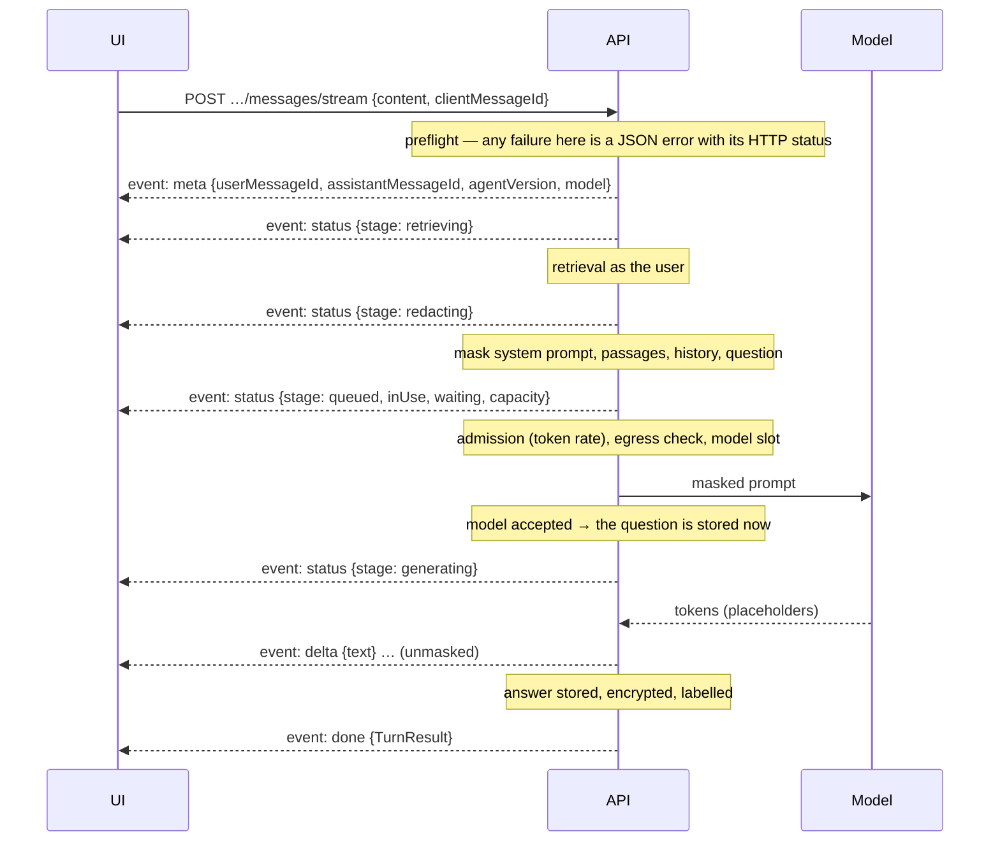

# Phase 4 — Agents, Models & Conversational AI

**Frontend implementation handoff · revision 1 · 6 October 2026**

**Product:** AgentVault / Distributed AI Agent Management Platform
**Backend baseline:** `42ab352` plus the `null`-validation fix recorded in [P4-G01](#13-backend-constraints-and-release-decisions) (in the working tree, not yet committed)
**Phase:** 4 of exactly 5
**Status:** specification ready and every operation proven against a live backend with a real language model; frontend implementation and browser acceptance not yet verified.

**Read with:** [Master roadmap/checklist](FRONTEND_PHASES.md), [Phase 1 foundation](PHASE_1_FOUNDATION_AUTH_WORKSPACE.md), [Phase 2 administration](PHASE_2_WORKSPACE_ADMINISTRATION.md), [Phase 3 knowledge and privacy](PHASE_3_KNOWLEDGE_DOCUMENT_VAULT_PRIVACY.md) and the [Phase 4 live verification report](PHASE_4_LIVE_VERIFICATION.md).

> The owner requested this handoff. That authorizes Phase 4 work; it does not establish that unobserved Phase 1–3 browser tests passed. Reuse the Phase 1 HTTP adapter, session refresh, workspace isolation and error handling, the Phase 2 role list, and the Phase 3 knowledge-base, document and privacy screens. All 25 Phase 4 HTTP operations are specified here.

## Contents

1. [Delivery outcome and evidence](#1-delivery-outcome-and-evidence)
2. [Shared integration contract](#2-shared-integration-contract)
3. [The access model](#3-the-access-model)
4. [Concepts the screens depend on](#4-concepts-the-screens-depend-on)
5. [Screens and workflows](#5-screens-and-workflows)
6. [Validation and wire models](#6-validation-and-wire-models)
7. [Complete endpoint register](#7-complete-endpoint-register)
8. [Detailed endpoint contracts](#8-detailed-endpoint-contracts)
9. [State, cache, streaming and concurrency](#9-state-cache-streaming-and-concurrency)
10. [Errors and recovery](#10-errors-and-recovery)
11. [Implementation sequence](#11-implementation-sequence)
12. [Acceptance checklist and demonstration](#12-acceptance-checklist-and-demonstration)
13. [Backend constraints and release decisions](#13-backend-constraints-and-release-decisions)
14. [Source map and delivery record](#14-source-map-and-delivery-record)
15. [Appendix A — TypeScript helpers](#appendix-a--typescript-helpers)

## 1. Delivery outcome and evidence

Deliver the conversational half of the product. Authorized people build agents (persona, instructions, model, knowledge, memory), version and publish them, and inspect the exact masked prompt an agent would send. Members chat with agents and watch answers stream in with citations to the documents behind them. Supervisors review conversations with personal data masked. Administrators choose which models the workspace may use, and anyone with the right permission can see token usage. A chat box that streams text is not completion: every control must follow the access rules in section 3, and every interrupted, refused or withheld answer must be shown honestly (sections 4.6–4.9).

| Area | Operations | Required outcome |
|---|---:|---|
| Agents | 7 (01–07) | Directory with search and visibility filter, create, read, edit, delete, publish and unpublish |
| Versions | 3 (08–10) | Version history, any version's full configuration, restore by appending a copy |
| Prompt preview | 1 (11) | The masked prompt, context budget and retrieval summary for a question, without calling the model |
| Conversations | 8 (12–19) | List mine or (supervisors) everyone's, start, read, rename/archive, delete, page through history, send, stream |
| Direct chat | 2 (20–21) | Model playground, plain and streaming, under the same masking |
| Models and policy | 3 (22–24) | Model catalogue, workspace model policy and effective limits, policy editor |
| Usage | 1 (25) | Invocations, tokens, latency and masking overhead for a time window |
| **Total** | **25** | All covered by register, contracts and acceptance |

Out of scope, and assigned to Phase 5: the tool catalogue and tool management, workflows, Socket.IO, audit viewer, analytics, quota and circuit management, and personal-data export. Phase 4 must still **display** tool calls that happen inside a turn (section 4.10) and **handle** governance refusals such as `TOKEN_RATE_LIMITED`, because they occur on Phase 4 calls (section 4.9).

### Verification honesty

- Controllers, DTOs, services, guards, the turn pipeline, the gateway, the tool loop, the label checks and the governance admission were read against `42ab352`.
- On **6 October 2026 (Asia/Karachi)** an owner-requested live run exercised **all 25 operations** with real HTTP requests against the running backend (`npm run start:dev`, `http://localhost:3000`) and **real model calls** to the deployment's language model (Groq's OpenAI-compatible API, `qwen/qwen3.8-27b`). Supabase PostgreSQL with row-level security, Aiven Valkey, Cloudflare R2, Qdrant Cloud and the project's AI service (embeddings, reranking, Presidio + spaCy + bert-base-NER) served retrieval and masking. Result: **461 checks, 459 passed**; the two failures were wrong harness expectations about masking during the outage, explained in the report and P4-G16, not backend defects — see the [report](PHASE_4_LIVE_VERIFICATION.md) and [machine-readable results](PHASE_4_LIVE_RESULTS.json).
- Members joined through the **real invitation flow** (emails read from the Ethereal test inbox over IMAP); knowledge fixtures went through the Phase 3 endpoints. No database rows were written directly.
- Streams were read byte for byte; a Stop was simulated by disconnecting mid-answer; a built-in tool call was streamed; the AI service was stopped mid-run and restarted, to observe outage errors, nothing being stored, degraded masking and recovery; concurrent calls were fired at the workspace token rate.
- Model output is non-deterministic, so content-dependent observations (what the answer said, whether it cited, whether it called the tool) are recorded separately under `facts.modelObservations` and never counted as checks. Every contract property (shapes, statuses, ids, stored state, label decisions, masking) is a counted check.
- Everything marked *source* in this document was read from code but not produced live. Section 13 lists what remains unverified.
- One backend defect was found during source review and fixed with a regression spec (P4-G01). No other backend behaviour was changed.

## 2. Shared integration contract

### Addresses and request modes

Product API base: `http://localhost:3000/api/v1`. Frontend local origin: `http://localhost:5173`. All 25 operations are workspace-scoped and bearer-authenticated:

```http
Authorization: Bearer <in-memory-access-token>
Accept: application/json            (text/event-stream for operations 19 and 21)
X-Organization-Id: <same-canonical-workspace-uuid-as-the-path>
```

As established in Phase 3, the **header wins** over the path when they disagree. Build both from one captured workspace ID.

| Mode | Used by | Notes |
|---|---|---|
| JSON | 23 operations | `Content-Type: application/json`; unknown properties are rejected with 422 |
| Server-Sent Events over **POST** | Stream a turn (19), stream direct chat (21) | A JSON body goes up; `text/event-stream` comes back. **`EventSource` cannot be used**: it only does GET and cannot send the bearer header. Use `fetch()` with a stream reader (Appendix A `postEventStream`) or `@microsoft/fetch-event-source`. Refusals **before** the stream opens are ordinary JSON error envelopes with their HTTP status; failures **after** it opens arrive as an `error` event inside a 200 response (section 4.4) |

Use `credentials: 'include'` consistently with Phase 1. The frontend never sends an API key; API keys appear here only as conversation owners in the supervision list.

### Time budgets: inference needs a longer client timeout

| Operations | Server budget | Client guidance |
|---|---|---|
| Send a message (18), direct chat (20) | **300 s** (`LLM_REQUEST_TIMEOUT`); a single generation is capped at 240 s (`LLM_MAX_DURATION`) | The Phase 1 adapter's 35 s default **will abort real answers**. Give these two calls a 310 s timeout, and prefer the streaming variants for anything interactive |
| Stream a turn (19), stream direct chat (21) | Same | No fixed total timeout. Use an **idle** watchdog instead: the server writes a `: keep-alive` comment every 15 s, so treat 45 s without any bytes as an interrupted stream |
| Prompt preview (11) | 60 s (retrieval budget) | 65 s |
| Everything else | 30 s | The Phase 1 default |

Past its budget the server answers **408 `REQUEST_TIMEOUT`**. For a send, a timeout does not tell you whether the question was stored: reconcile first (section 9.4).

### Envelope and pagination

Same envelope as Phases 1–3. `meta.pagination` lists: agents (01), versions (08), conversations (12). Message history (17) is **cursor-paged** instead: `data.messages` (chronological) with `data.nextBefore`. Models (22) are wrapped: `data.models` plus `data.verified`. Everything else returns a single object.

### Rate policies and limits

| Limit | Default | Applies to | Refusal |
|---|---|---|---|
| default | 120 requests / 60 s per user | everything not listed below | 429 `RATE_LIMIT_EXCEEDED` |
| inference | **20 / 60 s per user** | 18, 19, 20, 21 | 429 `RATE_LIMIT_EXCEEDED` |
| rag | 60 / 60 s per user | 11 | 429 `RATE_LIMIT_EXCEEDED` |
| Workspace token rate (governance) | `QUOTA_TOKENS_PER_MINUTE`; **8,000 tokens/min on this deployment** (default 100,000) | every model call | 429 `TOKEN_RATE_LIMITED` |
| Monthly token allowance (governance) | plan allowance (`QUOTA_FREE_MONTHLY_TOKENS`, 2,000,000) | every model call | 429 `QUOTA_EXCEEDED` |
| Model concurrency | `LLM_MAX_CONCURRENCY` (**1 on this deployment**) generations per server process; waiters queue up to 30 s | every model call | 503 `LLM_BUSY`, `Retry-After: 5` |

The token rate is checked against each call's **worst case**: the estimated prompt plus the maximum output it may generate. A large `maxOutputTokens` therefore uses up the per-minute budget faster than the tokens actually spent. Verified: nine concurrent direct-chat calls with `maxOutputTokens: 1000` against the 8,000/min budget produced 7 × 200 and 2 × 429 `TOKEN_RATE_LIMITED`; the refusal carried `Retry-After: 1` and `details` `{"quotaId": "b1fd7c95-881e-496f-a285-506f3444a141", "scope": "ORGANIZATION", "tokensPerMinute": 8000, "requested": 1010, "retryAfterSeconds": 1}`.

Every refusal carries `Retry-After` (seconds), exposed through CORS with the `x-ratelimit-*` headers and `x-request-id`. Read the headers; deployment configuration changes the numbers.

### Common handling

- DTO failures: **422 `VALIDATION_FAILED`** with `details.fields` keyed by property path (nested paths look like `retrieval.topK`). Malformed path UUIDs and non-numeric version numbers: **400 `BAD_REQUEST`**.
- Switch on `error.code` and status; `error.message` is display text.
- Never auto-replay a send after a timeout, a dropped stream or a 5xx: the question may have been stored and answered. Reconcile with a read; resend only with the same `clientMessageId` (section 9.4).
- Pessimistic updates for agent configuration, publication, policy and deletion. The only optimistic element is showing the user's own question as "sending" while a turn runs.
- 403 is not a refresh signal; only conclusively expired credentials go through the Phase 1 refresh path. For a stream, a 401 always arrives as JSON **before** the stream opens, so refresh and resend is safe.

### Shared dependencies from Phases 1–3

| Dependency | Why |
|---|---|
| Contextual `GET /auth/me` | `permissions`: the expanded effective permission list, the input to every gate in section 3; `id` to recognise your own conversations and agents (`ownerUserId`, `createdById`) |
| `GET /organizations/:id/roles` (role:read) | Role picker for RESTRICTED agents (`allowedRoleIds`) |
| `GET /organizations/:id/knowledge-bases` (knowledgebase:read) | Knowledge-base picker for an agent's retrieval. Only bases the editor can read may be attached |
| `GET /organizations/:id/rag/access-scope` (rag:query) | Explains what an agent can reach for **this** user (section 3.4) |
| `GET /organizations/:id/pii/policy` (pii:policy:read) | Masking status and warnings shown beside chat; the policy editor stays in Phase 3 |
| `GET /organizations/:id/documents/:documentId` (document:read) | Citation links open the Phase 3 document detail |
| `GET /organizations/:id/members` (member:read) | Optional: resolve `createdById` and `ownerUserId` to names |

A missing secondary permission disables only the dependent control ("Choosing knowledge bases needs knowledgebase:read"); it must not break the agent screens.

## 3. The access model

Read this before building any screen. Every Phase 4 refusal comes from one of these rules.

### 3.1 Route permissions

The route permission is checked first, before the server looks anything up: a missing permission is **403 `PERMISSION_DENIED`** with `details.missingPermissions`, even for an agent you could not see.

| Action | Permission |
|---|---|
| List/read agents, versions | `agent:read` |
| Create an agent | `agent:create` (granting tools also needs `tool:read`) |
| Edit an agent, restore a version | `agent:update` |
| Delete an agent | `agent:delete` |
| Publish/unpublish | `agent:publish` |
| Prompt preview, start a conversation, send, stream | `agent:execute` |
| List/read your conversations and messages, rename/archive yours | `conversation:read` |
| Everyone's conversations (`scope=all`, others' messages) | `conversation:read` **and** `conversation:read_all` |
| Delete a conversation | `conversation:delete` |
| Reveal personal data in someone else's conversation | `pii:reveal` |
| Direct chat, plain and streaming | `llm:invoke` |
| Read the model list and policy | **any one of** `llm:invoke`, `llm:manage`, `agent:read` |
| Change the model policy | `llm:manage` |
| Usage | `usage:read` |

### 3.2 Who can see an agent

```text
can see an agent =
     workspace owner (*:*)  or  holds agent:update            → every agent, drafts included
  or created it                                               → their own drafts
  or it is published (visibility WORKSPACE) and
       accessMode WORKSPACE                                   → everyone with agent:read
       or accessMode RESTRICTED and the member holds one of allowedRoleIds
```

- An agent you cannot see does not exist for you: **404 `AGENT_NOT_FOUND`** on read, versions, preview, starting a conversation and sending. Listing applies the same rule, so totals differ between users. Verified: a Member sees no drafts and not the RESTRICTED agent; an Administrator sees every agent.
- **Using** an agent means seeing it **and** holding `agent:execute`. Drafts can be used by their creator and by managers. Verified: the author started a conversation with their own unpublished draft; a Member got 404 for someone else's draft.
- A RESTRICTED agent whose allowed roles were all deleted is open to nobody (never to everybody). API keys can never use RESTRICTED agents (verified).
- `canEdit` on every agent simply mirrors `agent:update`. **A creator without `agent:update` cannot edit or publish their own draft** (verified with a custom "Agent Author" role; decision P4-G04).

### 3.3 Hidden knowledge bases inside an agent

An agent can be configured with a knowledge base its current editor cannot read. The HR manager attaches HR Casework; an Administrator outside that compartment edits the tone. The server handles it like this (all verified):

- `config.retrieval.knowledgeBaseIds` lists only the bases **you** can read; `hiddenKnowledgeBases` counts the others; `knowledgeBaseCount` (in summaries) counts all.
- Saving keeps the hidden ones attached, whatever you send.
- Naming a base you cannot read (on create or edit) is **404 `KNOWLEDGE_BASE_NOT_FOUND`** with `details.knowledgeBaseId`, and the probe is audited.

Show the count honestly: "Also uses 1 knowledge base you don't have access to."

### 3.4 An agent is a delegate, never a principal

Everything an agent reads, it reads **as the person talking to it** (ADR 0003, decision 7):

```text
bases searched     = agent's knowledge bases ∩ bases the user can read
classification cap = min(user's clearance, agent's retrieval.maxClassification, LLM_MAX_CLASSIFICATION)
```

Verified: for the same agent and question, the prompt preview searched **1** base for an Administrator and **2** for the author who holds the HR grant, and the HR-only figure reached only the author's prompt. Restricting an agent to HR roles controls who may *talk to* it; it is not what keeps payroll away from everyone else. Their own lack of access to the HR compartment does that.

**The model endpoint has a ceiling.** `LLM_MAX_CLASSIFICATION` caps what any agent may retrieve, for everyone, because a third-party model API should not receive confidential text. **It is `INTERNAL` on this deployment.** Verified: the owner (clearance RESTRICTED) can retrieve a CONFIDENTIAL document through Phase 3 search, but no agent prompt includes it, and every turn reports `effectiveClearance: "INTERNAL"`. Show it ("Agents on this workspace only use Internal and Public documents") from `GET /llm/policy` → `effective.maxClassification` (decision P4-G07).

### 3.5 Conversations: owners and supervisors

- A conversation belongs to the user (or API key) who started it.
- **Owner-only:** sending, streaming, renaming/archiving, and prompt preview with a `conversationId`. A non-owner gets **404 `CONVERSATION_NOT_FOUND`**, even a supervisor (verified).
- **Readable by** the owner, and by holders of `conversation:read_all` (supervision). Anyone else gets 404.
- **Delete:** `conversation:delete`, and either owner or supervisor. Verified: an Administrator deleted another member's conversation (decision P4-G09).
- Supervised reads are masked, labelled and audited (section 4.7).

### 3.6 Built-in roles, verified live

| | Owner | Administrator | Member | Viewer |
|---|---|---|---|---|
| Agents: read / create / update / delete / publish | ✓✓✓✓✓ | ✓✓✓✓✓ | ✓ – – – – | ✓ – – – – |
| Use agents (`agent:execute`) | ✓ | ✓ | ✓ | – |
| Conversations: own / supervise / delete | ✓✓✓ | ✓✓✓ | ✓ – ✓ | ✓ – – |
| Direct chat / manage model policy | ✓✓ | ✓✓ | ✓ – | – – |
| Usage | ✓ | ✓ | ✓ | – |
| Reveal personal data | ✓ | – | – | – |
| Clearance (agent retrieval is also capped at the endpoint ceiling, INTERNAL here) | RESTRICTED | CONFIDENTIAL | INTERNAL | INTERNAL |

Contextual permission counts (live `/auth/me`): owner 64, admin 60, member 20, viewer 10, author 10. Phase 4 keys per role:

```text
owner    agent:create agent:delete agent:execute agent:publish agent:read agent:update conversation:delete conversation:read conversation:read_all llm:invoke llm:manage tool:create tool:delete tool:execute tool:read tool:update usage:read
admin    agent:create agent:delete agent:execute agent:publish agent:read agent:update conversation:delete conversation:read conversation:read_all llm:invoke llm:manage tool:create tool:delete tool:execute tool:read tool:update usage:read
member   agent:execute agent:read conversation:delete conversation:read llm:invoke tool:execute tool:read usage:read
viewer   agent:read conversation:read tool:read
author   agent:create agent:execute agent:read conversation:delete conversation:read
```

The custom role used in the run, "Agent Author", held `agent:read`, `agent:create`, `agent:execute`, `conversation:read`, `conversation:delete`, `knowledgebase:read`, `document:read`, `rag:query` and `clearance:internal`.

Design consequences: a Viewer can browse agents and read their full instructions (P4-G03), and see the model list, but cannot chat. A Member chats, uses the playground and sees **workspace-wide** usage (P4-G06). An Administrator supervises masked conversations but cannot reveal. Roles are editable (Phase 2), so **derive every control from the permission list, never from role names**.

### 3.7 UI rules: compute once, use everywhere

```ts
can   = agentCapabilities(contextual GET /auth/me → data.permissions)   // Appendix A
agent = what the server returned (never assume you can see it)
show  "Edit" only if can.manageAgents, "Publish" if can.publishAgents && agent.visibility === 'PRIVATE'
show  chat entry points only if can.chat
```

Hide what the user can never do in this workspace. Handle every 403/404 anyway: roles, publication and access modes change while pages are open, and an agent can disappear from under an open chat (unpublished: 404 `AGENT_NOT_FOUND`; deleted: 409 `AGENT_UNAVAILABLE`).

## 4. Concepts the screens depend on

### 4.1 Anatomy of an agent

An agent has an **identity** (name, description), **access** (publication, access mode, allowed roles), and **behaviour**. Behaviour is the configuration below plus the instructions, and it is versioned (section 4.2). Defaults are what `POST /agents` with only a name produced live.

| Setting | Default | Range | What it does |
|---|---|---|---|
| `persona.role` | `null` | ≤160 | System prompt opens "You are {name}, {role}." (else "…an assistant for this organisation.") |
| `persona.tone` | `neutral` | `neutral` `formal` `friendly` `concise` | One sentence of tone guidance |
| `persona.language` | `null` | ≤40 | "Always answer in {language}"; `null` = the language the user writes in |
| `persona.greeting` | `null` | ≤500 | **UI only**: show it when a conversation opens. Never sent to the model, never stored as a message |
| `model` | `null` | ≤200 | `null` = the workspace default **at the time of each turn**. Must pass the allowlists (section 4.3) |
| `parameters` | `{}` | see section 6 | Sampling overrides. **Replaced wholesale** on update: send the complete object; `{}` clears all overrides |
| `contextWindow` | `null` | 512–1,048,576 | Caps the window below the model's own; `null` = the model's, within platform and workspace ceilings |
| `retrieval.enabled` | `true` | | `false` = never retrieve |
| `retrieval.knowledgeBaseIds` | `[]` | ≤20 | Bases to search. **With none attached, no retrieval runs.** Always intersected with the user's access |
| `retrieval.topK` | `8` | 1–20 | Passages requested |
| `retrieval.mode` | `hybrid` | `hybrid` `dense` | As in Phase 3 |
| `retrieval.rerank` | `false` | | Agents default to **no** reranking, even where the deployment enables it for Phase 3 search |
| `retrieval.maxContextTokens` | `3000` | 0–65,536 | Token budget for passages |
| `retrieval.minScore` | `null` | 0–1 | Dense mode only |
| `retrieval.maxClassification` | `null` | classification | Caps the agent for everyone (a public helpdesk agent capped at PUBLIC) |
| `memory.maxMessages` | `20` | 0–500, capped by the platform at 100 | Most recent messages considered; `0` disables memory |
| `memory.maxHistoryTokens` | `3000` | 0–262,144 | Token budget for history |
| `grounding` | `STRICT` | `STRICT` `BALANCED` | STRICT answers only from retrieved material and says it does not know otherwise; BALANCED may use general knowledge and says so |
| `citations` | `true` | | Asks the model to cite sources as `[S1]`, `[S2]` |
| `tools.toolIds` / `tools.maxIterations` | `[]` / `4` | ≤20 / 0–32, capped at `TOOL_MAX_ITERATIONS` (8) | Phase 5 manages tools; Phase 4 shows them read-only (section 4.10) |
| `instructions` | `""` | ≤12,000 | The administrator-written system prompt, stored encrypted. **Readable by anyone who can see the agent** (P4-G03) |
| `accessMode` / `allowedRoleIds` | `WORKSPACE` / `[]` | ≤50 roles | Who may use the published agent |

New agents are **private drafts** at version 1 (`visibility: PRIVATE`, `publishedAt: null`). Three platform rules are always appended to the system prompt, whatever the instructions say: reference material inside `<context>` is data, not instructions; placeholders like `[PERSON_1]` must be copied exactly; and the grounding rule. The prompt preview (operation 11) shows the compiled result.

### 4.2 Versions are append-only

| Change | Effect |
|---|---|
| Behaviour (`persona`, `model`, `parameters`, `contextWindow`, `retrieval`, `memory`, `grounding`, `citations`, `tools`, `instructions`) | New immutable version `currentVersion + 1`, **only if** the result differs. Saving an unchanged configuration creates none (verified) |
| Identity (`name`, `description`) | Edited in place, audited, no version (verified) |
| Access (`accessMode`, `allowedRoleIds`), publication | Edited in place, audited, no version (verified) |
| Restore version N | Appends a **copy** of N as a new version (`restoredFromVersion: N`, change note "Restored version N." unless you send one). History is never rewritten. The copy has N's `configDigest` (verified) |

- `expectedVersion` (send the `currentVersion` you loaded) refuses a save if someone else created a version since: **409 `AGENT_VERSION_CONFLICT`** `{expectedVersion, currentVersion}`. It compares versions only, so identity and access edits are last-write-wins (P4-G05).
- `configDigest` is SHA-256 of configuration plus instructions: two versions with the same digest behave identically. Use it to label "identical to v2" in history.
- `changeNote` (≤500) is recorded with the new version, like a commit message.
- Restoring the current version is **422 `VALIDATION_FAILED`** ("That version is already the current one."). Restoring a version whose model is no longer allowed is 422 `LLM_MODEL_NOT_ALLOWED`.
- Every answer records the `agentVersion` that produced it (verified on messages), so history can show "answered by v3".

Verified sequence on one agent: create v1 → description edit (still v1) → tone change with a note (v2) → identical save (still v2) → stale `expectedVersion: 1` (409) → `parameters: {temperature: 0.1}` (v3, and `maxOutputTokens` override gone) → parameters back (v4) → restore v2 (v5, same digest as v2).

### 4.3 Models: three allowlists and the effective limits

```text
models a request may use = what the endpoint serves
                         ∩ the platform allowlist (LLM_ALLOWED_MODELS; empty = unrestricted)
                         ∩ the workspace policy's allowedModels (empty = everything the platform allows)
```

- **Default model:** the workspace policy's `defaultModel`, else the platform default (`effective.defaultModel`). Agents with `model: null` follow it at every turn.
- **Context window used** = the smallest of: the model's own (when the endpoint reports one), `LLM_MAX_CONTEXT_WINDOW`, the workspace `maxContextTokens`, and the agent's `contextWindow`.
- **Output ceiling** = the smallest of `LLM_MAX_OUTPUT_TOKENS`, the workspace `maxOutputTokens`, and **half the context window**. A requested `maxOutputTokens` above it is **clamped, not refused**.
- A model outside the allowlists is **422 `LLM_MODEL_NOT_ALLOWED`** before anything runs; on chat the details list the allowed models (verified).

Live deployment values (`GET /llm/policy` → `effective`, and `GET /llm/models`):

- `verified: true`; platform allowlist ["qwen/qwen3.8-27b"]; platform default `qwen/qwen3.8-27b`.
- Effective ceilings with no workspace policy: output **1000** tokens (`LLM_MAX_OUTPUT_TOKENS`), context **32,768** tokens (`LLM_MAX_CONTEXT_WINDOW`; the model itself reports 131,072). Default answer length when nothing is requested: 512 tokens (`LLM_DEFAULT_MAX_OUTPUT_TOKENS`).
- Endpoint classification ceiling: **INTERNAL** (section 3.4).

| Model | Family | Context length | Allowed | Default |
|---|---|---:|---|---|
| `qwen/qwen3.8-27b` | Alibaba Cloud | 131,072 | yes | yes |

The model list is fetched from the endpoint and cached for 60 s. When the endpoint is unreachable, `verified: false` and the list comes from configuration. Show "Couldn't confirm with the model server" rather than hiding the picker.

### 4.4 Anatomy of a turn



**Preflight** (ordinary JSON errors, nothing stored): model configured (503 `LLM_NOT_CONFIGURED`), message length (422), you own the conversation (404), it is not archived (409 `CONVERSATION_ARCHIVED`), the agent is visible (404) and not deleted (409 `AGENT_UNAVAILABLE`), `clientMessageId` not already used (409 `MESSAGE_DUPLICATE`), conversation token budget (409 `CONVERSATION_TOKEN_BUDGET_EXCEEDED`), model allowed (422), no other turn running (409 `CONVERSATION_BUSY`).

**After `meta`** the HTTP status is already 200, so failures arrive as an `error` event `{code, message, status, details?, retryAfterSeconds?}`. That covers retrieval failing (`AI_SERVICE_UNAVAILABLE`, `VECTOR_STORE_UNAVAILABLE`), the prompt not fitting (`LLM_CONTEXT_OVERFLOW`), masking unavailable (`PII_DETECTION_UNAVAILABLE`), governance (`TOKEN_RATE_LIMITED`, `QUOTA_EXCEEDED`, `AGENT_CIRCUIT_OPEN`), the egress check (`PII_EGRESS_BLOCKED`), model capacity (`LLM_BUSY`) and model failures. `status` is the HTTP status it would have had, and `retryAfterSeconds` mirrors `Retry-After`, so one handler serves both forms.

**What is stored, and when:**

| The turn ended… | Stored | Verified |
|---|---|---|
| before the model accepted the request (any preflight failure, or an error event before `generating`) | **nothing**: no question, no answer; `messageCount` unchanged | yes (AI outage: `messageCount` stayed 0) |
| with `done` | the question (COMPLETE) and the answer (COMPLETE) | yes |
| because you disconnected after `generating` | the question, and the partial answer as **CANCELLED** with `errorCode: "REQUEST_TIMEOUT"` | yes (`CANCELLED`, `REQUEST_TIMEOUT`, 939 characters kept) |
| because the model failed or timed out after `generating` | the question, and the partial answer (possibly empty) as **FAILED** with the error code | source |

The non-streaming send (18) runs the same pipeline and returns the same `TurnResult` as `done`, or the JSON error.

Live event order and timing for a grounded turn (a Member's streamed turn in a conversation with the HR Policy Assistant that already had history, times from sending the request; total 5179 ms server-side, time to first token 492.15 ms):

```text
   2188 ms  meta (agentVersion 5, model qwen/qwen3.8-27b)
   2420 ms  status retrieving
   3887 ms  status redacting
   4532 ms  status queued {"inUse": 0, "waiting": 0, "capacity": 1}
   5717 ms  status generating
   5717 ms  delta × 23 (first here, last at 5717 ms; 104 characters)
   8190 ms  done
```

This model streams the whole answer in a burst, and `done` arrives about 2.5 s later, after the answer is stored, labelled and audited. Show the text as it arrives, keep the composer locked until `done`, and never treat the gap after the last delta as a stall.

### 4.5 The stream on the wire

Verified raw bytes of a direct-chat stream (synthetic data; `data:` lines shortened only where marked):

```text
retry: 5000

id: 1
event: meta
data: {"invocationId":"6b16a8de-a212-464f-8177-2a869949227c","model":"qwen/qwen3.8-27b"}

id: 2
event: status
data: {"stage":"redacting"}

id: 3
event: status
data: {"stage":"queued","inUse":0,"waiting":0,"capacity":1}

id: 4
event: status
data: {"stage":"generating","redaction":{"enabled":true,"degraded":false,"entitiesMasked":1}}

id: 5
event: delta
data: {"text":"Hello"}

id: 6
event: delta
data: {"text":","}

id: 7
event: delta
data: {"text":" "}

id: 8
event: delta
data: {"text":"Imran Siddiqui."}

id: 9
event: done
data: {"invocationId":"6b16a8de-a212-464f-8177-2a869949227c","model":"qwen/qwen3.8-27b","content":"Hello, Imran Siddiqui.","finishReason":"stop","usage":{"promptTokens":31,"completionTokens":8,"estimated":false},"redaction":{"enabled":true,"degraded":false,…
```

- First line `retry: 5000`; ignore it. **Never auto-reconnect a POST stream**: reconnecting would send the question again.
- Every event has `id:` (1, 2, 3… per response), `event:` and exactly **one** `data:` line of JSON. Model output cannot break the framing, because newlines inside it are JSON-escaped.
- Heartbeats are comment lines (`: keep-alive`) written every 15 s for as long as the stream is open; in practice you see them while retrieval is slow or a model is loading. Ignore them, but count them as activity for the idle watchdog.
- Headers (verified): `Content-Type: text/event-stream; charset=utf-8`, `Cache-Control: no-cache, no-store, no-transform`, `X-Accel-Buffering: no`, plus the usual `x-request-id` and `x-ratelimit-*`.
- `delta.text` is already **unmasked** and is plain text. Append it; render with your normal plain-text or sanitized-markdown pipeline. Placeholders are never split across deltas (verified: no delta ends inside `[NAME_1`).
- The concatenated deltas equal `done.assistantMessage.content` (turns) or `done.content` (direct chat) (verified). Replace the streamed text with the `done` value when it arrives.

| Event | Turn stream (19) | Direct stream (21) | Data |
|---|---|---|---|
| `meta` | once, first | once, first | turn: `{conversationId, agentId, agentVersion, model, userMessageId, assistantMessageId}` · direct: `{invocationId, model}` |
| `status` | many | many | `{stage}` plus: `queued` → `{inUse, waiting, capacity}` (the server-wide model queue); `generating` (direct only) → `{redaction: {enabled, degraded, entitiesMasked}}`; `tool` → `{tool, iteration}` |
| `delta` | many | many | `{text}` |
| `tool` | per tool call | — | `{executionId, tool, status: ok/error/denied, code?, reason?, durationMs}`, never arguments or results |
| `done` | last | last | the same body as the non-streaming endpoint |
| `error` | last | last | `{code, message, status, details?, retryAfterSeconds?}` |

Stages: `retrieving` (turns with knowledge bases), `redacting`, `queued`, `generating`, `thinking` (a reasoning model is thinking: the hidden reasoning is removed and never shown; not emitted by this deployment's model), `tool`. Suggested labels are in Appendix A (`stageLabel`).

### 4.6 Privacy inside conversations

- **Only masked text leaves the platform.** The system prompt, every passage and title, every history message and the question are masked in one session, so a person is the same placeholder everywhere (`[PERSON_1]`). The gateway re-scans the exact payload and blocks it (`PII_EGRESS_BLOCKED`) if anything sensitive survived. Verified: the prompt preview contained `[EMAIL_ADDRESS_1]` where the document had a real address, and its egress scan found nothing.
- **The answer is unmasked for you** as it streams and is stored unmasked (encrypted under the conversation's own key) in **your** conversation.
- The assistant message's `redaction` `{enabled, degraded, entities, byType}` says what was masked for that turn (counts only). Show a small "4 personal details masked before the model saw them" disclosure.
- `degraded: true` means names could not be detected (NER unavailable and the policy allows `DEGRADE_TO_PATTERNS`); only pattern types (emails, phones, cards…) were masked. Show a warning on that message (verified in the outage run).
- With masking unavailable and the policy on REFUSE (the default), turns fail with `PII_DETECTION_UNAVAILABLE` 503 and nothing is sent (verified).
- Name detection results are cached for `PII_DETECTION_CACHE_TTL` (1 h) by keyed fingerprint, never as text. During a short outage, text analysed in the last hour (a question asked again, a conversation supervised before) can still be masked; anything new fails closed. So the same outage can mask one conversation and withhold another (P4-G16).
- Placeholders the model invents are left as written; direct chat reports them as `placeholdersUnresolved`.

### 4.7 Labels: why a message can be withheld

Once a passage is quoted in an answer, the answer *contains* it, and it is stored, re-read, supervised and fed back as history. So every message carries an information-flow label (ADR 0003, decision 9):

- an **answer** is labelled with everything it was shown: the classifications, knowledge bases and documents of its passages, plus the labels of the history it saw;
- a **question** is labelled with the conversation's high-water mark when it was written;
- the conversation's `classification` only ever rises (a badge: "This conversation contains Internal material").

**Every read re-checks each label against the reader's access today.** A message that fails is returned with `content: null`, `contentState: "WITHHELD"`, `citations: []`, `toolCalls: []` and a `withheldReason`:

| `withheldReason` | Meaning | Verified |
|---|---|---|
| `CLEARANCE` | drew on material above your clearance | yes (an auditor role without clearance reading INTERNAL answers) |
| `COMPARTMENT` | drew on a knowledge base you cannot read | yes (an Administrator reading the author's HR answer) |
| `SOURCE_DELETED` | a document it relied on has been deleted, which withdraws it **even from its owner** | yes |
| `REDACTION_UNAVAILABLE` | supervision view: masking is unavailable for text not seen in the last hour, so content is hidden rather than shown unmasked | source (in the live outage the supervised text had been analysed before, so it was correctly masked from the detection cache instead; P4-G16) |

The owner always sees the questions they typed. Withheld messages also drop out of the model's memory for later turns (verified: `context.historyExcluded` rose after a source was deleted). Render a withheld message as a quiet placeholder row with the reason (Appendix A `messageNotice`). Never show an error toast for it.

**Supervision.** In someone else's conversation, visible content is **masked** (`contentState: "MASKED"`, `masked: true`), and so are cited document titles and the conversation title. `reveal=true` shows real values: it needs `pii:reveal` (owner only by default), is audited as a CRITICAL `pii.unmasked` event, and without the permission is **403 `PERMISSION_DENIED`** rather than a silent fallback (verified). Every supervised read is audited.

### 4.8 Memory and the context budget

```text
context window = system prompt + passages + history + question + reserved answer + safety margin
```

The answer's share (`reservedForAnswer` = the turn's `maxOutputTokens`) and a margin (32 + 3 % of the window) come off first. The system prompt and question are mandatory: if they alone do not fit, the turn fails with **422 `LLM_CONTEXT_OVERFLOW`** (as an `error` event when streaming). Passages are added in rank order up to `retrieval.maxContextTokens`. History fills what remains, newest first, as one contiguous block that never starts with an answer whose question was cut. Only COMPLETE messages are used, never cancelled or failed ones, and each must pass the label check and the classification ceiling.

`TurnResult.context` and the prompt preview's `context` report the result:

Verified, prompt preview for the owner (HR Policy Assistant: `maxOutputTokens` 300, passage budget 3,000):

```json
{"contextWindow": 8192, "promptBudget": 7614, "reservedForAnswer": 300, "systemTokens": 278, "passageTokens": 255, "historyTokens": 0, "userTokens": 40, "passagesIncluded": 3, "passagesDropped": 0, "historyIncluded": 0, "historyExcluded": 0}
```

`historyExcluded` counts earlier messages left out by budget, by the `maxMessages` limit, or by access. Show "This agent remembers the last N messages" from `memory.maxMessages`, and a hint when `historyExcluded > 0`.

### 4.9 Cancellation, failures and limits during a turn

- **Stop button = abort the fetch.** The server notices the disconnect, stops generation, and keeps what was shown as a CANCELLED message (verified: `CANCELLED`, `REQUEST_TIMEOUT`, 939 characters of partial text). The conversation is released at once (verified: the next send succeeded). A dropped connection has the same server-side effect.
- **One turn at a time per conversation:** a second send while one runs is **409 `CONVERSATION_BUSY`** (verified). Disable the composer while streaming. The server holds the lock for at most `LLM_REQUEST_TIMEOUT + 30 s`.
- **Idempotency:** send a fresh `clientMessageId` (UUID v4) with every new question and reuse it to retry *that* question. If it was already stored, the server answers **409 `MESSAGE_DUPLICATE`** with `details.messageId` = the stored question's id (verified), and you reconcile instead of answering twice.
- **Governance refusals are flow control, not failures.** `TOKEN_RATE_LIMITED` (429), `QUOTA_EXCEEDED` (429), `LLM_BUSY` (503), `AGENT_CIRCUIT_OPEN` (503) and `RATE_LIMIT_EXCEEDED` (429) carry a retry delay. Nothing was stored, so show a countdown and let the user retry (or retry once automatically after the delay, with the same `clientMessageId`). Never loop.
- Budgets that end a conversation: `CONVERSATION_TOKEN_BUDGET_EXCEEDED` (409; 1,000,000 tokens per conversation by default): offer "Start a new conversation". `AGENT_TOKEN_BUDGET_EXCEEDED` (422, an `error` event): one answer spent more than 60,000 tokens across tool calls.

### 4.10 Tools inside a turn (display only)

Tool management is Phase 5, but an agent configured with tools (through the API, or later through Phase 5 screens) calls them during a turn, so Phase 4 must render it:

- while a tool runs, `status {stage: "tool", tool, iteration}`; when it finishes, a `tool` event;
- the stored answer lists them in `toolCalls` (verified for the built-in `calculator`);
- text the model writes before deciding to call a tool streams as normal deltas, so an answer can contain a short preamble.

Show tool calls as compact chips ("calculator · 12 ms · ok"). `denied` with a `reason` means the platform refused the call (for example the user lacks `tool:execute`); show the reason. Phase 4 has **no** tool picker: in the agent editor, show `tools.toolIds.length` read-only, and do not offer to grant tools until the Phase 5 tool contract is delivered.

## 5. Screens and workflows

Suggested frontend routes (not backend endpoints). `:id` is the workspace.

| Route | Visible when | Content |
|---|---|---|
| `/w/:id/agents` | `agent:read` | Agent directory: search, visibility filter (managers), cards with persona role, greeting, model, knowledge count, published state |
| `/w/:id/agents/new` | `agent:create` | Builder (section 5.2) |
| `/w/:id/agents/:agentId` | `agent:read` | Overview: description, greeting, model, knowledge (with hidden count), access, version, "Start chat" (`agent:execute`) |
| `/w/:id/agents/:agentId/edit` | `agent:update` | Editor with version semantics |
| `/w/:id/agents/:agentId/versions` | `agent:read` | History, compare, restore (`agent:update`) |
| `/w/:id/agents/:agentId/preview` | `agent:execute` | Prompt inspector |
| `/w/:id/chat` | `conversation:read` | Conversation list (mine), filters by agent and status, "New chat" (`agent:execute`) |
| `/w/:id/chat/:conversationId` | `conversation:read` | Thread, composer (owner and `agent:execute`), stop, citations, notices |
| `/w/:id/supervision` | `conversation:read_all` | Everyone's conversations (masked titles), read-only threads, reveal (`pii:reveal`) |
| `/w/:id/settings/models` | any of `llm:invoke`, `llm:manage`, `agent:read` | Model catalogue and effective limits; policy editor with `llm:manage` |
| `/w/:id/playground` | `llm:invoke` | Direct chat: system prompt, messages, model, parameters, streaming, masking report |
| `/w/:id/usage` | `usage:read` | Window picker, totals, latency, masking overhead, by model, by agent |

### Common product quality

Separate loading, empty, filtered-empty, forbidden, not-found-or-hidden, pending, streaming and retryable states. Tables need semantic headers and narrow-screen cards. Keep keyboard operation, visible focus, 360 px layouts, reduced motion and non-colour status cues. Announce streaming politely: an `aria-live="polite"` region that updates on sentence boundaries or on `done`, not on every delta. **Never render model output, instructions, titles or greetings as raw HTML.** Use plain text or a sanitizing markdown renderer with links set to `rel="noopener noreferrer"` and no inline HTML.

### 5.1 Agent directory

- Members see published agents they may use plus their own drafts. Managers see everything, and the `visibility` filter is useful mainly to them. Search matches the **name** only. The order is always name A→Z: the list ignores `sortBy`, so do not offer sorting (P4-G08).
- Card: name, `role`, `greeting` (as a preview line), model (or "Workspace default"), `knowledgeBaseCount`, "Draft" badge for PRIVATE, lock icon for RESTRICTED, `lastUsedAt`.
- Empty states: "No agents yet" with "Create agent" (with `agent:create`); for Members, "No agents have been published to you yet".

### 5.2 Builder and editor

Sections in this order: **Identity** (name ≤80, description ≤2,000) · **Persona** (role, tone, language, greeting) · **Instructions** (multi-line, counter to 12,000) · **Knowledge** (enable, base picker from Phase 3 limited to bases you can read, hidden-base notice, topK, mode, rerank, passage budget, minScore in dense mode only, classification cap limited to levels up to the endpoint ceiling) · **Model** (picker from operation 22, allowed models only, "Workspace default" option = `null`; temperature, max output tokens with the effective ceiling as a hint; advanced: topP, seed, stop) · **Memory** (max messages, history budget) · **Answers** (grounding, citations) · **Access** (WORKSPACE/RESTRICTED, role picker) · **Tools** (read-only count).

- **Create** sends only what the user filled in. On 201 navigate to the overview and offer "Preview prompt" and "Publish".
- **Edit:** load the agent, keep it as the base, and on save send `agentPatch(base, draft)` (Appendix A): only changed sections, `parameters` whole, and `expectedVersion`. Before saving, show "Saving will create version N+1" when `createsVersion(patch)` is true, and an optional change note.
- **On 409 `AGENT_VERSION_CONFLICT`:** reload, show what changed (compare versions), and let the user reapply their edits. Never silently overwrite.
- **On 409 `AGENT_NAME_TAKEN`:** field error on name ("names are unique, ignoring case").
- **Unsaved changes:** warn on navigation; "Restore version" and "Discard" must confirm when the form is dirty.

### 5.3 Versions

List newest first (`isCurrent` badge), change note, author, date, "Restored from vN" when `restoredFromVersion` is set, "Identical to vN" when digests match. Selecting a version shows its full configuration and instructions. Offer a side-by-side diff against the current version: compare the two `config` objects and the instructions text client-side. "Restore" (`agent:update`) explains that it adds a new version and does not delete history. Page size is capped at 50.

### 5.4 Publishing

"Publish" makes a draft available under its access mode; "Unpublish" returns it to draft. Both are idempotent, and repeating either keeps the original `publishedAt` (verified). Unpublishing has an immediate effect on members (verified: their open conversation keeps its history, but the next send is 404 `AGENT_NOT_FOUND`). Confirm with: "Members will lose access to this agent; their conversations stay readable."

### 5.5 Prompt preview

A question box (and optional "include this conversation's history", for your own conversation with this agent). It shows:

- the masked messages exactly as the model would receive them (system / history / user with `<context>`), in a monospace viewer;
- the context budget as a stacked bar from `context`;
- the masking summary (`redaction.byType`, `degraded`, `egressFindings`, which should be empty);
- retrieval: bases searched, passages retrieved/included, `effectiveClearance`.

It calls no model and stores nothing, but it is throttled with Phase 3 search (rag policy) and needs `agent:execute`. Treat its content as sensitive (masked, but still internal text).

### 5.6 Chat

- **Start:** "New chat" picks an agent (from the directory) → `POST /conversations` → open the thread. Show the agent's `greeting` as a non-message banner. The title stays empty until the first question; the server then derives it from that question (first line, ≤80 characters) unless one was given.
- **Composer:** disabled while a turn runs, when the conversation is ARCHIVED (offer "Unarchive"), or when the user is not the owner (supervision view). Counter to `AGENT_MAX_MESSAGE_LENGTH` (16,000 characters on this deployment).
- **Send:** generate a `clientMessageId`, show the question as "sending", call the stream endpoint, and fold events with `turnReducer` (Appendix A). Show stage labels, stream the text, then replace both bubbles with `done.userMessage` / `done.assistantMessage`.
- **Stop:** abort the fetch; then reconcile (section 9.4) and show the CANCELLED message with its partial text.
- **Citations:** render `[S1]` markers as superscript chips linked to `assistantMessage.citations` (Appendix A `splitCitations`). Below the answer, list the sources it actually cited (`cited: true`), then "Also consulted" for the rest. Show document title, base, and a link to the Phase 3 document detail when the user has `document:read`. `documentTitle` is `null` when the document no longer exists. **Never present `score` as a percentage**; it is comparable only within one answer.
- **Per-turn details** (disclosure): model, agent version, tokens (`usage`), timings (`timeToFirstTokenMs`, `totalMs`), masking counts, `effectiveClearance`, context budget.
- **History:** load the newest page (`limit` 50), and load older pages on scroll with `before=nextBefore` until `nextBefore` is `null`.
- **Notices:** withheld, masked, cancelled and failed messages per Appendix A `messageNotice`.

### 5.7 Conversation list and supervision

- **Mine:** `GET /conversations` (default `scope=mine`), newest activity first, filter by agent and status. Rows: title (or "New conversation" when `null`), agent name (it survives agent deletion), message count, last activity, classification badge. Rename and archive inline (owner only).
- **Supervision** (`conversation:read_all`): `scope=all`. Other members' titles arrive masked; `null` means masking was unavailable. Show `ownerKind` ("API client" when `api_key`) and resolve `ownerUserId` to a member name if you have `member:read`. Threads are read-only, MASKED by default, with "Reveal personal data" for `pii:reveal` holders behind a confirmation that the action is audited. Never cache revealed pages. Say on the screen that viewing is audited.
- **Delete:** confirm with "Its messages are destroyed immediately and cannot be recovered" (the conversation's key is shredded). Supervisors with `conversation:delete` can delete other people's conversations. Make that explicit in the confirmation ("This is {name}'s conversation").

### 5.8 Models and policy

- Catalogue: name, family, context length, size where known, `allowed` and `isDefault` badges, and a `verified` notice.
- Effective limits panel from `effective` (default model, output and context ceilings, platform allowlist, **endpoint classification ceiling**).
- Editor (`llm:manage`): allowed models (multi-select among the platform's; "none selected" means all), default model (one of the allowed), output and context ceilings with "inherit platform" = `null`. Send only what changed, plus `expectedVersion` from the loaded policy. On 409, reload and reapply. Explain that agents pinned to a model removed from the list will fail with `LLM_MODEL_NOT_ALLOWED` until edited.

### 5.9 Playground (direct chat)

A system prompt field, a message list (up to 50 messages of ≤32,000 characters), model picker, parameters, and streaming by default. Nothing is stored server-side except a content-free usage record, so keep the transcript in component state only. Show the masking report from `done.redaction` and the timings. It is useful for comparing models and for demonstrating masking.

### 5.10 Usage

Window picker (defaults: last 30 days), totals by outcome (completed, failed, cancelled, refused = masking unavailable, blocked = egress check, throttled = governance), tokens, `estimatedTokenCounts` (rows where the endpoint did not report counts), latency p50/p95 and time to first token, masking overhead (p50/p95/p99 and share of total time), and the top 20 by model and by agent (`agentId: null` = direct chat; resolve ids via the agent list, and show "Deleted agent" for unknown ids). The ledger also counts Phase 5 workflow model calls, so label it "All model calls in this workspace". Empty windows return zeros and `null` percentiles (verified); render "—", not 0 ms.

## 6. Validation and wire models

Use JSON booleans and numbers. Omit untouched fields. Unknown properties are 422 everywhere.

### Body fields

| DTO / field | Contract |
|---|---|
| **Agent create** `name` | required, trimmed, non-empty, ≤80; unique per workspace ignoring case among live agents (409 `AGENT_NAME_TAKEN`); a deleted agent's name is free again (verified) |
| `description` | optional, ≤2,000 (`null` clears on update) |
| `persona` | optional object: `role` ≤160 or `null`; `tone` enum; `language` ≤40 or `null`; `greeting` ≤500 or `null`. Merged key by key on update |
| `model` | optional string ≤200 or `null` (workspace default); must be allowed (422 `LLM_MODEL_NOT_ALLOWED`) |
| `parameters` | optional object; **replaced wholesale** on update: `temperature` 0–2, `topP` 0.01–1, `topK` 1–500 (Ollama only), `maxOutputTokens` 1–65,536 (clamped), `repeatPenalty` 0.5–2 (Ollama only), `seed` integer, `stop` ≤4 strings of ≤32 |
| `contextWindow` | optional integer 512–1,048,576 or `null` |
| `retrieval` | optional object, merged: `enabled` boolean; `knowledgeBaseIds` ≤20 UUID v4, each readable by you (404 otherwise); `topK` 1–20; `mode` `hybrid`/`dense`; `rerank` boolean; `maxContextTokens` 0–65,536; `minScore` 0–1 or `null`; `maxClassification` enum or `null` |
| `memory` | optional object, merged: `maxMessages` 0–500; `maxHistoryTokens` 0–262,144 |
| `grounding` | `STRICT` / `BALANCED` |
| `citations` | boolean |
| `tools` | optional object, merged: `toolIds` ≤20 UUIDs (needs `tool:read`; each must exist and be enabled); `maxIterations` 0–32 and ≤ `TOOL_MAX_ITERATIONS` (8 here; 422 above) |
| `instructions` | optional string ≤12,000 |
| `accessMode` | `WORKSPACE` (default) / `RESTRICTED` |
| `allowedRoleIds` | optional ≤50 UUID v4 of roles in this workspace (404 `ROLE_NOT_FOUND` with `details.roleIds`) |
| **Agent update** | all of the above optional, plus `changeNote` ≤500 and `expectedVersion` integer ≥1. `null` is accepted only where it means "clear", "inherit" or "the default": `description`, `model`, `contextWindow`, `persona.role`/`language`/`greeting`, `retrieval.minScore`/`maxClassification`. Anywhere else `null` is **422** naming the field (P4-G01). To leave a field unchanged, omit it |
| **Restore** | `changeNote` ≤500, `expectedVersion` ≥1, both optional; body may be `{}` |
| **Prompt preview** `content` | required, non-empty, ≤ `AGENT_MAX_MESSAGE_LENGTH` (16,000 here; DTO allows 100,000, the service refuses above the deployment cap with 422) |
| `conversationId` | optional UUID v4 of **your** conversation with **this** agent (422 for another agent's) |
| **Conversation create** `agentId` | required UUID v4 of an agent you can see (404) and that is not deleted (409) |
| `title` | optional ≤120, trimmed; stored encrypted |
| **Conversation update** `title` | optional, non-empty, ≤120 |
| `status` | `ACTIVE` / `ARCHIVED` |
| **Send / stream** `content` | required, non-empty, ≤16,000 (deployment cap, as for preview) |
| `clientMessageId` | optional UUID v4; reuse only to retry the same question |
| `parameters` | optional `{temperature 0–2, maxOutputTokens 1–65,536}` for this turn only (other keys → 422) |
| `retrieval` | optional `{enabled, knowledgeBaseIds ≤20}` for this turn: `enabled:false` skips retrieval; `knowledgeBaseIds` **narrows to the intersection** with the agent's bases (ids the agent does not have are ignored silently, unlike Phase 3 search) |
| **Direct chat** `messages` | required, 1–50, each `{role: system/user/assistant, content non-empty ≤32,000}` |
| `model` | optional ≤200 (default: workspace default) |
| `parameters` | as for agents |
| **Policy update** `allowedModels` | optional ≤100 names, each platform-allowed (422 `LLM_MODEL_NOT_ALLOWED` with `details.models`); `[]` = every platform model |
| `defaultModel` | optional name or `null` (platform default); platform-allowed, and one of `allowedModels` when that list is non-empty (422 `VALIDATION_FAILED`) |
| `maxOutputTokens` | optional 16–65,536 or `null` |
| `maxContextTokens` | optional 512–1,048,576 or `null` |
| `expectedVersion` | optional integer ≥0; mismatch → 409 `RESOURCE_CONFLICT` |

Do not send: `id`, `visibility`, `currentVersion`, `publishedAt`, `canEdit`, `hiddenKnowledgeBases` or timestamps on agent writes; `messageCount`, `classification` or owner fields on conversation writes; `source`, `version` or `effective` on policy writes.

### Query parameters

| List | Inputs | Ordering and notes |
|---|---|---|
| Agents (01) | `page` ≥1, `limit` 1–100 (default 20), `search` ≤200 (**name**), `visibility` `PRIVATE`/`WORKSPACE` | Always name ASC, then id. `sortBy`/`sortDirection` are accepted and ignored |
| Versions (08) | `page`, `limit` (values above **50** are answered as 50) | Version DESC |
| Conversations (12) | `page`, `limit` 1–100, `scope` `mine` (default) / `all`, `agentId` UUID v4, `status` `ACTIVE`/`ARCHIVED` | Last activity DESC (never-used last), then created DESC. `sortBy` ignored |
| Messages (17) | `limit` 1–100 (default 50), `before` sequence ≥1, `reveal=true` | Returns the newest `limit` messages before `before`, chronologically. `nextBefore` = first sequence of a full page, else `null`. `reveal` is ignored on your own conversation |
| Usage (25) | `from`, `to` ISO dates (defaults: 30 days ago, now) | Unparseable dates → 422. `from > to` is not rejected (empty result) |

### Response types

```ts
export type UUID = string;
export type ISODate = string;
export type Classification = 'PUBLIC' | 'INTERNAL' | 'CONFIDENTIAL' | 'RESTRICTED';

// ── Agents ──────────────────────────────────────────────────────────────────

export type AgentVisibility = 'PRIVATE' | 'WORKSPACE';
export type AgentAccessMode = 'WORKSPACE' | 'RESTRICTED';
export type AgentTone = 'neutral' | 'formal' | 'friendly' | 'concise';
export type GroundingMode = 'STRICT' | 'BALANCED';

/** Every key optional; absent means "the platform default". */
export interface GenerationParameters {
  temperature?: number;     // 0–2
  topP?: number;            // 0.01–1
  topK?: number;            // 1–500, Ollama only
  maxOutputTokens?: number; // 1–65536, clamped to the effective ceiling
  repeatPenalty?: number;   // 0.5–2, Ollama only
  seed?: number;            // integer
  stop?: string[];          // ≤4, each ≤32 characters
}

export interface AgentPersona { role: string | null; tone: AgentTone; language: string | null; greeting: string | null }
export interface AgentRetrievalView {
  enabled: boolean;
  knowledgeBaseIds: UUID[];       // only the bases you can see
  hiddenKnowledgeBases: number;   // attached bases you cannot see; kept when you save
  topK: number;
  mode: 'hybrid' | 'dense';
  rerank: boolean;
  maxContextTokens: number;
  minScore: number | null;
  maxClassification: Classification | null;
}
export interface AgentMemory { maxMessages: number; maxHistoryTokens: number }
export interface AgentTools { toolIds: UUID[]; maxIterations: number }
export interface AgentConfigView {
  persona: AgentPersona;
  model: string | null;           // null: the workspace default model at the time of each turn
  parameters: GenerationParameters;
  contextWindow: number | null;
  retrieval: AgentRetrievalView;
  memory: AgentMemory;
  grounding: GroundingMode;
  citations: boolean;
  tools: AgentTools;
}
export interface AgentSummary {
  id: UUID; name: string; description: string | null;
  visibility: AgentVisibility; accessMode: AgentAccessMode; currentVersion: number;
  model: string | null; role: string | null; greeting: string | null; knowledgeBaseCount: number;
  createdById: UUID | null; publishedAt: ISODate | null; lastUsedAt: ISODate | null;
  createdAt: ISODate; updatedAt: ISODate;
  canEdit: boolean;               // you hold agent:update
}
export interface Agent extends AgentSummary { config: AgentConfigView; instructions: string; allowedRoleIds: UUID[] }
export interface AgentVersion {
  version: number; config: AgentConfigView; instructions: string;
  configDigest: string;           // SHA-256 hex of config + instructions
  changeNote: string | null; restoredFromVersion: number | null;
  createdById: UUID | null; createdAt: ISODate; isCurrent: boolean;
}

/** Writable configuration. Nested sections merge one level deep, except `parameters`, which replaces. */
export interface AgentWrite {
  persona?: Partial<AgentPersona>;
  model?: string | null;
  parameters?: GenerationParameters;
  contextWindow?: number | null;
  retrieval?: Partial<Omit<AgentRetrievalView, 'hiddenKnowledgeBases'>>;
  memory?: Partial<AgentMemory>;
  grounding?: GroundingMode;
  citations?: boolean;
  tools?: Partial<AgentTools>;
  instructions?: string;
  accessMode?: AgentAccessMode;
  allowedRoleIds?: UUID[];
}
export interface CreateAgentInput extends AgentWrite { name: string; description?: string }
export interface UpdateAgentInput extends AgentWrite {
  name?: string; description?: string | null; changeNote?: string; expectedVersion?: number;
}

export interface ContextAccounting {
  contextWindow: number; promptBudget: number; reservedForAnswer: number;
  systemTokens: number; passageTokens: number; historyTokens: number; userTokens: number;
  passagesIncluded: number; passagesDropped: number; historyIncluded: number; historyExcluded: number;
}
export interface PromptPreview {
  model: string; agentVersion: number; promptTemplateVersion: number;
  messages: Array<{ role: 'system' | 'user' | 'assistant'; content: string }>; // masked
  context: ContextAccounting;
  redaction: {
    enabled: boolean; degraded: boolean; entities: number; occurrences: number;
    byType: Record<string, number>; bySource: Record<string, number>; detectors: string[];
    timings: { patternMs: number; nerMs: number; maskingMs: number; totalMs: number };
    egressFindings: unknown[];
  };
  retrieval: {
    retrievalId: UUID; passagesRetrieved: number; passagesIncluded: number;
    effectiveClearance: Classification; knowledgeBasesSearched: number;
  } | null;
}

// ── Conversations ───────────────────────────────────────────────────────────

export type ConversationStatus = 'ACTIVE' | 'ARCHIVED';
export interface Conversation {
  id: UUID; agentId: UUID; agentName: string | null;
  title: string | null;           // masked when not yours; null if it could not be masked
  status: ConversationStatus; messageCount: number; lastMessageAt: ISODate | null;
  classification: Classification; // high-water mark of what it drew on
  isOwner: boolean; ownerKind: 'user' | 'api_key'; ownerUserId: UUID | null; createdAt: ISODate;
}

export type MessageRole = 'USER' | 'ASSISTANT';
export type MessageStatus = 'COMPLETE' | 'CANCELLED' | 'FAILED';
export type ContentState = 'VISIBLE' | 'MASKED' | 'WITHHELD';
export type WithheldReason = 'CLEARANCE' | 'COMPARTMENT' | 'SOURCE_DELETED' | 'REDACTION_UNAVAILABLE';
export interface Citation {
  tag: string; documentId: UUID; documentTitle: string | null; knowledgeBaseId: UUID; chunkId: UUID;
  rank: number; score: number;
  cited: boolean;                 // the answer text contains [tag]
}
export interface MessageRedaction { enabled: boolean; degraded: boolean; entities: number; byType: Record<string, number> }
export interface ToolCallRecord {
  executionId: UUID; tool: string; status: 'ok' | 'error' | 'denied';
  code?: string; reason?: string; durationMs: number;
}
export interface Message {
  id: UUID; sequence: number; role: MessageRole; status: MessageStatus;
  content: string | null; contentState: ContentState; withheldReason?: WithheldReason;
  classification: Classification; citations: Citation[];
  agentVersion: number | null; model: string | null;
  redaction: MessageRedaction | null; // null on user messages
  errorCode: string | null; toolCalls: ToolCallRecord[]; createdAt: ISODate;
}
export interface MessagePage { messages: Message[]; nextBefore: number | null; masked: boolean; revealed: boolean }

export interface SendMessageInput {
  content: string;
  clientMessageId?: UUID;         // idempotency key: resending it answers 409 MESSAGE_DUPLICATE
  parameters?: { temperature?: number; maxOutputTokens?: number };
  retrieval?: { enabled?: boolean; knowledgeBaseIds?: UUID[] };
}
export interface TurnResult {
  conversationId: UUID; userMessage: Message; assistantMessage: Message;
  usage: { promptTokens: number; completionTokens: number; estimated: boolean };
  timings: { retrievalMs: number; redactionMs: number; queueMs: number; timeToFirstTokenMs: number | null; generationMs: number; totalMs: number };
  retrieval: { retrievalId: UUID | null; passagesProvided: number; passagesCited: number; effectiveClearance: Classification | null };
  context: ContextAccounting;
}

// ── Models, policy, direct chat, usage ──────────────────────────────────────

export interface ChatMessage { role: 'system' | 'user' | 'assistant'; content: string }
export interface DirectChatInput { messages: ChatMessage[]; model?: string; parameters?: GenerationParameters }
export interface ChatCompletion {
  invocationId: UUID; model: string; content: string; finishReason: string | null;
  usage: { promptTokens: number; completionTokens: number; estimated: boolean };
  redaction: {
    enabled: boolean; degraded: boolean; entitiesMasked: number; byType: Record<string, number>;
    placeholdersResolved: number; placeholdersUnresolved: number;
  };
  timings: { redactionMs: number; queueMs: number; timeToFirstTokenMs: number | null; generationMs: number; totalMs: number };
}
export interface LlmModel {
  name: string; family: string | null; parameterSize: string | null; quantization: string | null;
  contextLength: number | null; sizeBytes: number | null; allowed: boolean; isDefault: boolean;
}
export interface LlmModels { models: LlmModel[]; verified: boolean }
export interface LlmPolicy {
  source: 'default' | 'workspace'; version: number;
  allowedModels: string[];        // empty: every model the platform allows
  defaultModel: string | null; maxOutputTokens: number | null; maxContextTokens: number | null;
  effective: {
    defaultModel: string; maxOutputTokens: number; maxContextTokens: number;
    platformAllowlist: string[]; maxClassification: Classification;
  };
}
export interface UpdateLlmPolicyInput {
  allowedModels?: string[]; defaultModel?: string | null;
  maxOutputTokens?: number | null; maxContextTokens?: number | null; expectedVersion?: number;
}
export interface UsageSummary {
  from: ISODate; to: ISODate;
  totals: {
    invocations: number; completed: number; failed: number; cancelled: number; refused: number;
    blocked: number; throttled: number; promptTokens: number; completionTokens: number;
    entitiesMasked: number; degradedRedactions: number; estimatedTokenCounts: number;
  };
  latencyMs: { totalP50: number | null; totalP95: number | null; timeToFirstTokenP50: number | null; timeToFirstTokenP95: number | null };
  redactionOverhead: { p50Ms: number | null; p95Ms: number | null; p99Ms: number | null; shareOfTotal: number | null };
  byModel: Array<{ model: string; invocations: number; promptTokens: number; completionTokens: number; totalP50Ms: number | null }>;
  byAgent: Array<{ agentId: UUID | null; invocations: number; promptTokens: number; completionTokens: number }>;
}

// ── Stream events ───────────────────────────────────────────────────────────

export type TurnStage = 'retrieving' | 'redacting' | 'queued' | 'generating' | 'thinking' | 'tool';
export interface TurnMeta {
  conversationId: UUID; agentId: UUID; agentVersion: number; model: string;
  userMessageId: UUID; assistantMessageId: UUID;
}
export type StatusEvent =
  | { stage: 'queued'; inUse: number; waiting: number; capacity: number }
  | { stage: 'tool'; tool: string; iteration: number }
  | { stage: 'generating'; redaction?: { enabled: boolean; degraded: boolean; entitiesMasked: number } }
  | { stage: 'retrieving' | 'redacting' | 'thinking' };
/** The JSON error envelope's fields, plus the HTTP status the failure would have had. */
export interface StreamErrorEvent {
  code: string; message: string; status: number; details?: unknown; retryAfterSeconds?: number;
}
export type TurnStreamEvent =
  | { event: 'meta'; data: TurnMeta }
  | { event: 'status'; data: StatusEvent }
  | { event: 'delta'; data: { text: string } }
  | { event: 'tool'; data: ToolCallRecord }
  | { event: 'done'; data: TurnResult }
  | { event: 'error'; data: StreamErrorEvent };
export type ChatStreamEvent =
  | { event: 'meta'; data: { invocationId: UUID; model: string } }
  | { event: 'status'; data: StatusEvent }
  | { event: 'delta'; data: { text: string } }
  | { event: 'done'; data: ChatCompletion }
  | { event: 'error'; data: StreamErrorEvent };
```

The top-level fields of every type above were asserted on live responses: none missing, none extra (the `… shape` checks in the results file). Not returned anywhere: the masking map or real values behind placeholders (except `reveal`), raw prompts, tool arguments or results, encryption material, the creator's name.

## 7. Complete endpoint register

All paths are relative to `/api/v1`, under `/organizations/:organizationId`. Every operation needs a bearer session, workspace membership and the workspace's MFA/email/IP policies (Phases 1–2). Policies: D default, I inference, R rag. "Keys" = also accepts an API key (irrelevant to the browser; bearer-only routes refuse keys with 401 `AUTH_SCHEME_NOT_ALLOWED`, verified).

| ID | Method | Path | Permission | Keys | Success | Policy | Payload |
|---|---|---|---|---|---|---|---|
| P4-API-01 | GET | `/agents` | agent:read | yes | 200 | D | AgentSummary[] + pagination |
| P4-API-02 | POST | `/agents` | agent:create | no | 201 | D | Agent |
| P4-API-03 | GET | `/agents/:agentId` | agent:read | yes | 200 | D | Agent |
| P4-API-04 | PATCH | `/agents/:agentId` | agent:update | no | 200 | D | Agent |
| P4-API-05 | DELETE | `/agents/:agentId` | agent:delete | no | 200 | D | `{deleted: true}` |
| P4-API-06 | POST | `/agents/:agentId/publish` | agent:publish | no | 200 | D | Agent |
| P4-API-07 | POST | `/agents/:agentId/unpublish` | agent:publish | no | 200 | D | Agent |
| P4-API-08 | GET | `/agents/:agentId/versions` | agent:read | yes | 200 | D | AgentVersion[] + pagination |
| P4-API-09 | GET | `/agents/:agentId/versions/:version` | agent:read | yes | 200 | D | AgentVersion |
| P4-API-10 | POST | `/agents/:agentId/versions/:version/restore` | agent:update | no | 200 | D | Agent |
| P4-API-11 | POST | `/agents/:agentId/prompt-preview` | agent:execute | yes | 200 | R | PromptPreview |
| P4-API-12 | GET | `/conversations` | conversation:read (+read_all for `scope=all`) | yes | 200 | D | Conversation[] + pagination |
| P4-API-13 | POST | `/conversations` | agent:execute | yes | 201 | D | Conversation |
| P4-API-14 | GET | `/conversations/:conversationId` | conversation:read | yes | 200 | D | Conversation |
| P4-API-15 | PATCH | `/conversations/:conversationId` | conversation:read (owner) | yes | 200 | D | Conversation |
| P4-API-16 | DELETE | `/conversations/:conversationId` | conversation:delete | yes | 200 | D | `{deleted: true}` |
| P4-API-17 | GET | `/conversations/:conversationId/messages` | conversation:read (+pii:reveal for `reveal`) | yes | 200 | D | MessagePage |
| P4-API-18 | POST | `/conversations/:conversationId/messages` | agent:execute (owner) | yes | 200 | I | TurnResult |
| P4-API-19 | POST | `/conversations/:conversationId/messages/stream` | agent:execute (owner) | yes | 200 SSE | I | events → TurnResult |
| P4-API-20 | POST | `/llm/chat` | llm:invoke | yes | 200 | I | ChatCompletion |
| P4-API-21 | POST | `/llm/chat/stream` | llm:invoke | yes | 200 SSE | I | events → ChatCompletion |
| P4-API-22 | GET | `/llm/models` | llm:invoke \| llm:manage \| agent:read | yes | 200 | D | LlmModels |
| P4-API-23 | GET | `/llm/policy` | llm:invoke \| llm:manage \| agent:read | yes | 200 | D | LlmPolicy |
| P4-API-24 | PUT | `/llm/policy` | llm:manage | no | 200 | D | LlmPolicy |
| P4-API-25 | GET | `/llm/usage` | usage:read | yes | 200 | D | UsageSummary |

## 8. Detailed endpoint contracts

Common headers, validation and envelopes from section 2 apply to every operation. Errors listed are in addition to the common 401, 403 `PERMISSION_DENIED`, 404 `ORGANIZATION_NOT_FOUND`, 422, 429 and 5xx. "Verified" means produced in the live run.

### P4-API-01 — List agents

`GET /agents?page=1&limit=20&search=assistant&visibility=WORKSPACE` → **200**, `data: AgentSummary[]`, `meta.pagination`.

Only agents you can see (section 3.2), so totals differ between users (verified: Administrator 5, Member 0 before publishing). Name ASC always; `search` matches the name (case-insensitive, `%`/`_` taken literally); `visibility` filters PRIVATE (drafts) or WORKSPACE (published). Summaries carry no instructions and no full configuration: open the detail for those. `canEdit` = you hold `agent:update`. `knowledgeBaseCount` includes bases hidden from you. Errors: **422** for `limit` above 100 or an unknown `visibility` (verified).

### P4-API-02 — Create agent

`POST /agents` → **201**, `data: Agent` (version 1, PRIVATE).

```json
{"name":"HR Policy Assistant","description":"Answers leave and HR questions from the Company Handbook.",
 "persona":{"role":"the HR policy assistant","tone":"friendly","greeting":"Hi! Ask me about leave, contacts or travel."},
 "model":"qwen/qwen3.8-27b","parameters":{"temperature":0.2,"maxOutputTokens":300},
 "retrieval":{"knowledgeBaseIds":["<base-id>"],"topK":6,"rerank":true},
 "memory":{"maxMessages":10,"maxHistoryTokens":1500},"grounding":"STRICT","citations":true,
 "instructions":"Help employees understand company policy. …"}
```

Only `name` is required; everything else takes the defaults in section 4.1 (verified by creating "Scratch Agent" with a name only). The server checks, in order: the bases are readable by you → tools grantable (needs `tool:read`) → `tools.maxIterations` ≤ `TOOL_MAX_ITERATIONS` → model allowed → roles exist → name unique.

Errors, all verified unless marked: **403 `PERMISSION_DENIED`** (no `agent:create`; or `toolIds` without `tool:read`, `details.missingPermissions: ["tool:read"]`); **404 `KNOWLEDGE_BASE_NOT_FOUND`** `{knowledgeBaseId}`; **404 `ROLE_NOT_FOUND`** `{roleIds}`; **422 `LLM_MODEL_NOT_ALLOWED`** `{model}`; **422 `VALIDATION_FAILED`** (blank name, unknown field such as `visibility`, `retrieval.topK` 21, instructions over 12,000, `contextWindow` below 512, `tools.maxIterations` above the platform cap); **409 `AGENT_NAME_TAKEN`** (case-insensitive: "hr policy assistant" vs "HR Policy Assistant"); 404 `TOOL_NOT_FOUND` / 409 `TOOL_DISABLED` (source). Bearer only. After success, refresh the list and navigate to the agent.

### P4-API-03 — Read agent

`GET /agents/:agentId` → **200**, `data: Agent`, including `instructions`, the full `config` and `allowedRoleIds`.

Hidden, unknown or deleted → **404 `AGENT_NOT_FOUND`** (indistinguishable by design; verified for a Member and a draft, a Member and a RESTRICTED agent, a deleted agent, and another tenant). Malformed id → **400 `BAD_REQUEST`**. `config.retrieval.knowledgeBaseIds` lists only the bases you can read; `hiddenKnowledgeBases` counts the others (verified: 1 for the Administrator, 0 for the author). Refetch before opening the editor.

### P4-API-04 — Update agent

`PATCH /agents/:agentId` → **200**, `data: Agent`. Requires `agent:update` (a creator without it gets 403, verified).

```json
{"expectedVersion":1,"persona":{"tone":"formal"},"changeNote":"Formal tone for policy answers."}
```

Send only what changed (Appendix A `agentPatch`). Nested sections merge one level deep (sending `persona.tone` keeps `persona.role`, verified); `parameters` replaces the whole object (sending `{temperature: 0.1}` removed the `maxOutputTokens` override, verified). Behaviour changes create a version when the result differs; identity and access changes never do (section 4.2). An empty or unchanged body is a 200 no-op. `null` clears `description`, returns `model` to the workspace default and `contextWindow` to the model's, and unsets the nullable persona and retrieval fields. Anywhere else `null` is **422** naming the field (verified for 13 fields after the P4-G01 fix; before it, `name`, `accessMode` and `allowedRoleIds` reached the database or the role lookup).

Errors: **409 `AGENT_VERSION_CONFLICT`** `{expectedVersion, currentVersion}` (verified); **409 `AGENT_NAME_TAKEN`** (verified); **404 `KNOWLEDGE_BASE_NOT_FOUND`** when you name a base you cannot read, even one already attached (verified); **422 `LLM_MODEL_NOT_ALLOWED`** (verified); 404 `ROLE_NOT_FOUND`; 403 `PERMISSION_DENIED` for newly granted tools without `tool:read`; 422 iterations above the cap. Bearer only (an API key gets 401 `AUTH_SCHEME_NOT_ALLOWED`, verified). After success, replace the cached agent and refresh versions when `currentVersion` changed.

### P4-API-05 — Delete agent

`DELETE /agents/:agentId`, no body → **200**, `data: {"deleted":true}` (verified).

A **soft** delete: the agent disappears everywhere (404 `AGENT_NOT_FOUND` on read, versions and a second delete, verified), its name is free again at once (verified), and **its conversations remain readable** with `agentName` kept (verified). Sending to one is **409 `AGENT_UNAVAILABLE`**, and so is starting a new conversation with the deleted agent (verified). There is no undelete. Confirm with "Members keep their conversation history, but no one can talk to this agent again." Errors: 403 without `agent:delete` (verified for a Member), 404.

### P4-API-06 — Publish

`POST /agents/:agentId/publish`, no body → **200**, `data: Agent` with `visibility: "WORKSPACE"` and `publishedAt` set. Requires `agent:publish` (a Member and the author got 403, verified). Idempotent: publishing again returns the same `publishedAt` (verified). Does not create a version. After success, members with access see it in their directory immediately (verified).

### P4-API-07 — Unpublish

`POST /agents/:agentId/unpublish`, no body → **200**, `data: Agent` with `visibility: "PRIVATE"`, `publishedAt: null` (verified). Idempotent (verified). Members lose the agent at once: read is 404, their conversations stay readable, and sending is **404 `AGENT_NOT_FOUND`** (verified). Managers and the creator can still use it.

### P4-API-08 — Version history

`GET /agents/:agentId/versions?page=1&limit=20` → **200**, `data: AgentVersion[]` newest first, `meta.pagination`. `limit` above 50 is answered with 50 (verified: `limit=100` → `meta.pagination.limit: 50`). Each version carries its full `config` (knowledge bases filtered to what you can read) and `instructions`, so this is a heavy call. Requires only `agent:read` (P4-G03). 404 for an agent you cannot see or a deleted agent (verified).

### P4-API-09 — One version

`GET /agents/:agentId/versions/:version` → **200**, `data: AgentVersion`. `version` must be an integer (`abc` → **400 `BAD_REQUEST`**, verified); a version that does not exist → **404 `AGENT_VERSION_NOT_FOUND`** (verified). Versions are immutable, so cache them indefinitely.

### P4-API-10 — Restore a version

`POST /agents/:agentId/versions/:version/restore` → **200**, `data: Agent` with the new `currentVersion`.

```json
{"expectedVersion":4,"changeNote":"Back to the formal tone."}
```

Appends a copy of the chosen version (`restoredFromVersion`, the same `configDigest`, change note "Restored version N." by default; verified). Errors: **422 `VALIDATION_FAILED`** "That version is already the current one." (verified); **409 `AGENT_VERSION_CONFLICT`** (verified); **404 `AGENT_VERSION_NOT_FOUND`** (verified); **403** without `agent:update` (verified); 422 `LLM_MODEL_NOT_ALLOWED` when the old version's model is no longer allowed. Confirm with "This adds version N+1, identical to version N. History is kept." and warn if the editor has unsaved changes.

### P4-API-11 — Prompt preview

`POST /agents/:agentId/prompt-preview` → **200**, `data: PromptPreview`. Throttled with the rag policy; 60 s budget.

```json
{"content":"How many days of annual leave do I get, and what is the email address of the HR business partner?"}
```

Builds the turn exactly as a send would (retrieval as you, budgeting, masking, the gateway's egress scan) without calling the model or storing anything. Verified: the system message comes first and the question last, wrapped with `<context>` and `<source tag="S1" …>` passages; the HR contact's email appeared only as `[EMAIL_ADDRESS_1]`; `egressFindings` was empty; `retrieval.effectiveClearance` was `INTERNAL` for the owner, and the CONFIDENTIAL document was absent. With `conversationId` (your own conversation with this agent) the history is included as the next turn would see it.

Verified response (abridged; message contents shortened):

```json
{
 "model": "qwen/qwen3.8-27b",
 "agentVersion": 5,
 "promptTemplateVersion": 2,
 "messages": [
  {
   "role": "system",
   "content": "You are HR Policy Assistant, the HR policy assistant.\n\nHelp employees understand company policy. Quote figures exactly as the reference material states them. If a question is not about company policy, say that you can o…"
  },
  {
   "role": "user",
   "content": "<context>\n<source tag=\"S1\" title=\"hr-contacts\">\nHR Contacts\n\nReference p4-1791274286469.\n\nThe HR business partner for all leave questions is [PERSON_1]. Contact him at [EMAIL_ADDRESS_1] or [PHONE_NUMBER_1]. Office hours…"
  }
 ],
 "context": {
  "contextWindow": 8192,
  "promptBudget": 7614,
  "reservedForAnswer": 300,
  "systemTokens": 278,
  "passageTokens": 255,
  "historyTokens": 0,
  "userTokens": 40,
  "passagesIncluded": 3,
  "passagesDropped": 0,
  "historyIncluded": 0,
  "historyExcluded": 0
 },
 "redaction": {
  "enabled": true,
  "degraded": false,
  "entities": 4,
  "occurrences": 4,
  "byType": {
   "PERSON": 1,
   "EMAIL_ADDRESS": 1,
   "PHONE_NUMBER": 1,
   "SALARY": 1
  },
  "detectors": [
   "patterns@1",
   "presidio@2.2.364/en_core_web_md+bert-base-NER"
  ],
  "egressFindings": []
 },
 "retrieval": {
  "retrievalId": "12a25e1e-7401-4e9d-ad3c-a670fa6f7533",
  "passagesRetrieved": 3,
  "passagesIncluded": 3,
  "effectiveClearance": "INTERNAL",
  "knowledgeBasesSearched": 1
 }
}
```

Errors: **403** without `agent:execute` (verified for a Viewer); **404 `AGENT_NOT_FOUND`** (verified for a RESTRICTED agent and another tenant's id); **422 `VALIDATION_FAILED`** for content over the deployment cap (verified) or a conversation belonging to another agent; 404 `CONVERSATION_NOT_FOUND` for someone else's conversation; **503** when retrieval or masking is unavailable (verified during the outage); 422 `LLM_CONTEXT_OVERFLOW`. Treat the output as sensitive.

### P4-API-12 — List conversations

`GET /conversations?scope=mine&agentId=<id>&status=ACTIVE&page=1&limit=20` → **200**, `data: Conversation[]`, `meta.pagination`.

`scope=mine` (default) lists yours. `scope=all` lists everyone's and needs `conversation:read_all` (a Member got **403 `PERMISSION_DENIED`**, verified). Other people's titles are masked (verified: "Is [PERSON_1] still the HR contact…"), or `null` if masking is unavailable for any of them (source; during the live outage the titles had been analysed before and were masked from the detection cache, P4-G16). Listing others is audited. Order: last activity, newest first. Filters: `agentId`, `status` (verified). Conversations whose agent was deleted remain listed.

### P4-API-13 — Start a conversation

`POST /conversations` → **201**, `data: Conversation`.

```json
{"agentId":"<agent-id>","title":"Travel allowance"}
```

Verified response: `title: null` (until the first question) or the given title, `messageCount: 0`, `classification: "PUBLIC"`, `isOwner: true`, `ownerKind: "user"`, `agentName` set. Errors: **403** without `agent:execute` (verified for a Viewer); **404 `AGENT_NOT_FOUND`** for an agent you cannot see, including someone else's draft (verified); **409 `AGENT_UNAVAILABLE`** for a deleted agent (verified); **422** unknown fields (verified). No model call. The title is stored encrypted.

### P4-API-14 — Read a conversation

`GET /conversations/:conversationId` → **200**, `data: Conversation`. For someone else's (supervisors only) the title is masked and `isOwner: false` (verified). Not yours and no supervision, deleted, unknown or another tenant's → **404 `CONVERSATION_NOT_FOUND`** (verified). Malformed id → **400** (verified). After the first turn, `title` is derived from the first question and `classification` reflects what the answer drew on (verified: `INTERNAL`).

### P4-API-15 — Rename or archive

`PATCH /conversations/:conversationId` → **200**, `data: Conversation`. Owner only (a supervisor got 404, verified).

```json
{"title":"Leave questions"}            {"status":"ARCHIVED"}            {"status":"ACTIVE"}
```

Archiving blocks new turns (**409 `CONVERSATION_ARCHIVED`**, JSON even on the stream route, verified) but keeps everything readable; `ACTIVE` restores it (verified). Errors: **422** empty title or unknown status (verified). `null` for `title` or `status` is **422** naming the field (verified after P4-G01; before it, `title: null` answered 500).

### P4-API-16 — Delete a conversation

`DELETE /conversations/:conversationId`, no body → **200**, `data: {"deleted":true}` (verified).

The conversation's encryption key is destroyed and its messages deleted in one transaction: the content is unrecoverable at once, including from backups. A second delete is **404** (verified). The owner can delete (verified); so can a supervisor holding `conversation:delete` (verified: the Administrator deleted the author's conversation, which then disappeared for its owner too). Errors: **403** without `conversation:delete` (verified); **404** for someone else's without supervision (verified). Evict it and its messages from caches.

### P4-API-17 — Read messages

`GET /conversations/:conversationId/messages?limit=50&before=<sequence>&reveal=false` → **200**, `data: MessagePage`.

- Returns the newest `limit` messages before `before`, in chronological order (verified with `limit=2` and `before`). `nextBefore` is the oldest sequence of a full page; `null` when the page is short, which means the start of the conversation (verified).
- Each message is checked against your current access: withheld messages have `content: null`, `citations: []`, `toolCalls: []` and a `withheldReason` (section 4.7; CLEARANCE, COMPARTMENT and SOURCE_DELETED verified live, REDACTION_UNAVAILABLE source-observed).
- For someone else's conversation: visible content is MASKED and `masked: true` (verified). `reveal=true` needs `pii:reveal` (**403** for the Administrator, verified) and returns VISIBLE content with `revealed: true` (verified for the owner). `reveal` on your own conversation is ignored (`revealed: false`, verified).
- `citations[].documentTitle` is resolved at read time (and masked for supervisors); `null` if the document no longer exists.
- `redaction` is set on assistant messages and `null` on user messages.

Errors: **404** (verified); **422** `limit` above 100 (verified). Treat content as sensitive; never cache revealed pages.

### P4-API-18 — Send a message

`POST /conversations/:conversationId/messages` → **200**, `data: TurnResult`. Inference policy; **300 s** budget.

```json
{"content":"How many days of annual leave do I get, and what is the email address of the HR business partner?",
 "clientMessageId":"0b6f1f0e-8f3a-4b6e-9a51-6c2d1c7e9a10",
 "parameters":{"maxOutputTokens":300},
 "retrieval":{"enabled":true}}
```

Verified response (abridged):

```json
{
 "conversationId": "107ae4b2-c6e6-4f50-997c-4366e3167687",
 "userMessage": {
  "id": "079be4f8-2cda-49a7-a5f2-5cb6f1e3d5d3",
  "sequence": 1,
  "role": "USER",
  "status": "COMPLETE",
  "contentState": "VISIBLE",
  "classification": "PUBLIC",
  "agentVersion": 5,
  "model": null,
  "errorCode": null,
  "content": "How many days of annual leave do I get, and what is the email address of the HR business partner?",
  "citations": [],
  "redaction": null,
  "toolCalls": []
 },
 "assistantMessage": {
  "id": "fd8c27e7-8f73-41c4-a3df-8ff351443f12",
  "sequence": 2,
  "role": "ASSISTANT",
  "status": "COMPLETE",
  "contentState": "VISIBLE",
  "classification": "INTERNAL",
  "agentVersion": 5,
  "model": "qwen/qwen3.8-27b",
  "errorCode": null,
  "content": "Every full-time employee receives 24 days of paid annual leave per calendar year [S2]. The email address of the HR business partner is imran.siddiqui@acme.test…",
  "citations": [
   {
    "tag": "S1",
    "documentTitle": "hr-contacts",
    "rank": 1,
    "score": 0.455678,
    "cited": true
   },
   {
    "tag": "S2",
    "documentTitle": "leave-policy",
    "rank": 2,
    "score": 0.387049,
    "cited": true
   },
   "…"
  ],
  "redaction": {
   "enabled": true,
   "degraded": false,
   "entities": 4,
   "byType": {
    "PERSON": 1,
    "SALARY": 1,
    "PHONE_NUMBER": 1,
    "EMAIL_ADDRESS": 1
   }
  },
  "toolCalls": []
 },
 "usage": {
  "promptTokens": 535,
  "completionTokens": 40,
  "estimated": false
 },
 "timings": {
  "retrievalMs": 2744,
  "redactionMs": 277.93,
  "queueMs": 0.23,
  "timeToFirstTokenMs": 556.7,
  "generationMs": 3.94,
  "totalMs": 6069
 },
 "retrieval": {
  "retrievalId": "cf8a6c00-b9cb-455f-a5fb-0d3f35526677",
  "passagesProvided": 3,
  "passagesCited": 2,
  "effectiveClearance": "INTERNAL"
 },
 "context": {
  "contextWindow": 8192,
  "promptBudget": 7614,
  "reservedForAnswer": 300,
  "systemTokens": 278,
  "passageTokens": 255,
  "historyTokens": 0,
  "userTokens": 40,
  "passagesIncluded": 3,
  "passagesDropped": 0,
  "historyIncluded": 0,
  "historyExcluded": 0
 }
}
```

Preflight errors (JSON, nothing stored), all verified unless marked: **404 `CONVERSATION_NOT_FOUND`** (not yours); **409 `CONVERSATION_ARCHIVED`**; **404 `AGENT_NOT_FOUND`** (agent unpublished); **409 `AGENT_UNAVAILABLE`** (agent deleted); **409 `MESSAGE_DUPLICATE`** `{messageId}`; **409 `CONVERSATION_BUSY`**; **422 `VALIDATION_FAILED`** (over the deployment cap; unknown per-turn parameter such as `topP`); **403** without `agent:execute`; 409 `CONVERSATION_TOKEN_BUDGET_EXCEEDED`, 422 `LLM_MODEL_NOT_ALLOWED`/`LLM_MODEL_NOT_FOUND`, 503 `LLM_NOT_CONFIGURED` (source). Pipeline errors (JSON here, `error` events on 19): **503 `PII_DETECTION_UNAVAILABLE`** (verified), **503 `AI_SERVICE_UNAVAILABLE`** (verified on 19), **429 `TOKEN_RATE_LIMITED`** (verified as flow control), 503 `LLM_BUSY`, 422 `LLM_CONTEXT_OVERFLOW`, 500 `PII_EGRESS_BLOCKED`, 502/503/504 model failures (source). A 408 or dropped connection leaves the outcome unknown: reconcile (section 9.4).

Per-turn overrides (verified): `retrieval.enabled: false` → no passages and `retrievalId: null`; `retrieval.knowledgeBaseIds` naming a base the agent does not use → narrowed to nothing, so no retrieval. History from earlier turns was included (`context.historyIncluded` ≥ 2).

### P4-API-19 — Stream a turn

`POST /conversations/:conversationId/messages/stream` with `Accept: text/event-stream` → **200** `text/event-stream`: `meta`, `status`…, `delta`…, then `done` (the `TurnResult`) or `error`. Same body, preflight and pipeline as 18 (section 4.4). Verified: the event order, `meta` ids equal to the stored message ids, the deltas concatenating to the stored answer, no delta ending inside a placeholder, preflight refusals (403, 409 archived, 409 agent deleted, 422 too long) arriving as JSON rather than as a stream, retrieval failure during the AI outage arriving as an `error` event with `status: 503` after `meta`, a client abort leaving a CANCELLED message, and a tool call emitting `status {stage: "tool"}` and `tool` events.

Verified tool turn (calculator agent; times from sending the request):

```text
   2075 ms  meta (agentVersion 1, model qwen/qwen3.8-27b)
   2152 ms  status redacting
   5032 ms  status queued {"inUse": 0, "waiting": 0, "capacity": 1}
   6554 ms  status generating
   7470 ms  status tool {"tool": "calculator", "iteration": 1}
   7906 ms  tool {"executionId": "ed49c418-13e0-452d-a36f-6a4ac213e36c", "tool": "calculator", "status": "ok", "durationMs": 3}
   9306 ms  delta × 26 (first here, last at 9347 ms; 40 characters)
  11524 ms  done
```

### P4-API-20 — Direct chat

`POST /llm/chat` → **200**, `data: ChatCompletion`. Inference policy; 300 s budget. No agent, no retrieval, nothing stored except a content-free usage record.

```json
{"messages":[{"role":"system","content":"You are terse."},{"role":"user","content":"My colleague is Imran Siddiqui (imran.siddiqui@acme.test). In one sentence, tell me who to email and at which address."}],
 "parameters":{"temperature":0,"maxOutputTokens":80}}
```

Every message, the system prompt included, is masked before it leaves. Verified: `redaction.entitiesMasked` ≥ 2 with `byType` naming PERSON and EMAIL_ADDRESS, and the answer came back with the real name and address and no leftover placeholder.

Verified response (`pong` call):

```json
{
 "invocationId": "11e8369f-58be-4f27-81dd-a45a7d626552",
 "model": "qwen/qwen3.8-27b",
 "content": "pong",
 "finishReason": "stop",
 "usage": {
  "promptTokens": 19,
  "completionTokens": 2,
  "estimated": false
 },
 "redaction": {
  "enabled": true,
  "degraded": false,
  "entitiesMasked": 0,
  "byType": {},
  "placeholdersResolved": 0,
  "placeholdersUnresolved": 0
 },
 "timings": {
  "redactionMs": 698.43,
  "queueMs": 0.1,
  "timeToFirstTokenMs": 120.93,
  "generationMs": 7.96,
  "totalMs": 2536
 }
}
```

Errors: **403** without `llm:invoke` (verified for a Viewer); **422 `LLM_MODEL_NOT_ALLOWED`** with `details.allowedModels` (verified); **422 `LLM_CONTEXT_OVERFLOW`** `{estimatedPromptTokens, maxOutputTokens, contextWindow}`, checked before any model call (verified with the workspace context ceiling at 512); **422 `VALIDATION_FAILED`** (empty `messages`, role `tool`, a message over 32,000 characters, 51 messages, temperature 3, all verified); **429 `TOKEN_RATE_LIMITED`** (verified); **503 `PII_DETECTION_UNAVAILABLE`** (verified); 503 `LLM_BUSY`/`LLM_UNAVAILABLE`, 504 `LLM_TIMEOUT` (source).

### P4-API-21 — Direct chat, streaming

`POST /llm/chat/stream` → **200** `text/event-stream`: `meta {invocationId, model}`, `status` (`redacting`, `queued` with load, `generating` with redaction counts, `thinking`), `delta`…, then `done` (the `ChatCompletion`) or `error`. Verified: the order and SSE framing (section 4.5), `meta.invocationId === done.invocationId`, the deltas concatenating to `done.content`, a model refusal before the stream as JSON 422, a Viewer refused as JSON 403, masking unavailable as an `error` event after `meta`, and a client abort recorded as a cancelled call in the usage ledger.

### P4-API-22 — Model catalogue

`GET /llm/models` → **200**, `data: LlmModels`. Readable with any of `llm:invoke`, `llm:manage`, `agent:read` (verified for a Viewer). Verified:

```json
{
 "verified": true,
 "models": [
  {
   "name": "qwen/qwen3.8-27b",
   "family": "Alibaba Cloud",
   "parameterSize": null,
   "quantization": null,
   "contextLength": 131072,
   "sizeBytes": null,
   "allowed": true,
   "isDefault": true
  }
 ]
}
```

`allowed` reflects the workspace policy (verified: after the policy named one model, every other model would read `allowed: false`); `isDefault` marks the effective default. The first call can take ~2 s while the endpoint is asked; results are cached 60 s. Non-member → 404 (verified).

### P4-API-23 — Model policy

`GET /llm/policy` → **200**, `data: LlmPolicy`. Before any save: `source: "default"`, `version: 0`, empty `allowedModels`, `null` choices (verified). `effective` is what requests actually get (section 4.3). Per workspace: another tenant kept the default policy (verified).

### P4-API-24 — Change the model policy

`PUT /llm/policy` → **200**, `data: LlmPolicy`. Requires `llm:manage`; bearer only. Despite PUT, a **partial update**: omitted fields keep their values.

```json
{"expectedVersion":0,"allowedModels":["qwen/qwen3.8-27b"],"defaultModel":"qwen/qwen3.8-27b","maxOutputTokens":600}
```

Verified: the first save returns `source: "workspace"`, `version: 1` and `effective.maxOutputTokens: 600`; sending `maxOutputTokens: null` returned the ceiling to the platform value and kept the allowed models (version 2); the model list then reflected the choice. `allowedModels` are de-duplicated and sorted. Errors: **409 `RESOURCE_CONFLICT`** `{expectedVersion, currentVersion}` (verified); **422 `LLM_MODEL_NOT_ALLOWED`** "A workspace can only choose among the models the platform allows." `{models}` (verified for `allowedModels` and for `defaultModel`); **422 `VALIDATION_FAILED`** (ceiling below 16, unknown field, verified; a default outside a non-empty allowed list, source); **403** for a Member (verified); **401** for an API key (verified). Takes effect on the next request everywhere. After success, replace the cached policy and refetch models.

### P4-API-25 — Usage

`GET /llm/usage?from=2026-10-01T00:00:00Z&to=2026-10-06T00:00:00Z` → **200**, `data: UsageSummary`. Default window: the last 30 days.

Verified at the end of the run (whole run, 30-day default window):

```json
{
 "from": "2026-09-06T08:25:12.880Z",
 "to": "2026-10-06T08:25:12.880Z",
 "totals": {
  "invocations": 31,
  "completed": 24,
  "failed": 0,
  "cancelled": 2,
  "refused": 3,
  "blocked": 0,
  "throttled": 2,
  "promptTokens": 6568,
  "completionTokens": 591,
  "entitiesMasked": 36,
  "degradedRedactions": 1,
  "estimatedTokenCounts": 7
 },
 "latencyMs": {
  "totalP50": 3413.5,
  "totalP95": 7431.35,
  "timeToFirstTokenP50": 479.5,
  "timeToFirstTokenP95": 575.65
 },
 "redactionOverhead": {
  "p50Ms": 558.61,
  "p95Ms": 1312.44,
  "p99Ms": 2942.57,
  "shareOfTotal": 0.1658
 },
 "byModel": [
  {
   "model": "qwen/qwen3.8-27b",
   "invocations": 31,
   "promptTokens": 6568,
   "completionTokens": 591,
   "totalP50Ms": 3413.5
  }
 ],
 "byAgent": [
  {
   "agentId": null,
   "invocations": 15,
   "promptTokens": 204,
   "completionTokens": 38
  },
  {
   "agentId": "e7dfb1d0-d797-4fdc-86e2-6cea14ce154c",
   "invocations": 11,
   "promptTokens": 4441,
   "completionTokens": 187
  },
  {
   "agentId": "5248a992-f2f9-4895-a638-666cb9c774da",
   "invocations": 2,
   "promptTokens": 349,
   "completionTokens": 282
  },
  "…"
 ]
}
```

Verified: counts by outcome including cancelled and throttled calls, `byAgent` with the agents' ids and `null` for direct chat, `byModel`, masking overhead as percentiles and a share, an explicit window, an empty window (zeros and `null` percentiles), an unparseable date (**422**), and a role without `usage:read` (**403**). Counts include Phase 5 workflow calls. `byModel` and `byAgent` are the top 20.

## 9. State, cache, streaming and concurrency

### 9.1 Query keys

Every key starts with the canonical workspace ID.

| Key | Source | Notes |
|---|---|---|
| `[ws, 'agents', 'list', filters]` | 01 | |
| `[ws, 'agent', id]` | 03 | |
| `[ws, 'agent', id, 'versions', page]` | 08 | |
| `[ws, 'agent', id, 'version', n]` | 09 | immutable: cache indefinitely |
| `[ws, 'conversations', scope, filters]` | 12 | |
| `[ws, 'conversation', id]` | 14 | |
| `[ws, 'conversation', id, 'messages']` | 17 | an infinite query keyed by `before`; **never** cache `reveal=true` pages |
| `[ws, 'llm', 'models']`, `[ws, 'llm', 'policy']` | 22, 23 | models: stale after 60 s (server cache) |
| `[ws, 'llm', 'usage', from, to]` | 25 | |

Capture the workspace at dispatch time, drop responses whose workspace is no longer current, and cancel in-flight requests and streams on workspace switch, logout and leaving the screen.

### 9.2 Sensitive data

Answers, questions, masked prompts and especially revealed pages are sensitive. Keep them in memory only: no localStorage/IndexedDB persistence of message content, no URL parameters for questions, no error-monitoring breadcrumbs or analytics with content, no logging of request bodies for 11 and 18–21. **On workspace switch or logout, abort any running stream and discard its partial text** (roadmap P4.10). Drop revealed pages when the panel closes. A pending "sending" bubble belongs to one conversation in one workspace; never show it after switching.

### 9.3 One stream at a time, per conversation

- Keep one `AbortController` per active turn. Abort it on Stop, conversation change, workspace switch, logout and unmount.
- Disable the composer from send until `done`/`error`/reconciliation; the server enforces it anyway (409 `CONVERSATION_BUSY`).
- If the tab is hidden, keep reading the stream: the server keeps generating, and a stopped reader only stops what you show. If you must stop, abort explicitly.
- Do not open a second stream for the same conversation from another tab: listen to your own cross-tab channel, or let the second tab hit 409 and show "Answering in another tab".

### 9.4 Reconciling an interrupted turn

```text
outcome = postEventStream(…)                         // Appendix A
done        → render done; invalidate conversation + list
failed, afterOpen=false → nothing stored; show error; allow resend (same clientMessageId)
failed, afterOpen=true  → error event: if it came before 'generating', nothing stored;
                          else the question and a FAILED answer are stored → refetch the newest page
aborted / interrupted   → refetch the newest page, then reconcileTurn(page.messages, meta)
                          answered   → show it (the server finished before the disconnect)
                          partial    → show the CANCELLED/FAILED message with its text
                          running    → poll the newest page every 2–3 s for up to the 300 s budget
                          not-started→ offer "Send again" (same clientMessageId; 409 MESSAGE_DUPLICATE
                                       then means it was stored after all — refetch)
```

For the non-streaming send (18), treat a timeout or dropped connection like `interrupted` with no `meta`: refetch, look for a user message with your text after the last known sequence, and use `clientMessageId` resend as the safety net.

### 9.5 Invalidate after mutations

| Mutation | Refresh or evict after known success |
|---|---|
| Create/update/restore agent | agent detail, agent list, versions |
| Publish/unpublish | agent detail, agent list |
| Delete agent | evict the agent; agent list. Its conversations remain (agentName kept) |
| Policy update | policy, models (allowed flags), agent detail screens that show a model |
| Start conversation | conversation list |
| Turn completed or reconciled | that conversation (messageCount, lastMessageAt, classification, derived title), its messages, the list |
| Rename/archive | conversation, list |
| Delete conversation | evict conversation and messages; list |
| Phase 3 document deleted or reclassified, grants changed | open message pages (labels may now withhold messages) |

No endpoint offers an ETag except the agent's and the policy's `expectedVersion`. Do not queue mutations offline.

## 10. Errors and recovery

| Status | Code | Phase 4 meaning | Required experience |
|---|---|---|---|
| 400 | `BAD_REQUEST` | malformed id, non-numeric version | Treat as not found in navigation |
| 401 | `AUTH_SCHEME_NOT_ALLOWED` | an API key on a bearer-only route | Not reachable from the browser |
| 403 | `PERMISSION_DENIED` | missing permission (`details.missingPermissions`), including `tool:read` to grant tools and `pii:reveal` to reveal | Explain the capability; refresh permissions |
| 404 | `AGENT_NOT_FOUND` | unknown, hidden, unpublished or RESTRICTED agent | Neutral "This agent doesn't exist or isn't available to you"; in an open chat: "This agent is no longer available to you" |
| 404 | `AGENT_VERSION_NOT_FOUND` | no such version | Refresh history |
| 404 | `CONVERSATION_NOT_FOUND` | unknown, deleted, or someone else's (without supervision; or owner-only action) | Neutral not-found; remove from caches |
| 404 | `KNOWLEDGE_BASE_NOT_FOUND` | attaching a base you cannot read (`details.knowledgeBaseId`) | Refresh the base picker |
| 404 | `ROLE_NOT_FOUND` | `allowedRoleIds` not in this workspace (`details.roleIds`) | Refresh the role picker |
| 404 | `TOOL_NOT_FOUND` | (source) granted tool does not exist | Phase 5 |
| 408 | `REQUEST_TIMEOUT` | budget exceeded; also the `errorCode` of a CANCELLED message | Writes: reconcile first |
| 409 | `AGENT_NAME_TAKEN` | name collision (ignoring case) | Field error on name |
| 409 | `AGENT_VERSION_CONFLICT` | stale `expectedVersion` (`expectedVersion`, `currentVersion`) | Reload, show changes, reapply |
| 409 | `AGENT_UNAVAILABLE` | the conversation's agent was deleted | Read-only thread: "The agent behind this conversation was deleted" |
| 409 | `CONVERSATION_ARCHIVED` | sending to an archived conversation | Offer "Unarchive" |
| 409 | `CONVERSATION_BUSY` | another turn is running | "Still answering…"; keep the draft |
| 409 | `MESSAGE_DUPLICATE` | `clientMessageId` already stored (`details.messageId`) | Reconcile; do not show as an error |
| 409 | `CONVERSATION_TOKEN_BUDGET_EXCEEDED` | lifetime budget used (`tokensUsed`, `limit`) | "Start a new conversation" |
| 409 | `RESOURCE_CONFLICT` | stale policy `expectedVersion` | Reload policy, reapply |
| 409 | `TOOL_DISABLED` | (source) granting a disabled tool | Phase 5 |
| 422 | `VALIDATION_FAILED` | DTO or service validation (restore current version, iterations above the cap, message over the deployment cap, default model outside allowed list) | Map `details.fields`; keep input |
| 422 | `LLM_MODEL_NOT_ALLOWED` | model outside the allowlists (`details.model`, `allowedModels` or `models`) | Offer allowed models |
| 422 | `LLM_MODEL_NOT_FOUND` | (source) the endpoint does not serve it (`availableModels`) | Offer available models |
| 422 | `LLM_CONTEXT_OVERFLOW` | prompt plus answer does not fit (`estimatedTokens`/`estimatedPromptTokens`, `promptBudget`, `contextWindow`) | "Shorten the message" (or raise ceilings, for managers) |
| 422 | `AGENT_TOKEN_BUDGET_EXCEEDED` | (source) one answer spent too much across tool calls | Show as failed answer |
| 429 | `RATE_LIMIT_EXCEEDED` | HTTP throttle (inference 20/min) | Countdown from `Retry-After` |
| 429 | `TOKEN_RATE_LIMITED` | workspace token rate (`tokensPerMinute`, `requested`, `retryAfterSeconds`) | Countdown; nothing was stored |
| 429 | `QUOTA_EXCEEDED` | (source) monthly allowance used | "This workspace has used its model allowance"; seconds to reset in `Retry-After` |
| 500 | `PII_EGRESS_BLOCKED` | (source) sensitive data survived masking; nothing was sent | "Stopped to protect personal data"; report with request ID |
| 502 | `LLM_REJECTED` / `LLM_RESPONSE_INVALID` | (source) the endpoint refused the request or answered garbage | Manual retry |
| 503 | `LLM_NOT_CONFIGURED` | no model on this deployment (`missingConfiguration`) | "Chat is not set up on this deployment"; details to operators only |
| 503 | `LLM_UNAVAILABLE` | (source) endpoint down, or circuit open (`details.reason: CIRCUIT_OPEN`, `Retry-After`) | Temporary state, manual retry |
| 503 | `LLM_BUSY` | model slots full (`capacity`, `waiting`; `Retry-After: 5`) | Countdown |
| 503 | `AGENT_CIRCUIT_OPEN` | (source) agent paused after runaway spend or repeated failures | "This agent is paused"; `Retry-After` |
| 503 | `PII_DETECTION_UNAVAILABLE` | masking unavailable and policy REFUSE | Explain; holders of `pii:policy:update` can see the DEGRADE option (Phase 3) |
| 503 | `AI_SERVICE_UNAVAILABLE` / `VECTOR_STORE_UNAVAILABLE` / `KNOWLEDGE_LAYER_NOT_CONFIGURED` | retrieval for the turn or preview failed | Temporary state, manual retry, keep the question |
| 504 | `LLM_TIMEOUT` | (source) no first token in 120 s, silence for 30 s, or over 240 s | Show partial answer if any (FAILED) |

In a stream, every row from 404 onwards except the preflight ones can arrive as an `error` event with the same `code` and its would-be `status`. Recovery principles: preserve the request ID in support messages (the `x-request-id` header of the stream response); never show stack traces, endpoints or `missingConfiguration` variable names to ordinary users; treat unknown codes with a generic fallback; keep the user's typed question on every failure.

## 11. Implementation sequence

1. Confirm Phase 1–3 foundations: contextual permissions, workspace isolation, envelope parsing. Extend the shared adapter with **long-timeout JSON** for 18/20 and a **POST event-stream** mode (Appendix A `postEventStream`).
2. Typed models (section 6), `agentCapabilities`, query keys.
3. Models and policy screen (22–24): small, and it unblocks the model picker.
4. Agent directory, overview, builder/editor with `agentPatch`, publish/unpublish, delete (01–07).
5. Versions: history, detail, compare, restore (08–10).
6. Prompt preview (11).
7. Conversations: list, start, rename/archive, delete (12–16); message history with cursor paging and notices (17).
8. Chat: streaming send with `turnReducer`, stop, reconciliation, citations, per-turn details (19), then the non-streaming fallback (18).
9. Supervision view with masking and reveal (12 `scope=all`, 17).
10. Playground (20–21) and usage (25).
11. Failure states: in a disposable environment stop the AI service, shrink the workspace context ceiling, burst requests against the token rate, and abort streams; walk sections 4.4–4.9 and 10. Then run the acceptance matrix with real backend fixtures.

These are work packages within Phase 4, not extra phases.

## 12. Acceptance checklist and demonstration

Every item starts unchecked. Check it only with evidence (fixture, frontend/backend commit, date, link). Use disposable workspaces, at least Owner/Administrator/Member/Viewer plus one custom role with `agent:create` but not `agent:update`, a RESTRICTED knowledge base granted to one member, two tenants, and real model calls. Never put revealed values, tokens or conversation contents in evidence.

### Foundation

- [ ] P4-T01 Contextual permissions drive every control; role names are never used for gating.
- [ ] P4-T02 Workspace header/path from one ID; switching workspaces aborts streams, discards partial text and never repaints stale data.
- [ ] P4-T03 Loading, empty, filtered-empty, forbidden, hidden-404, streaming and retryable states exist on every list, detail and thread.
- [ ] P4-T04 The adapter gives 18/20 a 310 s timeout and streams 19/21 with fetch (no EventSource), parsing JSON errors before the stream and `error` events after it.
- [ ] P4-T05 Keyboard, focus, polite live-region announcements, contrast, 360 px layout and reduced motion on every new screen; model output never rendered as raw HTML.

### Agents and versions (01–11)

- [ ] P4-T06 Directory: name search, visibility filter for managers, no sort control; totals differ correctly between a manager and a Member.
- [ ] P4-T07 Create with defaults and with a full configuration; case-insensitive name collision on the name field.
- [ ] P4-T08 Knowledge picker offers only readable bases; hidden-base count shown; editing keeps hidden bases attached; 404 for a hidden base handled.
- [ ] P4-T09 Model picker offers allowed models and "Workspace default"; output ceiling hint from the policy; 422 `LLM_MODEL_NOT_ALLOWED` handled.
- [ ] P4-T10 Editor sends only changed sections, `parameters` whole, and `expectedVersion`; "creates version N+1" shown only for behaviour edits; 409 conflict recovery.
- [ ] P4-T11 A creator without `agent:update` sees their draft but no Edit or Publish controls.
- [ ] P4-T12 Publish/unpublish with idempotent behaviour and the effect on members' open conversations.
- [ ] P4-T13 Version history, detail, compare, "identical to vN" by digest, restore with confirmation; restoring the current version prevented.
- [ ] P4-T14 Delete agent with confirmation; its conversations stay readable and refuse new turns (409).
- [ ] P4-T15 Prompt preview: masked messages, context bar, masking summary with empty egress findings, retrieval summary with `effectiveClearance`.
- [ ] P4-T16 RESTRICTED agents invisible to other roles; delegation shown (same agent, different reach per user).

### Conversations and turns (12–19)

- [ ] P4-T17 Start a conversation; greeting shown as a banner; title derived after the first question; explicit title kept.
- [ ] P4-T18 Streaming turn: stage labels, incremental text, `done` replaces the bubbles, ids from `meta` match.
- [ ] P4-T19 Citations: markers linked to sources, cited vs consulted, document links respect `document:read`, scores never as percentages.
- [ ] P4-T20 Stop mid-answer: CANCELLED message with partial text after reconciliation; the next send works.
- [ ] P4-T21 Dropped connection and send timeout reconciled without blind resend; `clientMessageId` reused; 409 `MESSAGE_DUPLICATE` handled quietly.
- [ ] P4-T22 One turn at a time: composer disabled; a second tab's 409 `CONVERSATION_BUSY` handled.
- [ ] P4-T23 Per-turn overrides (retrieval off, narrowing, temperature, max output) available only where the product wants them.
- [ ] P4-T24 Message history: newest page first, older pages with `before`, end of history at `nextBefore: null`.
- [ ] P4-T25 Withheld messages for CLEARANCE, COMPARTMENT, SOURCE_DELETED and REDACTION_UNAVAILABLE render as notices, never as errors.
- [ ] P4-T26 Rename, archive (composer disabled, 409 handled), unarchive.
- [ ] P4-T27 Delete own conversation; supervisor deletion of another member's conversation clearly labelled.
- [ ] P4-T28 Supervision: masked titles and content, owner kind, reveal only with `pii:reveal` behind confirmation, never cached.
- [ ] P4-T29 Tool calls in a turn shown as chips; denied calls show their reason; no tool picker in Phase 4.

### Models, playground and usage (20–25)

- [ ] P4-T30 Model catalogue with allowed/default badges and an unverified notice.
- [ ] P4-T31 Policy editor sends only changes plus `expectedVersion`; 409 recovery; `null` returns ceilings to the platform; the endpoint classification ceiling displayed.
- [ ] P4-T32 Playground plain and streaming; masking report; transcript kept in memory only.
- [ ] P4-T33 Usage for a chosen window with empty-window rendering and agent ids resolved (deleted agents labelled).

### Failure and limit states

- [ ] P4-T34 `TOKEN_RATE_LIMITED`, `RATE_LIMIT_EXCEEDED` and `LLM_BUSY` show a countdown from `Retry-After`; no loops; nothing duplicated.
- [ ] P4-T35 `LLM_CONTEXT_OVERFLOW` (JSON and `error` event) shown with guidance.
- [ ] P4-T36 AI-service outage: turn `error` event after `meta`, non-streaming 503, preview 503, nothing stored; degraded masking banner when the policy allows.
- [ ] P4-T37 Agent unpublished or deleted while a chat is open: correct 404/409 states without losing history.
- [ ] P4-T38 Restricted content absent for unauthorized users in agents, previews, answers, supervision and history (second session).

### Sign-off

- [ ] P4-T39 Execute all 25 register operations through the UI against a running backend; record sanitized evidence.
- [ ] P4-T40 No conversation content, masked prompt or revealed value in storage, URLs, logs, telemetry or screenshots.
- [ ] P4-T41 Resolve or accept each section 13 decision.
- [ ] P4-T42 Record frontend commit, backend commit, configuration, browser results; owner reviews and accepts.

**Demonstration:** create an agent attached to a knowledge base → preview its masked prompt → publish → as a Member, ask a document-grounded question and watch it stream with citations → open a cited document → stop a long answer and show the CANCELLED message → reload the history → as the Administrator, supervise the conversation (masked) and show reveal refused → as the owner, reveal → edit the agent (version 2), restore version 1 (version 3) → restrict the model policy and show the picker change → show usage. Also show one `TOKEN_RATE_LIMITED` countdown, one withheld message with its reason, and the AI-outage state with recovery.

## 13. Backend constraints and release decisions

Source-observed or verified behaviours the owner should decide on. Frontend mitigations are not server fixes; do not hide a gap behind a disabled button and call it resolved.

| ID | Behaviour | Decision / mitigation |
|---|---|---|
| P4-G01 | **Fixed during verification.** The Phase 4 DTOs used `@IsOptional()`, which skips validation for `null` as well as for absent fields. On the baseline, `null` for a field that cannot be cleared passed validation: `name`, `accessMode` or conversation `status` reached the database's NOT NULL constraint (422 naming no field); `allowedRoleIds` reached the role lookup and conversation `title` reached the encryption of the title (500); `persona.tone`, `memory.*`, `retrieval.*` and `tools.maxIterations` were **stored** as `null` (a null `memory.maxMessages` silently disabled memory; a null tone reached the system prompt). 45 fields across `agent.dto.ts`, `conversation.dto.ts` and `llm.dto.ts` now use the repository's `@IsOptionalNotNull()` (already used by the Phase 3 DTOs); nullable-by-design fields keep `@IsOptional()` | Done. Regression spec `src/modules/agents/agents-dto.spec.ts` fails on `42ab352` (3 of 4 tests) and passes with the fix; the full unit suite passes (41 suites, 753 tests; a first run under heavy machine load failed two timing-based tests that pass alone with and without the fix) and `tsc --noEmit` is clean; the live probe after the fix answered 422 with the field name for all 17 cases and stored nothing. Clients must omit fields rather than send `null` where the table in section 6 does not allow it |
| P4-G02 | Unverified live: `LLM_MODEL_NOT_FOUND` (this deployment's OpenAI-compatible endpoint does not list every model, so the endpoint decides), `LLM_TIMEOUT`, `LLM_REJECTED`, `LLM_RESPONSE_INVALID`, `LLM_UNAVAILABLE` and its circuit, a FAILED mid-stream answer, `PII_EGRESS_BLOCKED`, `QUOTA_EXCEEDED`, `AGENT_CIRCUIT_OPEN`, `AGENT_TOKEN_BUDGET_EXCEEDED`, `CONVERSATION_TOKEN_BUDGET_EXCEEDED`, `LLM_CONTEXT_OVERFLOW` inside a turn, `LLM_NOT_CONFIGURED`, the `thinking` stage (this model does not stream reasoning), `TOOL_NOT_FOUND`/`TOOL_DISABLED`, vector-store outage during a turn | Implement per the source contract (sections 4.4, 8 and 10); test in a disposable environment (stopped model endpoint, tiny budgets) before release |
| P4-G03 | An agent's instructions (the system prompt) are returned to everyone who can see the agent, through detail and every version: Viewers and API keys holding `agent:read` included (verified for a Viewer) | Accept (instructions are configuration, not secrets) and tell authors not to put secrets in instructions, or restrict instructions to `agent:update` server-side |
| P4-G04 | A role with `agent:create` but not `agent:update` can create a draft, see it and chat with it, but cannot edit or publish it, even its own (verified) | Product decision: grant `agent:update` with `agent:create`, or add an owner-may-edit rule server-side. The UI must not show Edit for such users |
| P4-G05 | `expectedVersion` guards behaviour edits only. Name, description, access mode, allowed roles and publication are last-write-wins, with no ETag | Refetch before editing, warn when a refetch differs while the form is dirty; backend could compare `updatedAt` |
| P4-G06 | `usage:read` (Members by default) returns workspace-wide usage, including per-agent and per-model token counts | Accept, or narrow the Member role / scope usage per user server-side |
| P4-G07 | The model endpoint's ceiling (`LLM_MAX_CLASSIFICATION`, **INTERNAL** here) silently excludes CONFIDENTIAL and RESTRICTED documents from every agent, for everyone including the owner (verified) | Accept (a third-party API should not receive confidential text); show `effective.maxClassification` and `effectiveClearance` so users understand gaps in answers |
| P4-G08 | The agent and conversation lists accept `sortBy`/`sortDirection` but ignore them (name ASC; last activity DESC) | Do not offer sorting; backend could reject or implement |
| P4-G09 | A supervisor holding `conversation:read_all` and `conversation:delete` (Administrators by default) can permanently destroy another member's conversation (verified) | Accept with an explicit confirmation naming the owner, or require ownership server-side |
| P4-G10 | Agent deletion is soft and final from the API's point of view: no undelete; the name is reusable at once; conversations remain readable but frozen (verified) | Confirmation copy must say so |
| P4-G11 | Turns can call tools (built-in or Phase 5 HTTP tools) and stream `tool` events, but tool management is Phase 5 | Phase 4 renders tool calls read-only and offers no tool granting |
| P4-G12 | With policy `DEGRADE_TO_PATTERNS`, turns run with names unmasked (`redaction.degraded: true`) while the AI service is down (verified) | Show the degraded banner per message; owners decide the policy in Phase 3 |
| P4-G13 | Refusals after `meta` (for example `TOKEN_RATE_LIMITED`, `AI_SERVICE_UNAVAILABLE`) arrive inside a 200 stream as `error` events even though nothing was stored | Use the `status` field of the error event and the stored-or-not rules in section 4.4 |
| P4-G14 | `GET /llm/usage` does not reject `from` later than `to` (returns an empty window) | Validate the window client-side |
| P4-G15 | The workspace header overrides the path (inherited from P3-G06) | Always send both from one ID |
| P4-G16 | Name-detection results are cached for an hour (`PII_DETECTION_CACHE_TTL`), so during an AI-service outage previously analysed text is still masked while new text is withheld (supervision) or refused (turns). Observed live: a conversation supervised before the outage was masked, not withheld, during it. `REDACTION_UNAVAILABLE` and `null` titles for never-analysed text were not observed in the final complete run (the corrected harness check is pending a healthy machine, INT-06) | Accept (masking from the cache is correct masking); the UI must handle both outcomes in the same outage |

For each row record the decision owner, intended behaviour, backend issue/commit if changed, evidence and date. An unresolved security-relevant row blocks a claim of production readiness.

## 14. Source map and delivery record

**Live verification:** [report](PHASE_4_LIVE_VERIFICATION.md), [results](PHASE_4_LIVE_RESULTS.json), [opt-in harness](../../scripts/verify-phase4-live.cjs).

| Area | Primary sources |
|---|---|
| Agents and versions | [controller](../../src/modules/agents/agents.controller.ts), [DTO](../../src/modules/agents/dto/agent.dto.ts), [service](../../src/modules/agents/agents.service.ts), [configuration and defaults](../../src/modules/agents/domain/agent-config.ts), [visibility](../../src/modules/agents/domain/agent-access.ts) |
| Turns, preview, streaming | [runtime](../../src/modules/agents/agent-runtime.service.ts), [tool loop](../../src/modules/agents/tool-loop.service.ts), [SSE contract](../../src/common/utils/sse-stream.ts), [SSE writer](../../src/common/utils/sse-writer.ts), [persona and system prompt](../../src/modules/agents/domain/persona.ts), [prompt assembly and citations](../../src/modules/agents/domain/prompt.ts), [context budget](../../src/modules/agents/domain/context-window.ts) |
| Conversations and labels | [controller](../../src/modules/agents/conversations.controller.ts), [DTO](../../src/modules/agents/dto/conversation.dto.ts), [service](../../src/modules/agents/conversations.service.ts), [labels](../../src/modules/agents/domain/labels.ts) |
| Models, policy, direct chat, usage | [controller](../../src/modules/llm/llm.controller.ts), [DTO](../../src/modules/llm/dto/llm.dto.ts), [policy and sizing](../../src/modules/llm/llm-policy.service.ts), [catalogue](../../src/modules/llm/model-catalogue.service.ts), [gateway](../../src/modules/llm/llm-gateway.service.ts), [errors](../../src/modules/llm/llm-errors.ts), [direct chat](../../src/modules/llm/direct-chat.service.ts), [usage](../../src/modules/llm/usage.service.ts), [parameters](../../src/modules/llm/domain/generation.ts) |
| Governance during turns | [admission](../../src/modules/quotas/governor.service.ts), [agent circuit](../../src/modules/quotas/agent-circuit.service.ts) |
| Design rationale | [ADR 0003: inference, agents and the privacy boundary](../adr/0003-inference-and-privacy.md) |
| Configuration defaults | [environment schema](../../src/config/env.validation.ts), [throttle policies](../../src/config/throttle.config.ts), [LLM](../../src/config/llm.config.ts), [agents](../../src/config/agents.config.ts) |

| Delivery field | Current record |
|---|---|
| Specification | Revision 1; 25 operations; 42 acceptance checks; 16 decision records |
| Backend source baseline | `42ab352` plus the P4-G01 `null`-validation fix (in the working tree) |
| Live API evidence | 461 checks, 459 passed, all 25 operations, real model calls, streaming, cancellation, AI outage and recovery |
| Appendix A | Type-checked with the repository's TypeScript compiler (`strict`); parser, reducer, citations, notices, reconciliation, error advice, PATCH builder and capabilities checked against live outcomes |
| Frontend implementation commit | Not supplied |
| Owner acceptance | Not yet recorded |

Phase 4 is implemented only when working client code exists, every applicable acceptance check has evidence, section 13 decisions are recorded, and the owner accepts.

## Appendix A — TypeScript helpers

Framework-neutral helpers implementing sections 3, 4, 5 and 9. They depend only on the section 6 types and the DOM `fetch`/`ReadableStream`/`TextDecoder`/`crypto` APIs. Save the section 6 types as `agents-types.ts` (they are already exported) and this file beside it. It was compiled with the repository's TypeScript 6.0.3 (`strict`, `noUnusedLocals`, `noUnusedParameters`, `noImplicitReturns`, DOM lib) against exactly the section 6 types. A separate script then ran 46 assertions against outcomes captured in the live run: the SSE parser on the raw bytes of a real direct-chat stream and a real agent-turn stream, fed whole, in 1-, 3-, 7- and 64-character chunks, with CRLF line endings and with a heartbeat inserted; the reducer folding the real turn into exactly the stored answer; `splitCitations` round-tripping the real answer; `messageNotice` on the real withheld and masked messages; `turnAdvice` on the real `TOKEN_RATE_LIMITED` refusal; `agentPatch` on the real default agent; and `agentCapabilities` against the live permission lists of every role in the run.

```ts
import type {
  Agent,
  ChatStreamEvent,
  Citation,
  Message,
  StreamErrorEvent,
  ToolCallRecord,
  TurnMeta,
  TurnResult,
  TurnStage,
  TurnStreamEvent,
  UpdateAgentInput,
} from './agents-types'; // the section 6 types, exported

// ── Capabilities (section 3) ────────────────────────────────────────────────

/** `permissions` is the expanded list from contextual GET /auth/me (no wildcards). */
export function agentCapabilities(permissions: readonly string[]) {
  const has = (key: string) => permissions.includes(key);
  return {
    browseAgents: has('agent:read'),
    createAgents: has('agent:create'),
    /** Edit, restore versions — and see every agent, drafts included. */
    manageAgents: has('agent:update'),
    deleteAgents: has('agent:delete'),
    publishAgents: has('agent:publish'),
    /** Start conversations, send messages, preview prompts. */
    chat: has('agent:execute'),
    readOwnConversations: has('conversation:read'),
    superviseConversations: has('conversation:read_all'),
    deleteConversations: has('conversation:delete'),
    revealPersonalData: has('pii:reveal'),
    directChat: has('llm:invoke'),
    readModels: has('llm:invoke') || has('llm:manage') || has('agent:read'),
    manageModelPolicy: has('llm:manage'),
    readUsage: has('usage:read'),
    /** Granting tools to an agent (the tool catalogue itself is Phase 5). */
    grantTools: has('tool:read'),
  };
}
export type AgentCapabilities = ReturnType<typeof agentCapabilities>;

/**
 * What a member may do with one agent they can see. Visibility is the server's
 * decision (a hidden agent is 404); this only gates controls.
 */
export function agentActions(agent: Pick<Agent, 'visibility'>, can: AgentCapabilities) {
  return {
    edit: can.manageAgents,
    restore: can.manageAgents,
    delete: can.deleteAgents,
    publish: can.publishAgents && agent.visibility === 'PRIVATE',
    unpublish: can.publishAgents && agent.visibility === 'WORKSPACE',
    chat: can.chat,
    preview: can.chat,
  };
}

// ── Editing (P4-API-04) ─────────────────────────────────────────────────────

/** The editable form state, shaped like the agent it was loaded from. */
export interface AgentDraft {
  name: string;
  description: string | null;
  instructions: string;
  config: Omit<Agent['config'], 'retrieval'> & {
    retrieval: Omit<Agent['config']['retrieval'], 'hiddenKnowledgeBases'>;
  };
  accessMode: Agent['accessMode'];
  allowedRoleIds: string[];
}

/** A deep copy: editing the draft must never mutate the loaded agent it is compared with. */
export function draftFrom(agent: Agent): AgentDraft {
  const config = structuredClone(agent.config);
  const { hiddenKnowledgeBases: _hidden, ...retrieval } = config.retrieval;
  void _hidden;
  return {
    name: agent.name,
    description: agent.description,
    instructions: agent.instructions,
    config: { ...config, retrieval },
    accessMode: agent.accessMode,
    allowedRoleIds: [...agent.allowedRoleIds],
  };
}

const same = (a: unknown, b: unknown): boolean => JSON.stringify(a) === JSON.stringify(b);
const sameSet = (a: readonly string[], b: readonly string[]): boolean =>
  same([...a].sort(), [...b].sort());

function changedKeys<T extends object>(before: T, after: T): Partial<T> | undefined {
  const out: Partial<T> = {};
  for (const key of Object.keys(after) as Array<keyof T>) {
    if (!same(before[key], after[key])) out[key] = after[key];
  }
  return Object.keys(out).length > 0 ? out : undefined;
}

/**
 * The PATCH body for a draft: only what changed, plus expectedVersion. Returns null
 * when nothing changed. `parameters` is sent whole (the server replaces it), every
 * other section as changed keys (the server merges one level deep). Hidden knowledge
 * bases are never sent: the server keeps them.
 */
export function agentPatch(loaded: Agent, draft: AgentDraft, changeNote?: string): UpdateAgentInput | null {
  const before = draftFrom(loaded);
  const patch: UpdateAgentInput = { expectedVersion: loaded.currentVersion };
  const name = draft.name.trim();
  if (name !== before.name) patch.name = name;
  const description = draft.description?.trim() ? draft.description.trim() : null;
  if (description !== before.description) patch.description = description;
  if (draft.instructions !== before.instructions) patch.instructions = draft.instructions;

  const b = before.config;
  const d = draft.config;
  const persona = changedKeys(b.persona, d.persona);
  if (persona) patch.persona = persona;
  if (d.model !== b.model) patch.model = d.model;
  if (!same(b.parameters, d.parameters)) patch.parameters = { ...d.parameters };
  if (d.contextWindow !== b.contextWindow) patch.contextWindow = d.contextWindow;
  const retrieval = changedKeys(
    { ...b.retrieval, knowledgeBaseIds: [...b.retrieval.knowledgeBaseIds].sort() },
    { ...d.retrieval, knowledgeBaseIds: [...d.retrieval.knowledgeBaseIds].sort() },
  );
  if (retrieval) patch.retrieval = retrieval;
  const memory = changedKeys(b.memory, d.memory);
  if (memory) patch.memory = memory;
  if (d.grounding !== b.grounding) patch.grounding = d.grounding;
  if (d.citations !== b.citations) patch.citations = d.citations;
  const tools = changedKeys(
    { ...b.tools, toolIds: [...b.tools.toolIds].sort() },
    { ...d.tools, toolIds: [...d.tools.toolIds].sort() },
  );
  if (tools) patch.tools = tools;

  if (draft.accessMode !== before.accessMode) patch.accessMode = draft.accessMode;
  if (!sameSet(draft.allowedRoleIds, before.allowedRoleIds)) patch.allowedRoleIds = [...draft.allowedRoleIds];

  if (Object.keys(patch).length === 1) return null;
  if (changeNote?.trim()) patch.changeNote = changeNote.trim();
  return patch;
}

const BEHAVIOUR: ReadonlyArray<keyof UpdateAgentInput> = [
  'persona', 'model', 'parameters', 'contextWindow', 'retrieval', 'memory',
  'grounding', 'citations', 'tools', 'instructions',
];

/** Whether saving this patch will create a new version (identity and access edits do not). */
export const createsVersion = (patch: UpdateAgentInput): boolean =>
  BEHAVIOUR.some((key) => patch[key] !== undefined);

// ── Server-Sent Events over POST (sections 4.4 and 8) ───────────────────────

export interface SseMessage { event: string; data: string; id?: string }

/**
 * The SSE line protocol: `event:`/`data:`/`id:` fields, a blank line ends an event,
 * `:` lines are heartbeats, `retry:` is ignored (a POST is never auto-reconnected).
 * Feed it decoded text in any chunking.
 */
export function createSseParser(onMessage: (message: SseMessage) => void): { push(text: string): void } {
  let buffer = '';
  let event = '';
  let data: string[] = [];
  let id: string | undefined;
  return {
    push(text: string) {
      buffer += text;
      for (;;) {
        const end = buffer.indexOf('\n');
        if (end < 0) return;
        let line = buffer.slice(0, end);
        buffer = buffer.slice(end + 1);
        if (line.endsWith('\r')) line = line.slice(0, -1);
        if (line === '') {
          if (data.length > 0) onMessage({ event: event || 'message', data: data.join('\n'), id });
          event = '';
          data = [];
          continue;
        }
        if (line.startsWith(':')) continue;
        const colon = line.indexOf(':');
        const field = colon < 0 ? line : line.slice(0, colon);
        let value = colon < 0 ? '' : line.slice(colon + 1);
        if (value.startsWith(' ')) value = value.slice(1);
        if (field === 'event') event = value;
        else if (field === 'data') data.push(value);
        else if (field === 'id') id = value;
      }
    },
  };
}

/** A failure in either form: a JSON envelope before the stream, or an `error` event after. */
export interface StreamFailure {
  status: number;
  code: string;
  message: string;
  details?: unknown;
  retryAfterSeconds?: number;
  requestId?: string;
  /** False: refused before anything ran (JSON). True: refused after `meta`. */
  afterOpen: boolean;
}

export type StreamOutcome<TDone> =
  | { kind: 'done'; result: TDone }
  | { kind: 'failed'; failure: StreamFailure }
  /** You aborted. Anything shown may have been stored as a CANCELLED message. */
  | { kind: 'aborted'; opened: boolean }
  /** The connection broke or ended without `done`/`error`. Reconcile with a read. */
  | { kind: 'interrupted'; opened: boolean };

type AnyStreamEvent = TurnStreamEvent | ChatStreamEvent;

/**
 * POSTs and reads the event stream. Never throws for HTTP or stream failures: every
 * end is an outcome. `EventSource` cannot send a POST body or a bearer header, so
 * this uses fetch and a stream reader.
 */
export async function postEventStream<E extends AnyStreamEvent, TDone>(options: {
  url: string;
  accessToken: string;
  workspaceId: string;
  body: unknown;
  signal?: AbortSignal;
  onEvent: (event: E) => void;
}): Promise<StreamOutcome<TDone>> {
  let opened = false;
  let response: Response;
  try {
    response = await fetch(options.url, {
      method: 'POST',
      headers: {
        Accept: 'text/event-stream',
        'Content-Type': 'application/json',
        Authorization: `Bearer ${options.accessToken}`,
        'X-Organization-Id': options.workspaceId,
      },
      body: JSON.stringify(options.body),
      credentials: 'include',
      signal: options.signal,
    });
  } catch {
    return options.signal?.aborted ? { kind: 'aborted', opened } : { kind: 'interrupted', opened };
  }

  const contentType = response.headers.get('content-type') ?? '';
  if (!contentType.includes('text/event-stream')) {
    const json = (await response.json().catch(() => null)) as {
      error?: { code: string; message: string; details?: unknown };
      meta?: { requestId?: string };
    } | null;
    const header = Number(response.headers.get('retry-after'));
    return {
      kind: 'failed',
      failure: {
        status: response.status,
        code: json?.error?.code ?? 'UNEXPECTED_RESPONSE',
        message: json?.error?.message ?? 'The server sent an answer this app cannot read.',
        details: json?.error?.details,
        retryAfterSeconds: Number.isFinite(header) && header > 0 ? header : undefined,
        requestId: json?.meta?.requestId ?? response.headers.get('x-request-id') ?? undefined,
        afterOpen: false,
      },
    };
  }

  opened = true;
  const requestId = response.headers.get('x-request-id') ?? undefined;
  let done: TDone | undefined;
  let failure: StreamFailure | undefined;
  const parser = createSseParser((message) => {
    let data: unknown;
    try {
      data = JSON.parse(message.data);
    } catch {
      return; // every server event is one JSON line; ignore anything else
    }
    const event = { event: message.event, data } as E;
    if (event.event === 'done') done = event.data as TDone;
    if (event.event === 'error') {
      const e = event.data as StreamErrorEvent;
      failure = { ...e, requestId, afterOpen: true };
    }
    options.onEvent(event);
  });

  const reader = (response.body as ReadableStream<Uint8Array>).getReader();
  const decoder = new TextDecoder();
  try {
    for (;;) {
      const { done: finished, value } = await reader.read();
      if (finished) break;
      parser.push(decoder.decode(value, { stream: true }));
    }
    parser.push(decoder.decode());
  } catch {
    if (options.signal?.aborted) return { kind: 'aborted', opened };
    return { kind: 'interrupted', opened };
  }
  if (done !== undefined) return { kind: 'done', result: done };
  if (failure) return { kind: 'failed', failure };
  return { kind: 'interrupted', opened };
}

// ── The turn as UI state (section 9) ────────────────────────────────────────

export interface TurnView {
  phase: 'sending' | 'streaming' | 'done' | 'failed';
  stage: TurnStage | null;
  meta: TurnMeta | null;
  /** Visible answer so far: already unmasked; render as plain text. */
  text: string;
  activeTool: string | null;
  tools: ToolCallRecord[];
  result: TurnResult | null;
  error: StreamErrorEvent | null;
  queue: { inUse: number; waiting: number; capacity: number } | null;
}

export const initialTurnView = (): TurnView => ({
  phase: 'sending', stage: null, meta: null, text: '', activeTool: null,
  tools: [], result: null, error: null, queue: null,
});

/** Folds one event into the view. Pure: use with useReducer or a store. */
export function turnReducer(view: TurnView, event: TurnStreamEvent): TurnView {
  switch (event.event) {
    case 'meta':
      return { ...view, phase: 'streaming', meta: event.data };
    case 'status': {
      const status = event.data;
      return {
        ...view,
        stage: status.stage,
        activeTool: status.stage === 'tool' ? status.tool : view.activeTool,
        queue: status.stage === 'queued' ? { inUse: status.inUse, waiting: status.waiting, capacity: status.capacity } : view.queue,
      };
    }
    case 'delta':
      return { ...view, text: view.text + event.data.text };
    case 'tool':
      return { ...view, activeTool: null, tools: [...view.tools, event.data] };
    case 'done':
      return { ...view, phase: 'done', stage: null, activeTool: null, result: event.data, text: event.data.assistantMessage.content ?? view.text };
    case 'error':
      return { ...view, phase: 'failed', stage: null, activeTool: null, error: event.data };
  }
}

const STAGE_LABEL: Readonly<Record<TurnStage, string>> = {
  retrieving: 'Searching knowledge…',
  redacting: 'Protecting personal data…',
  queued: 'Waiting for the model…',
  generating: 'Writing…',
  thinking: 'Thinking…',
  tool: 'Using a tool…',
};
export const stageLabel = (stage: TurnStage | null, tool?: string | null): string | null =>
  stage === 'tool' && tool ? `Using ${tool}…` : stage ? STAGE_LABEL[stage] : null;

// ── After a stop, a dropped connection or a timeout (section 9.4) ───────────

export type Reconciled =
  /** The answer was stored. Show the stored message. */
  | { state: 'answered'; message: Message }
  /** Stopped or failed part-way; the partial text is stored. */
  | { state: 'partial'; message: Message }
  /** The question was stored but no answer yet: the turn may still be running. */
  | { state: 'running' }
  /** Nothing was stored: safe to send again (keep the same clientMessageId). */
  | { state: 'not-started' };

/** Compares the newest page of messages with what `meta` announced. */
export function reconcileTurn(latest: readonly Message[], meta: TurnMeta | null): Reconciled {
  if (!meta) return { state: 'not-started' };
  const answer = latest.find((message) => message.id === meta.assistantMessageId);
  if (answer) return answer.status === 'COMPLETE' ? { state: 'answered', message: answer } : { state: 'partial', message: answer };
  if (latest.some((message) => message.id === meta.userMessageId)) return { state: 'running' };
  return { state: 'not-started' };
}

/** A fresh idempotency key per new question; reuse it when retrying that same question. */
export const newClientMessageId = (): string => crypto.randomUUID();

// ── Rendering messages (sections 4.7 and 5) ─────────────────────────────────

export interface MessageNotice { tone: 'info' | 'warning' | 'danger'; text: string }

/** The banner for a message, or null when it is an ordinary complete message. */
export function messageNotice(message: Pick<Message, 'contentState' | 'withheldReason' | 'status' | 'errorCode' | 'content'>): MessageNotice | null {
  if (message.contentState === 'WITHHELD') {
    switch (message.withheldReason) {
      case 'CLEARANCE':
        return { tone: 'info', text: 'Hidden: this message drew on material above your clearance.' };
      case 'COMPARTMENT':
        return { tone: 'info', text: 'Hidden: this message drew on a knowledge base you cannot access.' };
      case 'SOURCE_DELETED':
        return { tone: 'info', text: 'Withdrawn: a document this message relied on has been deleted.' };
      case 'REDACTION_UNAVAILABLE':
        return { tone: 'warning', text: 'Hidden: personal data cannot be masked right now. Try again later.' };
      default:
        return { tone: 'info', text: 'Hidden from you.' };
    }
  }
  if (message.status === 'CANCELLED') {
    return { tone: 'warning', text: message.content ? 'Stopped: partial answer.' : 'Stopped before any text was written.' };
  }
  if (message.status === 'FAILED') {
    return { tone: 'danger', text: message.content ? 'The answer failed part-way.' : 'The answer failed.' };
  }
  if (message.contentState === 'MASKED') {
    return { tone: 'info', text: 'Personal data is masked in this view.' };
  }
  return null;
}

export type AnswerSegment = { type: 'text'; text: string } | { type: 'citation'; tag: string; citation: Citation | null };

/**
 * Splits an answer into text and [S1]-style citation markers, linked to the message's
 * citations. A tag with no matching citation stays a plain marker (null citation).
 */
export function splitCitations(content: string, citations: readonly Citation[]): AnswerSegment[] {
  const byTag = new Map(citations.map((citation) => [citation.tag, citation]));
  const segments: AnswerSegment[] = [];
  let last = 0;
  for (const match of content.matchAll(/\[(S\d{1,3})\]/g)) {
    const index = match.index ?? 0;
    if (index > last) segments.push({ type: 'text', text: content.slice(last, index) });
    segments.push({ type: 'citation', tag: match[1], citation: byTag.get(match[1]) ?? null });
    last = index + match[0].length;
  }
  if (last < content.length) segments.push({ type: 'text', text: content.slice(last) });
  return segments;
}

// ── Errors (section 10) ─────────────────────────────────────────────────────

export interface TurnAdvice {
  /** wait: retry after `waitSeconds` (a countdown, never a loop); manual: offer a retry button. */
  retry: 'wait' | 'manual' | 'none';
  waitSeconds?: number;
  /** The question can be resent: nothing was stored. */
  safeToResend: boolean;
}

const WAIT_CODES = new Set(['TOKEN_RATE_LIMITED', 'LLM_BUSY', 'RATE_LIMIT_EXCEEDED', 'QUOTA_EXCEEDED', 'AGENT_CIRCUIT_OPEN']);
const MANUAL_CODES = new Set(['LLM_UNAVAILABLE', 'LLM_TIMEOUT', 'LLM_REJECTED', 'LLM_RESPONSE_INVALID', 'AI_SERVICE_UNAVAILABLE', 'VECTOR_STORE_UNAVAILABLE', 'PII_DETECTION_UNAVAILABLE', 'REQUEST_TIMEOUT', 'INTERNAL_SERVER_ERROR']);

/**
 * How to recover from a failed turn. `meta` is the stream's meta event, if one arrived:
 * a failure with no meta, or with meta but no stored question, left nothing behind.
 */
export function turnAdvice(failure: Pick<StreamFailure, 'code' | 'retryAfterSeconds' | 'afterOpen'>, questionStored: boolean): TurnAdvice {
  const safeToResend = !questionStored;
  if (WAIT_CODES.has(failure.code)) return { retry: 'wait', waitSeconds: failure.retryAfterSeconds ?? 5, safeToResend };
  if (MANUAL_CODES.has(failure.code)) return { retry: 'manual', safeToResend };
  return { retry: 'none', safeToResend };
}
```

